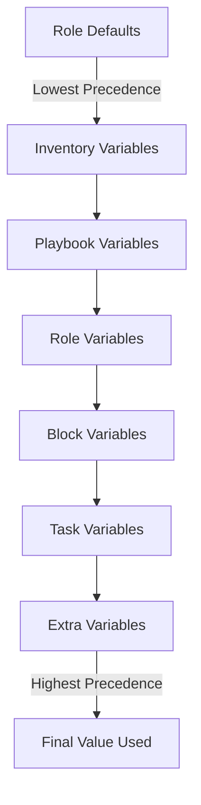

# Ansible Role Defaults

## Introduction

Default variables are a powerful feature in Ansible roles that allow you to define flexible, customizable behavior without requiring users to specify every configuration option. They provide sensible out-of-the-box values while still allowing for easy customization when needed.

In this guide, we'll explore how role defaults work, why they're important, and how to implement them effectively in your Ansible roles.

## What Are Role Defaults?

Role defaults are variables defined in the `defaults/main.yml` file of an Ansible role. They have the **lowest precedence** in Ansible's variable hierarchy, which means they're easily overridden by other variable types.

Think of defaults as the "factory settings" for your role - they provide reasonable starting values, but users can easily customize them to fit their specific needs.

## The Defaults Directory Structure

In a standard Ansible role structure, defaults are located in a specific directory:

```
my_role/
├── defaults/
│   └── main.yml    # Default variables defined here
├── tasks/
├── handlers/
├── vars/
├── templates/
└── files/
```

The `defaults/main.yml` file contains YAML-formatted variable definitions that will be used by your role.

## Creating Default Variables

Let's look at how to create default variables for a role that installs and configures a web server:

```yaml
# defaults/main.yml
---
# Web server type to install
webserver_type: "nginx"

# Port to listen on
webserver_port: 80

# Document root directory
webserver_docroot: "/var/www/html"

# Enable HTTPS
webserver_enable_ssl: false

# SSL certificate and key paths (only used if SSL is enabled)
webserver_ssl_cert: "/etc/ssl/certs/website.crt"
webserver_ssl_key: "/etc/ssl/private/website.key"

# Default virtual hosts
webserver_vhosts:
  - name: "default"
    server_name: "example.com www.example.com"
    docroot: "{{ webserver_docroot }}"
```

## Using Default Variables in Your Role

Once you've defined default variables, you can use them throughout your role's tasks, templates, and other files:

```yaml
# tasks/main.yml
---
- name: Install web server package
  package:
    name: "{{ webserver_type }}"
    state: present

- name: Configure web server port
  template:
    src: webserver.conf.j2
    dest: "/etc/{{ webserver_type }}/conf.d/custom.conf"
  notify: Restart web server
```

In a template file:

```
# templates/webserver.conf.j2
server {
    listen {{ webserver_port }};
    server_name localhost;
    root {{ webserver_docroot }};

    
    listen 443 ssl;
    ssl_certificate {{ webserver_ssl_cert }};
    ssl_certificate_key {{ webserver_ssl_key }};
    
}
```

## Overriding Default Variables

The power of default variables comes from how easily they can be overridden. Users of your role can customize behavior without modifying the role itself. Here are the different ways to override defaults, from lowest to highest precedence:



### Example: Overriding in a Playbook

```yaml
---
- hosts: webservers
  roles:
    - role: web_server
      webserver_type: "apache2"    # Override the default nginx
      webserver_port: 8080         # Override the default port 80
      webserver_enable_ssl: true   # Enable SSL
```

### Example: Overriding with Extra Variables

```bash
ansible-playbook playbook.yml --extra-vars "webserver_port=8443 webserver_enable_ssl=true"
```

## Best Practices for Role Defaults

### 1. Document Your Defaults

Always include comments in your `defaults/main.yml` file to explain what each variable does, its expected format, and any constraints:

```yaml
# defaults/main.yml
---
# The TCP port that the web server should listen on
# Type: Integer
# Default: 80
webserver_port: 80

# Whether to enable HTTPS for secure connections
# Type: Boolean
# Default: false
webserver_enable_ssl: false
```

### 2. Use Sensible Default Values

Choose default values that:
- Work in most common scenarios
- Are secure
- Don't require immediate configuration

### 3. Use Naming Conventions

Prefix your variables with the role name to avoid conflicts:

```yaml
# Good
webserver_port: 80

# Not recommended - too generic, might conflict
port: 80
```

### 4. Use Conditional Logic for Optional Features

```yaml
# tasks/main.yml
---
- name: Configure SSL
  template:
    src: ssl.conf.j2
    dest: "/etc/{{ webserver_type }}/ssl.conf"
  when: webserver_enable_ssl | bool
  notify: Restart web server
```

### 5. Use Default Filters as Extra Protection

Even though you define defaults, it's a good practice to use the Ansible `default()` filter as a fallback:

```yaml
# tasks/main.yml
---
- name: Set up log rotation
  template:
    src: logrotate.conf.j2
    dest: "/etc/logrotate.d/{{ webserver_type }}"
    mode: '0644'
    owner: "{{ webserver_user | default('www-data') }}"
```

## Real-World Example: PostgreSQL Role

Let's look at a more comprehensive example for a PostgreSQL database role:

```yaml
# defaults/main.yml for a PostgreSQL role
---
# PostgreSQL version to install
postgresql_version: "15"

# Basic configuration
postgresql_port: 5432
postgresql_listen_addresses: "localhost"
postgresql_max_connections: 100

# Memory settings
postgresql_shared_buffers: "128MB"
postgresql_effective_cache_size: "4GB"

# Authentication
postgresql_authentication:
  - type: "local"
    database: "all"
    user: "postgres"
    method: "peer"
  - type: "host"
    database: "all" 
    user: "all"
    address: "127.0.0.1/32"
    method: "md5"

# Databases to create
postgresql_databases: []
# Example entry:
# - name: myapp
#   owner: myapp_user
#   encoding: UTF-8

# Users to create
postgresql_users: []
# Example entry:
# - name: myapp_user
#   password: securepassword
#   privileges: 
#     - db: myapp
#       roles: ALL
```

And using these defaults in tasks:

```yaml
# tasks/configure.yml
---
- name: Configure PostgreSQL
  template:
    src: postgresql.conf.j2
    dest: "/etc/postgresql/{{ postgresql_version }}/main/postgresql.conf"
    owner: postgres
    group: postgres
    mode: '0644'
  notify: Restart PostgreSQL

- name: Configure client authentication
  template:
    src: pg_hba.conf.j2
    dest: "/etc/postgresql/{{ postgresql_version }}/main/pg_hba.conf"
    owner: postgres
    group: postgres
    mode: '0640'
  notify: Restart PostgreSQL
```

## Debugging Default Variables

When troubleshooting issues with role defaults, these commands can help:

```bash
# See all variables for a host (including defaults)
ansible -m debug -a "var=hostvars[inventory_hostname]" localhost

# Check a specific variable's value
ansible -m debug -a "var=webserver_port" webservers
```

## Summary

Ansible role defaults provide a powerful mechanism for creating flexible, reusable roles:

- Default variables are defined in `defaults/main.yml`
- They have the lowest precedence, making them easy to override
- They provide sensible "out-of-the-box" values
- They make roles more reusable across different projects and environments

By following best practices for default variables, you'll create Ansible roles that are easier to use, more maintainable, and adaptable to a wide range of scenarios.

## Exercises

1. Create a basic Ansible role for installing and configuring an NGINX web server with appropriate default variables.
2. Modify an existing role to add default variables for features that were previously hardcoded.
3. Create a playbook that uses a role and overrides several of its default values.
4. Update a role to use conditional logic based on default variables to enable or disable optional features.

## Additional Resources

- [Ansible Documentation on Role Defaults](https://docs.ansible.com/ansible/latest/user_guide/playbooks_reuse_roles.html#role-default-variables)
- [Ansible Variable Precedence](https://docs.ansible.com/ansible/latest/user_guide/playbooks_variables.html#variable-precedence-where-should-i-put-a-variable)
- [Ansible Best Practices](https://docs.ansible.com/ansible/latest/user_guide/playbooks_best_practices.html)