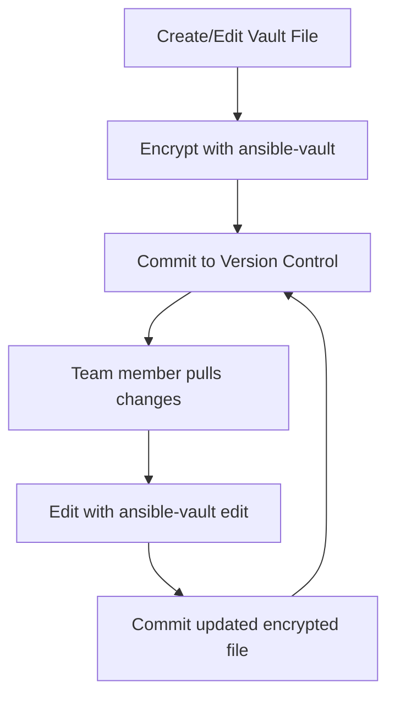

# Ansible Vault Editing

## Introduction

When working with sensitive data in Ansible, such as passwords, API keys, or other credentials, Ansible Vault provides encryption capabilities to protect this information. While creating encrypted files is important, knowing how to efficiently edit these encrypted files is equally crucial for day-to-day operations. This guide focuses specifically on editing Ansible Vault files, a common task you'll perform when managing secrets in your infrastructure.

## Prerequisites

Before diving into editing vault files, you should:
- Have Ansible installed on your system
- Understand basic Ansible concepts
- Know how to create encrypted files with `ansible-vault create`

## Methods for Editing Encrypted Files

Ansible provides several approaches to edit encrypted files. Let's explore each method with examples.

### Method 1: Using ansible-vault edit

The most straightforward way to edit an encrypted file is using the `ansible-vault edit` command:

```bash
ansible-vault edit secret_vars.yml
```

When you run this command:
1. Ansible will prompt you for the vault password
2. It will decrypt the file and open it in your default editor (defined by the `$EDITOR` environment variable)
3. When you save and exit the editor, Ansible automatically re-encrypts the file

#### Example Workflow

Let's say you have a file called `credentials.yml` that contains encrypted database credentials:

```bash
# Original encrypted file - this would be unreadable encrypted content
ansible-vault edit credentials.yml
```

After entering your password, you might see and edit content like:

```yaml
# Database credentials
db_user: admin
db_password: supersecure123
db_host: production-db.example.com
db_port: 5432
```

When you save and close the editor, Ansible automatically re-encrypts the file.

### Method 2: Using --vault-password-file

If you're editing vault files frequently, typing the password repeatedly can become tedious. You can store your vault password in a file (ensure this file has restricted permissions!) and reference it:

```bash
ansible-vault edit secret_vars.yml --vault-password-file ~/.vault_pass.txt
```

:::caution
Storing your vault password in a file is convenient but introduces security risks. Make sure the file has strict permissions (e.g., `chmod 600 ~/.vault_pass.txt`) and consider additional protection measures like disk encryption.
:::

### Method 3: Using ansible-vault view and ansible-vault encrypt

Sometimes you might prefer to view the file, make changes locally, and then re-encrypt it:

1. First, view the file:
   ```bash
   ansible-vault view secret_vars.yml > temp_file.yml
   ```

2. Edit the decrypted content:
   ```bash
   nano temp_file.yml  # Or any editor of your choice
   ```

3. Re-encrypt the file:
   ```bash
   ansible-vault encrypt temp_file.yml --output=secret_vars.yml
   ```

4. Clean up:
   ```bash
   rm temp_file.yml
   ```

:::warning
This method temporarily stores unencrypted content on disk, which poses security risks. Make sure to securely delete the temporary file afterward.
:::

### Method 4: In-Place Editing for Multiple Files

If you need to edit multiple encrypted files at once, you can use this approach:

```bash
ansible-vault decrypt secret_vars.yml group_vars/production/vault.yml
# Make your edits to the files
ansible-vault encrypt secret_vars.yml group_vars/production/vault.yml
```

## Using Different Vault IDs

When working with multiple environments or teams, you might need different vault passwords for different files. Ansible Vault supports Vault IDs to manage this scenario:

```bash
ansible-vault edit --vault-id dev@prompt secret_vars.yml
```

This associates the vault password with the 'dev' ID. You can then specify which ID to use when editing files:

```bash
ansible-vault edit --vault-id prod@~/.vault_pass.prod production_secrets.yml
```

### Example: Managing Multiple Environment Secrets

Consider a scenario where you have separate vault files for development and production:

```bash
# Edit development secrets
ansible-vault edit --vault-id dev@prompt group_vars/development/vault.yml

# Edit production secrets
ansible-vault edit --vault-id prod@prompt group_vars/production/vault.yml
```

## Editing Multi-Vault-ID Files

Ansible supports files encrypted with multiple vault IDs. To edit such files, you need to provide all vault passwords:

```bash
ansible-vault edit --vault-id dev@prompt --vault-id prod@prompt shared_secrets.yml
```

## Integration with Version Control

When using Ansible Vault with Git or other version control systems, you'll want to establish a consistent workflow:



### Best Practices for Teams

For teams working with encrypted vault files:

1. **Never commit unencrypted sensitive data**
2. **Use consistent vault IDs** across the team
3. **Consider using a vault password manager** like HashiCorp Vault or AWS Secrets Manager
4. **Document your vault password strategy** in your project README

## Practical Example: Rotating Database Credentials

Let's work through a complete example of updating database credentials across multiple environments:

First, let's examine our encrypted vault structure:

```
environments/
├── dev/
│   └── vault.yml  # Dev credentials
├── staging/
│   └── vault.yml  # Staging credentials
└── prod/
    └── vault.yml  # Production credentials
```

To rotate credentials across all environments:

```bash
# Update dev credentials
ansible-vault edit --vault-id dev@prompt environments/dev/vault.yml

# Update staging credentials
ansible-vault edit --vault-id staging@prompt environments/staging/vault.yml

# Update production credentials
ansible-vault edit --vault-id prod@prompt environments/prod/vault.yml
```

In each file, you would update the relevant section:

```yaml
database:
  credentials:
    username: app_user
    # Change this password to the new one
    password: new_secure_password_123!
    host: db.example.com
    port: 5432
```

After updating and saving each file, they're automatically re-encrypted and ready to be committed to version control.

## Troubleshooting Common Issues

### Issue: "Decryption failed"

This typically happens when you use the wrong password:

```
ERROR! Decryption failed
```

**Solution**: Verify you're using the correct vault password or vault-id.

### Issue: Editor Not Opening

If no editor opens when running `ansible-vault edit`:

**Solution**: Set the `EDITOR` environment variable:

```bash
export EDITOR=nano  # Or vim, or your preferred editor
ansible-vault edit secret_vars.yml
```

### Issue: Changes Not Saved

If changes aren't being saved after editing:

**Solution**: Make sure you're saving the file properly in your editor (e.g., in vim, use `:wq` to save and quit).

## Advanced Editing Techniques

### Using grep on Encrypted Files

If you need to search through encrypted files:

```bash
ansible-vault view secret_vars.yml | grep database
```

### Batch Editing Multiple Files

To edit multiple vault files with a script:

```bash
for env in dev staging prod; do
  ansible-vault edit --vault-id $env@prompt environments/$env/vault.yml
done
```

## Summary

Editing Ansible Vault encrypted files is a crucial skill for maintaining security while managing infrastructure as code. In this guide, we've covered:

- Basic editing with `ansible-vault edit`
- Using vault password files for convenience
- Managing multiple environments with vault IDs
- Best practices for team workflows
- Practical examples of credential rotation
- Troubleshooting common issues

By mastering these techniques, you can maintain strong security practices while still efficiently managing your Ansible configuration.

## Further Learning

To deepen your understanding of Ansible Vault:

- Explore integrating with secret management solutions like HashiCorp Vault
- Learn about automating vault operations in CI/CD pipelines
- Practice creating a full infrastructure deployment with proper secret management

## Exercises

1. Create an encrypted vault file containing database credentials
2. Edit the file to add new API credentials
3. Set up multiple vault IDs for different environments
4. Write a simple playbook that uses the encrypted variables
5. Create a workflow for rotating credentials across multiple environments