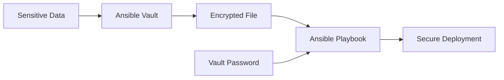

# Ansible Vault Encryption

## Introduction

When working with Ansible playbooks and roles, you'll often need to handle sensitive information such as passwords, API keys, or certificates. Storing this sensitive data in plain text within your playbooks or variable files poses a significant security risk, especially when your Ansible code is stored in version control systems like Git.

Ansible Vault solves this problem by providing built-in encryption capabilities that allow you to securely store and manage sensitive data within your Ansible projects. Ansible Vault uses AES256 encryption to protect your data while making it seamlessly available to your playbooks during execution.

## Understanding Ansible Vault

Ansible Vault is a feature that encrypts YAML files so you can protect sensitive content. It allows you to:

1. Create new encrypted files
2. Encrypt existing files
3. View encrypted files
4. Edit encrypted files
5. Use encrypted files in playbooks



## Getting Started with Ansible Vault

Let's explore how to use Ansible Vault to secure your sensitive data.

### Creating Encrypted Files

To create a new encrypted file, use the `ansible-vault create` command:

```bash
ansible-vault create secret_vars.yml
```

This command will:
1. Prompt you to enter and confirm a password
2. Open your default text editor
3. Allow you to add content to the file
4. Automatically encrypt the file when you save and exit

**Example:**

Input:
```bash
$ ansible-vault create secret_vars.yml
New Vault password: 
Confirm New Vault password:
```

After entering your password, your editor opens. You might add content like:

```yaml
# Database credentials
db_user: admin
db_password: supersecretpassword
db_name: production_db

# API credentials
api_key: abcd1234efgh5678ijkl
api_secret: verysecretapikey123!
```

Once saved, the file content will be encrypted and look similar to this:

```
$ANSIBLE_VAULT;1.1;AES256
34623639666666383339363732666263363830663666313466613830653266333566326564373066
33353330663932353330643336363062363661633537663661313563636565323866383034613534
66616266386138316432386166623764303661323764346436373736643737326664356664323837
3831643531303837650a313339623862666664343338303762333232326638323962323631353437
34376463356532626166656532366662316661646565306565626366363532353330363933643238
3931626661396538620a663135313739626334643962343664356332383537383637613965376664
62353338613732313639323266323732653163653939376663636164396265313437643635616263
31323064323337396536
```

### Encrypting Existing Files

If you already have files with sensitive data, you can encrypt them using the `ansible-vault encrypt` command:

```bash
ansible-vault encrypt existing_vars.yml
```

**Example:**

Let's say you have an existing file `database_credentials.yml` with:

```yaml
mysql_user: dbadmin
mysql_password: p@ssw0rd
mysql_host: db.example.com
mysql_port: 3306
```

To encrypt it:

```bash
$ ansible-vault encrypt database_credentials.yml
New Vault password: 
Confirm New Vault password:
Encryption successful
```

### Viewing Encrypted Files

To view the contents of an encrypted file without editing it:

```bash
ansible-vault view secret_vars.yml
```

You'll be prompted for the password, and then the decrypted content will be displayed in your terminal.

### Editing Encrypted Files

To edit an already encrypted file:

```bash
ansible-vault edit secret_vars.yml
```

This will:
1. Ask for your vault password
2. Decrypt the file temporarily
3. Open it in your editor
4. Re-encrypt it when you save and exit

### Decrypting Files

If you need to permanently decrypt a file:

```bash
ansible-vault decrypt secret_vars.yml
```

**Warning:** This removes encryption protection, so be careful!

## Using Encrypted Files in Playbooks

Ansible automatically detects encrypted files and attempts to decrypt them when running playbooks. You need to provide the vault password when executing your playbook.

### Basic Usage

```bash
ansible-playbook deploy.yml --ask-vault-pass
```

This will prompt you for the vault password before running the playbook.

### Using a Password File

For automation, you can store your vault password in a file (which should be properly secured and not committed to version control):

```bash
echo "my_vault_password" > ~/.vault_pass.txt
chmod 600 ~/.vault_pass.txt
```

Then reference it when running playbooks:

```bash
ansible-playbook deploy.yml --vault-password-file=~/.vault_pass.txt
```

You can also configure this in your `ansible.cfg` file:

```ini
[defaults]
vault_password_file = ~/.vault_pass.txt
```

## Real-World Example: Deploying a Web Application

Let's see a complete example of using Ansible Vault in a real-world scenario where we're deploying a web application that requires database credentials.

### Step 1: Create an encrypted variable file

```bash
ansible-vault create group_vars/production/vault.yml
```

Add the following sensitive variables:

```yaml
# Database credentials
db_user: webapp_user
db_password: super_secret_production_pw
db_name: webapp_production

# SSL Certificate Password
ssl_key_password: certificate_key_passphrase
```

### Step 2: Create a regular variables file that references encrypted variables

In `group_vars/production/vars.yml`:

```yaml
# Application settings
app_name: MyWebApp
app_environment: production
app_port: 8080

# Database connection string (using encrypted variables)
database_url: "postgresql://{{ db_user }}:{{ db_password }}@db.example.com:5432/{{ db_name }}"

# Deployment paths
app_path: /var/www/mywebapp
config_path: "{{ app_path }}/config"
```

### Step 3: Create the deployment playbook

In `deploy_webapp.yml`:

```yaml
---
- name: Deploy Web Application
  hosts: web_servers
  become: true
  
  tasks:
    - name: Install required packages
      apt:
        name: 
          - nginx
          - postgresql-client
          - python3-psycopg2
        state: present
        update_cache: yes
      
    - name: Create application directory
      file:
        path: "{{ app_path }}"
        state: directory
        owner: www-data
        group: www-data
        mode: '0755'
        
    - name: Generate application configuration
      template:
        src: templates/config.j2
        dest: "{{ config_path }}/config.json"
        owner: www-data
        group: www-data
        mode: '0640'
      notify: restart application
        
    - name: Configure SSL certificate
      copy:
        content: |
          #!/bin/bash
          echo "{{ ssl_key_password }}" | openssl pkcs12 -in /etc/ssl/private/cert.p12 -nocerts -out /etc/ssl/private/key.pem
        dest: /usr/local/bin/extract_ssl_key.sh
        mode: '0700'
      notify: extract ssl key
        
  handlers:
    - name: restart application
      systemd:
        name: mywebapp
        state: restarted
        
    - name: extract ssl key
      command: /usr/local/bin/extract_ssl_key.sh
      notify: restart nginx
        
    - name: restart nginx
      systemd:
        name: nginx
        state: restarted
```

### Step 4: Create the config template

In `templates/config.j2`:

```json
{
  "appName": "{{ app_name }}",
  "environment": "{{ app_environment }}",
  "port": {{ app_port }},
  "database": {
    "connectionString": "{{ database_url }}"
  },
  "logging": {
    "level": "info",
    "path": "/var/log/{{ app_name }}"
  }
}
```

### Step 5: Run the playbook with vault password

```bash
ansible-playbook deploy_webapp.yml --ask-vault-pass
```

This example demonstrates how Ansible Vault keeps sensitive data secure while still making it available during playbook execution.

## Multiple Vault Passwords

For more complex environments, you might need different vault passwords for different roles or environments.

### Using Vault IDs

Ansible supports vault IDs to work with multiple vault passwords:

```bash
# Create a production vault
ansible-vault create --vault-id=prod@prompt group_vars/production/vault.yml

# Create a development vault with different password
ansible-vault create --vault-id=dev@prompt group_vars/development/vault.yml
```

When running your playbook, you can specify which vault IDs to use:

```bash
ansible-playbook site.yml --vault-id prod@prompt --vault-id dev@prompt
```

You can also use password files with IDs:

```bash
ansible-playbook site.yml --vault-id prod@~/.vault_pass_prod --vault-id dev@~/.vault_pass_dev
```

## Best Practices

1. **Never commit vault passwords to version control**
2. **Use different vault passwords for different environments**
3. **Encrypt only what needs to be encrypted** - don't encrypt your entire playbook or all variables
4. **Rotate vault passwords periodically**
5. **Consider using a secrets management tool** like HashiCorp Vault or AWS Secrets Manager for larger deployments
6. **Store vault password files outside of your project directory**
7. **Set restrictive permissions on password files** (`chmod 600`)
8. **Use vault IDs to organize multiple passwords**

## Troubleshooting

### Common Issues and Solutions

1. **"Decryption failed"**
   - Ensure you're using the correct password
   - Check if the file was encrypted with a different vault ID

2. **"ERROR! Vault password file not found"**
   - Verify the path to your password file
   - Check permissions on the password file

3. **"ERROR! The vault password must be specified"**
   - You need to provide `--ask-vault-pass` or `--vault-password-file`
   - Or configure `vault_password_file` in ansible.cfg

4. **Playbook runs but variables are missing**
   - Ensure variables are properly referenced
   - Check that encrypted files are being loaded correctly

## Summary

Ansible Vault provides a straightforward way to encrypt sensitive data within your Ansible projects:

- Create encrypted files with `ansible-vault create`
- Encrypt existing files with `ansible-vault encrypt`
- View files with `ansible-vault view`
- Edit files with `ansible-vault edit`
- Run playbooks with `--ask-vault-pass` or `--vault-password-file`

By properly implementing Ansible Vault, you can maintain security best practices while still enjoying the automation benefits of Ansible. Sensitive information like passwords, API keys, and certificates can be securely stored alongside your code without exposing them to unauthorized users.

## Additional Resources

- [Official Ansible Vault Documentation](https://docs.ansible.com/ansible/latest/user_guide/vault.html)
- [Ansible Vault Examples (Ansible Project)](https://github.com/ansible/ansible-examples)

## Exercises

1. Create an encrypted file containing database credentials and use it in a playbook that sets up a database connection.
2. Experiment with vault IDs by creating multiple encrypted files for different environments (dev, staging, production).
3. Set up a CI/CD pipeline that uses a vault password file to decrypt secrets during deployment.
4. Create a playbook that rotates passwords stored in vault files.
5. Implement a solution where different team members have access to different vault-encrypted files.