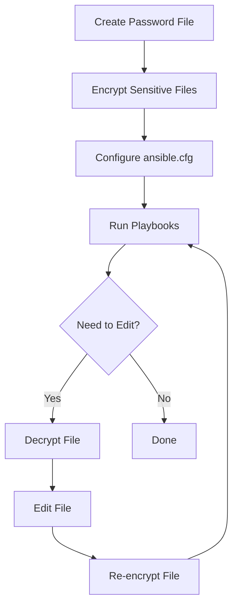

# Ansible Vault Passwords

## Introduction

When working with Ansible for infrastructure automation, you'll frequently need to handle sensitive information like API keys, database credentials, and login passwords. Storing these secrets in plaintext within your playbooks or variable files creates significant security risks if your code is exposed.

Ansible Vault solves this problem by providing encryption capabilities that protect your sensitive data while still allowing your automation to function seamlessly. In this guide, we'll explore how to effectively manage Ansible Vault passwords - the keys that lock and unlock your encrypted content.

## What Are Ansible Vault Passwords?

Ansible Vault passwords are secret keys that Ansible uses to encrypt and decrypt sensitive data. These passwords act as the master keys for accessing your protected information. When you encrypt a file with Ansible Vault, you specify a password that must be provided later to decrypt and use that file's contents.

## Managing Vault Passwords

### Single Password Approach

The simplest way to use Ansible Vault is with a single password for all your encrypted files.

#### Creating a Password File

Rather than typing your password each time, you can store it in a file (which you'll need to protect):

```bash
# Create a password file
echo "mysecretpassword" > ~/.vault_pass
chmod 600 ~/.vault_pass
```

:::caution
Ensure your password file has restricted permissions (600) so only you can read it.
:::

#### Configuring Ansible to Use Your Password File

You can tell Ansible where to find your vault password in two ways:

1. Via ansible.cfg:

```ini
[defaults]
vault_password_file = ~/.vault_pass
```

2. Via command line:

```bash
ansible-playbook site.yml --vault-password-file=~/.vault_pass
```

### Multiple Password Approach (Vault IDs)

For more complex environments, you might need different passwords for different types of secrets or environments.

#### Setting Up Multiple Vault IDs

Ansible supports multiple vault passwords through "Vault IDs" - labels that identify which password should be used for which file.

Create password files for each environment:

```bash
# Development password
echo "dev_secret_password" > ~/.vault_pass.dev
chmod 600 ~/.vault_pass.dev

# Production password
echo "prod_secret_password" > ~/.vault_pass.prod
chmod 600 ~/.vault_pass.prod
```

#### Using Vault IDs When Encrypting

When encrypting files, specify which vault ID to use:

```bash
# Encrypt with development password
ansible-vault encrypt --vault-id dev@~/.vault_pass.dev dev_secrets.yml

# Encrypt with production password
ansible-vault encrypt --vault-id prod@~/.vault_pass.prod prod_secrets.yml
```

#### Using Vault IDs When Running Playbooks

Provide multiple vault passwords when running playbooks:

```bash
ansible-playbook site.yml --vault-id dev@~/.vault_pass.dev --vault-id prod@~/.vault_pass.prod
```

Ansible will automatically use the correct password for each encrypted file based on how it was encrypted.

## Password Prompting

If you prefer not to store passwords in files, you can have Ansible prompt for passwords:

```bash
# Encrypt with prompt
ansible-vault encrypt --ask-vault-pass secrets.yml

# Run playbook with password prompt
ansible-playbook site.yml --ask-vault-pass
```

For multiple vault IDs with prompting:

```bash
ansible-playbook site.yml --vault-id dev@prompt --vault-id prod@prompt
```

## Password Scripts

For advanced use cases, you can use a script that outputs the vault password:

```bash
# Create a script that outputs your password
cat > ~/.vault_pass.py << 'EOF'
#!/usr/bin/env python
print("mysecretpassword")
EOF
chmod 700 ~/.vault_pass.py
```

A more practical example might retrieve the password from a secure password manager:

```python
#!/usr/bin/env python
import subprocess
import sys

# This example uses the 'pass' password manager
try:
    result = subprocess.run(
        ['pass', 'show', 'ansible/vault'],
        capture_output=True, 
        text=True
    )
    print(result.stdout.strip())
    sys.exit(0)
except Exception:
    sys.stderr.write("Failed to retrieve Ansible vault password
")
    sys.exit(1)
```

Configure Ansible to use this script:

```ini
[defaults]
vault_password_file = ~/.vault_pass.py
```

## Real-World Examples

### Example 1: Encrypting Database Credentials

Let's create a variables file with database credentials and encrypt it:

```bash
# Create the variables file
cat > group_vars/database/secrets.yml << 'EOF'
db_user: admin
db_password: supersecretpassword
db_name: production_db
db_host: db.example.com
EOF

# Encrypt the file
ansible-vault encrypt group_vars/database/secrets.yml
```

Using these credentials in a playbook:

```yaml
---
# deploy_database.yml
- name: Configure Database
  hosts: database_servers
  tasks:
    - name: Create database user
      postgresql_user:
        name: "{{ db_user }}"
        password: "{{ db_password }}"
        state: present
      become: true
      become_user: postgres
```

When you run this playbook with the vault password provided, Ansible will automatically decrypt the variables and use them.

### Example 2: Multiple Environment Setup

Creating separate files for different environments:

```bash
# Development secrets
cat > group_vars/dev/secrets.yml << 'EOF'
api_key: dev_api_key_123
admin_password: dev_admin_pass
EOF

# Production secrets
cat > group_vars/prod/secrets.yml << 'EOF'
api_key: prod_api_key_456
admin_password: prod_admin_pass
EOF

# Encrypt with different vault IDs
ansible-vault encrypt --vault-id dev@~/.vault_pass.dev group_vars/dev/secrets.yml
ansible-vault encrypt --vault-id prod@~/.vault_pass.prod group_vars/prod/secrets.yml
```

Now you can run your playbook with both passwords:

```bash
ansible-playbook deploy.yml --vault-id dev@~/.vault_pass.dev --vault-id prod@~/.vault_pass.prod -e "env=dev"
```

## Best Practices for Managing Vault Passwords

1. **Never commit vault passwords to version control**
   - Add password files to `.gitignore`
   - Consider using a secure password manager

2. **Use different passwords for different sensitivity levels**
   - Less sensitive data (dev environments): one password
   - Highly sensitive data (production secrets): stronger, different password

3. **Rotate passwords periodically**
   ```bash
   # Rekey an encrypted file with a new password
   ansible-vault rekey --vault-id old@~/.vault_pass.old --new-vault-id new@~/.vault_pass.new secrets.yml
   ```

4. **Integrate with secret management systems**
   - HashiCorp Vault
   - AWS Secrets Manager
   - Azure Key Vault

5. **Document your vault password strategy**
   - Create a README explaining how passwords are managed
   - Include procedures for password rotation

## Common Workflow Diagram



## Troubleshooting Vault Passwords

### Problem: "Decryption failed"

This usually means the wrong password was provided. Check:
- Are you using the correct password file?
- For multiple vault IDs, are you providing all necessary passwords?

### Problem: "ERROR! The vault password file /path/to/file is not readable"

Check file permissions:
```bash
chmod 600 ~/.vault_pass
```

### Problem: Ansible can't find the vault password

Check your `ansible.cfg` file or ensure you're providing the `--vault-password-file` option.

## Summary

Ansible Vault passwords are essential for securing sensitive data in your automation workflows. By understanding how to manage these passwords effectively, you can:

- Encrypt sensitive information securely
- Work with multiple passwords for different environments
- Integrate with secure password storage solutions
- Maintain security while preserving automation capabilities

With these skills, you can confidently store sensitive information in your Ansible projects without compromising security.

## Additional Resources

- [Official Ansible Vault Documentation](https://docs.ansible.com/ansible/latest/user_guide/vault.html)
- [Ansible Best Practices](https://docs.ansible.com/ansible/latest/user_guide/playbooks_best_practices.html)

## Exercises

1. Create a new Ansible project with encrypted variables for dev and prod environments
2. Write a script that retrieves your vault password from your system's keyring
3. Set up a playbook that uses encrypted variables and test it with different vault passwords
4. Practice rekeying an encrypted file to simulate password rotation