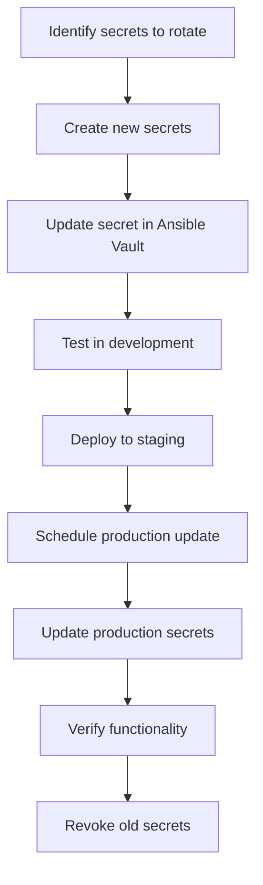

# Ansible Vault Best Practices

## Introduction

Ansible Vault is a powerful feature that allows you to encrypt and secure sensitive data within your Ansible projects. When working with infrastructure as code, you'll inevitably need to handle sensitive information such as passwords, API keys, and certificates. Ansible Vault provides a way to encrypt this data while still making it accessible to your Ansible playbooks and roles.

In this guide, we'll explore best practices for using Ansible Vault effectively and securely. These practices will help you maintain security while keeping your automation workflows smooth and manageable.

## Understanding Ansible Vault Basics

Before diving into best practices, let's quickly review what Ansible Vault does:

- **Encryption at Rest**: Vault encrypts sensitive files so they can be safely stored in version control
- **Seamless Integration**: Encrypted files can be used directly in playbooks and roles
- **Password Protection**: Access to encrypted content requires a password or key file

## Best Practice 1: Use Different Vault Passwords for Different Environments

One of the most important practices is to use different vault passwords for different environments (development, staging, production).

### Example Implementation

Create a vault password file for each environment:

```bash
# Create password files (don't commit these to version control!)
echo "dev-vault-password" > ~/.ansible/vault_pass_dev.txt
echo "prod-vault-password" > ~/.ansible/vault_pass_prod.txt

# Set restrictive permissions
chmod 600 ~/.ansible/vault_pass_*.txt
```

Configure your `ansible.cfg` to use different password files based on environment:

```ini
[defaults]
# This can be overridden at runtime with --vault-password-file
vault_password_file = ~/.ansible/vault_pass_dev.txt
```

When running playbooks, specify the appropriate password file:

```bash
# For development
ansible-playbook playbook.yml

# For production
ansible-playbook playbook.yml --vault-password-file=~/.ansible/vault_pass_prod.txt
```

## Best Practice 2: Organize Encrypted Variables Effectively

Rather than encrypting entire files, consider encrypting only specific variables that contain sensitive data.

### Approach 1: Individual Encrypted Variables

```yaml
# group_vars/all/vars.yml
regular_var: "Not sensitive data"

# group_vars/all/vault.yml (encrypted)
db_password: "supersecretpassword123"
api_key: "kd82jdiq9284hdk38"
```

Then in your playbook, you can use these variables normally:

```yaml
- name: Connect to database
  mysql_db:
    login_user: "{{ db_user }}"
    login_password: "{{ db_password }}"
    name: "{{ db_name }}"
```

### Approach 2: Encrypted Strings in Regular Files

You can also encrypt individual values within a regular YAML file:

```bash
# Create an encrypted string
ansible-vault encrypt_string 'secretpassword' --name 'db_password'
```

Add the encrypted string to your variables file:

```yaml
# group_vars/all/vars.yml
regular_var: "Not sensitive data"
db_password: !vault |
          $ANSIBLE_VAULT;1.1;AES256
          32613430643339643765623931303136636338356433326139663837653664393437396663646562
          6264383934386662376265336532613031323233326332360a393835656134636366303032353539
          63383833613733363462363238333835653631366331343531663238386364333032313130326639
          3762623132323036320a353564323134643937373236313730323630313735373930646165373164
          3261
```

## Best Practice 3: Use Vault IDs for Multiple Vault Passwords

If you need to manage multiple vaults within the same project, Vault IDs (introduced in Ansible 2.4) provide a cleaner approach.

```bash
# Creating encrypted content with specific vault IDs
ansible-vault encrypt_string --vault-id dev@~/.ansible/vault_pass_dev.txt 'dev_db_pass' --name 'db_password'
ansible-vault encrypt_string --vault-id prod@~/.ansible/vault_pass_prod.txt 'prod_db_pass' --name 'db_password'
```

Using these in a playbook with environment-specific variable files:

```yaml
# group_vars/development/vault.yml
db_password: !vault |
          $ANSIBLE_VAULT;1.2;AES256;dev
          32613430643339643765623931303136636338356433326139663837653664393437396663646562
          ...

# group_vars/production/vault.yml  
db_password: !vault |
          $ANSIBLE_VAULT;1.2;AES256;prod
          62643839343834666237626533653261303132323332633236306133393835656134636366303032
          ...
```

When running your playbook:

```bash
# For development
ansible-playbook playbook.yml --vault-id dev@~/.ansible/vault_pass_dev.txt

# For production
ansible-playbook playbook.yml --vault-id prod@~/.ansible/vault_pass_prod.txt
```

## Best Practice 4: Keep Vault Password Files Secure

Never commit vault password files to your version control system. Instead:

1. Store them in a secure location outside your project directory
2. Set appropriate file permissions (`chmod 600`)
3. Consider using a password manager or secure secret sharing system for team access

For CI/CD pipelines, use secure environment variables:

```yaml
# Example GitHub Actions workflow
jobs:
  deploy:
    runs-on: ubuntu-latest
    steps:
      - uses: actions/checkout@v2
      - name: Run Ansible playbook
        run: |
          echo "${{ secrets.VAULT_PASSWORD }}" > .vault_pass
          ansible-playbook playbook.yml --vault-password-file=.vault_pass
          rm .vault_pass
```

## Best Practice 5: Use .gitignore to Prevent Accidents

Add vault password files and any unencrypted sensitive files to your `.gitignore`:

```
# .gitignore
.vault_pass*
*_vault_pass.txt
*.key
secrets.yml
unencrypted/
```

## Best Practice 6: Establish Clear Workflows for Secret Rotation

Create documented workflows for rotating secrets:



## Best Practice 7: Prefer Vault Files over Command-Line Secrets

Avoid passing secrets via command line which might be visible in process lists or history:

```bash
# DON'T do this
ansible-playbook playbook.yml --extra-vars="db_password=supersecret"

# DO this instead
ansible-playbook playbook.yml --vault-password-file=~/.vault_pass
```

## Best Practice 8: Use Vault for All Sensitive Data Types

Encrypt all types of sensitive data, not just passwords:

- SSH private keys
- SSL certificates
- API tokens
- Database credentials
- Customer data
- Configuration with sensitive details

## Best Practice 9: Implementing a Vault Pre-Commit Hook

Create a pre-commit hook to check for unencrypted sensitive files:

```bash
#!/bin/bash
# .git/hooks/pre-commit

# Regular expressions for patterns that might indicate unencrypted secrets
patterns=("password:" "apikey:" "secret:" "BEGIN RSA PRIVATE KEY")

# Files to check (excluding encrypted vault files)
files=$(git diff --cached --name-only | grep -v "\.vault\." | grep -E '\.ya?ml$|\.json$')

for file in $files; do
  for pattern in "${patterns[@]}"; do
    if grep -q "$pattern" "$file"; then
      echo "WARNING: Potential unencrypted secret in $file"
      echo "File contains pattern: $pattern"
      echo "Consider encrypting this file with ansible-vault"
      exit 1
    fi
  done
done

exit 0
```

Make it executable:

```bash
chmod +x .git/hooks/pre-commit
```

## Best Practice 10: Document Vault Usage for Your Team

Create a clear documentation file explaining your team's Vault practices:

```markdown
# Ansible Vault Usage Guide

## How to access vault passwords
- Development: Contact team lead
- Production: Use secure password manager entry "Ansible Prod Vault"

## Adding new secrets
1. Encrypt using: `ansible-vault encrypt_string --vault-id=dev@prompt 'your-secret' --name 'secret_name'`
2. Add to appropriate vars file
3. Document in our secrets registry

## Rotating secrets
Follow the rotation procedure in our team wiki
```

## Practical Example: Complete Workflow

Here's a complete example putting these practices together:

1. Project structure:

```
ansible-project/
├── ansible.cfg
├── inventory/
│   ├── development
│   └── production
├── group_vars/
│   ├── all/
│   │   ├── vars.yml
│   │   └── vault.yml     # Encrypted with vault
│   ├── development/
│   │   ├── vars.yml
│   │   └── vault.yml     # Encrypted with dev vault id
│   └── production/
│       ├── vars.yml
│       └── vault.yml     # Encrypted with prod vault id
├── playbooks/
│   └── deploy.yml
└── roles/
    └── application/
        └── ...
```

2. Encrypting a new production secret:

```bash
# Create a new encrypted variable
ansible-vault encrypt_string --vault-id prod@~/.ansible/vault_pass_prod.txt 'super-secure-value' --name 'api_secret'

# Add it to group_vars/production/vault.yml
```

3. Running the playbook:

```bash
# For development environment
ansible-playbook -i inventory/development playbooks/deploy.yml --vault-id dev@~/.ansible/vault_pass_dev.txt

# For production environment  
ansible-playbook -i inventory/production playbooks/deploy.yml --vault-id prod@~/.ansible/vault_pass_prod.txt
```

4. Viewing encrypted content:

```bash
# View the encrypted file
ansible-vault view group_vars/production/vault.yml --vault-id prod@~/.ansible/vault_pass_prod.txt
```

5. Editing encrypted content:

```bash
# Edit the encrypted file
ansible-vault edit group_vars/production/vault.yml --vault-id prod@~/.ansible/vault_pass_prod.txt
```

## Common Vault Command Reference

Here's a quick reference for common Ansible Vault commands:

```bash
# Create a new encrypted file
ansible-vault create secret.yml

# Encrypt an existing file
ansible-vault encrypt secret.yml

# View an encrypted file
ansible-vault view secret.yml

# Edit an encrypted file
ansible-vault edit secret.yml

# Decrypt a file (be careful with this!)
ansible-vault decrypt secret.yml

# Change the password of an encrypted file
ansible-vault rekey secret.yml

# Encrypt a string to insert into a YAML file
ansible-vault encrypt_string 'secret_value' --name 'variable_name'
```

## Summary

Ansible Vault is an essential tool for securing sensitive data in your Ansible projects. By following these best practices, you can ensure your secrets remain safe while maintaining a smooth workflow:

1. Use different vault passwords for different environments
2. Organize encrypted variables effectively
3. Utilize Vault IDs for multiple vault passwords
4. Keep vault password files secure
5. Use .gitignore to prevent accidental commits of sensitive data
6. Establish clear workflows for secret rotation
7. Prefer vault files over command-line secrets
8. Use vault for all sensitive data types
9. Implement pre-commit hooks
10. Document vault usage for your team

By implementing these practices, you'll create a more secure and maintainable infrastructure automation workflow.

## Additional Resources

- [Ansible Vault Official Documentation](https://docs.ansible.com/ansible/latest/user_guide/vault.html)
- [Red Hat Ansible Vault Best Practices](https://www.redhat.com/en/blog/ansible-vault-best-practices)

## Exercises

1. Create a simple Ansible project that uses vault to store database credentials and deploy a simple application
2. Set up separate vault passwords for development and production environments
3. Write a pre-commit hook to detect potentially unencrypted secrets
4. Create a documentation guide for your team's vault usage
5. Practice rotating a secret across development and production environments