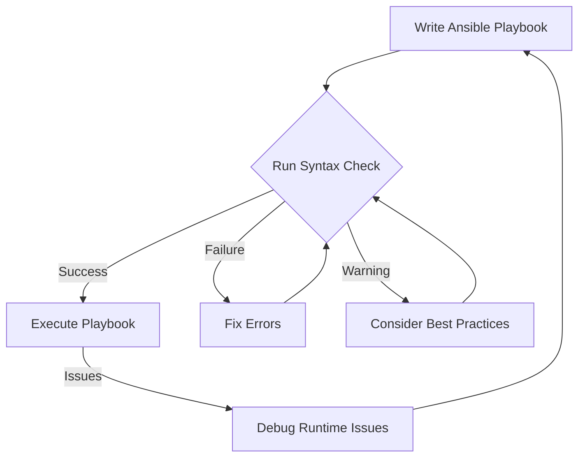

# Ansible Syntax Checking

## Introduction

When working with Ansible, ensuring your playbooks and roles are syntactically correct is a critical first step before deployment. Syntax errors can lead to failed deployments, unexpected behavior, and wasted time troubleshooting issues. Ansible provides built-in syntax checking capabilities that allow you to validate your YAML syntax, variable references, and task definitions before executing your automation.

In this guide, we'll explore how to perform syntax checking in Ansible, understand different validation methods, and implement best practices to catch errors early in your development workflow.

## What is Ansible Syntax Checking?

Ansible syntax checking is a validation process that inspects your playbooks, roles, and task files for:

- YAML syntax errors (indentation, missing colons, etc.)
- Invalid Ansible module parameters
- Missing required fields
- Basic structural problems in playbooks

The key benefit of syntax checking is that it identifies errors before attempting to execute your code against target systems, saving time and preventing potential issues.

## Basic Syntax Checking with `ansible-playbook`

The simplest way to check syntax is using the `--syntax-check` flag with the `ansible-playbook` command:

```bash
ansible-playbook --syntax-check playbook.yml
```

### Example Input

Let's say we have a playbook with a syntax error:

```yaml
---
- name: Install and configure web server
  hosts: webservers
  tasks:
    - name: Install Apache
      yum:
        name: httpd
        state: present
      
    - name: Start Apache Service
      service
        name: httpd
        state: started
        enabled: yes
```

### Example Output

When we run the syntax check:

```bash
$ ansible-playbook --syntax-check playbook.yml

ERROR! Syntax Error while loading YAML.
  did not find expected key

The error appears to be in '/path/to/playbook.yml': line 10, column 9, but may
be elsewhere in the file depending on the exact syntax problem.

The offending line appears to be:

    - name: Start Apache Service
      service
        ^ here
```

The syntax checker identified that we're missing a colon (`:`) after the module name `service`.

### Corrected Playbook

```yaml
---
- name: Install and configure web server
  hosts: webservers
  tasks:
    - name: Install Apache
      yum:
        name: httpd
        state: present
      
    - name: Start Apache Service
      service:
        name: httpd
        state: started
        enabled: yes
```

## Checking Syntax in Multiple Files

If you have multiple playbooks or a complex project structure, you can check all playbooks at once:

```bash
find . -name "*.yml" -type f -exec ansible-playbook --syntax-check {} \;
```

This command finds all YAML files in the current directory and its subdirectories, then runs a syntax check on each one.

## Understanding Ansible's Validation Process

When you run the syntax check, Ansible performs the following steps:

1. Parses the YAML files
2. Validates the playbook structure
3. Checks for valid module parameters
4. Verifies variable syntax
5. Validates role references and includes

<div className="info-box">
<strong>Note:</strong> The syntax check doesn't verify that variables will have appropriate values at runtime or that target hosts will be reachable. It only checks for syntax correctness.
</div>

## Integrating Syntax Checking into CI/CD Pipelines

Adding syntax checking to your CI/CD pipeline ensures that syntax errors are caught early in the development cycle.

### Example GitLab CI Configuration

```yaml
stages:
  - syntax
  - deploy

ansible_syntax:
  stage: syntax
  image: ansible/ansible:latest
  script:
    - ansible-playbook --syntax-check playbooks/*.yml
  only:
    - merge_requests
```

## Advanced Syntax Checking with `ansible-lint`

While the built-in syntax checker catches basic errors, `ansible-lint` provides more comprehensive validation:

```bash
pip install ansible-lint
ansible-lint playbook.yml
```

### Example Input

Consider this playbook with multiple issues:

```yaml
---
- name: Configure application
  hosts: all
  tasks:
    - shell: echo "Configuring app"

    - name: Install packages
      apt: pkg=nginx state=present

    - name: Create user
      user:
        name: "{{ app_user }}"
        shell: /bin/bash
```

### Example Output

```bash
$ ansible-lint playbook.yml

app.yml:5: command-instead-of-module [WARNING]: Consider using the command module with creates rather than the shell module
app.yml:8: deprecated-module [WARNING]: deprecated-module: Deprecated module, use ansible.builtin.apt or apt instead
app.yml:8: key-equals [WARNING]: key=value is deprecated, use YAML format instead
app.yml:13: risky-undefined-variable [MEDIUM]: Variables should be enclosed by spaces "{{ app_user }}"
```

Unlike the basic syntax checker, `ansible-lint` identifies not just syntax errors but also stylistic issues and potential improvements.

## Creating a Custom Configuration for `ansible-lint`

You can create a `.ansible-lint` file in your project root to customize the linting rules:

```yaml
skip_list:
  - fqcn-builtins
  - command-instead-of-module

warn_list:
  - yaml
  - var-spacing

exclude_paths:
  - .git/
  - roles/external/
```

## Checking Variable References

One common issue in Ansible playbooks is undefined variables. You can use the `--check-mode` along with verbosity to help identify undefined variables:

```bash
ansible-playbook -vv --check playbook.yml
```

This will attempt to execute the playbook in check mode, which will catch undefined variables.

## Using VSCode Extensions for Real-time Syntax Checking

For real-time feedback, you can use IDE extensions like the "Ansible" extension for VSCode:

1. Install the extension from the marketplace
2. Configure settings to enable linting
3. Get immediate feedback as you write your playbooks

```json
{
  "ansible.ansibleLint.enabled": true,
  "ansible.ansibleLint.path": "ansible-lint"
}
```

## Best Practices for Ansible Syntax Checking

1. **Check syntax before every execution**: Make it a habit to run syntax checks before deploying playbooks.

2. **Include syntax checks in your CI pipeline**: Automate the validation process in your CI/CD pipeline.

3. **Use YAML validators alongside Ansible checks**: Tools like `yamllint` can catch YAML-specific issues:

   ```bash
   pip install yamllint
   yamllint playbook.yml
   ```

4. **Validate playbooks against inventory**: Sometimes errors only appear with specific inventory variables:

   ```bash
   ansible-playbook --syntax-check -i inventory.ini playbook.yml
   ```

5. **Check included files and roles**: Ensure you validate not just the main playbook but all included files.

## Practical Example: Setting Up a Pre-commit Hook

To enforce syntax checking before commits, create a pre-commit hook:

```bash
#!/bin/bash
# .git/hooks/pre-commit

# Find all YAML files that are being committed
files=$(git diff --cached --name-only --diff-filter=ACM | grep -E '\.ya?ml$')

if [ -n "$files" ]; then
  for file in $files; do
    # Skip files that have been deleted
    if [ -f "$file" ]; then
      echo "Checking syntax for $file"
      ansible-playbook --syntax-check "$file" > /dev/null 2>&1
      if [ $? -ne 0 ]; then
        echo "Syntax error in $file"
        ansible-playbook --syntax-check "$file"
        exit 1
      fi
    fi
  done
fi

exit 0
```

Make the hook executable:

```bash
chmod +x .git/hooks/pre-commit
```

## Working with Roles and Complex Projects

When working with roles, check the syntax of the entire role structure:

```bash
ansible-playbook --syntax-check site.yml
```

If your roles contain multiple entry points, check each one:

```bash
for playbook in roles/my_role/examples/*.yml; do
  ansible-playbook --syntax-check "$playbook"
done
```

## Troubleshooting Common Syntax Issues

### Indentation Problems

YAML is sensitive to indentation. Always use spaces (not tabs) and maintain consistent indentation.

**Problem:**
```yaml
- name: Configure web server
  hosts: webservers
  tasks:
  - name: Install packages
      apt:
        name: nginx
        state: present
```

**Solution:**
```yaml
- name: Configure web server
  hosts: webservers
  tasks:
    - name: Install packages
      apt:
        name: nginx
        state: present
```

### Quoting Values with Special Characters

Always quote values containing special characters like `{`, `}`, `:`, etc.

**Problem:**
```yaml
- name: Set fact
  set_fact:
    app_config: { key: value }
```

**Solution:**
```yaml
- name: Set fact
  set_fact:
    app_config: "{ key: value }"
```

### Using Jinja2 Expressions

When using Jinja2 expressions, ensure they're properly formatted with spaces inside the curly braces.

**Problem:**
```yaml
- name: Create file
  file:
    path: /tmp/{{filename}}
    state: touch
```

**Solution:**
```yaml
- name: Create file
  file:
    path: "/tmp/{{ filename }}"
    state: touch
```

## Flow Diagram of Ansible Syntax Checking Process



## Summary

Ansible syntax checking is an essential practice that helps identify errors before executing playbooks in production environments. By integrating syntax checking into your development workflow, you can:

- Catch errors early in the development process
- Improve code quality and maintainability
- Reduce deployment failures
- Speed up troubleshooting

Remember that while syntax checking is powerful, it only catches structural and syntax issues. For more comprehensive testing, combine it with other Ansible testing techniques like molecule testing, integration tests, and infrastructure testing.

## Additional Resources

- [Ansible Documentation on Check Mode](https://docs.ansible.com/ansible/latest/playbook_guide/playbooks_checkmode.html)
- [Ansible Lint Documentation](https://ansible-lint.readthedocs.io/)
- [YAML Specification](https://yaml.org/spec/1.2.2/)

## Exercises

1. Create a playbook with intentional syntax errors, then use `ansible-playbook --syntax-check` to identify and fix them.
2. Set up a pre-commit hook that runs syntax checks on your Ansible playbooks.
3. Configure `ansible-lint` with a custom configuration file to match your team's coding standards.
4. Create a CI/CD pipeline that includes Ansible syntax checking as part of the validation stage.
5. Compare the results of basic syntax checking with `ansible-lint` on the same playbook to understand the differences.