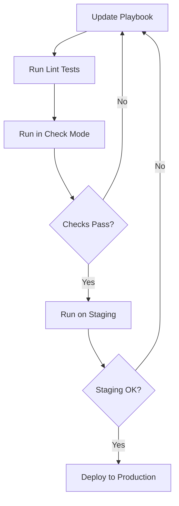

# Ansible Dry Runs

## Introduction

When working with Ansible to automate infrastructure management, it's crucial to verify that your playbooks will make the expected changes before applying them to production environments. This is where **Ansible dry runs** come into play.

A dry run (also known as "check mode" in Ansible) allows you to simulate the execution of your playbooks without making any actual changes to your target systems. This testing approach is essential for preventing unintended modifications, validating your automation logic, and confirming that playbooks will behave as expected.

In this guide, we'll explore how to perform dry runs in Ansible, understand their limitations, and see practical examples of implementing them in your workflow.

## Understanding Check Mode

Ansible's check mode (the official term for dry runs) works by telling Ansible to report what changes would be made rather than actually making those changes. When you run a playbook in check mode:

1. Ansible connects to the target hosts
2. Evaluates the tasks in your playbook
3. Reports what changes would occur
4. Makes no actual modifications to the systems

Think of it as a "what-if" simulation that gives you a preview of what would happen if you ran the playbook for real.

## Running Playbooks in Check Mode

There are two primary ways to run Ansible playbooks in check mode:

### 1. Using the `--check` Flag

The simplest way to perform a dry run is to add the `--check` flag when executing your playbook:

```bash
ansible-playbook my_playbook.yml --check
```

### 2. Setting `check_mode: yes` in Your Playbook

You can also enable check mode for specific tasks by setting the `check_mode` parameter (or its alias `check`):

```yaml
- name: Create a directory if it doesn't exist
  file:
    path: /opt/my_application
    state: directory
    mode: '0755'
  check_mode: yes
```

## Check Mode Output Example

Let's look at an example of running a simple playbook in check mode:

```bash
$ ansible-playbook install_nginx.yml --check

PLAY [Install and configure Nginx] ***********************************************

TASK [Gathering Facts] **********************************************************
ok: [webserver.example.com]

TASK [Install Nginx package] ****************************************************
changed: [webserver.example.com]

TASK [Ensure Nginx service is started] ******************************************
changed: [webserver.example.com]

PLAY RECAP **********************************************************************
webserver.example.com : ok=3    changed=2    unreachable=0    failed=0    skipped=0    rescued=0    ignored=0
```

In this output:
- Tasks marked as `changed` indicate what would change if you ran the playbook without check mode
- Tasks marked as `ok` would not result in any changes

## Controlling Check Mode Behavior

### Forcing Task Execution with `check_mode: no`

Some tasks don't work well in check mode or might be required to run for subsequent tasks to be properly evaluated. In these cases, you can force a task to execute even in check mode:

```yaml
- name: Get current application version
  command: /opt/app/bin/version
  register: app_version
  check_mode: no  # This will run even in check mode
```

### Skipping Tasks in Check Mode with `when`

Conversely, you might want some tasks to be skipped entirely during check mode:

```yaml
- name: Perform database backup
  shell: /usr/local/bin/backup_db.sh
  when: not ansible_check_mode
```

## Check Mode Limitations

While check mode is powerful, it has some limitations you should be aware of:

1. **Module Support**: Not all Ansible modules fully support check mode. Some modules cannot accurately predict changes.

2. **External Dependencies**: If a task relies on the result of another task that doesn't execute in check mode, it may not report accurate results.

3. **Command/Shell Modules**: Tasks using `command` or `shell` modules can't determine changes automatically unless you add `changed_when` conditions.

4. **Conditional Logic**: If your playbook contains conditional logic based on the results of tasks, check mode might not follow the same execution path as a real run.

## Improving Check Mode Reliability

### Using `changed_when` with Command and Shell

For `command` and `shell` modules, you can improve check mode accuracy by defining when a task should be considered "changed":

```yaml
- name: Check if configuration needs updating
  command: grep "max_connections=100" /etc/mysql/my.cnf
  register: config_check
  changed_when: config_check.rc != 0
  check_mode: no  # Run the check even in check mode
  
- name: Update MySQL configuration
  lineinfile:
    path: /etc/mysql/my.cnf
    regexp: '^max_connections'
    line: 'max_connections=100'
  when: config_check.rc != 0
```

### Combining with `--diff` for More Detail

For a more detailed view of what changes would be made, combine check mode with the `--diff` flag:

```bash
ansible-playbook my_playbook.yml --check --diff
```

This will show you exactly what content would be changed in files, configurations, and other resources.

## Real-World Examples

### Example 1: Testing System Updates

```yaml
---
# update_systems.yml
- name: Update all system packages
  hosts: all
  become: yes
  tasks:
    - name: Update apt cache
      apt:
        update_cache: yes
      when: ansible_os_family == "Debian"
      
    - name: Upgrade all packages
      apt:
        upgrade: safe
      when: ansible_os_family == "Debian"
```

To test this playbook safely:

```bash
ansible-playbook update_systems.yml --check --diff
```

### Example 2: Deploying a Web Application

```yaml
---
# deploy_webapp.yml
- name: Deploy web application
  hosts: webservers
  become: yes
  vars:
    app_version: "1.2.3"
    
  tasks:
    - name: Ensure application directory exists
      file:
        path: /var/www/myapp
        state: directory
        owner: www-data
        group: www-data
        
    - name: Download application release
      get_url:
        url: "https://example.com/releases/myapp-{{ app_version }}.zip"
        dest: "/tmp/myapp-{{ app_version }}.zip"
      register: download_result
      
    - name: Extract application files
      unarchive:
        src: "/tmp/myapp-{{ app_version }}.zip"
        dest: /var/www/myapp
        remote_src: yes
      when: download_result is changed
      
    - name: Restart web server
      service:
        name: nginx
        state: restarted
```

Test the deployment:

```bash
ansible-playbook deploy_webapp.yml --check
```

### Example 3: Using Verbose Output for Better Insights

For more detailed output during a dry run, add the verbose flag:

```bash
ansible-playbook configure_firewall.yml --check -v
```

## Workflow Integration

A common practice is to incorporate dry runs into your CI/CD pipeline:



This workflow helps catch potential issues early and builds confidence in your automation.

## Summary

Ansible dry runs (check mode) provide a safe way to test your playbooks before deploying them to production environments. By simulating changes without making them, you can:

- Identify potential issues before they affect your systems
- Verify that playbooks will make the changes you expect
- Safely test configurations in sensitive environments
- Build confidence in your automation processes

While check mode has some limitations, combining it with techniques such as `changed_when` conditions, the `--diff` flag, and proper task organization can make it an invaluable part of your Ansible testing strategy.

## Practice Exercises

1. Take a simple playbook you've written and run it in check mode. Analyze the output to understand what changes it would make.

2. Create a playbook that installs and configures a service of your choice. Run it in check mode with the `--diff` flag to see detailed configuration changes.

3. Modify a task that uses the `command` or `shell` module to include appropriate `changed_when` conditions that work well with check mode.

4. Create a playbook with tasks that should always run in check mode, and others that should be skipped. Test your configuration to ensure it behaves as expected.

## Additional Resources

- [Ansible Documentation on Check Mode](https://docs.ansible.com/ansible/latest/user_guide/playbooks_checkmode.html)
- [Ansible Best Practices](https://docs.ansible.com/ansible/latest/user_guide/playbooks_best_practices.html)
- [Ansible Testing Strategies](https://docs.ansible.com/ansible/latest/reference_appendices/test_strategies.html)