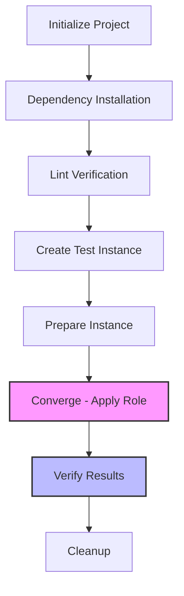

# Ansible Molecule

## Introduction

Testing infrastructure code is just as important as testing application code. Ansible Molecule is a framework specifically designed to test Ansible roles. It helps you develop and test your roles in isolation, ensuring they work as expected before deploying them to production environments.

In this guide, we'll explore how Molecule works, how to set it up, and how to use it to test your Ansible roles effectively. By the end, you'll have a solid understanding of how to implement automated testing for your infrastructure code.

## What is Molecule?

Molecule provides a framework for developing and testing Ansible roles. It helps you:

- Validate that your role works across different operating systems
- Detect errors early in your development cycle
- Establish best practices for role development
- Ensure your roles meet quality standards

Molecule uses a structured approach to testing, defining various stages such as linting, creating test instances, preparing them, converging (applying your role), verifying results, and cleaning up afterward.



## Getting Started with Molecule

### Installation

Before using Molecule, you need to install it along with its dependencies. The easiest way is to use pip:

```bash
# Create a virtual environment
python -m venv molecule-env
source molecule-env/bin/activate  # On Windows: molecule-env\Scripts\activate

# Install Molecule with the Docker driver
pip install molecule molecule-plugins[docker] ansible-lint yamllint
```

You'll also need Docker installed on your system since we'll be using it as our test platform.

### Creating a New Role with Molecule

Let's create a new Ansible role with Molecule testing integrated:

```bash
# Create a new role with Molecule integration
molecule init role my_awesome_role

# Change into the role directory
cd my_awesome_role
```

This command creates a new role with the following structure:

```
my_awesome_role/
├── defaults/
├── handlers/
├── meta/
├── molecule/
│   └── default/
│       ├── converge.yml
│       ├── molecule.yml
│       └── verify.yml
├── tasks/
├── templates/
└── vars/
```

The `molecule/` directory contains everything needed for testing your role.

## Understanding the Molecule Configuration

The main configuration file for Molecule is `molecule.yml`. Let's examine a basic configuration:

```yaml
---
dependency:
  name: galaxy
driver:
  name: docker
platforms:
  - name: instance
    image: quay.io/centos/centos:stream8
    pre_build_image: true
provisioner:
  name: ansible
verifier:
  name: ansible
```

This configuration tells Molecule to:

1. Use Galaxy for dependencies
2. Use Docker as the testing platform
3. Create a CentOS Stream 8 container for testing
4. Use Ansible as both the provisioner and verifier

### Molecule Configuration Breakdown

Let's break down each section:

#### Dependency

```yaml
dependency:
  name: galaxy
```

This section defines how Molecule should handle role dependencies. Using `galaxy` means Molecule will install any dependencies defined in your `meta/main.yml` file.

#### Driver

```yaml
driver:
  name: docker
```

The driver tells Molecule what platform to use for testing. Docker is ideal for local testing as it's lightweight and fast. Other options include:

- podman
- vagrant
- ec2
- azure
- gce

#### Platforms

```yaml
platforms:
  - name: instance
    image: quay.io/centos/centos:stream8
    pre_build_image: true
```

This section defines what instances Molecule will create for testing. You can define multiple platforms to test your role against different operating systems.

#### Provisioner

```yaml
provisioner:
  name: ansible
```

The provisioner is what applies your role to the test instances. Ansible is the default.

#### Verifier

```yaml
verifier:
  name: ansible
```

The verifier runs tests to ensure your role applied correctly. Molecule supports several verifiers, but Ansible is recommended for most use cases.

## The Molecule Testing Workflow

Molecule follows a specific workflow when testing your roles:

### 1. Dependency Resolution

First, Molecule installs any dependencies your role requires.

### 2. Lint Checking

Molecule can run linters like `ansible-lint` and `yamllint` to check your role's syntax.

```bash
molecule lint
```

### 3. Creating Test Instances

When you run a test, Molecule creates instances based on your configuration.

```bash
molecule create
```

### 4. Preparing Instances

The preparation phase can run playbooks to set up your instances before testing.

### 5. Converging - Applying Your Role

The converge step applies your role to the test instances.

```bash
molecule converge
```

The `converge.yml` playbook typically looks like this:

```yaml
---
- name: Converge
  hosts: all
  tasks:
    - name: Include my_awesome_role
      ansible.builtin.include_role:
        name: my_awesome_role
```

### 6. Verifying Results

Verification ensures your role had the expected effect.

```bash
molecule verify
```

The `verify.yml` playbook might look like:

```yaml
---
- name: Verify
  hosts: all
  gather_facts: false
  tasks:
    - name: Check if required file exists
      ansible.builtin.stat:
        path: /path/to/expected/file
      register: stat_result

    - name: Ensure file exists
      ansible.builtin.assert:
        that: stat_result.stat.exists
        fail_msg: "Required file doesn't exist!"
        success_msg: "Required file exists as expected"
```

### 7. Cleanup

Finally, Molecule destroys the test instances.

```bash
molecule destroy
```

You can run the entire workflow with a single command:

```bash
molecule test
```

## Practical Example: Web Server Role

Let's work through a complete example of creating and testing a simple web server role.

### 1. Create the Role

```bash
molecule init role web_server
cd web_server
```

### 2. Define Role Tasks

Edit `tasks/main.yml`:

```yaml
---
- name: Install nginx
  ansible.builtin.package:
    name: nginx
    state: present

- name: Enable and start nginx
  ansible.builtin.service:
    name: nginx
    state: started
    enabled: true

- name: Create custom index page
  ansible.builtin.template:
    src: index.html.j2
    dest: /usr/share/nginx/html/index.html
    mode: '0644'
```

### 3. Create a Template

Create `templates/index.html.j2`:

```html
<!DOCTYPE html>
<html>
<head>
    <title>Welcome to {{ ansible_hostname }}</title>
</head>
<body>
    <h1>Hello from {{ ansible_hostname }}</h1>
    <p>This server is managed by Ansible</p>
</body>
</html>
```

### 4. Update Molecule Configuration

Edit `molecule/default/molecule.yml`:

```yaml
---
dependency:
  name: galaxy
driver:
  name: docker
platforms:
  - name: instance
    image: quay.io/centos/centos:stream8
    pre_build_image: true
    command: /sbin/init
    privileged: true
    volumes:
      - /sys/fs/cgroup:/sys/fs/cgroup:ro
provisioner:
  name: ansible
  playbooks:
    converge: converge.yml
verifier:
  name: ansible
```

### 5. Create Verification Tests

Edit `molecule/default/verify.yml`:

```yaml
---
- name: Verify
  hosts: all
  gather_facts: false
  tasks:
    - name: Check if nginx is running
      ansible.builtin.service_facts:

    - name: Ensure nginx is running
      ansible.builtin.assert:
        that:
          - "'nginx' in services"
          - "services['nginx']['state'] == 'running'"
        fail_msg: "Nginx is not running!"
        success_msg: "Nginx is running as expected"

    - name: Get webpage content
      ansible.builtin.uri:
        url: http://localhost
        return_content: true
      register: webpage

    - name: Verify webpage content
      ansible.builtin.assert:
        that:
          - "'managed by Ansible' in webpage.content"
        fail_msg: "Custom webpage not found!"
        success_msg: "Custom webpage configured correctly"
```

### 6. Run the Tests

Now you can run the complete test suite:

```bash
molecule test
```

If everything works correctly, you should see output indicating that each step succeeded, and your role works as expected.

## Testing Multiple Scenarios

One of Molecule's strengths is testing your role across multiple scenarios. You might want to test your role against different:

- Operating systems (Ubuntu, CentOS, etc.)
- Configurations (different role parameters)
- Ansible versions

Let's create a new scenario for Ubuntu:

```bash
molecule init scenario ubuntu --driver-name docker
```

Then edit `molecule/ubuntu/molecule.yml`:

```yaml
---
dependency:
  name: galaxy
driver:
  name: docker
platforms:
  - name: ubuntu-instance
    image: ubuntu:20.04
    pre_build_image: true
    command: /sbin/init
    privileged: true
    volumes:
      - /sys/fs/cgroup:/sys/fs/cgroup:ro
provisioner:
  name: ansible
verifier:
  name: ansible
```

Now you can test your role on Ubuntu:

```bash
molecule test -s ubuntu
```

## Testing Role Parameters

You can also test how your role behaves with different parameters. Let's modify our converge playbook to pass variables:

Edit `molecule/default/converge.yml`:

```yaml
---
- name: Converge
  hosts: all
  vars:
    web_page_title: "Custom Title"
    web_page_content: "This is a custom page"
  tasks:
    - name: Include web_server role
      ansible.builtin.include_role:
        name: web_server
```

Then update your role to use these variables:

Edit `templates/index.html.j2`:

```html
<!DOCTYPE html>
<html>
<head>
    <title>{{ web_page_title | default('Welcome to ' + ansible_hostname) }}</title>
</head>
<body>
    <h1>{{ web_page_title | default('Hello from ' + ansible_hostname) }}</h1>
    <p>{{ web_page_content | default('This server is managed by Ansible') }}</p>
</body>
</html>
```

This allows you to test your role with different parameter values.

## Best Practices for Molecule Testing

Here are some recommended practices when using Molecule:

1. **Test with Multiple Platforms**: Test your roles against all operating systems they'll be used with.

2. **Use Idempotence Testing**: Ensure your role can be run multiple times without errors.

3. **Write Comprehensive Verification**: Check all aspects of your role's functionality.

4. **Include Edge Cases**: Test with both standard and unusual parameters.

5. **Integrate with CI/CD**: Add Molecule tests to your CI/CD pipeline.

6. **Keep Test Fast**: Use lightweight containers where possible.

7. **Test Role Dependencies**: Ensure any dependencies work correctly with your role.

## Continuous Integration with Molecule

You can integrate Molecule tests into your CI/CD pipeline. Here's an example GitHub Actions workflow:

```yaml
name: Molecule Test
on: [push, pull_request]
jobs:
  test:
    runs-on: ubuntu-latest
    steps:
      - name: Check out code
        uses: actions/checkout@v2
      
      - name: Set up Python
        uses: actions/setup-python@v2
        with:
          python-version: '3.9'
      
      - name: Install dependencies
        run: |
          python -m pip install --upgrade pip
          pip install molecule molecule-plugins[docker] ansible-lint yamllint
      
      - name: Run Molecule tests
        run: molecule test
```

This workflow will run your Molecule tests whenever you push code or open a pull request.

## Debugging Molecule Tests

When your tests fail, you can use these strategies to debug:

1. **Keep the Instance Running**:
   ```bash
   molecule create
   molecule converge
   # Debug the instance
   molecule login
   ```

2. **Increase Verbosity**:
   ```bash
   molecule --debug test
   ```

3. **Test Stages Individually**:
   ```bash
   molecule create
   molecule converge
   molecule verify
   ```

## Summary

Ansible Molecule is a powerful tool for testing your Ansible roles. It helps ensure your infrastructure code works as expected across different environments and configurations. By incorporating Molecule into your workflow, you can:

- Catch bugs early in the development process
- Ensure roles work across different operating systems
- Test different configurations and parameters
- Build more reliable infrastructure code

Remember that good infrastructure testing is just as important as application testing. Using Molecule helps you develop high-quality, reliable Ansible roles that you can confidently use in production.

## Additional Resources

- [Official Molecule Documentation](https://molecule.readthedocs.io/)
- [Ansible Testing Strategies](https://docs.ansible.com/ansible/latest/reference_appendices/test_strategies.html)
- [Ansible Role Best Practices](https://docs.ansible.com/ansible/latest/user_guide/playbooks_best_practices.html)

## Exercises

1. Create a basic Ansible role with Molecule testing for installing and configuring a database server.
2. Extend an existing role to test against multiple Linux distributions.
3. Add verification tests that check both the installation status and the actual functionality of your role.
4. Integrate Molecule testing into a CI/CD pipeline for one of your Ansible projects.
5. Create a complex role with custom parameters and write tests to verify each parameter works as expected.