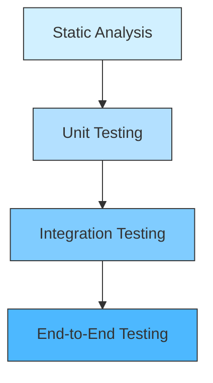

# Ansible Test Strategies

## Introduction

Testing is a critical aspect of any software development lifecycle, and Ansible automation is no exception. Properly testing your Ansible code ensures your infrastructure deployments are reliable, reproducible, and maintainable. In this guide, we'll explore various strategies and tools for testing Ansible playbooks, roles, and modules effectively.

As infrastructure automation becomes increasingly complex, having a robust testing strategy helps catch errors early, validates changes before they reach production, and gives you confidence in your automation code. Whether you're new to Ansible or looking to improve your testing practices, this guide will provide you with practical approaches to implement effective testing in your Ansible workflows.

## Why Test Ansible Code?

Before diving into testing strategies, let's understand why testing Ansible code is important:

1. **Prevent Configuration Drift**: Ensure your infrastructure remains in the desired state
2. **Catch Errors Early**: Identify issues before they impact production environments
3. **Validate Changes**: Verify that modifications work as expected
4. **Document Behavior**: Tests serve as executable documentation of expected behavior
5. **Enable Collaboration**: Allow team members to confidently modify and extend existing code

## Testing Pyramid for Ansible

Similar to application development, Ansible testing can be organized in a pyramid structure:



Let's explore each level in detail:

## 1. Static Analysis

Static analysis tools examine your code without executing it, helping catch syntax errors, style issues, and potential bugs.

### Ansible Lint

Ansible Lint is a command-line tool that checks playbooks for practices and behavior that could potentially be improved.

#### Installation:

```bash
pip install ansible-lint
```

#### Usage:

```bash
ansible-lint playbook.yml
```

#### Example Output:

```
playbook.yml:15: [E301] Commands should not change things if nothing needs doing
playbook.yml:42: [E305] Use shell only when shell functionality is required
```

### YAML Validation

Since Ansible uses YAML, validating your YAML syntax is a fundamental first step:

```bash
ansible-playbook --syntax-check playbook.yml
```

### Best Practices for Static Analysis:

1. Integrate linting into your CI/CD pipeline
2. Create a `.ansible-lint` configuration file to customize rules
3. Run static analysis before committing code
4. Address all warnings and errors promptly

Example `.ansible-lint` configuration:

```yaml
exclude_paths:
  - .github/
  - .git/
  - roles/external/
skip_list:
  - '204' # Lines should be no longer than 160 chars
  - '303' # Using command rather than module
```

## 2. Unit Testing

Unit testing focuses on testing individual components of your Ansible code in isolation.

### Molecule

Molecule is a testing framework designed specifically for Ansible roles. It helps developers and operators create and test roles in isolation.

#### Installation:

```bash
pip install molecule molecule-docker
```

#### Creating a New Role with Molecule:

```bash
molecule init role my_new_role
```

#### Directory Structure:

```
my_new_role/
├── defaults/
├── handlers/
├── meta/
├── molecule/
│   └── default/
│       ├── converge.yml
│       ├── molecule.yml
│       └── verify.yml
├── tasks/
├── templates/
└── vars/
```

#### Example `molecule.yml`:

```yaml
---
dependency:
  name: galaxy
driver:
  name: docker
platforms:
  - name: instance
    image: "geerlingguy/docker-${MOLECULE_DISTRO:-ubuntu2004}-ansible:latest"
    command: ""
    volumes:
      - /sys/fs/cgroup:/sys/fs/cgroup:ro
    privileged: true
    pre_build_image: true
provisioner:
  name: ansible
verifier:
  name: ansible
```

#### Running Tests:

```bash
cd my_new_role
molecule test
```

### Ansible-Playbook with `--check`

For simple playbooks, you can use Ansible's built-in check mode:

```bash
ansible-playbook playbook.yml --check
```

This runs the playbook without making any changes to the target systems, allowing you to see what would change.

## 3. Integration Testing

Integration testing verifies that multiple components work together correctly.

### Testing with Inventories

Create test-specific inventories to validate playbooks against controlled environments:

```yaml
# test_inventory.yml
all:
  hosts:
    test_host:
      ansible_connection: docker
      ansible_host: test-container
  vars:
    env: test
```

#### Running Integration Tests:

```bash
# Start a test container
docker run -d --name test-container ubuntu:20.04 sleep infinity

# Run your playbook against the test inventory
ansible-playbook -i test_inventory.yml playbook.yml

# Verify the results
ansible -i test_inventory.yml test_host -m shell -a "cat /etc/myapp/config.yml"

# Clean up
docker stop test-container
docker rm test-container
```

### Testinfra

Testinfra is a Python library for testing the actual state of your servers configured by Ansible.

#### Installation:

```bash
pip install testinfra
```

#### Example Test:

```python
# test_myapp.py
def test_myapp_service_running(host):
    service = host.service('myapp')
    assert service.is_running
    assert service.is_enabled

def test_myapp_config_file(host):
    config_file = host.file('/etc/myapp/config.yml')
    assert config_file.exists
    assert config_file.user == 'myapp'
    assert config_file.group == 'myapp'
    assert config_file.mode == 0o644
    assert 'environment: test' in config_file.content_string
```

#### Running Testinfra:

```bash
pytest -v test_myapp.py --hosts=ansible://test_host --ansible-inventory=test_inventory.yml
```

## 4. End-to-End Testing

End-to-end testing validates complete workflows and ensures all components work together as expected.

### Using Vagrant for Testing

Vagrant allows you to create and configure lightweight, reproducible, and portable development environments.

#### Example `Vagrantfile`:

```ruby
Vagrant.configure("2") do |config|
  config.vm.box = "ubuntu/focal64"
  
  config.vm.provision "ansible" do |ansible|
    ansible.playbook = "site.yml"
    ansible.groups = {
      "webservers" => ["default"],
      "all:vars" => {"env" => "test"}
    }
  end
end
```

#### Running Vagrant:

```bash
vagrant up
vagrant provision
```

### Ansible Tower / AWX for Testing

If you're using Ansible Tower or AWX, you can create test job templates and workflows to validate your playbooks in a controlled environment.

## Real-World Testing Workflows

Let's explore practical workflows for testing Ansible code:

### Continuous Integration with GitHub Actions

```yaml
# .github/workflows/ansible-test.yml
name: Ansible Test

on:
  push:
    branches: [ main, develop ]
  pull_request:
    branches: [ main ]

jobs:
  lint:
    runs-on: ubuntu-latest
    steps:
      - uses: actions/checkout@v2
      - name: Set up Python
        uses: actions/setup-python@v2
        with:
          python-version: '3.9'
      - name: Install dependencies
        run: pip install ansible ansible-lint
      - name: Lint Ansible playbooks
        run: ansible-lint

  molecule:
    needs: lint
    runs-on: ubuntu-latest
    strategy:
      matrix:
        distro: ['ubuntu2004', 'centos8']
    steps:
      - uses: actions/checkout@v2
      - name: Set up Python
        uses: actions/setup-python@v2
        with:
          python-version: '3.9'
      - name: Install dependencies
        run: pip install molecule molecule-docker ansible
      - name: Run Molecule tests
        run: cd roles/myapp && MOLECULE_DISTRO=${{ matrix.distro }} molecule test
        env:
          PY_COLORS: '1'
          ANSIBLE_FORCE_COLOR: '1'
```

### Testing Infrastructure Changes

Here's a workflow for safely testing infrastructure changes:

1. **Development**: Write or modify Ansible code locally
2. **Static Analysis**: Run ansible-lint to check for issues
3. **Unit Testing**: Test individual roles with Molecule
4. **Staging Test**: Apply changes to a staging environment
5. **Verification**: Run Testinfra to verify the state
6. **Review**: Conduct a peer review of changes
7. **Production Deployment**: Apply to production with `--limit` for controlled rollout

## Best Practices for Ansible Testing

1. **Make Tests Idempotent**: Ensure playbooks can be run multiple times without issues
2. **Use Version Control**: Track all changes to your Ansible code
3. **Create Test Environments**: Use containers or VMs that mirror production
4. **Parameterize Tests**: Test with different variables and environments
5. **Include Cleanup**: Tests should clean up after themselves
6. **Test Failure Scenarios**: Verify that tasks fail correctly when they should
7. **Automate Testing**: Integrate tests into CI/CD pipelines

## Testing Custom Ansible Modules

If you've written custom Ansible modules, you can test them with Ansible's module testing framework:

```python
# library/test/units/modules/test_my_module.py
from __future__ import absolute_import, division, print_function
__metaclass__ = type

from units.compat import unittest
from units.compat.mock import patch
from ansible.modules.my_module import main

class TestMyModule(unittest.TestCase):
    def test_module_fail_when_required_args_missing(self):
        with self.assertRaises(AnsibleFailJson) as result:
            main()
        
    @patch('ansible.modules.my_module.AnsibleModule.exec_command')
    def test_module_command(self, mock_exec_command):
        mock_exec_command.return_value = (0, 'output', '')
        with patch.object(basic.AnsibleModule, 'exit_json') as mock_exit_json:
            main()
        mock_exit_json.assert_called_once_with(
            changed=True,
            command='my_command',
            stdout='output'
        )
```

## Summary

Effective testing of Ansible code is crucial for maintaining reliable infrastructure automation. By implementing a multi-layered testing approach that includes static analysis, unit testing, integration testing, and end-to-end testing, you can catch issues early and ensure your Ansible code performs as expected.

Remember that the goal of testing is not just to find bugs but to build confidence in your automation code. A well-tested Ansible codebase allows you to make changes and improvements with minimal risk, enabling faster and more reliable infrastructure evolution.

## Additional Resources

- [Ansible Testing Strategies Documentation](https://docs.ansible.com/ansible/latest/reference_appendices/test_strategies.html)
- [Molecule Documentation](https://molecule.readthedocs.io/)
- [Ansible Lint Documentation](https://ansible-lint.readthedocs.io/)
- [Testinfra Documentation](https://testinfra.readthedocs.io/)

## Exercises

1. Set up Ansible Lint in your project and fix any issues it identifies.
2. Create a new role using Molecule and write tests for it.
3. Implement a CI pipeline for your Ansible code using GitHub Actions or another CI system.
4. Write Testinfra tests to verify the state of your infrastructure after applying a playbook.
5. Create a test strategy document for an existing Ansible project, identifying areas where testing could be improved.