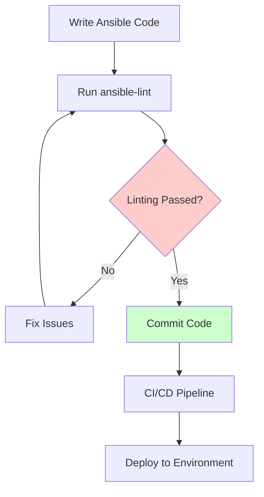

# Ansible Linting

## Introduction

When working with Ansible, ensuring that your playbooks, roles, and tasks follow best practices is crucial for maintaining code quality and preventing potential issues. Ansible linting is the process of analyzing your Ansible code to identify and fix stylistic errors, potential bugs, and deviations from established conventions.

In this guide, we'll explore how to use linting tools to validate your Ansible code, understand common linting rules, and integrate linting into your development workflow.

## What is Ansible Linting?

Ansible linting is a static code analysis process that examines your Ansible code without executing it. A linter checks your code against a set of predefined rules and highlights any violations, helping you to:

- Maintain consistent coding style across your infrastructure code
- Identify potential bugs and errors before deployment
- Follow security best practices
- Improve readability and maintainability
- Enforce team-wide coding standards

## Getting Started with ansible-lint

The most commonly used tool for Ansible linting is `ansible-lint`, a command-line utility specifically designed to check Ansible playbooks and roles for best practices and potential issues.

### Installation

You can install `ansible-lint` using pip:

```bash
pip install ansible-lint
```

For those using Python 3:

```bash
pip3 install ansible-lint
```

### Basic Usage

The basic syntax for running ansible-lint is:

```bash
ansible-lint playbook.yml
```

This command will analyze your playbook and output any issues it finds. For example:

```bash
ansible-lint my_playbook.yml
```

Example output:

```
my_playbook.yml:15: [E301] Commands should not change things if nothing needs doing
my_playbook.yml:22: [E305] Use shell only when shell functionality is required
my_playbook.yml:45: [E601] Don't compare to literal True/False
```

### Linting Multiple Files

You can also lint multiple files at once:

```bash
ansible-lint playbook1.yml playbook2.yml roles/myrole/
```

## Common Linting Rules

`ansible-lint` checks your code against numerous rules. Here are some of the most common categories:

### YAML Formatting

These rules check for proper YAML syntax and formatting:

- Indentation consistency
- Line length
- Trailing whitespace
- Required whitespace

Example of a YAML formatting issue:

```yaml
# Incorrect (inconsistent indentation)
---
- name: Configure webserver
  hosts: webservers
  tasks:
    - name: Install nginx
      apt:
        name: nginx
        state: present
   - name: Start nginx  # Wrong indentation here
     service:
       name: nginx
       state: started
```

### Ansible Best Practices

These rules enforce Ansible-specific best practices:

- Using modules instead of commands where possible
- Avoiding deprecated modules or features
- Using appropriate variable naming conventions
- Handling secrets properly

Example of a best practice violation:

```yaml
# Incorrect (using command instead of module)
- name: Start the nginx service
  command: service nginx start

# Correct (using the service module)
- name: Start the nginx service
  service:
    name: nginx
    state: started
```

### Security Concerns

Security-focused rules help identify potential vulnerabilities:

- Avoiding world-writeable files
- Preventing use of unencrypted protocols
- Checking proper permission management
- Warning against hard-coded secrets

Example of a security concern:

```yaml
# Security issue: hardcoded password
- name: Create database user
  mysql_user:
    name: dbuser
    password: SuperSecretPassword123  # Should use a variable with vault encryption
    priv: '*.*:ALL'
    state: present
```

## Configuring ansible-lint

You can customize ansible-lint behavior by creating a configuration file named `.ansible-lint` in your project's root directory.

### Basic Configuration Example

```yaml
# .ansible-lint configuration
exclude_paths:
  - .github/
  - roles/external_role/
skip_list:
  - '204'  # Lines should be no longer than 160 chars
  - '301'  # Commands should not change things if nothing needs doing
warn_list:
  - '305'  # Use shell only when shell functionality is required
  - experimental  # all rules tagged as experimental
```

### Common Configuration Options

- `exclude_paths`: Directories or files to exclude from linting
- `skip_list`: Rules to completely skip
- `warn_list`: Rules to still check but only warn about (not error)
- `verbosity`: Level of detail in output (1-3)
- `parseable`: Whether to output in a machine-readable format

## Integrating ansible-lint Into Your Workflow

To make the most of ansible-lint, you should integrate it into your development workflow.

### Pre-commit Hooks

You can use [pre-commit](https://pre-commit.com/) to run ansible-lint automatically before each commit.

Create a `.pre-commit-config.yaml` file:

```yaml
repos:
- repo: https://github.com/ansible-community/ansible-lint
  rev: v6.13.1  # use the latest version
  hooks:
    - id: ansible-lint
      files: \.(yaml|yml)$
```

### Continuous Integration

Incorporate ansible-lint into your CI pipeline to ensure code quality checks run on every change.

Example GitHub Actions workflow (`.github/workflows/ansible-lint.yml`):

```yaml
name: Ansible Lint

on:
  push:
    paths:
      - '**.yml'
      - '**.yaml'
  pull_request:
    paths:
      - '**.yml'
      - '**.yaml'

jobs:
  ansible-lint:
    runs-on: ubuntu-latest
    steps:
      - name: Checkout code
        uses: actions/checkout@v3

      - name: Set up Python
        uses: actions/setup-python@v4
        with:
          python-version: '3.10'

      - name: Install ansible-lint
        run: pip install ansible-lint

      - name: Run ansible-lint
        run: ansible-lint
```

## Practical Examples

Let's look at some real-world examples of applying linting to improve Ansible code quality.

### Example 1: Fixing Command Usage

**Before linting:**

```yaml
- name: Install required packages
  command: apt install -y nginx python3 vim
```

**Linting output:**

```
tasks/main.yml:3: [E303] Use the 'apt' module instead of running apt commands
```

**After fixing:**

```yaml
- name: Install required packages
  apt:
    name: 
      - nginx
      - python3
      - vim
    state: present
```

### Example 2: Addressing Idempotency Issues

**Before linting:**

```yaml
- name: Create application directory
  command: mkdir -p /opt/myapp
```

**Linting output:**

```
tasks/main.yml:8: [E301] Commands should not change things if nothing needs doing
```

**After fixing:**

```yaml
- name: Create application directory
  file:
    path: /opt/myapp
    state: directory
    mode: '0755'
```

### Example 3: Handling File Permissions

**Before linting:**

```yaml
- name: Copy configuration file
  copy:
    src: config.ini
    dest: /etc/myapp/config.ini
```

**Linting output:**

```
tasks/main.yml:15: [E208] File permissions unset or incorrect
```

**After fixing:**

```yaml
- name: Copy configuration file
  copy:
    src: config.ini
    dest: /etc/myapp/config.ini
    mode: '0644'
```

## Advanced Linting Techniques

### Custom Rules

You can create custom linting rules for your organization's specific requirements.

Create a custom rule file:

```python
# custom_rules.py
from ansiblelint.rules import AnsibleLintRule

class CustomNoHardcodedIPs(AnsibleLintRule):
    id = 'CUSTOM0001'
    shortdesc = 'No hardcoded IP addresses'
    description = 'IP addresses should be defined in variables, not hardcoded'
    severity = 'HIGH'
    tags = ['custom', 'networking']

    def matchtask(self, file, task):
        for key, value in task.items():
            if isinstance(value, str) and self._is_ip_address(value):
                return True
        return False

    def _is_ip_address(self, value):
        import re
        ip_pattern = r'\b\d{1,3}\.\d{1,3}\.\d{1,3}\.\d{1,3}\b'
        return bool(re.search(ip_pattern, value))
```

Reference it in your `.ansible-lint` config:

```yaml
rulesdir:
  - ./custom_rules/
```

### Using Tags to Target Specific Rules

ansible-lint groups rules by tags, which allows you to target specific categories:

```bash
# Only run security-related checks
ansible-lint --tags security playbook.yml

# Skip deprecation warnings
ansible-lint --skip-tags deprecation playbook.yml
```

## Visual Representation of Ansible Linting Workflow

Here's a diagram showing how ansible-lint fits into the development process:



## Summary

Ansible linting is an essential practice for maintaining high-quality, consistent infrastructure code. By incorporating tools like `ansible-lint` into your development workflow, you can:

- Catch errors early in the development process
- Enforce consistent coding standards
- Improve code readability and maintainability
- Avoid common security pitfalls
- Ensure adherence to best practices

Remember that linting is just one aspect of testing your Ansible code. For a comprehensive testing strategy, combine linting with other testing methods like syntax checking, playbook validation, and integration testing.

## Additional Resources

To further your knowledge of Ansible linting:

- [Official ansible-lint documentation](https://ansible-lint.readthedocs.io/)
- [Ansible Best Practices Guide](https://docs.ansible.com/ansible/latest/user_guide/playbooks_best_practices.html)
- [Pre-commit Framework](https://pre-commit.com/)

## Exercises

1. Install ansible-lint and run it against an existing playbook
2. Create a custom `.ansible-lint` configuration file for your project
3. Set up a pre-commit hook to run ansible-lint automatically
4. Identify and fix three different types of linting issues in your Ansible code
5. Create a simple custom rule for a standard specific to your organization