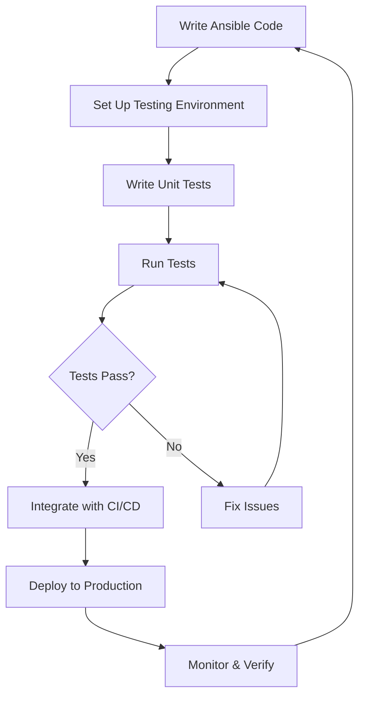

# Ansible Unit Testing

## Introduction

Unit testing is a fundamental practice in software development that involves testing individual components or "units" of code in isolation. In the context of Ansible, unit testing allows you to verify that your roles, playbooks, and modules behave as expected without actually executing them against real infrastructure.

This guide will walk you through implementing unit testing for your Ansible code, helping you catch issues early, ensure reliability, and build confidence in your automation.

## Why Unit Test Ansible Code?

Before diving into implementation, let's understand why unit testing Ansible code is valuable:

- **Early bug detection**: Catch issues before deploying to production environments
- **Regression prevention**: Ensure new changes don't break existing functionality
- **Documentation**: Tests serve as executable documentation of how your code should behave
- **Confidence**: Build trust in your automation code through validated behavior
- **Collaboration**: Enable team members to contribute safely with test validation

## Getting Started with Ansible Unit Testing

### Prerequisites

To follow along with this guide, you'll need:

- Python 3.6 or higher
- Ansible (2.9+)
- pip (Python package manager)

### Setting Up Your Testing Environment

Let's start by installing the necessary testing tools:

```bash
# Create a virtual environment (recommended)
python -m venv ansible-test-env
source ansible-test-env/bin/activate  # On Windows: ansible-test-env\Scripts\activate

# Install required packages
pip install pytest pytest-ansible ansible-lint molecule
```

## Ansible Testing Frameworks

There are several frameworks available for testing Ansible code. We'll cover the most popular ones:

### 1. Molecule

Molecule is the official testing framework for Ansible roles. It provides a complete testing pipeline that includes:

- Dependency installation
- Syntax validation
- Linting
- Unit testing
- Integration testing
- Verification

#### Setting Up Molecule for a Role

```bash
# Install Molecule with docker driver
pip install molecule molecule-docker

# Initialize a new role with Molecule
molecule init role my_test_role

# Or add Molecule to an existing role
cd existing_role
molecule init scenario default -d docker
```

The above commands create a directory structure similar to:

```
my_test_role/
├── defaults/
├── handlers/
├── meta/
├── molecule/
│   └── default/
│       ├── converge.yml
│       ├── molecule.yml
│       └── verify.yml
├── tasks/
├── tests/
└── vars/
```

### 2. Pytest-Ansible

Pytest-ansible is a plugin for the pytest framework that makes it easier to test Ansible modules and playbooks.

#### Installing and Using Pytest-Ansible

```bash
# Install pytest-ansible
pip install pytest-ansible

# Create a test file (test_my_playbook.py)
```

Here's a basic test file example:

```python
def test_ansible_ping(ansible_module):
    """Test ansible ping module."""
    result = ansible_module.ping()
    assert 'ping' in result
    assert result['ping'] == 'pong'
```

## Writing Unit Tests for Ansible Roles

Let's walk through creating unit tests for an Ansible role that installs and configures Nginx.

### Example Role Structure

```
nginx_role/
├── defaults/
│   └── main.yml
├── handlers/
│   └── main.yml
├── tasks/
│   └── main.yml
├── templates/
│   └── nginx.conf.j2
└── tests/
    └── unit/
        └── test_nginx_role.py
```

### Sample Role Tasks (tasks/main.yml)

```yaml
---
- name: Install Nginx
  package:
    name: nginx
    state: present
  become: true

- name: Configure Nginx
  template:
    src: nginx.conf.j2
    dest: /etc/nginx/nginx.conf
  notify: restart nginx
  become: true

- name: Ensure Nginx is running
  service:
    name: nginx
    state: started
    enabled: yes
  become: true
```

### Creating Unit Tests with Molecule

Let's set up Molecule for our Nginx role:

```bash
cd nginx_role
molecule init scenario unit -d docker
```

This creates a new scenario called "unit" that uses Docker as the driver.

Now, let's modify the verify.yml file to include our tests:

```yaml
---
# molecule/unit/verify.yml
- name: Verify
  hosts: all
  gather_facts: false
  tasks:
    - name: Check if Nginx package is installed
      command: dpkg-query -W -f='${Status}' nginx
      register: nginx_check
      changed_when: false
      failed_when: nginx_check.rc > 1
      
    - name: Verify Nginx config exists
      stat:
        path: /etc/nginx/nginx.conf
      register: nginx_config
      
    - name: Verify Nginx is running
      command: pgrep nginx
      register: nginx_status
      changed_when: false
      failed_when: false
      
    - name: Assert Nginx is properly installed and configured
      assert:
        that:
          - "'install ok installed' in nginx_check.stdout"
          - "nginx_config.stat.exists"
          - "nginx_status.rc == 0"
```

## Advanced Unit Testing Techniques

### Mocking External Dependencies

One key principle of unit testing is isolating the code under test from external dependencies. In Ansible, this often means mocking or simulating external services.

Here's an example using Pytest to mock an API call in a custom Ansible module:

```python
import pytest
from unittest.mock import patch

# The custom module being tested
from library.my_api_module import MyApiModule

def test_api_module_success():
    """Test successful API call."""
    with patch('library.my_api_module.requests.get') as mock_get:
        # Mock the API response
        mock_get.return_value.status_code = 200
        mock_get.return_value.json.return_value = {'status': 'success'}
        
        # Create module instance and test
        module = MyApiModule(dict(api_endpoint='https://example.com/api'))
        result = module.run()
        
        assert result['changed'] is True
        assert result['status'] == 'success'
```

### Testing Idempotence

Idempotence (the property that applying an operation multiple times gives the same result as applying it once) is a key principle in Ansible. Let's test it:

```yaml
# molecule/idempotence/molecule.yml
---
dependency:
  name: galaxy
driver:
  name: docker
platforms:
  - name: instance
    image: ubuntu:20.04
provisioner:
  name: ansible
verifier:
  name: ansible
scenario:
  name: idempotence
  test_sequence:
    - dependency
    - lint
    - cleanup
    - destroy
    - syntax
    - create
    - prepare
    - converge
    - idempotence  # This test will run converge twice and fail if there are changes
    - verify
    - cleanup
    - destroy
```

## Testing Best Practices

1. **Test structure**: Keep tests focused on a single aspect of functionality
2. **Isolation**: Ensure tests can run independently without affecting each other
3. **Coverage**: Aim to test all meaningful paths through your code
4. **Speed**: Optimize tests to run quickly to encourage frequent execution
5. **Readability**: Write clear test names and descriptions that explain what's being tested

## Real-World Example: Complete Web Server Role Testing

Let's look at a more comprehensive example of testing a web server role that:
- Installs web server software
- Configures virtual hosts
- Sets up SSL certificates
- Implements security hardening

### Directory Structure

```
webserver_role/
├── defaults/
│   └── main.yml
├── handlers/
│   └── main.yml
├── meta/
│   └── main.yml
├── molecule/
│   └── default/
│       ├── converge.yml
│       ├── molecule.yml
│       └── verify.yml
├── tasks/
│   ├── main.yml
│   ├── install.yml
│   ├── configure.yml
│   ├── certificates.yml
│   └── security.yml
├── templates/
└── vars/
```

### Test Cases

Here's a comprehensive set of tests in our verify.yml:

```yaml
---
# molecule/default/verify.yml
- name: Verify
  hosts: all
  gather_facts: true
  tasks:
    # Software installation tests
    - name: Verify web server is installed
      package_facts:
        manager: auto
      
    - name: Assert web server package is present
      assert:
        that: 
          - "'nginx' in ansible_facts.packages or 'apache2' in ansible_facts.packages"
          
    # Configuration tests
    - name: Check virtual host configuration
      stat:
        path: "{{ item }}"
      loop:
        - /etc/nginx/sites-enabled/example.com
        - /etc/nginx/ssl/example.com.crt
      register: config_files
      
    - name: Assert configuration files exist
      assert:
        that: item.stat.exists
      loop: "{{ config_files.results }}"
      
    # Service tests
    - name: Check web server service
      service_facts:
      
    - name: Assert web server is running
      assert:
        that:
          - "'nginx.service' in ansible_facts.services or 'apache2.service' in ansible_facts.services"
          - "ansible_facts.services['nginx.service'].state == 'running' if 'nginx.service' in ansible_facts.services else ansible_facts.services['apache2.service'].state == 'running'"
      
    # Content tests
    - name: Check if website responds
      uri:
        url: http://localhost
        return_content: yes
      register: webpage
      
    - name: Assert website is responding with correct content
      assert:
        that:
          - webpage.status == 200
          - "'Welcome to' in webpage.content"
          
    # Security tests
    - name: Check SSL configuration with OpenSSL
      command: openssl s_client -connect localhost:443 -servername example.com -showcerts
      register: ssl_check
      changed_when: false
      ignore_errors: true
      
    - name: Assert SSL is properly configured
      assert:
        that:
          - ssl_check.rc == 0
          - "'TLSv1.2' in ssl_check.stdout or 'TLSv1.3' in ssl_check.stdout"
```

## Integrating Tests with CI/CD

To maximize the benefits of your tests, integrate them into your CI/CD pipeline. Here's an example for GitHub Actions:

```yaml
# .github/workflows/molecule-test.yml
name: Molecule Test

on:
  push:
    branches: [ main, develop ]
  pull_request:
    branches: [ main ]

jobs:
  molecule:
    runs-on: ubuntu-latest
    strategy:
      matrix:
        python-version: [3.8]

    steps:
      - uses: actions/checkout@v2
      
      - name: Set up Python ${{ matrix.python-version }}
        uses: actions/setup-python@v2
        with:
          python-version: ${{ matrix.python-version }}
          
      - name: Install dependencies
        run: |
          python -m pip install --upgrade pip
          pip install molecule molecule-docker ansible-lint
          
      - name: Run Molecule tests
        run: molecule test
        env:
          PY_COLORS: '1'
          ANSIBLE_FORCE_COLOR: '1'
```

## Visualizing the Testing Process

Here's a flowchart of the Ansible testing process:



## Summary

Ansible unit testing is an essential practice for ensuring the quality and reliability of your automation code. In this guide, we've explored:

- The importance of unit testing in Ansible
- Setting up testing environments with Molecule and Pytest-Ansible
- Writing basic and advanced unit tests
- Testing real-world scenarios
- Integrating tests into CI/CD pipelines

By implementing unit testing in your Ansible workflow, you'll catch issues earlier, increase confidence in your code, and ultimately deliver more reliable automation.

## Additional Resources

- [Ansible Testing Strategies](https://docs.ansible.com/ansible/latest/dev_guide/testing.html)
- [Molecule Documentation](https://molecule.readthedocs.io/)
- [Pytest-Ansible Documentation](https://pytest-ansible.readthedocs.io/)
- [Ansible Best Practices](https://docs.ansible.com/ansible/latest/user_guide/playbooks_best_practices.html)

## Exercises

1. Create a basic Ansible role and set up Molecule testing for it
2. Write unit tests for an existing Ansible role in your project
3. Add idempotence testing to your Molecule scenarios
4. Integrate your Ansible tests with a CI/CD pipeline
5. Create mock tests for an Ansible module that interacts with external services