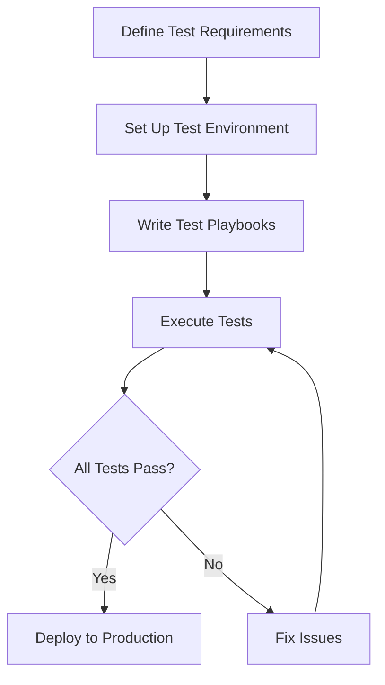

# Ansible Integration Testing

## Introduction

Integration testing is a critical component in the Ansible testing ecosystem. While unit tests verify individual components in isolation, integration tests validate how these components work together in a more realistic environment. For Ansible, integration testing ensures that your playbooks, roles, and modules perform as expected when interacting with actual systems or simulated environments.

In this guide, we'll explore how to set up, implement, and run integration tests for your Ansible projects. Whether you're managing a handful of servers or a complex infrastructure, proper integration testing helps catch issues before they impact your production environment.

## Understanding Integration Testing in Ansible

Integration testing for Ansible focuses on verifying that your automation works correctly across multiple components and systems. It answers questions like:

- Does my playbook correctly configure services across multiple hosts?
- Do my custom modules interact properly with the systems they manage?
- Are my roles idempotent when run multiple times?
- Do my playbooks handle different operating systems correctly?

### How Ansible Integration Tests Differ from Unit Tests

| Aspect | Unit Testing | Integration Testing |
|--------|-------------|---------------------|
| Scope | Tests individual components (modules, plugins) | Tests interactions between components |
| Environment | Typically mocked | Real or virtualized systems |
| Speed | Fast | Slower |
| Complexity | Lower | Higher |
| Dependencies | Minimal | Multiple system dependencies |

## Setting Up Your Integration Testing Environment

Before writing tests, you need an environment where you can safely run them. There are several approaches:

### 1. Using Docker Containers

Docker provides a lightweight, reproducible environment for testing Ansible playbooks and roles.

```yaml
# docker-compose.yml for testing environment
version: '3'
services:
  ubuntu_target:
    image: ubuntu:20.04
    command: sleep infinity
    volumes:
      - /sys/fs/cgroup:/sys/fs/cgroup:ro
    privileged: true
  
  centos_target:
    image: centos:8
    command: sleep infinity
    volumes:
      - /sys/fs/cgroup:/sys/fs/cgroup:ro
    privileged: true
```

### 2. Using Molecule

Molecule is a testing framework designed specifically for Ansible roles. It can spin up instances using Docker, Vagrant, or cloud providers.

```yaml
# molecule/default/molecule.yml
---
dependency:
  name: galaxy
driver:
  name: docker
platforms:
  - name: instance
    image: ubuntu:20.04
    pre_build_image: true
provisioner:
  name: ansible
verifier:
  name: ansible
```

### 3. Using Vagrant

Vagrant allows you to create and manage virtual machines for testing.

```ruby
# Vagrantfile
Vagrant.configure("2") do |config|
  config.vm.box = "ubuntu/focal64"
  
  config.vm.provider "virtualbox" do |vb|
    vb.memory = "1024"
  end
  
  config.vm.provision "ansible" do |ansible|
    ansible.playbook = "test_playbook.yml"
  end
end
```

## Writing Your First Integration Test

Let's create a simple integration test for a web server role:

### 1. Create a Test Playbook

```yaml
# tests/integration/test_webserver.yml
---
- name: Test web server installation
  hosts: all
  become: true
  roles:
    - role: webserver
  
  tasks:
    - name: Verify Apache is running
      service:
        name: apache2
        state: started
      register: apache_status
    
    - name: Verify Apache is enabled
      service:
        name: apache2
        enabled: yes
      register: apache_enabled
    
    - name: Check if website is accessible
      uri:
        url: http://localhost
        return_content: yes
      register: webpage
      failed_when: "'Welcome' not in webpage.content"
```

### 2. Create an Inventory File

```ini
# tests/integration/inventory
[webservers]
localhost ansible_connection=local
```

### 3. Run the Test

```bash
ansible-playbook -i tests/integration/inventory tests/integration/test_webserver.yml
```

## Best Practices for Integration Tests

### 1. Make Tests Idempotent

Ensure your tests can be run multiple times without failure. This is a core principle of Ansible itself.

```yaml
- name: Test idempotence
  hosts: all
  tasks:
    - name: First run
      include_role:
        name: my_role
      register: first_run

    - name: Second run
      include_role:
        name: my_role
      register: second_run

    - name: Check idempotence
      assert:
        that:
          - second_run.changed == 0
        fail_msg: "Role is not idempotent!"
```

### 2. Test Against Multiple Platforms

Test your Ansible code against all operating systems you intend to support.

```yaml
# molecule/default/molecule.yml with multiple platforms
---
platforms:
  - name: ubuntu
    image: ubuntu:20.04
  - name: centos
    image: centos:8
  - name: debian
    image: debian:buster
```

### 3. Validate Expected States

Don't just check if tasks run without errors; verify that they create the expected state.

```yaml
- name: Validate configuration file
  ansible.builtin.command: nginx -t
  changed_when: false

- name: Verify configuration content
  ansible.builtin.lineinfile:
    path: /etc/nginx/nginx.conf
    line: "worker_connections 1024;"
    state: present
  check_mode: yes
  register: config_check
  failed_when: not config_check.found
```

## Advanced Integration Testing Techniques

### Using Ansible's Integration Test Framework

Ansible itself includes a comprehensive testing framework in its codebase that you can adapt for your own projects:

```bash
# Clone Ansible repository to see their integration tests
git clone https://github.com/ansible/ansible.git
cd ansible/test/integration
```

### Testing Ansible Collections

If you're developing collections, you can structure your integration tests like this:

```
my_collection/
├── galaxy.yml
├── plugins/
└── tests/
    └── integration/
        ├── targets/
        │   └── my_module/
        │       ├── tasks/
        │       │   └── main.yml
        │       └── meta/
        │           └── main.yml
        └── integration_config.yml
```

### Using Test Callbacks

Create custom callback plugins to format test results:

```python
# callback_plugins/test_summary.py
from ansible.plugins.callback import CallbackBase

class CallbackModule(CallbackBase):
    CALLBACK_VERSION = 2.0
    CALLBACK_TYPE = 'aggregate'
    CALLBACK_NAME = 'test_summary'

    def v2_playbook_on_stats(self, stats):
        hosts = sorted(stats.processed.keys())
        self._display.banner("TEST SUMMARY")
        for h in hosts:
            t = stats.summarize(h)
            self._display.display(
                "%s : ok=%s changed=%s unreachable=%s failed=%s skipped=%s" % 
                (h, t['ok'], t['changed'], t['unreachable'], t['failures'], t['skipped']),
                color=self._get_color(t)
            )
```

## Creating a CI/CD Pipeline for Integration Tests

Integrate your tests with CI/CD platforms like GitHub Actions:

```yaml
# .github/workflows/integration-tests.yml
name: Ansible Integration Tests

on:
  push:
    branches: [ main ]
  pull_request:
    branches: [ main ]

jobs:
  integration:
    runs-on: ubuntu-latest
    steps:
    - uses: actions/checkout@v2
    
    - name: Set up Python
      uses: actions/setup-python@v2
      with:
        python-version: '3.9'
    
    - name: Install dependencies
      run: |
        python -m pip install --upgrade pip
        pip install ansible molecule docker pytest-testinfra
    
    - name: Run molecule tests
      run: molecule test
```

## Real-World Example: Testing a Multi-Tier Application

Let's say we're deploying a web application with a database backend. Here's how we might test it:

```yaml
# integration_test.yml
---
- name: Deploy test environment
  hosts: all
  roles:
    - database
    - webserver
    - application

- name: Verify deployment
  hosts: all
  tasks:
    - name: Check database connection
      command: psql -U app_user -d app_db -c "SELECT 1"
      register: db_result
      failed_when: db_result.rc != 0
      changed_when: false
      become: true
      become_user: postgres
    
    - name: Check web server is serving application
      uri:
        url: http://localhost/app
        return_content: yes
      register: app_page
      failed_when: "'Welcome to MyApp' not in app_page.content"
    
    - name: Test application functionality
      uri:
        url: http://localhost/app/api/status
        return_content: yes
      register: api_response
      failed_when: api_response.json.status != "operational"
```

## Visualizing Your Test Process



## Handling Test Failures and Debugging

When your integration tests fail, you need a systematic approach to debugging:

1. **Enable verbose output**: Use `-v`, `-vv`, or `-vvv` to get more details.

```bash
ansible-playbook -i inventory test_playbook.yml -vvv
```

2. **Use the `debug` module**: Add debug tasks to inspect variables.

```yaml
- name: Debug task
  debug:
    var: result_variable
    verbosity: 2
```

3. **Check logs on target systems**: Use the `command` module to retrieve logs.

```yaml
- name: Get service logs
  command: journalctl -u nginx -n 50
  register: service_logs
  changed_when: false

- name: Display logs
  debug:
    var: service_logs.stdout_lines
```

## Summary

Integration testing is essential for ensuring your Ansible playbooks and roles work correctly in real-world scenarios. By setting up proper testing environments and writing comprehensive tests, you can catch issues early and deploy your automation with confidence.

In this guide, we've covered:

- Setting up testing environments using Docker, Molecule, and Vagrant
- Writing basic and advanced integration tests
- Best practices for meaningful testing
- CI/CD integration
- Debugging test failures

Remember that while integration testing requires more resources than unit testing, the investment pays off by preventing costly issues in production environments.

## Additional Resources

- [Ansible Testing Strategies](https://docs.ansible.com/ansible/latest/dev_guide/testing.html)
- [Molecule Documentation](https://molecule.readthedocs.io/)
- [Testinfra for Testing Infrastructure](https://testinfra.readthedocs.io/)

## Exercises

1. Create a simple role that installs and configures Nginx, then write integration tests to verify it works correctly.
2. Set up a Molecule testing environment for an existing Ansible role.
3. Create a CI pipeline using GitHub Actions or GitLab CI to run integration tests automatically.
4. Write an integration test that verifies a multi-tier application (database + application server + web server) is functioning correctly.
5. Extend an existing integration test to verify both functionality and security best practices.