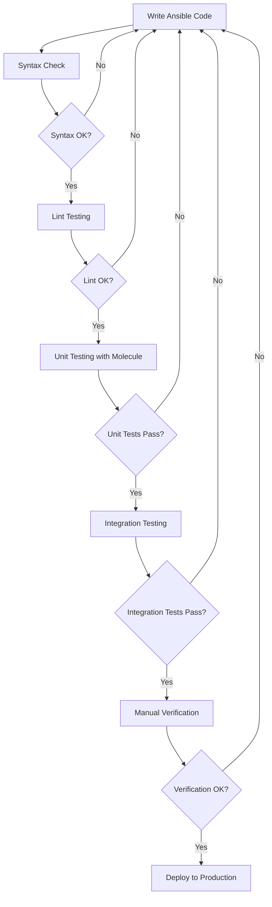

# Ansible Test Environments

## Introduction

Testing is a critical part of any development process, and Ansible automation is no exception. Ansible test environments allow you to validate your playbooks, roles, and modules before deploying them to production systems. This ensures that your automation works as expected and prevents potential issues that could impact your infrastructure.

In this guide, we'll explore how to set up and use different types of test environments for Ansible, along with best practices and tools that make testing more efficient.

## Why Test Ansible Code?

Before diving into test environments, let's understand why testing Ansible code is important:

- **Prevent Production Failures**: Testing helps catch errors before they reach production systems.
- **Validate Changes**: Ensure that changes to playbooks and roles work as expected.
- **Increase Confidence**: Build confidence in your automation by verifying its behavior.
- **Facilitate Collaboration**: Enable team members to test changes without affecting others.
- **Support CI/CD**: Integrate testing into your continuous integration and deployment pipelines.

## Types of Ansible Test Environments

There are several approaches to setting up test environments for Ansible. Let's explore the most common options:

### 1. Local Testing with Ansible Syntax Check

The simplest form of testing is using Ansible's built-in syntax checker to validate your playbooks before execution.

```bash
# Check syntax of a playbook
ansible-playbook --syntax-check playbook.yml

# Example output
playbook: playbook.yml
```

This simple check can catch basic syntax errors but doesn't verify the actual execution of your playbooks.

### 2. Virtual Machines with Vagrant

[Vagrant](https://www.vagrantup.com/) is a popular tool for creating and managing virtual machine environments. It's ideal for testing Ansible playbooks in an isolated environment.

Here's a sample `Vagrantfile` that creates a test environment for Ansible:

```ruby
Vagrant.configure("2") do |config|
  config.vm.box = "ubuntu/focal64"
  
  config.vm.provider "virtualbox" do |vb|
    vb.memory = "1024"
  end
  
  # Enable provisioning with Ansible
  config.vm.provision "ansible" do |ansible|
    ansible.playbook = "playbook.yml"
    ansible.verbose = "v"
  end
end
```

To use this environment:

```bash
# Start the VM and run the Ansible playbook
vagrant up

# Re-run the Ansible playbook on the VM
vagrant provision

# Destroy the VM when done
vagrant destroy
```

### 3. Container-based Testing with Docker

Docker containers provide a lightweight alternative to virtual machines for testing Ansible playbooks.

Create a `Dockerfile` to define your test environment:

```dockerfile
FROM ubuntu:20.04

# Install SSH and Python (required for Ansible)
RUN apt-get update && \
    apt-get install -y openssh-server python3 python3-pip sudo && \
    mkdir /var/run/sshd

# Configure SSH
RUN echo 'root:password' | chpasswd
RUN sed -i 's/#PermitRootLogin prohibit-password/PermitRootLogin yes/' /etc/ssh/sshd_config

# Start SSH service
CMD ["/usr/sbin/sshd", "-D"]
```

Build and run the Docker container:

```bash
# Build the Docker image
docker build -t ansible-test-ubuntu .

# Run the container
docker run -d -p 2222:22 --name ansible-test ansible-test-ubuntu
```

Create an inventory file to target the Docker container:

```ini
# inventory.ini
[test]
localhost ansible_port=2222 ansible_user=root ansible_password=password ansible_host=127.0.0.1
```

Run your Ansible playbook against the container:

```bash
ansible-playbook -i inventory.ini playbook.yml
```

### 4. Molecule: Specialized Testing Framework for Ansible

[Molecule](https://molecule.readthedocs.io/) is a framework designed specifically for testing Ansible roles. It provides a standardized way to test roles across different platforms and scenarios.

Install Molecule:

```bash
pip install molecule molecule-docker
```

Initialize a new role with Molecule:

```bash
molecule init role my_role --driver-name docker
```

This creates a directory structure with a `molecule` directory containing test scenarios.

To test the role:

```bash
cd my_role
molecule test
```

Molecule will:
1. Create a Docker container
2. Apply your Ansible role
3. Verify the results
4. Destroy the container

Molecule's default test sequence includes:
- `dependency`: Install role dependencies
- `lint`: Lint the playbook
- `cleanup`: Clean up test resources
- `destroy`: Destroy test resources
- `syntax`: Verify syntax
- `create`: Create test resources
- `prepare`: Prepare test resources
- `converge`: Run the playbook
- `idempotence`: Verify idempotence
- `side_effect`: Run side effects
- `verify`: Verify results
- `cleanup`: Clean up test resources
- `destroy`: Destroy test resources

## Setting Up a Comprehensive Test Environment

Let's walk through setting up a comprehensive test environment using Molecule, which is considered the industry standard for testing Ansible roles.

### Step 1: Install Required Tools

```bash
# Install Python packages
pip install molecule molecule-docker ansible-lint yamllint

# Ensure Docker is installed
# For Ubuntu/Debian:
apt-get install docker.io
```

### Step 2: Create a New Role with Molecule

```bash
molecule init role my_web_server --driver-name docker
cd my_web_server
```

### Step 3: Define the Role

Edit `tasks/main.yml` to define your role:

```yaml
---
# tasks/main.yml
- name: Install Nginx
  apt:
    name: nginx
    state: present
    update_cache: yes
  become: true

- name: Start and enable Nginx
  service:
    name: nginx
    state: started
    enabled: yes
  become: true

- name: Create custom webpage
  copy:
    content: "<html><body><h1>Hello from Ansible!</h1></body></html>"
    dest: /var/www/html/index.html
  become: true
```

### Step 4: Configure Molecule

Edit `molecule/default/molecule.yml` to define your test scenario:

```yaml
---
dependency:
  name: galaxy
driver:
  name: docker
platforms:
  - name: instance
    image: ubuntu:20.04
    pre_build_image: true
    privileged: true
    command: "/sbin/init"
    volumes:
      - /sys/fs/cgroup:/sys/fs/cgroup:ro
    environment:
      ANSIBLE_USER: root
provisioner:
  name: ansible
  config_options:
    defaults:
      interpreter_python: auto_silent
verifier:
  name: ansible
```

### Step 5: Create Verification Tests

Create or modify `molecule/default/verify.yml`:

```yaml
---
- name: Verify
  hosts: all
  gather_facts: false
  tasks:
    - name: Check if Nginx is installed
      command: which nginx
      register: nginx_check
      changed_when: false
      failed_when: nginx_check.rc != 0

    - name: Verify Nginx is running
      command: systemctl is-active nginx
      register: nginx_status
      changed_when: false
      failed_when: nginx_status.stdout != "active"
    
    - name: Check webpage content
      uri:
        url: http://localhost
        return_content: yes
      register: webpage
      failed_when: "'Hello from Ansible!' not in webpage.content"
```

### Step 6: Run the Tests

```bash
molecule test
```

This will execute the complete test sequence. If any part fails, Molecule will stop and report the error.

## Testing Strategy: A Practical Workflow

Let's put together a practical workflow for testing Ansible code:

1. **Syntax Checking**: Start with basic syntax validation.
   ```bash
   ansible-playbook --syntax-check playbook.yml
   ```

2. **Lint Testing**: Use ansible-lint to catch common mistakes and best practice violations.
   ```bash
   ansible-lint playbook.yml
   ```

3. **Unit Testing with Molecule**: Test individual roles in isolation.
   ```bash
   cd roles/my_role
   molecule test
   ```

4. **Integration Testing**: Test multiple roles working together in a test environment.
   ```bash
   # Using Vagrant for integration testing
   vagrant up
   ```

5. **Manual Verification**: Perform manual checks for critical functionality.

Let's visualize this workflow:



## Best Practices for Ansible Test Environments

1. **Test Environment Parity**: Make your test environment as similar to production as possible.
2. **Idempotence Testing**: Ensure your playbooks can run multiple times without changing the result.
3. **Version Control**: Keep your test configurations in version control alongside your Ansible code.
4. **Automated Testing**: Integrate testing into your CI/CD pipeline.
5. **Test Coverage**: Test multiple scenarios and edge cases.
6. **Isolation**: Ensure tests don't interfere with each other or production systems.

## Practical Example: Testing a Web Server Deployment

Let's walk through a complete example of testing an Ansible role that deploys a web server:

### 1. Create the Role Structure

```bash
molecule init role web_server --driver-name docker
cd web_server
```

### 2. Define the Role Tasks

Edit `tasks/main.yml`:

```yaml
---
- name: Install web server packages
  package:
    name:
      - nginx
      - curl
    state: present
  become: true

- name: Configure Nginx
  template:
    src: nginx.conf.j2
    dest: /etc/nginx/nginx.conf
  become: true
  notify: restart nginx

- name: Create web directory
  file:
    path: /var/www/html
    state: directory
    mode: '0755'
  become: true

- name: Deploy sample website
  template:
    src: index.html.j2
    dest: /var/www/html/index.html
  become: true
```

### 3. Create Templates

Create `templates/nginx.conf.j2`:

```
user www-data;
worker_processes auto;
pid /run/nginx.pid;

events {
    worker_connections 768;
}

http {
    sendfile on;
    tcp_nopush on;
    tcp_nodelay on;
    keepalive_timeout 65;
    types_hash_max_size 2048;

    include /etc/nginx/mime.types;
    default_type application/octet-stream;

    server {
        listen 80 default_server;
        listen [::]:80 default_server;
        root /var/www/html;
        index index.html;

        location / {
            try_files $uri $uri/ =404;
        }
    }
}
```

Create `templates/index.html.j2`:

```html
<!DOCTYPE html>
<html>
<head>
    <title>Welcome to {{ ansible_hostname }}</title>
</head>
<body>
    <h1>Hello from {{ ansible_hostname }}</h1>
    <p>This server was configured using Ansible.</p>
</body>
</html>
```

### 4. Define Handlers

Edit `handlers/main.yml`:

```yaml
---
- name: restart nginx
  service:
    name: nginx
    state: restarted
  become: true
```

### 5. Configure Molecule

Edit `molecule/default/molecule.yml`:

```yaml
---
dependency:
  name: galaxy
driver:
  name: docker
platforms:
  - name: instance
    image: ubuntu:20.04
    pre_build_image: true
    privileged: true
    command: "/sbin/init"
    volumes:
      - /sys/fs/cgroup:/sys/fs/cgroup:ro
provisioner:
  name: ansible
verifier:
  name: ansible
```

### 6. Create Verification Tests

Edit `molecule/default/verify.yml`:

```yaml
---
- name: Verify
  hosts: all
  tasks:
    - name: Check if Nginx is installed
      command: which nginx
      register: nginx_check
      changed_when: false
      failed_when: nginx_check.rc != 0

    - name: Verify Nginx is running
      command: systemctl is-active nginx
      register: nginx_status
      changed_when: false
      failed_when: nginx_status.stdout != "active"

    - name: Check website content
      uri:
        url: http://localhost
        return_content: yes
      register: webpage
      failed_when: "'This server was configured using Ansible' not in webpage.content"

    - name: Test idempotence of configuration
      uri:
        url: http://localhost
        method: GET
        status_code: 200
      register: result
      until: result.status == 200
      retries: 3
      delay: 5
```

### 7. Run the Tests

```bash
molecule test
```

When the tests pass, you'll see output confirming that each phase completed successfully.

## Advanced Testing Techniques

### Testing Across Multiple Platforms

Modify your `molecule/default/molecule.yml` to test on multiple operating systems:

```yaml
---
dependency:
  name: galaxy
driver:
  name: docker
platforms:
  - name: ubuntu
    image: ubuntu:20.04
    pre_build_image: true
    privileged: true
    command: "/sbin/init"
    volumes:
      - /sys/fs/cgroup:/sys/fs/cgroup:ro
  - name: centos
    image: centos:8
    pre_build_image: true
    privileged: true
    command: "/sbin/init"
    volumes:
      - /sys/fs/cgroup:/sys/fs/cgroup:ro
provisioner:
  name: ansible
verifier:
  name: ansible
```

### Testing Different Scenarios

You can create multiple test scenarios:

```bash
molecule init scenario alternative --driver-name docker
```

This creates a new scenario in `molecule/alternative/` that you can customize for different test conditions.

### Integration with CI/CD

Here's an example of integrating Molecule testing with GitHub Actions:

```yaml
# .github/workflows/molecule.yml
name: Molecule Test
on: [push, pull_request]
jobs:
  molecule:
    runs-on: ubuntu-latest
    steps:
      - name: Checkout code
        uses: actions/checkout@v2
      
      - name: Set up Python
        uses: actions/setup-python@v2
        with:
          python-version: '3.x'
      
      - name: Install dependencies
        run: |
          python -m pip install --upgrade pip
          pip install molecule molecule-docker ansible-lint yamllint
      
      - name: Run Molecule tests
        run: molecule test
```

## Troubleshooting Common Issues

### Docker Connection Issues

If you encounter connection issues with Docker containers:

```yaml
# molecule/default/molecule.yml
platforms:
  - name: instance
    # Add these settings
    published_ports:
      - "0.0.0.0:8080:80/tcp"
    networks:
      - name: molecule_network
networks:
  - name: molecule_network
```

### Python Interpreter Issues

If you encounter Python interpreter issues:

```yaml
# molecule/default/molecule.yml
provisioner:
  name: ansible
  config_options:
    defaults:
      interpreter_python: auto_silent
```

### Idempotence Test Failures

If your idempotence tests are failing:

1. Check for tasks that always report as changed
2. Use `changed_when` to control change reporting
3. Ensure proper state definitions in your tasks

## Summary

Setting up proper test environments for Ansible is essential for developing reliable automation. In this guide, we've explored:

- Different types of test environments (syntax checking, Vagrant VMs, Docker containers, and Molecule)
- A step-by-step process for setting up comprehensive test environments with Molecule
- Best practices for testing Ansible code
- A practical workflow for implementing a testing strategy
- Advanced testing techniques and troubleshooting tips

By implementing these testing approaches, you can ensure your Ansible code works correctly, is maintainable, and can be safely deployed to production environments.

## Additional Resources

- [Ansible Documentation on Testing](https://docs.ansible.com/ansible/latest/reference_appendices/test_strategies.html)
- [Molecule Documentation](https://molecule.readthedocs.io/)
- [Ansible Lint Documentation](https://ansible-lint.readthedocs.io/)
- [Testing Ansible Playbooks with Vagrant](https://www.vagrantup.com/docs/provisioning/ansible)

## Exercises

1. Set up a basic test environment using Ansible's syntax check for an existing playbook.
2. Create a Vagrant environment to test a playbook that installs and configures a database server.
3. Use Molecule to test an Ansible role that deploys a web application across multiple operating systems.
4. Implement an integration test for multiple roles working together.
5. Add Molecule testing to a CI/CD pipeline using GitHub Actions or another CI platform.