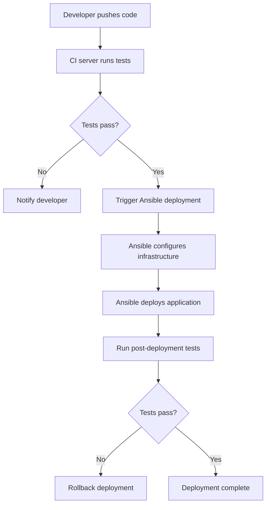

# Ansible CI/CD Integration

## Introduction

Ansible is a powerful automation tool that simplifies configuration management, application deployment, and task automation. When integrated into a Continuous Integration/Continuous Deployment (CI/CD) pipeline, Ansible becomes even more valuable, allowing teams to consistently deploy applications and infrastructure with minimal manual intervention.

In this guide, we'll explore how to integrate Ansible with popular CI/CD platforms to create robust deployment pipelines. Whether you're new to Ansible or looking to enhance your existing automation workflows, this tutorial will provide practical insights into building effective CI/CD pipelines with Ansible.

## What is CI/CD?

Before diving into Ansible integration, let's clarify what CI/CD means:

- **Continuous Integration (CI)**: The practice of automatically integrating code changes from multiple contributors into a shared repository, followed by automated building and testing.
- **Continuous Deployment (CD)**: The practice of automatically deploying all code changes to production after passing through the CI pipeline.

A CI/CD pipeline automates the steps between a developer committing code and that code being deployed to production environments.

## Why Integrate Ansible with CI/CD?

Integrating Ansible with CI/CD offers several advantages:

1. **Infrastructure as Code (IaC)**: Maintain your infrastructure configuration in version control alongside application code
2. **Consistency**: Ensure environments are configured consistently across development, testing, and production
3. **Automation**: Reduce manual intervention in the deployment process
4. **Idempotency**: Ansible's idempotent nature makes it safe to run deployments multiple times
5. **Flexibility**: Ansible works across various environments (on-premises, cloud, hybrid)

## CI/CD Workflow with Ansible

Here's a typical workflow when integrating Ansible with CI/CD:



## Integration Examples

Let's explore how to integrate Ansible with popular CI/CD platforms:

### 1. Ansible with Jenkins

Jenkins is one of the most widely used CI/CD tools, and it works seamlessly with Ansible.

#### Setup Steps:

1. **Install the Ansible plugin for Jenkins**:
   - Navigate to "Manage Jenkins" → "Manage Plugins"
   - In the "Available" tab, search for "Ansible"
   - Install the "Ansible" plugin and restart Jenkins

2. **Configure Ansible in Jenkins**:
   - Go to "Manage Jenkins" → "Global Tool Configuration"
   - Scroll to the Ansible section and add your Ansible installation

3. **Create a Jenkins Pipeline**:

```groovy
pipeline {
    agent any
    
    stages {
        stage('Checkout') {
            steps {
                checkout scm
            }
        }
        
        stage('Run Tests') {
            steps {
                sh 'pytest'
            }
        }
        
        stage('Deploy with Ansible') {
            steps {
                ansiblePlaybook(
                    playbook: 'deploy.yml',
                    inventory: 'inventory/production',
                    credentialsId: 'ansible-ssh-key',
                    colorized: true
                )
            }
        }
    }
    
    post {
        failure {
            mail to: 'team@example.com',
                 subject: "Failed Pipeline: ${currentBuild.fullDisplayName}",
                 body: "The pipeline failed. Check console output at ${env.BUILD_URL}"
        }
    }
}
```

#### Example Ansible Playbook (deploy.yml):

```yaml
---
- name: Deploy Application
  hosts: web_servers
  become: yes
  
  tasks:
    - name: Ensure required packages are installed
      apt:
        name: "{{ item }}"
        state: present
        update_cache: yes
      loop:
        - nginx
        - python3-pip
        
    - name: Deploy application code
      git:
        repo: https://github.com/yourusername/yourapp.git
        dest: /var/www/myapp
        version: "{{ git_version | default('main') }}"
      notify: restart nginx
      
    - name: Configure nginx
      template:
        src: templates/nginx-site.conf.j2
        dest: /etc/nginx/sites-available/myapp
      notify: restart nginx
      
    - name: Enable site in nginx
      file:
        src: /etc/nginx/sites-available/myapp
        dest: /etc/nginx/sites-enabled/myapp
        state: link
      notify: restart nginx
      
  handlers:
    - name: restart nginx
      service:
        name: nginx
        state: restarted
```

### 2. Ansible with GitLab CI/CD

GitLab offers built-in CI/CD capabilities that can easily integrate with Ansible.

#### Example .gitlab-ci.yml file:

```yaml
stages:
  - test
  - deploy

variables:
  ANSIBLE_CONFIG: ./ansible.cfg

test:
  stage: test
  image: python:3.9
  script:
    - pip install pytest
    - pytest

ansible-lint:
  stage: test
  image: pipelinecomponents/ansible-lint
  script:
    - ansible-lint playbooks/

deploy_staging:
  stage: deploy
  image: cytopia/ansible:latest
  script:
    - eval $(ssh-agent -s)
    - echo "$SSH_PRIVATE_KEY" | ssh-add -
    - mkdir -p ~/.ssh
    - echo "$SSH_KNOWN_HOSTS" > ~/.ssh/known_hosts
    - ansible-playbook -i inventory/staging deploy.yml
  environment:
    name: staging
  only:
    - develop

deploy_production:
  stage: deploy
  image: cytopia/ansible:latest
  script:
    - eval $(ssh-agent -s)
    - echo "$SSH_PRIVATE_KEY" | ssh-add -
    - mkdir -p ~/.ssh
    - echo "$SSH_KNOWN_HOSTS" > ~/.ssh/known_hosts
    - ansible-playbook -i inventory/production deploy.yml
  environment:
    name: production
  only:
    - main
  when: manual
```

### 3. Ansible with GitHub Actions

GitHub Actions is a CI/CD platform integrated directly into GitHub repositories.

#### Example GitHub Actions workflow file (.github/workflows/deploy.yml):

```yaml
name: Deploy with Ansible

on:
  push:
    branches: [ main ]
  pull_request:
    branches: [ main ]

jobs:
  test:
    runs-on: ubuntu-latest
    steps:
      - uses: actions/checkout@v3
      - name: Set up Python
        uses: actions/setup-python@v4
        with:
          python-version: '3.10'
      - name: Install dependencies
        run: |
          python -m pip install --upgrade pip
          pip install pytest ansible-lint
      - name: Run tests
        run: pytest
      - name: Lint Ansible playbooks
        run: ansible-lint

  deploy:
    needs: test
    runs-on: ubuntu-latest
    if: github.ref == 'refs/heads/main' && github.event_name == 'push'
    steps:
      - uses: actions/checkout@v3
      - name: Set up Python
        uses: actions/setup-python@v4
        with:
          python-version: '3.10'
      - name: Install Ansible
        run: |
          python -m pip install --upgrade pip
          pip install ansible
      - name: Setup SSH key
        uses: webfactory/ssh-agent@v0.7.0
        with:
          ssh-private-key: ${{ secrets.SSH_PRIVATE_KEY }}
      - name: Add known hosts
        run: |
          mkdir -p ~/.ssh
          echo "${{ secrets.SSH_KNOWN_HOSTS }}" > ~/.ssh/known_hosts
      - name: Run Ansible playbook
        run: ansible-playbook -i inventory/production deploy.yml
```

## Best Practices for Ansible in CI/CD

To ensure successful Ansible integration in your CI/CD pipeline, consider these best practices:

### 1. Test Your Playbooks

Before deploying to production, test your Ansible playbooks:

```yaml
---
- name: Verify deployment
  hosts: all
  gather_facts: no
  
  tasks:
    - name: Check if web server is responding
      uri:
        url: "http://{{ inventory_hostname }}"
        status_code: 200
      register: response
      retries: 3
      delay: 5
      until: response.status == 200
      
    - name: Verify application version
      shell: grep "version" /var/www/myapp/version.txt
      register: version_output
      failed_when: "'v1.2.3' not in version_output.stdout"
```

### 2. Use Ansible Vault for Secrets

Store sensitive information securely using Ansible Vault:

```bash
# Create an encrypted file
ansible-vault create secrets.yml

# Edit an encrypted file
ansible-vault edit secrets.yml

# Use the vault in CI/CD
ansible-playbook deploy.yml --vault-password-file vault-password.txt
```

For CI/CD systems, you can store the vault password as a CI/CD secret and reference it in your pipeline configuration.

### 3. Implement Idempotent Deployments

Ensure your playbooks are idempotent to prevent issues with repeated runs:

```yaml
- name: Ensure application is at correct version
  git:
    repo: https://github.com/yourusername/yourapp.git
    dest: /var/www/myapp
    version: "{{ app_version }}"
  register: git_status
  changed_when: git_status.changed

- name: Restart application only when code changes
  service:
    name: myapp
    state: restarted
  when: git_status.changed
```

### 4. Use Tags for Partial Runs

Tags help you run only specific parts of your playbooks:

```yaml
- name: Configure web server
  hosts: webservers
  tasks:
    - name: Install packages
      apt:
        name: nginx
        state: present
      tags: [setup, packages]
      
    - name: Deploy application
      git:
        repo: https://github.com/yourusername/yourapp.git
        dest: /var/www/myapp
      tags: [deploy]
```

Then in your CI/CD pipeline:

```bash
ansible-playbook deploy.yml --tags deploy
```

### 5. Use Dynamic Inventories

For cloud environments, use dynamic inventories to automatically discover resources:

```bash
# AWS example
pip install boto3
ansible-playbook -i inventory/aws_ec2.yml deploy.yml
```

## Implementing Blue-Green Deployments with Ansible

Blue-green deployment is a technique that reduces downtime by running two identical production environments (blue and green). At any time, only one of the environments is live.

Here's how to implement it with Ansible:

```yaml
---
- name: Blue-Green Deployment
  hosts: localhost
  gather_facts: no
  
  vars:
    app_name: myapp
    load_balancer: lb.example.com
    
  tasks:
    - name: Determine current live environment
      shell: aws elbv2 describe-tags --resource-arns arn:aws:elasticloadbalancing:region:account-id:loadbalancer/app/my-load-balancer/50dc6c495c0c9188 --query "TagDescriptions[0].Tags[?Key=='environment'].Value" --output text
      register: current_env
      
    - name: Set target environment
      set_fact:
        target_env: "{{ 'green' if current_env.stdout == 'blue' else 'blue' }}"
        
    - name: Deploy to target environment
      ansible.builtin.include_tasks: deploy_to_env.yml
      
    - name: Run tests against new environment
      uri:
        url: "http://{{ target_env }}.internal.example.com/health"
        status_code: 200
      register: health_check
      failed_when: health_check.status != 200
      
    - name: Switch load balancer to new environment
      shell: aws elbv2 modify-listener --listener-arn arn:aws:elasticloadbalancing:region:account-id:listener/app/my-load-balancer/50dc6c495c0c9188/f2f7dc8efc522ab2 --default-actions Type=forward,TargetGroupArn=arn:aws:elasticloadbalancing:region:account-id:targetgroup/{{ target_env }}/6d0ecf831eec9f09
      when: health_check.status == 200
```

## Troubleshooting Common Issues

When integrating Ansible with CI/CD, you might encounter these common issues:

### 1. SSH Authentication Problems

**Symptom**: `Permission denied (publickey)` errors

**Solution**:
- Ensure your CI/CD system has access to the necessary SSH keys
- Check if the SSH agent is running and has loaded the keys
- Verify that the target hosts have your public keys in their `authorized_keys` file

### 2. Ansible Playbook Syntax Errors

**Symptom**: `ERROR! Syntax Error while loading YAML` in CI/CD logs

**Solution**:
- Add an Ansible lint step to your pipeline to catch syntax errors early
- Use a YAML validator to check your playbooks
- Use indentation of 2 spaces consistently

### 3. Inventory Connection Issues

**Symptom**: `UNREACHABLE! => {"changed": false, "msg": "Failed to connect to the host via ssh"}`

**Solution**:
- Verify network connectivity between CI/CD runner and target hosts
- Check if firewalls are blocking SSH connections
- Make sure your inventory file has the correct host addresses

## Summary

Integrating Ansible with CI/CD pipelines creates a powerful automation system that can significantly improve your deployment process. By automating infrastructure provisioning and application deployment, you can achieve more consistent, reliable, and efficient releases.

Key takeaways from this guide:

1. Ansible fits naturally into CI/CD pipelines and can be integrated with tools like Jenkins, GitLab CI/CD, and GitHub Actions
2. Implement best practices such as testing playbooks, securing sensitive data with Ansible Vault, and ensuring idempotency
3. Advanced techniques like blue-green deployments can be implemented with Ansible to minimize downtime
4. Troubleshooting integration issues often involves SSH configuration, YAML syntax, and network connectivity

## Additional Resources

To further enhance your understanding of Ansible CI/CD integration, explore these resources:

- [Ansible Documentation](https://docs.ansible.com/)
- [Ansible Galaxy](https://galaxy.ansible.com/) for reusable roles
- [Ansible Testing Strategies](https://docs.ansible.com/ansible/latest/dev_guide/testing.html)
- [Molecule](https://molecule.readthedocs.io/) for testing Ansible roles

## Exercises

1. **Basic Integration**: Set up a simple CI/CD pipeline that uses Ansible to deploy a "Hello World" web application to a test server.

2. **Secure Deployment**: Modify your pipeline to use Ansible Vault for storing and accessing database credentials.

3. **Advanced Deployment**: Implement a blue-green deployment strategy for a web application using Ansible and your preferred CI/CD platform.

4. **Monitoring Integration**: Extend your deployment playbook to include monitoring setup (e.g., Prometheus, Grafana) after deploying your application.

5. **Multi-Environment Pipeline**: Create a pipeline that deploys to development, staging, and production environments with appropriate approvals and validations between stages.

By completing these exercises, you'll gain practical experience with Ansible CI/CD integration and develop the skills to implement robust deployment pipelines for your own projects.