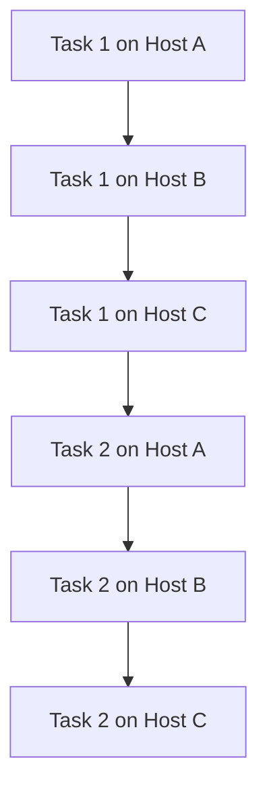

# Ansible Async Actions

## Introduction

When running Ansible playbooks, you might encounter tasks that take a long time to complete - like installing large packages, running system updates, or waiting for services to start. By default, Ansible executes tasks synchronously, meaning it waits for each task to complete before moving on to the next one. This can lead to inefficient playbook execution and potential SSH timeout issues with long-running operations.

Ansible's **Async Actions** feature solves this problem by allowing tasks to run in the background while your playbook continues with other tasks. This is particularly useful for:

- Preventing SSH timeouts with long-running tasks
- Running multiple tasks in parallel across different hosts
- Starting a process and checking its status later
- Improving overall playbook execution efficiency

In this guide, we'll explore how to implement asynchronous task execution in Ansible and demonstrate practical use cases for this powerful feature.

## Understanding Ansible's Default Execution

Before diving into async actions, let's understand how Ansible executes tasks by default:



By default, Ansible runs each task sequentially across all hosts. If a task takes a long time on one host, all other executions have to wait, which may cause SSH timeouts or significantly slow down your playbook execution.

## Async Action Basics

To run a task asynchronously, you need to specify two parameters:

- `async`: Maximum runtime in seconds (how long the task can run)
- `poll`: How frequently Ansible should check back on the task (in seconds)

### Simple Async Task Example

```yaml
- name: Update system packages in the background
  ansible.builtin.apt:
    update_cache: yes
    upgrade: dist
  async: 3600  # Allow the task to run for up to 1 hour
  poll: 0      # Don't wait for the task to finish (fire and forget)
```

The `poll: 0` setting means Ansible won't wait for the task to complete - it will start the task and immediately move on.

## Checking Status of Async Tasks

When you run a task with `poll: 0`, Ansible assigns a job ID that you can use to check the status later:

```yaml
- name: Start a long-running operation
  ansible.builtin.command: /usr/bin/long_running_operation
  async: 3600
  poll: 0
  register: async_result

- name: Check on long-running operation
  ansible.builtin.async_status:
    jid: "{{ async_result.ansible_job_id }}"
  register: job_result
  until: job_result.finished
  retries: 30
  delay: 10
```

In this example:
1. We start a task asynchronously and register its result
2. We use the `async_status` module to periodically check if the task has finished
3. The `until` loop continues checking until the task completes or reaches the maximum number of retries

## Practical Examples

Let's look at some practical use cases for async actions:

### Example 1: System Updates Across Multiple Servers

```yaml
---
- name: Update all web servers simultaneously
  hosts: webservers
  tasks:
    - name: Update apt cache and upgrade packages
      ansible.builtin.apt:
        update_cache: yes
        upgrade: dist
      async: 1800  # 30 minutes
      poll: 0
      register: update_result

    # Do other tasks while updates run in background
    - name: Ensure critical services are running
      ansible.builtin.service:
        name: "{{ item }}"
        state: started
      loop:
        - nginx
        - redis
        - memcached

    # Check on the status of the updates
    - name: Wait for system updates to complete
      ansible.builtin.async_status:
        jid: "{{ update_result.ansible_job_id }}"
      register: job_result
      until: job_result.finished
      retries: 60
      delay: 30
```

This playbook begins system updates on all web servers simultaneously, performs other tasks while updates run in the background, and then checks back on the update status.

### Example 2: Waiting for Service Readiness

```yaml
- name: Restart database server
  ansible.builtin.service:
    name: postgresql
    state: restarted
  async: 300
  poll: 0
  register: restart_job

- name: Wait for database to become available
  ansible.builtin.async_status:
    jid: "{{ restart_job.ansible_job_id }}"
  register: job_result
  until: job_result.finished
  retries: 30
  delay: 10

- name: Verify database connectivity
  ansible.builtin.command: psql -c "SELECT 1"
  register: db_check
  until: db_check.rc == 0
  retries: 12
  delay: 5
```

This example restarts a database service asynchronously, then waits for it to complete before verifying connectivity.

## Parallel Task Execution

One of the most powerful applications of async is running multiple tasks in parallel:

```yaml
- name: Start multiple operations in parallel
  hosts: webservers
  tasks:
    - name: Backup database
      ansible.builtin.command: /usr/local/bin/backup_database.sh
      async: 3600
      poll: 0
      register: backup_job

    - name: Run security updates
      ansible.builtin.command: /usr/local/bin/security_updates.sh
      async: 3600
      poll: 0
      register: security_job

    - name: Generate reports
      ansible.builtin.command: /usr/local/bin/generate_reports.sh
      async: 3600
      poll: 0
      register: reports_job

    - name: Wait for all tasks to complete
      ansible.builtin.async_status:
        jid: "{{ item.ansible_job_id }}"
      register: job_results
      until: job_results.finished
      retries: 60
      delay: 30
      loop:
        - "{{ backup_job }}"
        - "{{ security_job }}"
        - "{{ reports_job }}"
```

This playbook runs three operations in parallel and then waits for all of them to complete.

## Common Use Cases for Async Actions

1. **Long-running system operations**: Package installations, system updates, backups
2. **Service restarts**: Starting services that take time to initialize
3. **Batch processing**: Running multiple independent operations in parallel
4. **Preventing SSH timeouts**: For tasks that exceed your SSH connection timeout
5. **Resource-intensive operations**: CPU or I/O intensive tasks that you want to run in parallel

## Best Practices and Limitations

### Best Practices

1. **Set appropriate async timeout values**: Set the `async` value higher than you expect the task to take
2. **Keep track of job IDs**: Always `register` async tasks if you need to check their status later
3. **Use reasonable polling intervals**: Don't poll too frequently to avoid overloading the control node
4. **Consider failure scenarios**: What happens if an async task fails? Plan for proper error handling

### Limitations

1. **Not all modules support async**: Some Ansible modules may not work correctly with async
2. **No synchronization between hosts**: Async tasks run independently on each host
3. **Potential resource constraints**: Running too many tasks in parallel might overload your systems
4. **Task dependencies**: If tasks depend on each other, you must explicitly manage the dependencies

## Example: Comprehensive Server Setup with Async

Here's a more complex example combining multiple async patterns:

```yaml
---
- name: Setup web application servers
  hosts: app_servers
  tasks:
    # Start long-running tasks in parallel
    - name: Update system packages
      ansible.builtin.yum:
        name: '*'
        state: latest
      async: 1800
      poll: 0
      register: update_task

    - name: Pull large application files
      ansible.builtin.git:
        repo: https://github.com/company/large-app.git
        dest: /var/www/application
      async: 600
      poll: 0
      register: git_task

    # Do quick tasks while long tasks run
    - name: Configure firewall
      ansible.builtin.firewalld:
        port: "{{ item }}/tcp"
        permanent: yes
        state: enabled
      loop:
        - 80
        - 443
        - 8080

    - name: Create application user
      ansible.builtin.user:
        name: app_user
        shell: /bin/bash
        home: /home/app_user
        create_home: yes

    # Wait for long-running tasks to complete
    - name: Wait for system updates
      ansible.builtin.async_status:
        jid: "{{ update_task.ansible_job_id }}"
      register: job_result
      until: job_result.finished
      retries: 90
      delay: 20

    - name: Wait for git repository
      ansible.builtin.async_status:
        jid: "{{ git_task.ansible_job_id }}"
      register: job_result
      until: job_result.finished
      retries: 30
      delay: 10

    # Run dependent tasks after async tasks complete
    - name: Start application service
      ansible.builtin.systemd:
        name: application
        state: started
        enabled: yes
```

This playbook demonstrates how to optimize server setup by running long tasks in the background while performing other quick configuration tasks, then waiting for all tasks to complete before starting dependent services.

## Summary

Ansible's async actions feature provides a powerful way to handle long-running operations and improve playbook efficiency. By running tasks in the background, you can:

- Prevent SSH timeout issues
- Run multiple tasks in parallel
- Improve overall playbook execution time
- Handle long-running operations more gracefully

When implementing async actions, remember to:
- Set appropriate async timeout values
- Register async tasks if you need to check their status later
- Consider dependencies between tasks
- Test thoroughly to ensure proper execution

## Additional Resources

- [Ansible Documentation on Asynchronous Actions](https://docs.ansible.com/ansible/latest/playbook_guide/playbooks_async.html)
- [Ansible async_status Module Documentation](https://docs.ansible.com/ansible/latest/collections/ansible/builtin/async_status_module.html)

## Exercises

1. Modify an existing playbook to run system updates asynchronously across all hosts.
2. Create a playbook that performs three different operations in parallel and waits for all to complete.
3. Implement error handling for an async task that might fail (hint: check the `failed` property in the async_status result).
4. Write a playbook that restarts a service and polls until it's responsive again.
5. Compare the execution time of a playbook with and without async tasks to measure the performance improvement.