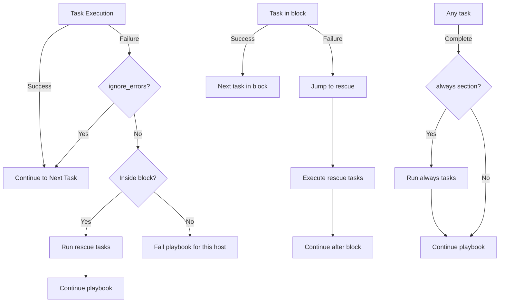

# Ansible Error Handling

## Introduction

When running Ansible playbooks in production environments, it's crucial to handle errors gracefully. Without proper error handling, failed tasks can cause entire playbooks to abort, potentially leaving systems in an inconsistent state. This guide will explore Ansible's error handling mechanisms that allow your automation to detect, respond to, and recover from failures.

## Understanding Ansible's Default Behavior

By default, when a task in an Ansible playbook fails:

1. Ansible marks the task as failed
2. The playbook stops execution on the failed host
3. Ansible continues executing on other hosts

This behavior protects your infrastructure from cascading failures but isn't always ideal. Sometimes you want to:

- Continue despite failures (for non-critical tasks)
- Run cleanup operations after a failure
- Retry failed operations
- Implement custom error responses

## Basic Error Handling with `ignore_errors`

The simplest form of error handling in Ansible is to ignore failures for specific tasks:

```yaml
- name: This command might fail but we don't care
  ansible.builtin.command: /bin/false
  ignore_errors: true
```

When this task runs, the output would look similar to:

```
TASK [This command might fail but we don't care] ********************************
fatal: [webserver1]: FAILED! => {"changed": true, "cmd": ["/bin/false"], "delta": "0:00:00.004365", "end": "2023-05-10 15:32:05.915715", "rc": 1, "start": "2023-05-10 15:32:05.911350", "stderr": "", "stderr_lines": [], "stdout": "", "stdout_lines": []}
...ignoring

PLAY RECAP ********************************************************************
webserver1                 : ok=1    changed=1    unreachable=0    failed=0    skipped=0    rescued=0    ignored=1
```

Notice how the execution continues despite the failure, and `ignored=1` is shown in the play recap.

## Advanced Error Handling with Blocks

Ansible provides `block`, `rescue`, and `always` directives that work similar to try/catch/finally constructs in programming languages:

```yaml
- name: Attempt a series of operations with error handling
  block:
    - name: Install the database package
      ansible.builtin.apt:
        name: mysql-server
        state: present
        
    - name: Start the database service
      ansible.builtin.service:
        name: mysql
        state: started
  
  rescue:
    - name: Log the failure
      ansible.builtin.shell: |
        echo "Database installation failed on $(hostname) at $(date)" >> /var/log/ansible_failures.log
      
    - name: Send notification
      ansible.builtin.debug:
        msg: "Database installation failed, notifying the team"
  
  always:
    - name: Cleanup temporary files
      ansible.builtin.file:
        path: /tmp/mysql_setup
        state: absent
```

This playbook will:
1. Try to install and start MySQL (in the `block` section)
2. If any task fails, run the tasks in the `rescue` section
3. Always run the cleanup task in the `always` section, regardless of success or failure

## Conditional Error Handling

You can use Ansible's `failed_when` directive to define custom failure conditions:

```yaml
- name: Check disk space
  ansible.builtin.shell: df -h / | grep -v Filesystem | awk '{ print $5 }' | sed 's/%//'
  register: disk_space
  failed_when: disk_space.stdout|int > 90
```

In this example, the task will fail if the disk usage is above 90%, even though the `df` command itself succeeds.

Similarly, you can use `changed_when` to control when Ansible considers a task to have made a change:

```yaml
- name: Run database query
  ansible.builtin.shell: mysql -e "SELECT COUNT(*) FROM users;"
  register: query_result
  changed_when: false  # This command is read-only, so never mark as changed
```

## Handling Failures Across Multiple Hosts

In a playbook targeting multiple hosts, you might want to continue execution even if some hosts fail. The `any_errors_fatal` directive controls this behavior:

```yaml
- name: Update critical service
  hosts: webservers
  any_errors_fatal: true  # Stop the entire playbook if any host fails
  tasks:
    - name: Update service package
      ansible.builtin.apt:
        name: critical-service
        state: latest
```

With `any_errors_fatal: true`, if the task fails on any host, the entire playbook stops for all hosts.

## Implementing Retries

For tasks that might fail temporarily (like API calls or network operations), you can implement retries:

```yaml
- name: Install package that might have network errors
  ansible.builtin.apt:
    name: nginx
    state: present
    update_cache: yes
  register: result
  retries: 3
  delay: 5
  until: result is succeeded
```

This configuration:
- Attempts the task up to 3 times (`retries: 3`)
- Waits 5 seconds between attempts (`delay: 5`)
- Continues retrying until the task succeeds (`until: result is succeeded`)

The output for a retry scenario would look like:

```
TASK [Install package that might have network errors] ***************************
FAILED - RETRYING: Install package that might have network errors (3 retries left).
FAILED - RETRYING: Install package that might have network errors (2 retries left).
changed: [webserver1]

PLAY RECAP *********************************************************************
webserver1                 : ok=1    changed=1    unreachable=0    failed=0    skipped=0    rescued=0    ignored=0
```

## Creating Custom Error Messages

You can create more descriptive error messages using the `fail` module:

```yaml
- name: Check if configuration is valid
  ansible.builtin.command: nginx -t
  register: nginx_config
  ignore_errors: true

- name: Fail with custom message if nginx config is invalid
  ansible.builtin.fail:
    msg: "Nginx configuration is invalid: {{ nginx_config.stderr }}"
  when: nginx_config.rc != 0
```

This provides clearer error messages than the default output.

## Error Handling with Handlers

Handlers in Ansible only run if triggered by a successful task. If you need handlers to run even after failures, use the `force_handlers` option:

```yaml
- name: Critical update playbook
  hosts: webservers
  force_handlers: true
  tasks:
    - name: Update application
      ansible.builtin.git:
        repo: https://github.com/company/app.git
        dest: /var/www/app
      notify: restart application

    - name: Might fail but we still want handlers to run
      ansible.builtin.command: /bin/false

  handlers:
    - name: restart application
      ansible.builtin.service:
        name: app-service
        state: restarted
```

With `force_handlers: true`, the restart handler will run even if the second task fails.

## Practical Example: Rolling Deployment with Error Handling

Here's a more comprehensive example showing a rolling deployment with error handling:

```yaml
---
- name: Rolling deployment with error handling
  hosts: webservers
  serial: 1  # Process one host at a time
  max_fail_percentage: 25  # Allow 25% of hosts to fail before aborting
  
  vars:
    deployment_dir: /var/www/app
    
  tasks:
    - name: Check prerequisites
      block:
        - name: Verify disk space
          ansible.builtin.shell: df -h / | grep -v Filesystem | awk '{ print $5 }' | sed 's/%//'
          register: disk_space
          failed_when: disk_space.stdout|int > 80
          
        - name: Check connectivity to repository
          ansible.builtin.uri:
            url: https://github.com/company/app
            status_code: 200
          register: repo_check
          
      rescue:
        - name: Log prerequisite check failure
          ansible.builtin.shell: |
            echo "Deployment failed on prerequisite check for $(hostname) at $(date)" >> /var/log/deployment_failures.log
            
        - name: Skip this host
          ansible.builtin.meta: clear_host_errors
          
    - name: Deploy application
      block:
        - name: Pull latest code
          ansible.builtin.git:
            repo: https://github.com/company/app.git
            dest: "{{ deployment_dir }}"
          register: git_result
          
        - name: Install dependencies
          ansible.builtin.command: npm install
          args:
            chdir: "{{ deployment_dir }}"
          when: git_result.changed
          
        - name: Run tests
          ansible.builtin.command: npm test
          args:
            chdir: "{{ deployment_dir }}"
          register: test_result
          failed_when: test_result.rc != 0
          
        - name: Take server out of load balancer
          ansible.builtin.uri:
            url: "https://loadbalancer.example.com/api/servers/{{ inventory_hostname }}/disable"
            method: POST
            status_code: 200
          register: lb_disable
          retries: 3
          delay: 5
          until: lb_disable is succeeded
          
        - name: Restart application
          ansible.builtin.service:
            name: app-service
            state: restarted
          
        - name: Verify application is running
          ansible.builtin.uri:
            url: "http://localhost:8080/health"
            status_code: 200
          register: app_health
          retries: 5
          delay: 10
          until: app_health is succeeded
          
        - name: Add server back to load balancer
          ansible.builtin.uri:
            url: "https://loadbalancer.example.com/api/servers/{{ inventory_hostname }}/enable"
            method: POST
            status_code: 200
          register: lb_enable
          retries: 3
          delay: 5
          until: lb_enable is succeeded
          
      rescue:
        - name: Take server out of load balancer in case of failure
          ansible.builtin.uri:
            url: "https://loadbalancer.example.com/api/servers/{{ inventory_hostname }}/disable"
            method: POST
          ignore_errors: true
          
        - name: Restore previous version
          ansible.builtin.git:
            repo: https://github.com/company/app.git
            dest: "{{ deployment_dir }}"
            version: "{{ previous_version }}"
          ignore_errors: true
          
        - name: Restart application with previous version
          ansible.builtin.service:
            name: app-service
            state: restarted
          ignore_errors: true
          
        - name: Send notification of deployment failure
          ansible.builtin.debug:
            msg: "Deployment failed on {{ inventory_hostname }}, reverted to previous version"
            
        - name: Log failure details
          ansible.builtin.shell: |
            echo "Deployment failed on $(hostname) at $(date)" >> /var/log/deployment_failures.log
            
      always:
        - name: Ensure application is running
          ansible.builtin.service:
            name: app-service
            state: started
          ignore_errors: true
          
        - name: Clean up temporary files
          ansible.builtin.file:
            path: "{{ deployment_dir }}/tmp"
            state: absent
          ignore_errors: true
```

This playbook showcases a robust deployment process that:
1. Checks prerequisites before attempting deployment
2. Performs a rolling deployment one server at a time
3. Implements comprehensive error handling at each step
4. Automatically reverts to the previous version if the deployment fails
5. Ensures cleanup operations always run

## Flow Diagram of Error Handling

Here's a visual representation of Ansible's error handling flow:



## Summary

Effective error handling is essential for creating robust, production-ready Ansible playbooks. In this guide, we've covered:

- Basic error handling with `ignore_errors`
- Advanced error handling with `block`, `rescue`, and `always`
- Custom failure conditions with `failed_when`
- Implementing retries for transient failures
- Creating clear error messages
- Forcing handlers to run despite failures
- Building comprehensive error handling for complex deployments

By implementing these techniques, your Ansible playbooks will be more resilient, providing better feedback when things go wrong and recovering gracefully from failures.

## Additional Resources and Exercises

### Resources
- [Ansible Documentation: Error Handling](https://docs.ansible.com/ansible/latest/user_guide/playbooks_error_handling.html)
- [Ansible Documentation: Blocks](https://docs.ansible.com/ansible/latest/user_guide/playbooks_blocks.html)

### Exercises

1. **Basic Error Handling**  
   Create a playbook that attempts to install three different packages. Make it continue even if one package fails to install.

2. **Implement Block/Rescue**  
   Write a playbook that tries to clone a Git repository, and if it fails, sends a notification and creates a local backup instead.

3. **Custom Error Conditions**  
   Create a playbook that checks system resources (memory, disk, CPU) and fails with appropriate messages if any resource is over-utilized.

4. **Retry Logic**  
   Implement a playbook that makes an API call with retries and increasing delays between attempts.

5. **Complete Deployment**  
   Design a playbook for deploying an application with proper error handling, including health checks, rollback capabilities, and notification systems.