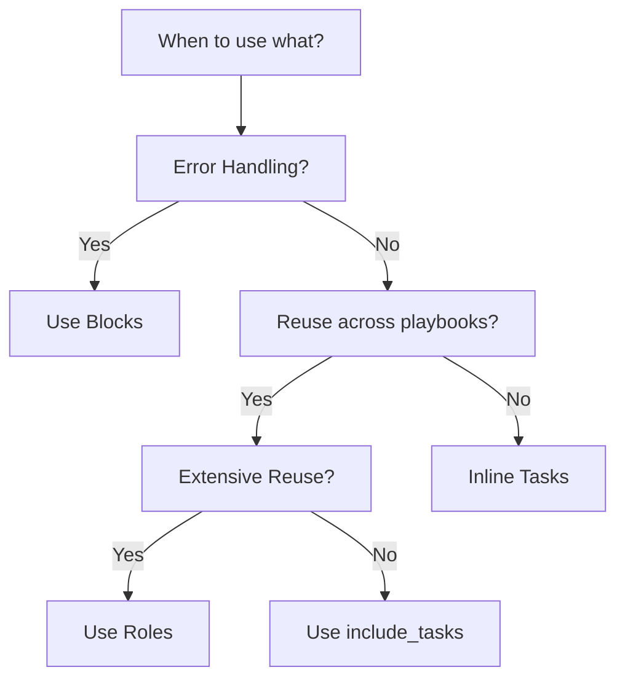

# Ansible Blocks

## Introduction

Ansible blocks are a powerful feature that allows you to group multiple tasks together, apply common parameters to them, and implement sophisticated error handling. Think of blocks as logical groupings of tasks that can share conditions, tags, and most importantly, error handling strategies.

In this guide, we'll explore how to use Ansible blocks effectively to improve the organization, readability, and resilience of your playbooks.

## Understanding Ansible Blocks

Blocks serve three primary purposes in Ansible:

1. **Logical grouping** - Organize related tasks together
2. **Shared parameters** - Apply common settings to multiple tasks at once
3. **Error handling** - Define how failures are managed with `rescue` and `always` sections

The basic syntax of a block looks like this:

```yaml
- name: Block example
  block:
    - name: Task 1
      ansible.builtin.debug:
        msg: "This is task 1 in the block"
    
    - name: Task 2
      ansible.builtin.debug:
        msg: "This is task 2 in the block"
  
  rescue:
    - name: Rescue task
      ansible.builtin.debug:
        msg: "This will run if any task in the block fails"
  
  always:
    - name: Always task
      ansible.builtin.debug:
        msg: "This will always run, regardless of success or failure"
```

Let's break down each section:

- **block**: Contains the main tasks you want to run
- **rescue**: Contains tasks that run only if tasks in the block section fail
- **always**: Contains tasks that always run, regardless of success or failure in the block or rescue sections

## Basic Block Usage

Let's start with a simple example that shows how to group related tasks:

```yaml
- hosts: webservers
  tasks:
    - name: Configure web server
      block:
        - name: Install Apache
          ansible.builtin.apt:
            name: apache2
            state: present
        
        - name: Start Apache service
          ansible.builtin.service:
            name: apache2
            state: started
            enabled: yes
        
        - name: Deploy website
          ansible.builtin.copy:
            src: /files/index.html
            dest: /var/www/html/index.html
      when: ansible_facts['os_family'] == "Debian"
```

In this example, all three tasks related to configuring a web server are grouped in a block. The `when` condition applies to all tasks in the block, so these tasks will only run on Debian-based systems.

## Applying Common Parameters

One of the main advantages of blocks is the ability to apply common parameters to multiple tasks:

```yaml
- hosts: all
  tasks:
    - name: Database operations
      block:
        - name: Create database
          ansible.builtin.command: createdb myapp
        
        - name: Import schema
          ansible.builtin.command: psql myapp < schema.sql
        
        - name: Import initial data
          ansible.builtin.command: psql myapp < initial_data.sql
      become: yes
      become_user: postgres
      tags: 
        - database
        - setup
```

In this example, all tasks in the block inherit the `become`, `become_user`, and `tags` parameters. This saves you from having to repeat these parameters for each task.

## Error Handling with Blocks

The most powerful feature of blocks is their error handling capability with `rescue` and `always` sections:

```yaml
- hosts: application_servers
  tasks:
    - name: Application deployment
      block:
        - name: Stop application
          ansible.builtin.service:
            name: myapp
            state: stopped
          
        - name: Update application files
          ansible.builtin.copy:
            src: /builds/myapp/
            dest: /opt/myapp/
            owner: myapp
            group: myapp
            mode: '0755'
          
        - name: Start application
          ansible.builtin.service:
            name: myapp
            state: started
      
      rescue:
        - name: Restore backup
          ansible.builtin.copy:
            src: /backups/myapp/
            dest: /opt/myapp/
            owner: myapp
            group: myapp
            mode: '0755'
          
        - name: Start application
          ansible.builtin.service:
            name: myapp
            state: started
          
        - name: Send failure notification
          ansible.builtin.mail:
            to: devops@example.com
            subject: "Deployment failed on {{ inventory_hostname }}"
            body: "Deployment failed, backup restored. Check the server."
      
      always:
        - name: Update deployment log
          ansible.builtin.shell: |
            echo "Deployment attempt at $(date) on {{ inventory_hostname }}" >> /var/log/deployments.log
```

This example demonstrates a deployment process with built-in error handling:

1. The `block` section contains the main deployment tasks.
2. If any task in the block fails, the `rescue` section runs, restoring a backup and sending a notification.
3. The `always` section runs regardless of success or failure, updating a deployment log.

## Real-World Examples

### Example 1: System Update with Fallback

Let's look at a practical example for safely updating a system:

```yaml
- hosts: servers
  tasks:
    - name: System update
      block:
        - name: Update apt cache
          ansible.builtin.apt:
            update_cache: yes
          
        - name: Upgrade all packages
          ansible.builtin.apt:
            upgrade: dist
          
        - name: Check if reboot is required
          ansible.builtin.stat:
            path: /var/run/reboot-required
          register: reboot_required
          
        - name: Reboot if required
          ansible.builtin.reboot:
          when: reboot_required.stat.exists
      
      rescue:
        - name: Log the failure
          ansible.builtin.shell: |
            echo "Update failed on {{ inventory_hostname }} at $(date)" >> /var/log/ansible-updates.log
          
        - name: Send notification
          ansible.builtin.mail:
            to: sysadmin@example.com
            subject: "Update failed on {{ inventory_hostname }}"
            body: "System update failed. Manual intervention required."
      
      always:
        - name: Ensure critical services are running
          ansible.builtin.service:
            name: "{{ item }}"
            state: started
          loop:
            - nginx
            - postgresql
            - redis
```

### Example 2: Database Backup and Restoration

Here's an example showing database operations with proper error handling:

```yaml
- hosts: database_servers
  tasks:
    - name: Database maintenance
      block:
        - name: Take database backup
          ansible.builtin.shell: |
            pg_dump -U postgres myapp > /tmp/myapp_backup.sql
          register: backup_result
          
        - name: Perform database optimization
          ansible.builtin.shell: |
            psql -U postgres -c "VACUUM ANALYZE myapp;"
          
        - name: Run database migrations
          ansible.builtin.shell: |
            cd /opt/myapp && ./manage.py migrate
      
      rescue:
        - name: Restore database from backup
          ansible.builtin.shell: |
            psql -U postgres myapp < /tmp/myapp_backup.sql
          when: backup_result is defined and backup_result.rc == 0
          
        - name: Alert on failure
          ansible.builtin.debug:
            msg: "Database operations failed, manual intervention required"
      
      always:
        - name: Clean up temporary files
          ansible.builtin.file:
            path: /tmp/myapp_backup.sql
            state: absent
      become: yes
      become_user: postgres
```

## Nesting Blocks

You can nest blocks within blocks for more complex scenarios:

```yaml
- hosts: application_servers
  tasks:
    - name: Application deployment
      block:
        - name: Preparation steps
          block:
            - name: Create backup directory
              ansible.builtin.file:
                path: /opt/backups/
                state: directory
                
            - name: Backup current application
              ansible.builtin.copy:
                src: /opt/myapp/
                dest: /opt/backups/myapp-{{ ansible_date_time.date }}/
                remote_src: yes
          rescue:
            - name: Handle preparation failure
              ansible.builtin.debug:
                msg: "Preparation failed, cannot proceed safely"
              
            - name: Exit play
              ansible.builtin.meta: end_play
              
        - name: Deployment steps
          block:
            - name: Update application files
              ansible.builtin.copy:
                src: /builds/myapp/
                dest: /opt/myapp/
                
            - name: Update configuration
              ansible.builtin.template:
                src: templates/config.j2
                dest: /opt/myapp/config.yml
      
      rescue:
        - name: Deployment recovery
          ansible.builtin.debug:
            msg: "Deployment failed, but preparation was successful"
            
      always:
        - name: Cleanup temporary files
          ansible.builtin.file:
            path: /tmp/deployment-files/
            state: absent
```

## Blocks vs. Includes and Roles

It's important to understand when to use blocks versus other Ansible structures:

- **Blocks** are primarily for error handling and applying common parameters to groups of tasks within a play
- **Includes** (`include_tasks`) are for reusing tasks across multiple plays or playbooks
- **Roles** are for packaging and distributing reusable Ansible content

Here's a simple comparison:



## Best Practices

When working with blocks, keep these best practices in mind:

1. **Logical Grouping**: Group tasks that logically belong together
2. **Meaningful Names**: Give your blocks descriptive names
3. **Error Handling Strategy**: Design your `rescue` and `always` sections deliberately
4. **Don't Over-Nest**: Keep nesting to a minimum for readability
5. **Common Parameters**: Use blocks to reduce repetition of common parameters
6. **Testing**: Test your error handling to ensure it behaves as expected

## Summary

Ansible blocks are a powerful feature that improve the organization, readability, and resilience of your playbooks. By grouping related tasks, applying common parameters, and implementing error handling, you can create more robust automation.

Key takeaways:

- Use `block` to group related tasks
- Apply common parameters (like `when`, `become`, `tags`) at the block level
- Implement error handling with `rescue` and `always` sections
- Use blocks to create robust playbooks that can handle failures gracefully

## Practice Exercises

1. Convert an existing playbook to use blocks for better organization
2. Implement error handling for a critical deployment process
3. Create a nested block structure for a complex multi-step process
4. Compare the readability of a playbook before and after using blocks

## Additional Resources

- [Ansible Official Documentation on Blocks](https://docs.ansible.com/ansible/latest/user_guide/playbooks_blocks.html)
- [Ansible Error Handling](https://docs.ansible.com/ansible/latest/user_guide/playbooks_error_handling.html)
- [Ansible Best Practices](https://docs.ansible.com/ansible/latest/user_guide/playbooks_best_practices.html)