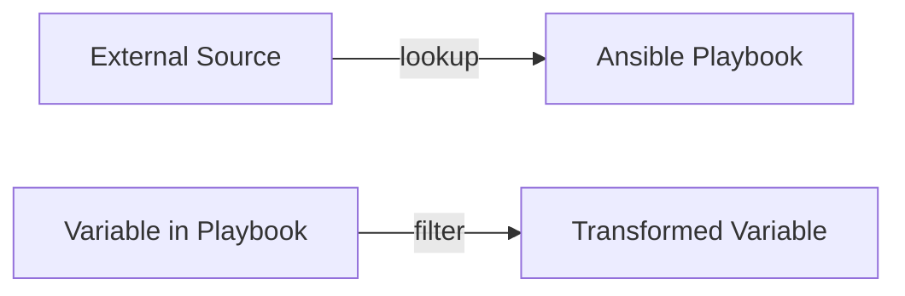

# Ansible Lookups

## Introduction

Ansible lookups are a powerful feature that allow you to retrieve data from various sources during playbook execution. Unlike standard variables that are defined statically, lookups provide a way to dynamically fetch information from external sources, files, environment variables, and more at runtime.

Think of lookups as "getters" - they pull data from somewhere and make it available for your playbooks. This data retrieval happens on the control node (where Ansible is running) rather than on the managed nodes, which makes lookups particularly useful for gathering local information.

## Understanding Lookup Plugins

Lookups are implemented as plugins in Ansible. The general syntax for using a lookup is:

```yaml
- name: Example of lookup syntax
  debug:
    msg: "The value is: {{ lookup('plugin_name', 'plugin_argument') }}"
```

Where:
- `plugin_name` is the name of the lookup plugin you want to use
- `plugin_argument` is the argument passed to the lookup plugin

Lookups can be used directly in templates, variable files, or anywhere in your playbooks where Jinja2 templating is supported.

## Common Lookup Plugins

Let's explore some of the most commonly used lookup plugins in Ansible:

### 1. File Lookup

The `file` lookup reads the contents of a file from the control node:

```yaml
- name: Display file contents
  debug:
    msg: "{{ lookup('file', '/path/to/file.txt') }}"
```

**Example**: Reading a SSH public key file for authorized_keys configuration

```yaml
- name: Add SSH public key to authorized_keys
  ansible.posix.authorized_key:
    user: deploy
    key: "{{ lookup('file', '~/.ssh/id_rsa.pub') }}"
    state: present
```

### 2. ENV Lookup

The `env` lookup retrieves environment variables from the control node:

```yaml
- name: Get HOME environment variable
  debug:
    msg: "Your home directory is {{ lookup('env', 'HOME') }}"
```

**Output**:
```
TASK [Get HOME environment variable] ******************************************
ok: [localhost] => {
    "msg": "Your home directory is /home/ansible"
}
```

### 3. Vars Lookup

The `vars` lookup retrieves the value of a variable:

```yaml
- name: Set a variable
  set_fact:
    my_variable: "Hello World"

- name: Get variable value through lookup
  debug:
    msg: "The value is: {{ lookup('vars', 'my_variable') }}"
```

### 4. Password Lookup

The `password` lookup generates or retrieves passwords:

```yaml
- name: Create a random password
  debug:
    msg: "Random password: {{ lookup('password', '/tmp/passwordfile length=12 chars=ascii_letters,digits') }}"
```

This generates a 12-character password using letters and digits and stores it in `/tmp/passwordfile`. If the file already exists, the password is read from it instead of generating a new one.

### 5. INI Lookup

The `ini` lookup reads values from INI files:

```yaml
- name: Read database password from config file
  debug:
    msg: "DB Password: {{ lookup('ini', 'password section=database file=/etc/app/config.ini') }}"
```

**Example INI file** (`/etc/app/config.ini`):
```ini
[database]
host=localhost
port=5432
username=app_user
password=secretpassword
```

### 6. Template Lookup

The `template` lookup processes a Jinja2 template and returns the result:

```yaml
- name: Template lookup example
  debug:
    msg: "{{ lookup('template', 'message.j2') }}"
```

With a template file `message.j2` containing:
```jinja
Hello {{ ansible_hostname }}! The time is {{ ansible_date_time.time }}.
```

## Combining Multiple Lookups

You can combine multiple lookups to achieve more complex data retrieval:

```yaml
- name: Combine lookup results
  debug:
    msg: "Server: {{ lookup('env', 'SERVER_NAME') }} with config from {{ lookup('file', '/etc/app/config.txt') }}"
```

## Working with Lookup Errors

By default, if a lookup fails, Ansible will stop the playbook execution. You can handle potential lookup failures with the `default` filter:

```yaml
- name: Handle potential lookup failure
  debug:
    msg: "Config value: {{ lookup('file', '/path/to/optional/file.txt') | default('Default value if file not found') }}"
```

## Loop with Lookups

Lookups can be powerful when used with loops. The `query` function works similarly to lookup but always returns a list:

```yaml
- name: Process all items from a file
  debug:
    msg: "Processing item: {{ item }}"
  loop: "{{ query('file', '/path/to/items.txt') | from_yaml }}"
```

## Real-World Example: Dynamic Inventory Management

Here's a practical example showing how lookups can be used for dynamic inventory management:

```yaml
---
# playbook.yml
- name: Configure servers from external inventory
  hosts: all
  vars:
    servers_list: "{{ lookup('file', 'servers.json') | from_json }}"
  
  tasks:
    - name: Configure each server based on its role
      template:
        src: "{{ item.role }}_config.j2"
        dest: "/etc/{{ item.name }}/config.conf"
      loop: "{{ servers_list.servers }}"
      when: item.name == inventory_hostname
```

With a `servers.json` file containing:
```json
{
  "servers": [
    {"name": "web01", "role": "web", "port": 80},
    {"name": "db01", "role": "database", "port": 5432},
    {"name": "cache01", "role": "cache", "port": 6379}
  ]
}
```

And role-specific templates like `web_config.j2`, `database_config.j2`, etc.

## Advanced: Creating Custom Lookup Plugins

For specialized needs, you can create your own lookup plugins. A custom lookup plugin is a Python file placed in a `lookup_plugins` directory.

Here's a simple example of a custom lookup plugin that transforms text to uppercase:

```python
# lookup_plugins/uppercase.py
from ansible.plugins.lookup import LookupBase

class LookupModule(LookupBase):
    def run(self, terms, variables=None, **kwargs):
        return [term.upper() for term in terms]
```

Usage in a playbook:
```yaml
- name: Use custom uppercase lookup
  debug:
    msg: "{{ lookup('uppercase', 'hello world') }}"
```

**Output**:
```
TASK [Use custom uppercase lookup] ******************************************
ok: [localhost] => {
    "msg": "HELLO WORLD"
}
```

## Lookups vs. Filters

It's important to understand the difference between lookups and filters in Ansible:

- **Lookups**: Retrieve data from external sources (files, APIs, etc.)
- **Filters**: Transform data that already exists in your playbook



## Lookup Performance Considerations

Lookups run on the control node and may affect performance if used excessively, especially with large data sets. Consider these best practices:

1. Use `set_fact` to store lookup results that are used multiple times
2. Be cautious with lookups in loops, as they execute for each iteration
3. Consider using the `ansible.builtin.slurp` module instead of file lookups for large files on remote nodes

## Summary

Ansible lookups provide a powerful way to retrieve and incorporate dynamic data into your playbooks. They allow you to:

- Read data from files, environment variables, and other sources
- Generate passwords and retrieve secrets
- Process data through templates
- Incorporate external configuration into your automation workflows

By understanding and using lookups effectively, you can create more dynamic, flexible, and powerful Ansible playbooks.

## Additional Resources

- [Ansible Documentation on Lookups](https://docs.ansible.com/ansible/latest/plugins/lookup.html)
- [Available Lookup Plugins](https://docs.ansible.com/ansible/latest/collections/index_lookup.html)
- [Ansible Jinja2 Templates](https://docs.ansible.com/ansible/latest/user_guide/playbooks_templating.html)

## Exercises

1. Create a playbook that reads a list of users from a JSON file using the file lookup and creates those users on a target system.
2. Write a playbook that uses the env lookup to conditionally execute tasks based on environment variables.
3. Create a template with the template lookup that generates a configuration file with values from your inventory variables.
4. Build a playbook that uses the password lookup to generate unique passwords for a list of service accounts.