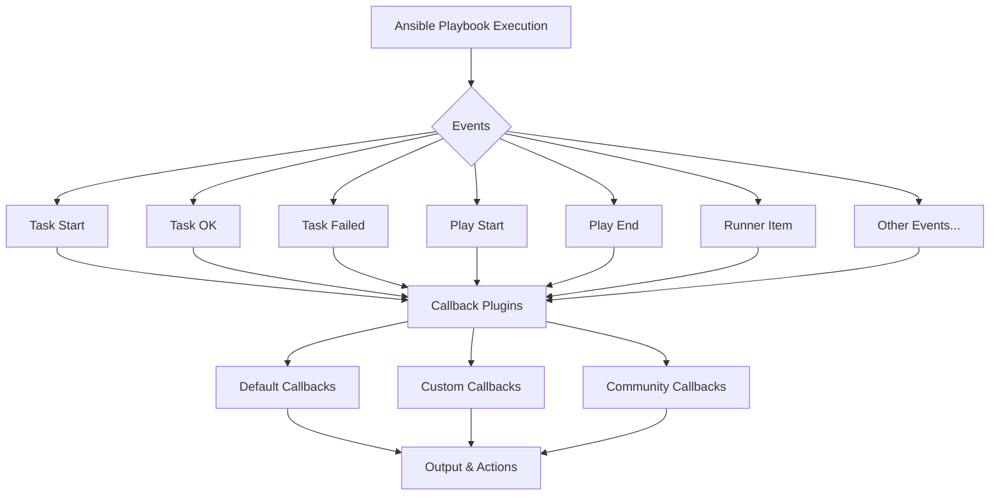

# Ansible Callback Plugins

## Introduction

Ansible Callback Plugins are powerful extensions that allow you to customize how Ansible responds to various events during playbook execution. They intercept events like when a task starts or finishes, and let you modify the output, collect data, or trigger external systems.

Think of callback plugins as event listeners for your Ansible automation. They provide hooks into Ansible's execution process, allowing you to:

- Customize the console output format
- Generate custom reports or logs
- Send notifications to external services
- Collect and analyze playbook performance metrics
- Integrate with monitoring and alerting systems

Whether you want cleaner output, custom logging, or integration with other tools, callback plugins give you the flexibility to tailor Ansible's behavior to your specific needs.

## Understanding Callback Plugins Architecture

Callback plugins work by responding to specific events that occur during Ansible's execution cycle. Let's understand how they fit into Ansible's architecture:



Ansible triggers various events during execution, and callback plugins can respond to these events to modify behavior or output.

## Built-in Callback Plugins

Ansible comes with several built-in callback plugins. Some of the most useful ones include:

1. **default**: The standard output formatter
2. **minimal**: Minimizes output to only essential information
3. **json**: Formats output as JSON data
4. **yaml**: Formats output as YAML data
5. **timer**: Adds timing information to tasks
6. **log_plays**: Logs playbook execution to a file

Let's see how to use some of these plugins:

### Configuring Callback Plugins

You can enable callback plugins in several ways:

1. Via the ansible.cfg file:

```ini
[defaults]
callback_plugins = ./callback_plugins
stdout_callback = yaml
```

2. Via environment variables:

```bash
export ANSIBLE_STDOUT_CALLBACK=json
```

3. Via command line:

```bash
ansible-playbook -i inventory playbook.yml --stdout-callback=minimal
```

### Example: Using the timer Callback

Let's see how the timer callback changes your output:

```bash
ansible-playbook -i inventory playbook.yml --stdout_callback=timer
```

Output:
```
PLAY [webservers] ******************************************

TASK [Gathering Facts] *************************************
ok: [web01.example.com] (0.92s)
ok: [web02.example.com] (0.87s)

TASK [Install nginx] **************************************
changed: [web01.example.com] (2.13s)
changed: [web02.example.com] (2.05s)

PLAY RECAP ***********************************************
web01.example.com : ok=2   changed=1   unreachable=0   failed=0   skipped=0   rescued=0   ignored=0   time=3.05s
web02.example.com : ok=2   changed=1   unreachable=0   failed=0   skipped=0   rescued=0   ignored=0   time=2.92s
```

Notice how the timer callback adds execution time information to each task and host!

## Creating Custom Callback Plugins

Now let's create our own custom callback plugin that sends notifications when tasks fail.

### Step 1: Create the Directory Structure

First, create a directory for your custom callback plugins:

```bash
mkdir -p callback_plugins
```

### Step 2: Create the Plugin File

Create a file named `notify_failures.py` in the callback_plugins directory:

```python
# callback_plugins/notify_failures.py
from __future__ import (absolute_import, division, print_function)
__metaclass__ = type

DOCUMENTATION = '''
    callback: notify_failures
    type: notification
    short_description: Sends notifications on task failures
    version_added: "2.9"
    description:
        - This callback sends notifications when tasks fail
    requirements:
        - python requests library
    options:
      webhook_url:
        description: The webhook URL to send notifications to
        env:
          - name: ANSIBLE_NOTIFY_WEBHOOK_URL
        ini:
          - section: callback_notify_failures
            key: webhook_url
'''

import os
import json
import requests

from ansible.plugins.callback import CallbackBase


class CallbackModule(CallbackBase):
    """
    Ansible callback plugin for sending notifications on failed tasks.
    """
    CALLBACK_VERSION = 2.0
    CALLBACK_TYPE = 'notification'
    CALLBACK_NAME = 'notify_failures'
    CALLBACK_NEEDS_WHITELIST = True

    def __init__(self):
        super(CallbackModule, self).__init__()
        self.webhook_url = os.getenv('ANSIBLE_NOTIFY_WEBHOOK_URL', '')
        
    def v2_runner_on_failed(self, result, ignore_errors=False):
        if ignore_errors:
            return
            
        host = result._host.get_name()
        task = result._task.get_name()
        
        # Create notification message
        message = {
            "text": f"❌ Ansible Task Failed",
            "attachments": [
                {
                    "title": f"Task: {task}",
                    "fields": [
                        {"title": "Host", "value": host, "short": True},
                        {"title": "Error", "value": self._get_error_message(result), "short": False}
                    ],
                    "color": "danger"
                }
            ]
        }
        
        # Send the notification
        if self.webhook_url:
            try:
                requests.post(
                    self.webhook_url,
                    data=json.dumps(message),
                    headers={'Content-Type': 'application/json'}
                )
            except Exception as e:
                self._display.warning(f"Could not send notification: {str(e)}")
                
    def _get_error_message(self, result):
        if 'msg' in result._result:
            return result._result['msg']
        return "Unknown error"
```

### Step 3: Configure Your Plugin

To enable your custom plugin, update your ansible.cfg:

```ini
[defaults]
callback_plugins = ./callback_plugins
```

### Step 4: Set Your Webhook URL

```bash
export ANSIBLE_NOTIFY_WEBHOOK_URL="https://example.com/webhook"
```

### Step 5: Run Your Playbook

Now when you run your playbook, failed tasks will trigger notifications:

```bash
ansible-playbook -i inventory playbook.yml
```

## Practical Applications

Let's explore some real-world applications of callback plugins:

### 1. Performance Analysis Plugin

This callback plugin measures and records the execution time of each task:

```python
# callback_plugins/performance_analyzer.py
from __future__ import (absolute_import, division, print_function)
__metaclass__ = type

import time
import json
from ansible.plugins.callback import CallbackBase

class CallbackModule(CallbackBase):
    CALLBACK_VERSION = 2.0
    CALLBACK_TYPE = 'aggregate'
    CALLBACK_NAME = 'performance_analyzer'
    
    def __init__(self):
        super(CallbackModule, self).__init__()
        self.task_timings = {}
        self.current_task = None
        self.start_time = None
        
    def v2_playbook_on_task_start(self, task, is_conditional):
        self.current_task = task.get_name()
        self.start_time = time.time()
        
    def v2_runner_on_ok(self, result):
        if self.start_time and self.current_task:
            elapsed = time.time() - self.start_time
            host = result._host.get_name()
            
            if self.current_task not in self.task_timings:
                self.task_timings[self.current_task] = []
                
            self.task_timings[self.current_task].append({
                'host': host,
                'time': elapsed
            })
            
    def v2_playbook_on_stats(self, stats):
        # Calculate average time per task
        analysis = {}
        for task, timings in self.task_timings.items():
            total_time = sum(t['time'] for t in timings)
            avg_time = total_time / len(timings)
            max_time = max(t['time'] for t in timings)
            slowest_host = next(t['host'] for t in timings if t['time'] == max_time)
            
            analysis[task] = {
                'avg_time': avg_time,
                'max_time': max_time,
                'slowest_host': slowest_host
            }
            
        # Output the results
        self._display.banner("PERFORMANCE ANALYSIS")
        for task, data in analysis.items():
            self._display.display(f"Task: {task}")
            self._display.display(f"  Average time: {data['avg_time']:.2f}s")
            self._display.display(f"  Max time: {data['max_time']:.2f}s (on {data['slowest_host']})")
            
        # Save to file for later analysis
        with open('ansible_performance.json', 'w') as f:
            json.dump(analysis, f, indent=2)
```

### 2. Slack Integration Plugin

This plugin sends task status updates to a Slack channel:

```python
# callback_plugins/slack_updates.py
from __future__ import (absolute_import, division, print_function)
__metaclass__ = type

import os
import json
import requests
from ansible.plugins.callback import CallbackBase

class CallbackModule(CallbackBase):
    CALLBACK_VERSION = 2.0
    CALLBACK_TYPE = 'notification'
    CALLBACK_NAME = 'slack_updates'
    CALLBACK_NEEDS_WHITELIST = True
    
    def __init__(self):
        super(CallbackModule, self).__init__()
        self.webhook_url = os.getenv('SLACK_WEBHOOK_URL', '')
        self.playbook_name = None
        
    def v2_playbook_on_start(self, playbook):
        self.playbook_name = os.path.basename(playbook._file_name)
        if self.webhook_url:
            message = {
                "blocks": [
                    {
                        "type": "section",
                        "text": {
                            "type": "mrkdwn",
                            "text": f"*Ansible Playbook Started*: `{self.playbook_name}`"
                        }
                    }
                ]
            }
            self._send_to_slack(message)
            
    def v2_playbook_on_stats(self, stats):
        if not self.webhook_url:
            return
            
        # Collect stats
        hosts = sorted(stats.processed.keys())
        summary = {}
        for host in hosts:
            summary[host] = stats.summarize(host)
        
        # Create status indicator
        success = all(h_stats['failures'] == 0 and h_stats['unreachable'] == 0 
                      for h_stats in summary.values())
        status = "✅ Success" if success else "❌ Failed"
        
        # Create message
        message = {
            "blocks": [
                {
                    "type": "section",
                    "text": {
                        "type": "mrkdwn",
                        "text": f"*Ansible Playbook Complete*: `{self.playbook_name}` - {status}"
                    }
                },
                {
                    "type": "section",
                    "text": {
                        "type": "mrkdwn",
                        "text": "*Host Results:*"
                    }
                }
            ]
        }
        
        # Add host details
        for host, h_stats in summary.items():
            host_result = (f"*{host}*: ok={h_stats['ok']} changed={h_stats['changed']} "
                          f"failed={h_stats['failures']} unreachable={h_stats['unreachable']}")
            message["blocks"].append({
                "type": "section",
                "text": {
                    "type": "mrkdwn",
                    "text": host_result
                }
            })
            
        self._send_to_slack(message)
        
    def _send_to_slack(self, message):
        try:
            response = requests.post(
                self.webhook_url,
                data=json.dumps(message),
                headers={'Content-Type': 'application/json'}
            )
            if response.status_code != 200:
                self._display.warning(f"Slack notification failed: {response.content}")
        except Exception as e:
            self._display.warning(f"Could not send Slack notification: {str(e)}")
```

## Best Practices for Callback Plugins

When working with callback plugins, keep these best practices in mind:

1. **Performance Considerations**
   - Keep callback code efficient, as it runs on every event
   - Be mindful of external API calls that could slow down playbook execution

2. **Error Handling**
   - Always include robust error handling in your callbacks
   - Ensure failures in your callback don't cause the playbook to fail

3. **Configuration Options**
   - Make your plugin configurable through environment variables and ansible.cfg
   - Document configuration options thoroughly

4. **Testing**
   - Test your callback plugin with various playbooks and scenarios
   - Verify it works correctly with different Ansible versions

5. **Security**
   - Be careful with sensitive data that might appear in task results
   - Consider encryption for any data transmitted to external services

## Troubleshooting Callback Plugins

Common issues with callback plugins and how to solve them:

| Issue | Solution |
|-------|----------|
| Plugin not activating | Check path in ansible.cfg and plugin file permissions |
| Errors in plugin code | Enable Ansible debug mode with `ANSIBLE_DEBUG=1` |
| Plugin conflicts | Try running with only your plugin enabled to isolate issues |
| Version compatibility | Check Ansible version requirements in plugin documentation |
| Missing dependencies | Install required Python packages mentioned in the plugin |

## Summary

Ansible Callback Plugins provide a powerful way to customize and extend Ansible's behavior during playbook execution. They allow you to:

- Modify the output format to suit your needs
- Integrate with external services and notification systems
- Collect performance metrics and execution statistics
- Generate custom reports and logs

By creating your own callback plugins, you can tailor Ansible to fit perfectly into your workflow and environment, making your automation efforts more effective and integrated with your broader systems.

## Additional Resources and Exercises

### Resources
- [Ansible Callback Plugin Documentation](https://docs.ansible.com/ansible/latest/plugins/callback.html)
- [Ansible Developer Guide](https://docs.ansible.com/ansible/latest/dev_guide/developing_plugins.html)
- [Ansible Collections on Galaxy](https://galaxy.ansible.com/) (many include useful callback plugins)

### Exercises

1. **Basic Plugin Modification**
   - Take the `notify_failures.py` plugin and modify it to also send notifications for successful tasks.

2. **Create a Custom Output Plugin**
   - Create a callback plugin that formats the output of Ansible playbooks in a custom format of your choice.

3. **Integration Challenge**
   - Develop a callback plugin that integrates with a monitoring system like Prometheus or Nagios.

4. **Performance Analysis**
   - Extend the performance analyzer plugin to generate visual charts (using libraries like matplotlib) of task execution times.

5. **Advanced Plugin Development**
   - Create a callback plugin that makes intelligent recommendations based on playbook execution patterns, such as suggesting tasks that could be optimized or parallelized.