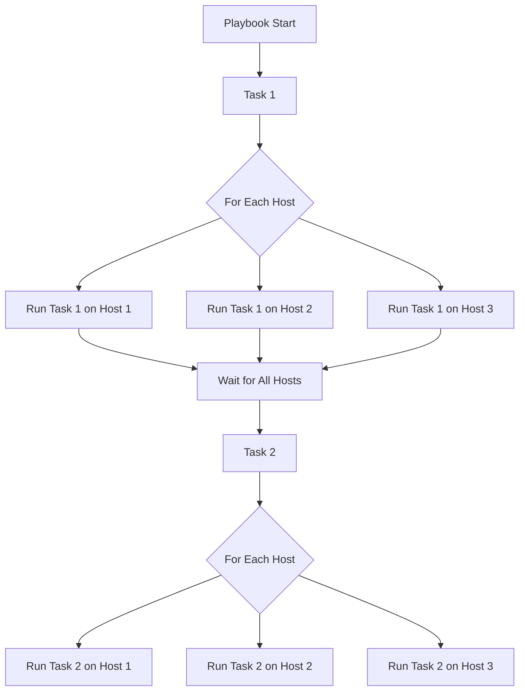

# Ansible Strategy Plugins

## Introduction

When running Ansible playbooks, have you ever wondered how Ansible decides the order in which tasks run across multiple hosts? This is determined by **strategy plugins** - a powerful yet often overlooked feature in Ansible.

Strategy plugins control the flow and execution of your playbooks, allowing you to fine-tune how Ansible processes tasks across multiple hosts. By default, Ansible uses the `linear` strategy, but there are several other strategies available that can significantly improve performance or help with specialized workflows.

In this tutorial, we'll explore:
- What strategy plugins are and why they matter
- The available built-in strategies in Ansible
- How to configure and use different strategies
- Creating custom strategy plugins for specific needs

## Understanding Strategy Plugins

At its core, a strategy plugin determines **how** Ansible executes tasks across multiple hosts. Think of strategies as traffic controllers directing the flow of task execution.

### What Exactly Do Strategy Plugins Control?

Strategy plugins determine:
1. The order in which hosts execute tasks
2. How many hosts run tasks simultaneously
3. What happens when a task fails on one host
4. How Ansible handles task delegation

Let's visualize the default flow with a diagram:



## Built-in Strategy Plugins

Ansible comes with five built-in strategy plugins:

### 1. Linear Strategy (Default)

The `linear` strategy runs each task on all hosts before moving to the next task. This ensures consistency across your infrastructure.

```yaml
- name: Update all web servers
  hosts: webservers
  strategy: linear
  tasks:
    - name: Install nginx
      ansible.builtin.apt:
        name: nginx
        state: present
      
    - name: Start nginx service
      ansible.builtin.service:
        name: nginx
        state: started
```

With the linear strategy:
1. Ansible connects to all hosts
2. Runs "Install nginx" on all hosts
3. Waits until all hosts complete the task
4. Then runs "Start nginx service" on all hosts

### 2. Free Strategy

The `free` strategy allows each host to run through the playbook as fast as possible, without waiting for other hosts.

```yaml
- name: Update all web servers
  hosts: webservers
  strategy: free
  tasks:
    - name: Install nginx
      ansible.builtin.apt:
        name: nginx
        state: present
      
    - name: Start nginx service
      ansible.builtin.service:
        name: nginx
        state: started
```

With the free strategy:
- Host1 might already be starting nginx while Host2 is still installing it
- Faster hosts won't be held up by slower ones
- Good for independent hosts that don't rely on each other

### 3. Debug Strategy

The `debug` strategy is designed for troubleshooting and offers interactive debugging capabilities when tasks fail.

```yaml
- name: Debug playbook execution
  hosts: webservers
  strategy: debug
  tasks:
    - name: A potentially problematic task
      ansible.builtin.shell: some_command
      register: command_result
```

When a task fails with the debug strategy, Ansible enters an interactive console where you can:
- Inspect variables
- Run arbitrary commands on the target host
- Retry the failed task with modifications
- Continue or abort execution

### 4. Host Pinned Strategy

The `host_pinned` strategy runs tasks on a single host until either all tasks are complete for that host or a task that needs to run on all hosts at once is encountered.

```yaml
- name: Deploy application with host pinning
  hosts: app_servers
  strategy: host_pinned
  tasks:
    - name: Install dependencies
      ansible.builtin.yum:
        name: "{{ dependencies }}"
        state: present
        
    - name: Deploy application code
      ansible.builtin.git:
        repo: https://github.com/myorg/myapp.git
        dest: /var/www/myapp
```

### 5. Linear MITOGEN Strategy

If you have the Mitogen plugin installed, you can use the `mitogen_linear` strategy, which optimizes connection overhead and can speed up playbook execution by 1.25x to 7x.

```yaml
- name: Fast deployment with Mitogen
  hosts: all
  strategy: mitogen_linear
  tasks:
    - name: Run commands
      ansible.builtin.command: hostname
```

## Configuring Strategy Plugins

There are three ways to specify which strategy to use:

### 1. In the Playbook

This sets the strategy for a specific play:

```yaml
- name: This play uses the free strategy
  hosts: all
  strategy: free
  tasks:
    - name: Some task
      ansible.builtin.debug:
        msg: "Running with free strategy"
```

### 2. In ansible.cfg

This sets the default strategy for all playbooks:

```ini
[defaults]
strategy = free
```

### 3. Using Strategy Variables

For fine-tuning strategy behavior:

```yaml
- name: Configure strategy parameters
  hosts: all
  strategy: linear
  vars:
    ansible_strategy_linear_forks: 10
  tasks:
    - name: Some task
      ansible.builtin.debug:
        msg: "Running with customized linear strategy"
```

## Practical Examples

Let's explore some real-world scenarios where different strategies excel.

### Example 1: Large Infrastructure Updates

When updating a large number of servers, the `free` strategy can significantly reduce total execution time:

```yaml
- name: Update large server farm
  hosts: server_farm
  strategy: free
  gather_facts: false  # Skip fact gathering for speed
  tasks:
    - name: Update apt cache
      ansible.builtin.apt:
        update_cache: yes
      
    - name: Upgrade all packages
      ansible.builtin.apt:
        upgrade: dist
      
    - name: Reboot if required
      ansible.builtin.reboot:
        reboot_timeout: 3600
      when: ansible_pkg_mgr == 'apt' and ansible_apt_needs_reboot is defined and ansible_apt_needs_reboot
```

### Example 2: Debugging a Complex Deployment

When troubleshooting issues in a deployment pipeline, the `debug` strategy helps identify problems:

```yaml
- name: Debug application deployment
  hosts: app_servers
  strategy: debug
  tasks:
    - name: Clone application repository
      ansible.builtin.git:
        repo: https://github.com/example/app.git
        dest: /var/www/app
      register: git_result
    
    - name: Install dependencies
      ansible.builtin.pip:
        requirements: /var/www/app/requirements.txt
        virtualenv: /var/www/app/venv
      register: pip_result
    
    - name: Start application
      ansible.builtin.shell: |
        cd /var/www/app
        source venv/bin/activate
        python manage.py runserver
      register: app_start_result
```

### Example 3: Rolling Deployment with Host Pinned Strategy

For a zero-downtime rolling deployment, the `host_pinned` strategy ensures one host completes all steps before moving to the next:

```yaml
- name: Rolling deployment
  hosts: load_balanced_app
  serial: 1  # Process one host at a time
  strategy: host_pinned
  tasks:
    - name: Remove from load balancer
      ansible.builtin.uri:
        url: "http://lb.example.com/api/remove?host={{ inventory_hostname }}"
        method: POST
      delegate_to: localhost
    
    - name: Deploy new code
      ansible.builtin.git:
        repo: https://github.com/example/app.git
        dest: /var/www/app
        version: "{{ new_version }}"
    
    - name: Restart application
      ansible.builtin.service:
        name: app
        state: restarted
    
    - name: Wait for application to respond
      ansible.builtin.uri:
        url: "http://{{ inventory_hostname }}/health"
        status_code: 200
      register: result
      until: result.status == 200
      retries: 30
      delay: 10
    
    - name: Add back to load balancer
      ansible.builtin.uri:
        url: "http://lb.example.com/api/add?host={{ inventory_hostname }}"
        method: POST
      delegate_to: localhost
```

## Creating a Custom Strategy Plugin

For specialized needs, you can create your own strategy plugin. Here's a simple example that extends the linear strategy to prioritize certain hosts:

First, create a directory structure for your plugin:

```
├── ansible.cfg
├── playbook.yml
└── strategy_plugins/
    └── prioritized.py
```

Update your `ansible.cfg` to include the strategy plugins directory:

```ini
[defaults]
strategy_plugins = ./strategy_plugins
```

Create the `prioritized.py` strategy plugin:

```python
from ansible.plugins.strategy.linear import StrategyModule as LinearStrategyModule

class StrategyModule(LinearStrategyModule):
    def _get_next_task_lockstep(self, hosts, iterator):
        # Get list of hosts in priority order
        priority_hosts = [h for h in hosts if h.name.startswith('priority_')]
        normal_hosts = [h for h in hosts if h not in priority_hosts]
        
        # Reorder hosts to process priority hosts first
        sorted_hosts = priority_hosts + normal_hosts
        
        # Call the parent method with the reordered hosts
        return super(StrategyModule, self)._get_next_task_lockstep(sorted_hosts, iterator)
```

Now use your custom strategy in a playbook:

```yaml
- name: Use custom prioritized strategy
  hosts: all
  strategy: prioritized
  tasks:
    - name: Run important task
      ansible.builtin.debug:
        msg: "This task will run on priority hosts first"
```

## Advanced Strategy Configurations

For more advanced scenarios, you can configure additional strategy parameters:

### Forks and Parallelism

Control how many hosts execute tasks simultaneously:

```yaml
- name: Highly parallel deployment
  hosts: webservers
  strategy: free
  vars:
    ansible_strategy_free_forks: 50  # Run on up to 50 hosts in parallel
  tasks:
    - name: Deploy static content
      ansible.builtin.copy:
        src: files/
        dest: /var/www/html/
```

### Failure Handling

Different strategies handle failures differently:

```yaml
- name: Continue despite failures
  hosts: all
  strategy: free
  serial: "100%"
  max_fail_percentage: 30  # Continue if less than 30% of hosts fail
  tasks:
    - name: Attempt risky operation
      ansible.builtin.shell: risky_command
      ignore_errors: yes
```

## Strategy Selection Guide

To help you choose the right strategy for your use case:

| Strategy | Best For | Less Suitable For |
|----------|----------|-------------------|
| Linear | Consistent deployments, interdependent tasks | Very large host counts |
| Free | Independent hosts, maximizing throughput | Tasks with dependencies between hosts |
| Debug | Troubleshooting, complex playbooks | Production runs, automated pipelines |
| Host Pinned | Rolling updates, minimizing host switching | Tasks requiring coordination across hosts |
| Mitogen Linear | Optimized performance, reducing overhead | Environments where additional plugins can't be installed |

## Common Issues and Troubleshooting

### Strategy Not Found

If you see an error like "strategy not found: mitogen_linear", ensure:
1. The plugin is installed
2. The strategy_plugins path is correctly set in ansible.cfg
3. The plugin name is spelled correctly

### Task Synchronization Issues

With the `free` strategy, tasks may execute in an unexpected order. Use explicit wait_for tasks for synchronization:

```yaml
- name: Ensure database is ready before connecting
  ansible.builtin.wait_for:
    host: "{{ db_host }}"
    port: "{{ db_port }}"
    state: started
    timeout: 300
```

### Debug Strategy Hangs

If the debug strategy seems to hang, check:
1. You have proper terminal access (it doesn't work well in CI/CD pipelines)
2. You're not running with -v (verbosity flags can interfere with the debug prompt)

## Summary

Ansible strategy plugins provide powerful control over playbook execution, allowing you to optimize for different scenarios:

- **Linear (default)**: Predictable, consistent execution
- **Free**: Maximum throughput, minimum execution time
- **Debug**: Interactive troubleshooting
- **Host Pinned**: Minimize host switching overhead
- **Mitogen Linear**: Optimized performance

By selecting and configuring the appropriate strategy, you can:
- Speed up playbook execution
- Implement zero-downtime deployments
- Troubleshoot complex automation
- Customize execution flow for specific needs

Understanding and leveraging strategy plugins is a key step in mastering advanced Ansible techniques and optimizing your automation workflows.

## Additional Resources

- Practice implementing each strategy type on a test environment
- Experiment with custom strategy plugins
- Try combining strategies with other Ansible features like `serial`, `max_fail_percentage`, and `delegate_to`

**Exercise**: Create a playbook that performs a zero-downtime rolling update using the host_pinned strategy. Include proper health checks and load balancer integration.