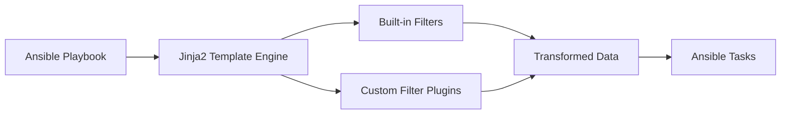

# Ansible Filter Plugins

## Introduction

When working with Ansible, you'll often need to transform, manipulate, or format data in your playbooks. While Ansible provides many built-in filters through Jinja2 templating, sometimes you need more specialized functionality. This is where **filter plugins** come in - they allow you to extend Ansible's capabilities by writing custom Python functions that can transform your data in exactly the ways you need.

Filter plugins are one of Ansible's most powerful features, enabling you to create reusable data transformation logic that can be applied throughout your playbooks and roles.

## What Are Filter Plugins?

Filter plugins are Python functions that can be used within Jinja2 templates in your Ansible playbooks and roles. They follow the "pipe" syntax that will be familiar if you've used filters in other contexts:

```yaml
- name: Display transformed data
  debug:
    msg: "{{ some_variable | my_custom_filter }}"
```

In this example, `my_custom_filter` is a filter that transforms `some_variable` in some way before passing it to the `debug` module.

## How Filter Plugins Work

Let's understand the basic architecture of how filter plugins integrate with Ansible:



When Ansible processes a template, it:
1. Identifies filter expressions in your playbook or template
2. Looks for matching filter functions in built-in and custom plugins
3. Applies the filter to the data
4. Uses the transformed result in your task

## Creating Your First Filter Plugin

Let's create a simple filter plugin that converts a string to uppercase and adds an exclamation mark:

1. First, create a directory structure for your plugin:

```
your_ansible_project/
├── filter_plugins/
│   └── custom_filters.py
├── playbook.yml
```

2. Create the filter plugin file `custom_filters.py`:

```python
# custom_filters.py

class FilterModule(object):
    ''' Custom filters for string manipulation '''

    def filters(self):
        return {
            'emphasize': self.emphasize
        }
    
    def emphasize(self, string):
        ''' Convert a string to uppercase and add an exclamation mark '''
        return string.upper() + '!'
```

3. Use your filter in a playbook:

```yaml
# playbook.yml
---
- name: Test custom filter
  hosts: localhost
  vars:
    greeting: "hello world"
  tasks:
    - name: Use custom filter
      debug:
        msg: "{{ greeting | emphasize }}"
```

4. Run the playbook:

```bash
ansible-playbook playbook.yml
```

The output will be:

```
TASK [Use custom filter] **********************
ok: [localhost] => {
    "msg": "HELLO WORLD!"
}
```

## Filter Plugin Structure Explained

Let's break down how a filter plugin works:

1. **FilterModule class**: All filter plugins must define a `FilterModule` class.
2. **filters() method**: This method returns a dictionary mapping filter names to their corresponding functions.
3. **Filter functions**: These are the actual functions that transform your data.

## Passing Multiple Arguments to Filters

Filters can accept additional arguments beyond the value being filtered. Here's an example of a filter that adds a prefix and suffix to a string:

```python
# custom_filters.py

class FilterModule(object):
    ''' Custom filters for string manipulation '''

    def filters(self):
        return {
            'decorate': self.decorate
        }
    
    def decorate(self, string, prefix='', suffix=''):
        ''' Add a prefix and suffix to a string '''
        return prefix + string + suffix
```

You can use this filter in your playbook like this:

```yaml
- name: Use filter with arguments
  debug:
    msg: "{{ 'ansible' | decorate('**', '**') }}"  # Output: **ansible**
```

## Practical Examples

Let's explore some practical examples of custom filter plugins:

### Example 1: Formatting IP Addresses

```python
# network_filters.py

class FilterModule(object):
    def filters(self):
        return {
            'format_cidr': self.format_cidr
        }
    
    def format_cidr(self, ip_address, subnet_prefix=24):
        ''' Format an IP address with CIDR notation '''
        if '/' in ip_address:
            return ip_address
        return f"{ip_address}/{subnet_prefix}"
```

Usage in a playbook:

```yaml
- name: Configure network interface
  template:
    src: interface.conf.j2
    dest: /etc/network/interfaces.d/eth0.conf
  vars:
    ip_address: "192.168.1.10"
    formatted_ip: "{{ ip_address | format_cidr(28) }}"  # Results in 192.168.1.10/28
```

### Example 2: Processing and Filtering Lists

```python
# list_filters.py

class FilterModule(object):
    def filters(self):
        return {
            'select_versions': self.select_versions
        }
    
    def select_versions(self, versions, min_version=None):
        ''' Filter a list of version strings to those >= min_version '''
        if not min_version:
            return versions
            
        result = []
        for v in versions:
            v_parts = [int(x) for x in v.split('.')]
            min_parts = [int(x) for x in min_version.split('.')]
            
            # Compare versions
            if self._version_greater_equal(v_parts, min_parts):
                result.append(v)
                
        return result
    
    def _version_greater_equal(self, version, min_version):
        ''' Helper method to compare version numbers '''
        for i in range(max(len(version), len(min_version))):
            v1 = version[i] if i < len(version) else 0
            v2 = min_version[i] if i < len(min_version) else 0
            if v1 > v2:
                return True
            if v1 < v2:
                return False
        return True
```

Usage in a playbook:

```yaml
- name: Find compatible software versions
  hosts: app_servers
  vars:
    available_versions:
      - "1.2.0"
      - "1.3.5"
      - "2.0.1"
      - "2.1.0"
    min_required: "2.0.0"
  tasks:
    - name: Show compatible versions
      debug:
        msg: "Compatible versions: {{ available_versions | select_versions(min_required) }}"
```

## Filter Plugins vs. Jinja2 Filters

You might wonder when to use a custom filter plugin versus using Jinja2's built-in capabilities:

| Filter Plugins | Jinja2 Filters |
|----------------|----------------|
| Complex data transformations | Simple text manipulation |
| Reusable across multiple playbooks | One-off transformations |
| Access to full Python functionality | Limited to Jinja2 expressions |
| Can maintain state between calls | Stateless |

## Testing Your Filter Plugins

It's important to test your filter plugins to ensure they work correctly. Here's a simple approach:

```python
# test_filters.py
from custom_filters import FilterModule

def test_emphasize():
    filters = FilterModule().filters()
    emphasize = filters['emphasize']
    
    assert emphasize('hello') == 'HELLO!'
    assert emphasize('ansible') == 'ANSIBLE!'
    print("All tests passed!")

if __name__ == "__main__":
    test_filters()
```

You can run this with Python:

```bash
python test_filters.py
```

## Best Practices for Filter Plugins

1. **Keep them focused**: Each filter should do one thing well.
2. **Document thoroughly**: Add docstrings to explain what your filter does.
3. **Handle edge cases**: Consider what happens with empty input, unusual data types, etc.
4. **Include error handling**: Fail gracefully with helpful error messages.
5. **Follow naming conventions**: Use lowercase names with underscores.
6. **Group related filters**: Keep related filters in the same module.

## Locating Filter Plugins

Ansible looks for filter plugins in specific locations:

1. In a `filter_plugins` directory relative to your playbook
2. In a `filter_plugins` directory inside each role
3. In Ansible's system-wide filter plugin directory

If you're creating plugins for reuse across projects, consider creating an Ansible collection to package them.

## Summary

Filter plugins provide a powerful way to extend Ansible's templating system with custom data transformation logic. By writing Python functions and exposing them through the plugin system, you can create reusable utilities that make your playbooks more powerful and your automation code more maintainable.

The key benefits of using filter plugins include:

- Extending Ansible with custom data manipulation functions
- Encapsulating complex logic in reusable components
- Keeping your playbooks clean and focused on automation rather than data processing
- Leveraging the full power of Python in your Ansible workflows

## Exercises

1. Create a filter plugin that takes a list of dictionaries and returns only those matching specific criteria.
2. Modify the `emphasize` filter to accept an optional parameter for the number of exclamation marks to add.
3. Write a filter plugin that formats a duration in seconds into a human-readable string (e.g., "2h 30m 15s").
4. Create a filter that parses a log file string and extracts entries matching a specific pattern.

## Additional Resources

- [Ansible Documentation on Filters](https://docs.ansible.com/ansible/latest/user_guide/playbooks_filters.html)
- [Developing Ansible Plugins](https://docs.ansible.com/ansible/latest/dev_guide/developing_plugins.html)
- [Jinja2 Template Designer Documentation](https://jinja.palletsprojects.com/en/3.0.x/templates/)
- [Python Regular Expressions](https://docs.python.org/3/library/re.html) (useful for text processing filters)