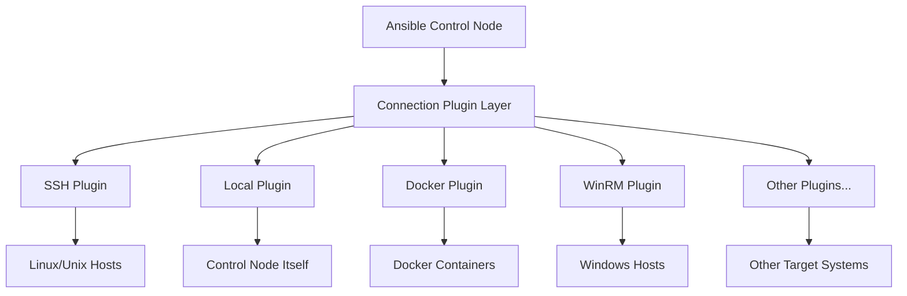

# Ansible Connection Plugins

## Introduction

When you're automating tasks with Ansible, one of the fundamental aspects is how Ansible connects to your target systems. This is where **Connection Plugins** come into play. Connection plugins determine the method Ansible uses to communicate with managed nodes, whether they're remote servers, local machines, or even container environments.

In this guide, we'll explore Ansible Connection Plugins, understand how they work, and learn how to leverage them effectively in your automation workflows.

## What Are Connection Plugins?

Connection plugins are modules that define how Ansible communicates with target hosts. By default, Ansible uses SSH to connect to remote machines, but there are situations where you might need alternative connection methods.

For example:
- You might need to manage Docker containers
- You might want to execute tasks locally
- You might need to connect to Windows machines using WinRM
- You might be working in a network with specific security requirements

Each connection type is handled by a specific plugin that knows how to establish the connection, transfer files, and execute commands on the target host.

## Available Connection Plugins

Ansible includes several built-in connection plugins to accommodate various scenarios:

| Plugin | Description |
|--------|-------------|
| `ssh` | The default connection plugin, using OpenSSH |
| `local` | Executes on the control node itself |
| `docker` | Connects to Docker containers |
| `winrm` | Connects to Windows hosts |
| `network_cli` | Used for network devices |
| `httpapi` | Used for REST API endpoints |
| `kubectl` | Executes commands in Kubernetes pods |

Let's examine the most commonly used ones in detail.

## The SSH Connection Plugin

The SSH plugin is Ansible's default connection method and works for most Linux/Unix environments.

### How to Configure SSH Connections

You can specify SSH connection details in your inventory file:

```ini
[webservers]
web1.example.com ansible_connection=ssh ansible_user=admin ansible_ssh_private_key_file=/path/to/key
```

Or in your Ansible configuration file (`ansible.cfg`):

```ini
[defaults]
remote_user = admin
private_key_file = /path/to/key

[ssh_connection]
pipelining = True
ssh_args = -o ControlMaster=auto -o ControlPersist=60s
```

### SSH Connection Options

Some useful SSH connection options include:

- `ansible_ssh_host`: The hostname/IP to connect to
- `ansible_ssh_port`: The SSH port (default: 22)
- `ansible_ssh_user`: The username to connect with
- `ansible_ssh_private_key_file`: Private key file
- `ansible_ssh_common_args`: Arguments to pass to all SSH CLI tools
- `ansible_ssh_extra_args`: Extra arguments specific to ssh

### Example: Using SSH with Non-standard Port

```yaml
- name: Update web servers using non-standard SSH port
  hosts: all
  vars:
    ansible_port: 2222
    ansible_connection: ssh
  
  tasks:
    - name: Update apt cache
      apt:
        update_cache: yes
```

## The Local Connection Plugin

The local connection plugin executes tasks on the Ansible control node itself, which is useful for managing the controller or when tasks need to interact with local resources.

### Example: Using Local Connection

```yaml
- name: Local tasks example
  hosts: localhost
  connection: local
  
  tasks:
    - name: Create a directory locally
      file:
        path: /tmp/ansible_test
        state: directory
        
    - name: Get local machine information
      setup:
      register: local_facts
      
    - name: Show local machine info
      debug:
        var: local_facts.ansible_distribution
```

Output:
```
TASK [Show local machine info] **********************************************
ok: [localhost] => {
    "local_facts.ansible_distribution": "Ubuntu"
}
```

## The Docker Connection Plugin

The Docker connection plugin allows you to manage Docker containers directly.

### Prerequisites

To use the Docker connection plugin, you need:
1. Docker installed on your control node
2. The Python docker module (`pip install docker`)

### Example: Docker Connection

First, let's define an inventory with Docker hosts:

```ini
[containers]
web_container ansible_connection=docker
db_container  ansible_connection=docker
```

Then, let's create a playbook to manage these containers:

```yaml
- name: Manage Docker containers
  hosts: containers
  gather_facts: no
  
  tasks:
    - name: Install curl inside containers
      raw: apt-get update && apt-get install -y curl
      
    - name: Check connectivity
      shell: curl --version
      register: curl_version
      
    - name: Display curl version
      debug:
        var: curl_version.stdout_lines
```

## The WinRM Connection Plugin

For managing Windows hosts, Ansible uses the WinRM connection plugin.

### Setting Up WinRM

Before using the WinRM plugin, you need to configure WinRM on your Windows hosts. You can use the PowerShell script provided by Ansible for this setup.

### Example: WinRM Connection

Inventory file:

```ini
[windows]
win_server ansible_host=192.168.1.100

[windows:vars]
ansible_connection=winrm
ansible_winrm_server_cert_validation=ignore
ansible_user=Administrator
ansible_password=SecurePassword
```

Playbook to manage Windows hosts:

```yaml
- name: Windows management example
  hosts: windows
  
  tasks:
    - name: Get Windows version
      win_shell: Get-ComputerInfo | Select-Object WindowsProductName, WindowsVersion
      register: win_info
      
    - name: Display Windows info
      debug:
        var: win_info.stdout_lines
```

## Switching Connection Types

Sometimes you might need to use different connection methods within the same playbook. Ansible provides several ways to specify the connection type:

### 1. In the Inventory File

```ini
[web_servers]
web1.example.com ansible_connection=ssh

[containers]
container1 ansible_connection=docker
```

### 2. In the Playbook

```yaml
- name: Tasks for SSH hosts
  hosts: web_servers
  connection: ssh
  tasks:
    # SSH-related tasks

- name: Tasks for Docker containers
  hosts: containers
  connection: docker
  tasks:
    # Docker-related tasks
```

### 3. At the Task Level

You can also change connections for specific tasks using the `delegate_to` directive with `local_action`:

```yaml
- name: Server management
  hosts: web_servers
  
  tasks:
    - name: Remote task using SSH
      apt:
        name: nginx
        state: present
        
    - name: Local task
      local_action:
        module: file
        path: /tmp/local_report
        state: touch
```

## Creating a Custom Connection Plugin

For advanced use cases, you might need to create your own connection plugin. Here's a simplified example of how to create a custom connection plugin:

1. Create a directory structure:

```
my_project/
├── ansible.cfg
├── inventory
├── playbook.yml
└── connection_plugins/
    └── my_connection.py
```

2. Update `ansible.cfg` to include your custom plugins:

```ini
[defaults]
connection_plugins = ./connection_plugins
```

3. Create your custom plugin (`my_connection.py`):

```python
from ansible.plugins.connection import ConnectionBase

class Connection(ConnectionBase):
    """
    Custom connection plugin for specialized connections
    """
    transport = 'my_connection'

    def __init__(self, *args, **kwargs):
        super(Connection, self).__init__(*args, **kwargs)
        self.host = self._play_context.remote_addr

    def _connect(self):
        # Establish your custom connection
        return self

    def exec_command(self, cmd, in_data=None, sudoable=True):
        # Execute command logic
        return 0, b'stdout data', b'stderr data'

    def put_file(self, in_path, out_path):
        # File transfer logic
        pass

    def fetch_file(self, in_path, out_path):
        # File retrieval logic
        pass

    def close(self):
        # Clean up connection
        pass
```

4. Use your custom connection in a playbook:

```yaml
- name: Use custom connection
  hosts: custom_hosts
  connection: my_connection
  
  tasks:
    - name: Run a command
      raw: your_command_here
```

## Connection Plugin in Action: Real-World Scenario

Let's look at a practical example that uses multiple connection types to deploy a web application:

```yaml
- name: Prepare local build
  hosts: localhost
  connection: local
  
  tasks:
    - name: Build application
      shell: npm run build
      args:
        chdir: /path/to/app
        
    - name: Create deployment package
      archive:
        path: /path/to/app/dist
        dest: /tmp/app_deployment.zip
        format: zip

- name: Deploy to web servers
  hosts: web_servers
  connection: ssh
  
  tasks:
    - name: Ensure web directory exists
      file:
        path: /var/www/myapp
        state: directory
        
    - name: Copy deployment package
      copy:
        src: /tmp/app_deployment.zip
        dest: /tmp/app_deployment.zip
        
    - name: Extract application
      unarchive:
        src: /tmp/app_deployment.zip
        dest: /var/www/myapp
        remote_src: yes
        
    - name: Restart web service
      service:
        name: nginx
        state: restarted
```

This playbook:
1. Builds the application locally (using `local` connection)
2. Creates a deployment package
3. Deploys the application to web servers (using `ssh` connection)

## Visualizing Connection Flow

Here's a diagram showing how connection plugins fit into Ansible's architecture:



## Debugging Connection Issues

When you encounter connection problems, these techniques can help:

### 1. Increase Verbosity

Run Ansible with increased verbosity to see connection details:

```bash
ansible-playbook -i inventory playbook.yml -vvv
```

### 2. Check Connection Parameters

Verify the connection parameters in your inventory or variables:

```bash
ansible-inventory --host hostname -i inventory --yaml
```

### 3. Test Basic Connectivity

Use the `ping` module to verify basic connectivity:

```bash
ansible hostname -i inventory -m ping
```

### 4. Connection-Specific Troubleshooting

For SSH issues:
```bash
ssh -v user@hostname
```

For Docker issues:
```bash
docker ps
docker exec -it container_name ls
```

## Best Practices

When working with connection plugins, follow these best practices:

1. **Consistent Configuration**: Define connection settings in inventory or group variables for consistency

2. **Security First**: Always use secure methods (key-based authentication, avoiding plain-text passwords)

3. **Test Connectivity**: Before running complex playbooks, test basic connectivity

4. **Use Connection Groups**: Group hosts by connection type in your inventory for better organization

5. **Minimize Connection Overhead**: Use `pipelining` and persistent connections for SSH to improve performance

6. **Control Parallelism**: Adjust the `forks` parameter to control how many parallel connections Ansible makes

## Summary

Ansible Connection Plugins provide the flexibility to connect to various target environments using different protocols and methods. By understanding the available plugins and how to configure them, you can extend your automation capabilities to diverse infrastructure types.

We've covered:
- The concept and purpose of connection plugins
- Common built-in connection plugins (ssh, local, docker, winrm)
- How to configure different connection types
- Switching between connection types
- Creating custom connection plugins
- Real-world application scenarios
- Troubleshooting connection issues

With this knowledge, you should be able to effectively use Ansible to manage not just traditional servers but also containers, network devices, and other specialized environments.

## Additional Resources

- Explore more connection plugins in the [Ansible documentation](https://docs.ansible.com/ansible/latest/plugins/connection.html)
- Practice with different connection types in a test environment
- Experiment with connection parameters to optimize performance

## Exercises

1. Create a playbook that uses the local connection to generate a report and then uses SSH to distribute the report to multiple servers.

2. Set up a Docker environment and create a playbook that manages containers using the docker connection plugin.

3. Implement a mixed-environment playbook that manages both Linux servers (via SSH) and Windows servers (via WinRM) to deploy a cross-platform application.

4. Try creating a simple custom connection plugin for a specific use case in your environment.