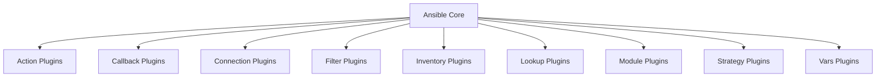

# Ansible Custom Plugins

## Introduction

Ansible's power and flexibility stem not just from its core functionality, but also from its extensible architecture. While Ansible provides a rich set of built-in features, there are times when you need custom functionality that doesn't exist out of the box. This is where Ansible's plugin system comes in.

Ansible plugins are Python modules that extend Ansible's core functionality in specific ways. By creating custom plugins, you can tailor Ansible to your specific needs, make your playbooks more elegant, and solve complex automation challenges more efficiently.

In this guide, we'll explore:
- The different types of Ansible plugins
- How to create and use your own custom plugins
- Real-world examples of custom plugins in action

## Understanding Ansible's Plugin Architecture

Before diving into custom plugin development, let's understand Ansible's plugin architecture and the various types of plugins available.

### Types of Ansible Plugins

Ansible offers several plugin types, each serving a specific purpose:

1. **Action Plugins**: Execute on the controller before tasks are delegated to target hosts
2. **Callback Plugins**: Process events during playbook execution (like logging)
3. **Connection Plugins**: Handle communication with managed hosts
4. **Filter Plugins**: Manipulate data within templates and playbooks
5. **Inventory Plugins**: Add dynamic inventory sources
6. **Lookup Plugins**: Fetch data from external sources
7. **Module Plugins**: Execute code on target hosts (the most common plugin type)
8. **Strategy Plugins**: Control how Ansible executes tasks across hosts
9. **Vars Plugins**: Add additional sources for variables



### Plugin Discovery Path

Ansible looks for plugins in several locations, in this order:

1. `ANSIBLE_[PLUGIN_TYPE]_PLUGINS` environment variable
2. `ansible.cfg` file settings
3. `~/.ansible/plugins/[plugin_type]/`
4. `/usr/share/ansible/plugins/[plugin_type]/`

## Creating Your First Custom Plugin

Let's start by creating a simple filter plugin. Filter plugins are among the easiest to create and can be immediately useful in your playbooks.

### Custom Filter Plugin Example

Filter plugins allow you to transform data within your templates and playbooks. Let's create a filter plugin that converts bytes to a human-readable format.

First, create the directory structure:

```bash
mkdir -p ~/.ansible/plugins/filter
touch ~/.ansible/plugins/filter/size_filters.py
```

Now, let's write our filter plugin:

```python
#!/usr/bin/python

def human_readable_size(size_bytes):
    """
    Convert size in bytes to human-readable format
    
    Args:
        size_bytes (int): Size in bytes
        
    Returns:
        str: Human-readable size
    """
    for unit in ['B', 'KB', 'MB', 'GB', 'TB']:
        if size_bytes < 1024 or unit == 'TB':
            return f"{size_bytes:.2f} {unit}"
        size_bytes /= 1024.0

# Plugin registration
class FilterModule(object):
    def filters(self):
        return {
            'human_readable_size': human_readable_size
        }
```

This filter will convert a byte value to a human-readable format (B, KB, MB, etc.).

### Using the Custom Filter

Now let's use our new filter in a playbook:

```yaml
---
- name: Test custom filter plugin
  hosts: localhost
  gather_facts: no
  vars:
    file_size: 1536246
  
  tasks:
    - name: Display file size in human-readable format
      debug:
        msg: "The file size is {{ file_size | human_readable_size }}"
```

When you run this playbook, you'll see:

```
TASK [Display file size in human-readable format] ***************************
ok: [localhost] => {
    "msg": "The file size is 1.47 MB"
}
```

## Custom Lookup Plugin

Lookup plugins allow you to fetch data from various sources. Let's create a simple lookup plugin that reads data from a JSON API.

First, create the directory:

```bash
mkdir -p ~/.ansible/plugins/lookup
touch ~/.ansible/plugins/lookup/json_api.py
```

Now, let's write our lookup plugin:

```python
#!/usr/bin/python
# Python 3 headers, required if submitting to Ansible

from __future__ import (absolute_import, division, print_function)
__metaclass__ = type

DOCUMENTATION = """
    lookup: json_api
    author: Your Name
    short_description: Read data from a JSON API
    description:
        - This lookup returns data from a JSON API endpoint
    options:
        _terms:
            description: URL of the API endpoint
            required: True
"""

from ansible.errors import AnsibleError
from ansible.plugins.lookup import LookupBase
import json
import urllib.request

class LookupModule(LookupBase):

    def run(self, terms, variables=None, **kwargs):
        result = []
        
        for term in terms:
            url = term.strip()
            try:
                response = urllib.request.urlopen(url)
                data = json.loads(response.read())
                result.append(data)
            except Exception as e:
                raise AnsibleError(f"Error accessing API: {str(e)}")
                
        return result
```

### Using the Custom Lookup Plugin

Here's how you might use this lookup plugin in a playbook:

```yaml
---
- name: Test JSON API lookup plugin
  hosts: localhost
  gather_facts: no
  
  tasks:
    - name: Get data from JSON API
      debug:
        msg: "{{ lookup('json_api', 'https://jsonplaceholder.typicode.com/todos/1') }}"
```

The output would look like:

```
TASK [Get data from JSON API] ***************************
ok: [localhost] => {
    "msg": {
        "userId": 1,
        "id": 1,
        "title": "delectus aut autem",
        "completed": false
    }
}
```

## Custom Callback Plugin

Callback plugins process events generated during playbook execution. Let's create a simple callback plugin that logs task duration.

First, create the directory:

```bash
mkdir -p ~/.ansible/plugins/callback
touch ~/.ansible/plugins/callback/task_timer.py
```

Now, let's write our callback plugin:

```python
#!/usr/bin/python

from __future__ import (absolute_import, division, print_function)
__metaclass__ = type

DOCUMENTATION = '''
    callback: task_timer
    type: stdout
    short_description: Displays task execution time
    description:
        - This callback module displays the time taken for each task.
    requirements:
        - Enable in ansible.cfg
'''

import time
from ansible.plugins.callback import CallbackBase

class CallbackModule(CallbackBase):
    """
    Callback module that displays task execution time
    """
    CALLBACK_VERSION = 2.0
    CALLBACK_TYPE = 'stdout'
    CALLBACK_NAME = 'task_timer'

    def __init__(self):
        super(CallbackModule, self).__init__()
        self.task_start_time = None

    def v2_playbook_on_task_start(self, task, is_conditional):
        self.task_start_time = time.time()
        self._display.display(f"Starting task: {task.name}")

    def v2_playbook_on_stats(self, stats):
        self._display.display("Task timing report completed")

    def v2_runner_on_ok(self, result):
        duration = time.time() - self.task_start_time
        self._display.display(f"Task '{result._task.name}' completed in {duration:.2f} seconds")
```

### Enabling the Custom Callback Plugin

To enable our callback plugin, add the following to your `ansible.cfg` file:

```ini
[defaults]
callback_whitelist = task_timer
```

Now, when you run any playbook, you'll see task timing information.

## Creating a Custom Module

Modules are the workhorses of Ansible, executing on target hosts to implement the desired state. Let's create a custom module that checks website availability.

First, create the directory:

```bash
mkdir -p ~/.ansible/plugins/modules
touch ~/.ansible/plugins/modules/website_status.py
```

Now, let's write our module:

```python
#!/usr/bin/python

from __future__ import absolute_import, division, print_function
__metaclass__ = type

DOCUMENTATION = '''
---
module: website_status
short_description: Check if a website is available
description:
    - This module checks if a website is available and returns its HTTP status code.
options:
    url:
        description:
            - The URL to check
        required: true
        type: str
    timeout:
        description:
            - The timeout in seconds
        required: false
        default: 10
        type: int
author:
    - Your Name
'''

EXAMPLES = '''
- name: Check if example.com is available
  website_status:
    url: https://example.com
  register: result

- name: Display result
  debug:
    var: result
'''

RETURN = '''
status_code:
    description: HTTP status code
    type: int
    returned: always
    sample: 200
is_available:
    description: Whether the website is available (status code 200-399)
    type: bool
    returned: always
    sample: true
response_time:
    description: Response time in seconds
    type: float
    returned: always
    sample: 0.345
'''

import urllib.request
import time
from ansible.module_utils.basic import AnsibleModule

def main():
    module = AnsibleModule(
        argument_spec=dict(
            url=dict(type='str', required=True),
            timeout=dict(type='int', default=10),
        )
    )

    url = module.params['url']
    timeout = module.params['timeout']
    
    start_time = time.time()
    
    try:
        request = urllib.request.Request(url)
        response = urllib.request.urlopen(request, timeout=timeout)
        status_code = response.getcode()
        is_available = 200 <= status_code < 400
        
    except urllib.error.HTTPError as e:
        status_code = e.code
        is_available = False
    except Exception as e:
        module.fail_json(msg=f"Error checking website status: {str(e)}")
    
    response_time = time.time() - start_time
    
    result = {
        'status_code': status_code,
        'is_available': is_available,
        'response_time': response_time,
        'url': url
    }
    
    module.exit_json(**result)

if __name__ == '__main__':
    main()
```

### Using the Custom Module

Here's how you might use your custom module in a playbook:

```yaml
---
- name: Check website availability
  hosts: localhost
  gather_facts: no
  
  tasks:
    - name: Check website status
      website_status:
        url: https://www.example.com
        timeout: 5
      register: website
    
    - name: Display result
      debug:
        msg: "Website is {{ 'available' if website.is_available else 'unavailable' }} with status code {{ website.status_code }}. Response time: {{ website.response_time | float | round(3) }}s"
```

Output would look like:

```
TASK [Check website status] ***************************
ok: [localhost]

TASK [Display result] ***************************
ok: [localhost] => {
    "msg": "Website is available with status code 200. Response time: 0.345s"
}
```

## Real-world Examples

Let's look at some real-world examples of custom plugins that solve specific automation challenges.

### Example 1: Dynamic Inventory Plugin for Cloud Resources

Imagine you're managing infrastructure in a cloud environment and want Ansible to automatically discover all your resources. You could create a custom inventory plugin:

```python
# This is a simplified example and would need more development for actual use

from ansible.plugins.inventory import BaseInventoryPlugin
import boto3

class InventoryModule(BaseInventoryPlugin):
    NAME = 'aws_ec2_custom'
    
    def verify_file(self, path):
        # Return true/false if this is possibly a valid file for this plugin to consume
        return path.endswith('aws_ec2.yaml')
    
    def parse(self, inventory, loader, path, cache=True):
        # Parse the inventory file
        super(InventoryModule, self).parse(inventory, loader, path)
        
        # Initialize AWS client
        ec2 = boto3.client('ec2')
        
        # Get all instances
        instances = ec2.describe_instances()
        
        # Add hosts to inventory
        for reservation in instances['Reservations']:
            for instance in reservation['Instances']:
                if instance['State']['Name'] == 'running':
                    # Use instance ID as host name
                    hostname = instance['InstanceId']
                    
                    # Add host to group based on instance type
                    group_name = f"aws_type_{instance['InstanceType']}"
                    self.inventory.add_group(group_name)
                    self.inventory.add_host(hostname, group=group_name)
                    
                    # Add variables based on instance metadata
                    self.inventory.set_variable(hostname, 'ansible_host', instance.get('PublicIpAddress', ''))
                    self.inventory.set_variable(hostname, 'private_ip', instance.get('PrivateIpAddress', ''))
                    
                    # Add tags as variables
                    if 'Tags' in instance:
                        for tag in instance['Tags']:
                            self.inventory.set_variable(hostname, f"tag_{tag['Key']}", tag['Value'])
```

### Example 2: Custom Filter for Network Configuration

If you're managing network devices, you might need to transform data in specific ways:

```python
def subnet_to_cidr(subnet_mask):
    """Convert subnet mask to CIDR notation."""
    if not subnet_mask:
        return None
        
    try:
        # Split by dots
        octets = subnet_mask.split('.')
        if len(octets) != 4:
            return None
            
        # Convert to binary and count 1s
        binary = ''.join([bin(int(octet))[2:].zfill(8) for octet in octets])
        return binary.count('1')
    except Exception:
        return None

def ip_in_subnet(ip_address, subnet):
    """Check if an IP address is in a subnet."""
    import ipaddress
    try:
        return ipaddress.ip_address(ip_address) in ipaddress.ip_network(subnet)
    except Exception:
        return False

class FilterModule(object):
    def filters(self):
        return {
            'subnet_to_cidr': subnet_to_cidr,
            'ip_in_subnet': ip_in_subnet
        }
```

## Best Practices for Custom Plugin Development

When creating custom Ansible plugins, follow these best practices:

1. **Documentation**: Always include comprehensive documentation with examples.
2. **Error Handling**: Implement proper error handling and provide clear error messages.
3. **Testing**: Test your plugins thoroughly before using them in production.
4. **Reusability**: Design your plugins to be reusable across multiple projects.
5. **Performance**: Be mindful of performance, especially in plugins that run frequently.
6. **Security**: Be careful when handling sensitive data or executing external commands.
7. **Python Version Compatibility**: Ensure your plugins work with the Python version used by Ansible.
8. **Follow Ansible Style**: Follow Ansible's coding style and conventions.

## Plugin Development Workflow

Here's a recommended workflow for developing custom Ansible plugins:

1. **Identify the Need**: Clearly define what functionality you need that isn't available.
2. **Choose the Plugin Type**: Determine which type of plugin is best suited for your needs.
3. **Start Simple**: Begin with a basic implementation and add complexity gradually.
4. **Test Locally**: Test your plugin thoroughly in a development environment.
5. **Version Control**: Store your plugins in a version control system for easy management.
6. **Share with the Team**: Document and share your plugins with your team.
7. **Consider Contributing**: If your plugin is generally useful, consider contributing it to the Ansible community.

## Summary

Custom plugins are a powerful way to extend Ansible's functionality to meet your specific automation needs. By creating your own plugins, you can:

- Implement functionality that isn't available in Ansible's core
- Make your playbooks more elegant and DRY (Don't Repeat Yourself)
- Integrate with external systems and data sources
- Improve the efficiency and effectiveness of your automation

As you become more comfortable with Ansible, developing custom plugins will allow you to unlock its full potential and tackle even the most complex automation challenges.

## Additional Resources

- [Ansible Plugin Development Documentation](https://docs.ansible.com/ansible/latest/dev_guide/developing_plugins.html)
- [Ansible Python API Documentation](https://docs.ansible.com/ansible/latest/dev_guide/developing_api.html)
- [Ansible Galaxy](https://galaxy.ansible.com/) - Browse existing community plugins for inspiration

## Exercises

1. Create a custom filter plugin that formats dates in a specific way.
2. Develop a lookup plugin that retrieves data from a database.
3. Build a callback plugin that sends notifications when playbooks complete.
4. Create a custom module that interacts with a service not supported by Ansible's built-in modules.
5. Extend the website_status module to check multiple URLs and report on their availability.