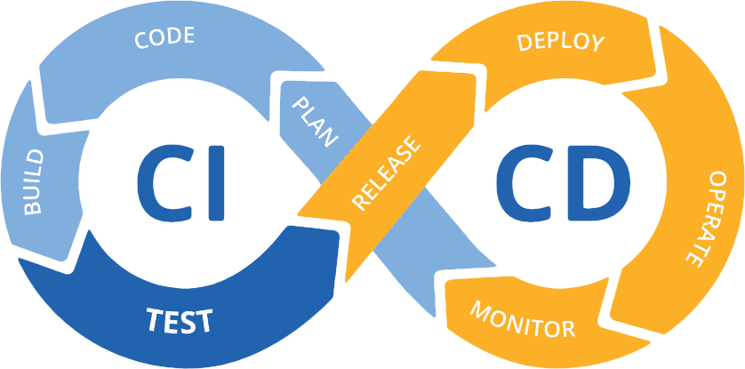
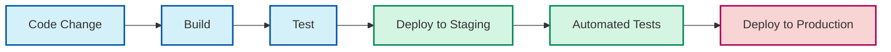

# CI/CD Introduction

## What is CI/CD?

<div style={{
    "width": "20%",
    "margin": "0 auto",
    "text-align": "center"
}}>
    
</div>

CI/CD stands for **Continuous Integration** and **Continuous Deployment** (or Continuous Delivery). It's a set of practices that helps development teams deliver code changes more frequently and reliably.

Think of CI/CD as an assembly line for your code. Instead of building software in large batches with occasional releases, CI/CD helps you build, test, and release software in small, manageable increments - often multiple times per day!

## Why CI/CD Matters

Before CI/CD became common practice, software development often followed this pattern:

1. Developers worked independently for weeks
2. Everyone merged their changes at the end (causing "merge hell")
3. Testing happened after development was "complete"
4. Deployment was a stressful, manual process

This approach led to:
- Bugs discovered late in development
- Difficult integration processes
- Infrequent, high-risk deployments
- Long delays between writing code and getting user feedback

CI/CD solves these problems by automating integration, testing, and deployment processes.

## The CI/CD Pipeline

A CI/CD pipeline is an automated sequence of steps that code changes go through from development to production deployment.



Let's break down the two main components:

### Continuous Integration (CI)

CI focuses on automatically integrating code changes from multiple developers into a shared repository. Each integration triggers automated builds and tests to catch issues early.

**Key CI practices:**

1. **Frequent code commits** - Developers push small changes several times a day
2. **Automated building** - Code is automatically compiled or bundled
3. **Automated testing** - Tests run automatically when code is committed
4. **Fast feedback** - Developers learn quickly if their changes broke anything

### Continuous Deployment/Delivery (CD)

CD extends CI by automatically deploying code changes to testing, staging, and eventually production environments.

- **Continuous Delivery**: Automatically deploy to staging, but require manual approval for production deployment
- **Continuous Deployment**: Automatically deploy to production with no manual intervention (if all tests pass)

## CI/CD in Action: A Simple Example

Let's walk through a basic example of how CI/CD works in practice:

1. A developer makes code changes to add a new feature
2. She commits and pushes the changes to the team's Git repository
3. The CI server detects the new commit and starts the pipeline

Here's what happens next in the automated pipeline:

```javascript
// Example: A simple JavaScript function with a bug
function calculateTotal(prices) {
  let total = 0;
  for (let i = 0; i < prices.length; i++) {
    total += prices[i];
  }
  return total;
}

// Test for the function
function testCalculateTotal() {
  const testPrices = [10, 20, 30];
  const expectedTotal = 60;
  const actualTotal = calculateTotal(testPrices);
  
  if (actualTotal === expectedTotal) {
    console.log("Test passed!");
    return true;
  } else {
    console.log(`Test failed! Expected ${expectedTotal} but got ${actualTotal}`);
    return false;
  }
}
```

When this code is pushed, the CI system would:

1. **Build** the application
2. **Run the tests** (like `testCalculateTotal()`)
3. **Report** the results back to the developer

If all tests pass, the CD part of the pipeline might:

4. **Deploy** to a staging environment
5. **Run** integration tests
6. **Deploy** to production (or wait for manual approval)

## Setting Up a Basic CI/CD Pipeline

Let's explore how to set up a simple CI/CD pipeline using GitHub Actions, a popular CI/CD tool that's free for public repositories.

### Example: GitHub Actions Workflow

Create a file named `.github/workflows/ci.yml` in your repository:

```yaml
name: CI/CD Pipeline

on:
  push:
    branches: [ main ]
  pull_request:
    branches: [ main ]

jobs:
  build-and-test:
    runs-on: ubuntu-latest
    
    steps:
    - uses: actions/checkout@v3
    
    - name: Set up Node.js
      uses: actions/setup-node@v3
      with:
        node-version: '16'
        
    - name: Install dependencies
      run: npm install
      
    - name: Run tests
      run: npm test
      
    - name: Build
      run: npm run build
      
  deploy:
    needs: build-and-test
    if: github.event_name == 'push' && github.ref == 'refs/heads/main'
    runs-on: ubuntu-latest
    
    steps:
    - name: Deploy to staging
      run: echo "Deploying to staging..."
      # In a real setup, you would use a deployment action here
```

This workflow:
1. Triggers whenever someone pushes to the main branch or creates a pull request
2. Sets up a Node.js environment
3. Installs dependencies
4. Runs tests
5. Builds the application
6. Deploys to staging (only when merging to the main branch)

## Benefits of CI/CD

Implementing CI/CD provides numerous advantages:

1. **Faster feedback** - Developers learn about issues minutes after committing code
2. **Reduced risk** - Small, frequent changes are easier to troubleshoot
3. **Improved quality** - Automated testing catches bugs before they reach users
4. **More frequent releases** - Teams can deploy new features as soon as they're ready
5. **Happier developers** - Less time fighting with integration and deployment issues
6. **Happier users** - Receive new features and bug fixes more quickly

## Common CI/CD Tools

Many tools are available to help implement CI/CD:

- **GitHub Actions**: Tightly integrated with GitHub repositories
- **Jenkins**: Self-hosted, highly customizable
- **CircleCI**: Cloud-based, easy to set up
- **GitLab CI/CD**: Built into GitLab
- **Travis CI**: Popular for open-source projects
- **Azure DevOps**: Microsoft's integrated solution
- **AWS CodePipeline**: Amazon's CI/CD service

## Best Practices for CI/CD

To get the most out of your CI/CD implementation:

1. **Commit small changes frequently** - Aim for multiple commits per day
2. **Write automated tests** - Maintain good test coverage
3. **Keep builds fast** - Aim for under 10 minutes
4. **Fix broken builds immediately** - Don't let failures linger
5. **Use feature flags** - Deploy code that's not yet ready for users
6. **Monitor deployments** - Track performance and errors after release
7. **Automate everything** - If it's manual, it's a candidate for automation

## Summary

CI/CD transforms how software is built and delivered by automating the integration, testing, and deployment processes. By implementing these practices, development teams can:

- Deliver changes more frequently
- Reduce integration problems
- Improve code quality
- Respond faster to user feedback

As you grow in your development career, CI/CD will become an essential part of your toolkit for building and delivering high-quality software.

## Additional Resources

To learn more about CI/CD:

- Explore free tiers of CI/CD platforms like GitHub Actions
- Set up a simple CI pipeline for one of your projects
- Experiment with different types of automated tests

## Exercises

1. Create a simple application with automated tests
2. Set up a GitHub Actions workflow to run those tests
3. Extend your workflow to build and deploy your application to a free hosting service
4. Add a code quality check to your pipeline using a linter
5. Implement feature flags in your application to control feature availability