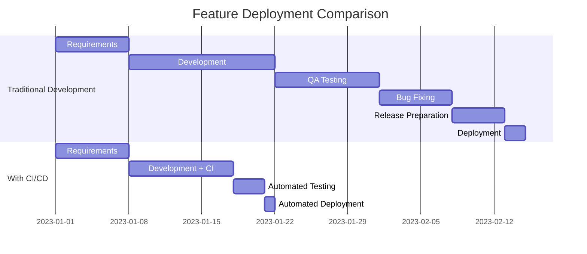
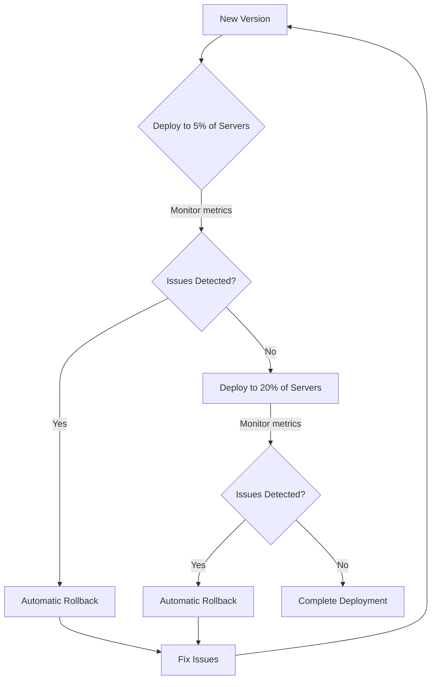
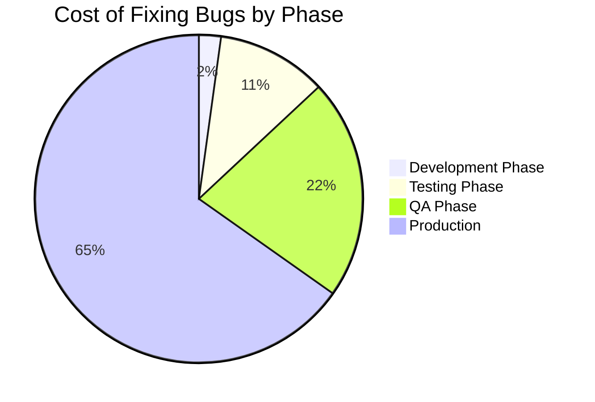

# CI/CD Benefits

## Introduction

Continuous Integration and Continuous Deployment (CI/CD) has revolutionized how software teams build, test, and deliver applications. As a beginner, understanding these benefits will help you appreciate why modern development teams invest in establishing CI/CD pipelines. This guide explores the tangible advantages that CI/CD brings to development teams of all sizes.

## What is CI/CD?

Before diving into the benefits, let's quickly review what CI/CD means:

- **Continuous Integration (CI)**: The practice of frequently merging code changes into a shared repository, followed by automated building and testing.
- **Continuous Deployment (CD)**: The practice of automatically deploying code changes to production after passing all tests.

Together, these practices form a pipeline that streamlines the software delivery process from code commit to production deployment.

## Key Benefits of CI/CD

### 1. Faster Time to Market

One of the most significant advantages of CI/CD is the ability to deliver features to users more quickly.

<details>
<summary>How CI/CD accelerates delivery</summary>

- **Automated workflows** replace manual processes
- **Parallel testing** reduces overall testing time
- **Incremental changes** are easier to implement and deploy
- **Immediate feedback** allows for quicker issue resolution

</details>

#### Example: Feature Deployment Timeline



With CI/CD, teams can reduce their deployment time from weeks to days or even hours.

### 2. Higher Code Quality

CI/CD enforces code quality by integrating automated testing at multiple stages of the development pipeline.

#### How CI/CD improves code quality:

1. **Automated testing** catches issues early
2. **Code reviews** become more focused on architecture and design
3. **Static code analysis** identifies potential bugs before they reach production
4. **Consistent environments** reduce "works on my machine" problems

#### Real-world Example: Test Coverage

Let's examine how CI can track and enforce test coverage:

```yaml
# Example CI configuration for test coverage
test:
  script:
    - npm install
    - npm run test:coverage
  coverage: '/Total.*?(\d+\.\d+)%/'
  only:
    - merge_requests
  rules:
    - if: $CI_PIPELINE_SOURCE == "merge_request_event"
      when: always
```

This configuration automatically runs tests and reports coverage whenever a merge request is created, helping maintain code quality standards.

### 3. Reduced Risk

CI/CD significantly reduces the risk associated with software deployments.

#### Risk reduction through CI/CD:

- **Smaller changes** are easier to troubleshoot
- **Incremental deployments** limit the scope of potential failures
- **Automated rollbacks** provide safety nets
- **Consistent processes** eliminate human error in deployment steps

#### Example: Canary Deployments

A common risk-reduction strategy enabled by CI/CD is canary deployments:



This approach minimizes the impact of problematic deployments by testing changes with a small subset of users first.

### 4. Improved Developer Productivity

CI/CD empowers developers to focus on writing code rather than managing deployments.

#### Productivity gains include:

- **Automated builds** free developers from manual compilation
- **Quick feedback** on code quality and test failures
- **Self-service environments** for testing and verification
- **Consistent tooling** across the team

#### Example: Developer Workflow Comparison

| Without CI/CD | With CI/CD |
|--------------|------------|
| Developer manually builds and tests changes | Automated build and test on commit |
| Developer manually deploys to test environment | Automatic deployment to test environment |
| QA team manually tests | Automated test suite runs |
| Manual deployment procedures | One-click or fully automated deployments |
| Time-consuming regression testing | Continuous regression testing |

### 5. Better Collaboration

CI/CD fosters better team collaboration by creating shared processes and visibility.

#### Collaboration improvements:

- **Shared responsibility** for build and deployment health
- **Transparent processes** visible to all team members
- **Early integration** of work from different team members
- **Faster feedback loops** between development and operations

#### Real-world Example: Slack Integration

Many teams integrate their CI/CD pipelines with communication tools:

```javascript
// Example webhook for pipeline notifications
async function sendSlackNotification(status, branch, commitMessage) {
  const emoji = status === 'success' ? '✅' : '❌';
  const message = {
    text: `${emoji} Pipeline ${status} for ${branch}`,
    blocks: [
      {
        type: "section",
        text: {
          type: "mrkdwn",
          text: `*Pipeline ${status}*
Branch: ${branch}
Commit: ${commitMessage}`
        }
      }
    ]
  };
  
  await fetch('https://hooks.slack.com/services/YOUR_WEBHOOK_URL', {
    method: 'POST',
    body: JSON.stringify(message)
  });
}
```

This notification system ensures everyone stays informed about build and deployment status.

### 6. Cost Reduction

While implementing CI/CD requires initial investment, it leads to significant cost savings over time.

#### Cost savings sources:

- **Reduced manual testing** costs
- **Fewer production incidents** and associated downtime
- **More efficient resource utilization**
- **Less time spent on deployment activities**

#### Example: Bug Cost Analysis

The cost of fixing bugs increases dramatically based on when they're discovered:



CI/CD helps catch bugs earlier in the development process, significantly reducing their cost impact.

### 7. Consistent and Reliable Releases

CI/CD creates a repeatable process that makes releases consistent and predictable.

#### Consistency benefits:

- **Identical environments** across development, testing, and production
- **Infrastructure as code** ensures environment reproducibility
- **Versioned artifacts** provide traceability
- **Automated verification** ensures release readiness

#### Example: GitOps Deployment Flow


This GitOps approach ensures that every deployment follows the same consistent process.

## Real-world CI/CD Implementation Example

Let's look at a simplified CI/CD pipeline implementation using GitHub Actions:

```yaml
# Example GitHub Actions workflow file (.github/workflows/ci-cd.yml)
name: CI/CD Pipeline

on:
  push:
    branches: [ main ]
  pull_request:
    branches: [ main ]

jobs:
  build:
    runs-on: ubuntu-latest
    steps:
    - uses: actions/checkout@v3
    - name: Set up Node.js
      uses: actions/setup-node@v3
      with:
        node-version: '16'
    - name: Install dependencies
      run: npm ci
    - name: Run linter
      run: npm run lint
    - name: Run tests
      run: npm test
    - name: Build
      run: npm run build
    
  deploy-staging:
    needs: build
    if: github.event_name == 'push' && github.ref == 'refs/heads/main'
    runs-on: ubuntu-latest
    steps:
    - uses: actions/checkout@v3
    - name: Deploy to staging
      run: |
        echo "Deploying to staging environment"
        # Deployment commands would go here
        
  deploy-production:
    needs: deploy-staging
    if: github.event_name == 'push' && github.ref == 'refs/heads/main'
    runs-on: ubuntu-latest
    steps:
    - name: Wait for approval
      uses: trstringer/manual-approval@v1
      with:
        secret: ${{ secrets.GITHUB_TOKEN }}
        approvers: username1,username2
        minimum-approvals: 1
        timeout-minutes: 60
    - uses: actions/checkout@v3
    - name: Deploy to production
      run: |
        echo "Deploying to production environment"
        # Production deployment commands would go here
```

This workflow automatically builds, tests, and deploys code when changes are pushed to the main branch, with a manual approval step before production deployment.

## Getting Started with CI/CD

To start implementing CI/CD in your projects:

1. **Choose a CI/CD tool** that fits your needs (GitHub Actions, Jenkins, GitLab CI, CircleCI, etc.)
2. **Start small** by automating just the build and test process
3. **Gradually add** more steps to your pipeline
4. **Incorporate automated testing** at multiple levels
5. **Define deployment strategies** appropriate for your application

## Summary

CI/CD brings numerous benefits to software development teams:

- Faster time to market
- Higher code quality
- Reduced deployment risk
- Improved developer productivity
- Better team collaboration
- Reduced costs
- Consistent and reliable releases

By implementing CI/CD practices, even beginner developers can create more robust applications and adopt professional workflows that scale with their projects.

## Additional Resources

- [Martin Fowler's article on Continuous Integration](https://martinfowler.com/articles/continuousIntegration.html)
- [The Twelve-Factor App methodology](https://12factor.net/)
- [DevOps Research and Assessment (DORA) metrics](https://cloud.google.com/blog/products/devops-sre/using-the-four-keys-to-measure-your-devops-performance)

## Exercises

1. Set up a basic CI pipeline for an existing project using GitHub Actions or GitLab CI.
2. Create a test suite that runs automatically on each commit.
3. Implement a staging environment that receives automatic deployments.
4. Practice implementing a feature using a feature branch workflow with CI/CD integration.
5. Design a CD pipeline that includes both staging and production environments.