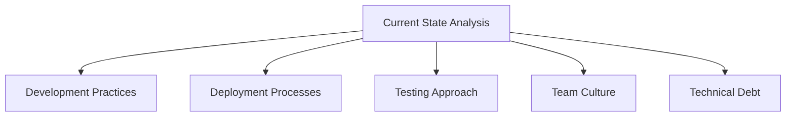

# CI/CD Adoption

## Introduction

Adopting Continuous Integration and Continuous Deployment (CI/CD) practices represents a significant milestone in a development team's journey toward modern software delivery. While understanding CI/CD concepts is important, successfully implementing and adopting these practices across an organization or project requires careful planning, cultural shifts, and technical considerations.

This guide will walk you through the process of CI/CD adoption, from initial assessment to full implementation, addressing common challenges and providing practical strategies for success.

## Why Adopt CI/CD?

Before diving into the "how," let's briefly explore the "why" of CI/CD adoption:

- **Faster delivery**: Reduce the time between writing code and delivering it to users
- **Higher quality**: Catch bugs earlier with automated testing
- **Reduced risk**: Smaller, more frequent releases make problems easier to identify and fix
- **Developer satisfaction**: Less manual work and fewer deployment headaches
- **Business agility**: Respond more quickly to user feedback and market changes

## CI/CD Adoption Roadmap

Let's explore a step-by-step approach to successfully adopting CI/CD in your organization or project.

### 1. Assessment and Planning

#### Current State Analysis

Begin by honestly assessing your current development and deployment practices:



**Key questions to ask:**

- How long does it take to deploy a single line change to production?
- How frequently do you release to production?
- How automated are your testing processes?
- What manual steps exist in your workflow?
- What are your current pain points?

#### Set Clear Goals

Define what successful CI/CD adoption looks like for your specific context:

- Deployment frequency targets
- Lead time reduction goals
- Mean time to recovery improvements
- Change failure rate reduction

Remember that different teams may have different needs - a mobile app team might have different deployment goals than a web services team.

### 2. Start Small and Scale Gradually

CI/CD adoption works best with an incremental approach. Begin with a single project or component that:

- Has good test coverage (or can quickly achieve it)
- Has a supportive, enthusiastic team
- Provides visible value to the organization
- Is relatively low-risk

#### Example: Gradual CI/CD Adoption Path


### 3. Building Your CI/CD Pipeline

Let's look at how to construct your pipeline step by step:

#### Version Control Setup

Ensure all code lives in a version control system (like Git) with these practices:

- Feature branches for development
- Pull/Merge request workflow
- Code review requirements
- Branch protection rules

#### Example Git Workflow

```bash
# Create a new feature branch
git checkout -b feature/login-enhancement

# Make changes and commit
git add .
git commit -m "Add password strength indicator"

# Push to remote repository
git push origin feature/login-enhancement

# (Then create pull request via your Git provider's interface)
```

#### Continuous Integration Pipeline

Set up automated builds triggered by code changes:

```yaml
# Example GitHub Actions workflow for a Node.js project
name: CI Pipeline

on:
  push:
    branches: [ main, develop ]
  pull_request:
    branches: [ main, develop ]

jobs:
  build-and-test:
    runs-on: ubuntu-latest
    
    steps:
    - uses: actions/checkout@v2
    
    - name: Setup Node.js
      uses: actions/setup-node@v2
      with:
        node-version: 16
        
    - name: Install dependencies
      run: npm ci
      
    - name: Lint code
      run: npm run lint
      
    - name: Run unit tests
      run: npm test
      
    - name: Build
      run: npm run build
```

#### Testing Strategy

Implement a comprehensive testing approach:

- **Unit tests**: Test individual functions and components
- **Integration tests**: Test interactions between components
- **End-to-end tests**: Test complete user journeys
- **Performance tests**: Verify system performance under load
- **Security scans**: Identify vulnerabilities

#### Continuous Deployment Pipeline

Extend your CI pipeline to include deployment stages:

```yaml
# Example addition to the previous workflow for CD
    - name: Deploy to staging
      if: github.ref == 'refs/heads/develop'
      run: |
        echo "${{ secrets.DEPLOY_KEY }}" > deploy_key
        chmod 600 deploy_key
        scp -i deploy_key -r build/* user@staging-server:/var/www/app
        
    - name: Deploy to production
      if: github.ref == 'refs/heads/main'
      run: |
        echo "${{ secrets.DEPLOY_KEY }}" > deploy_key
        chmod 600 deploy_key
        scp -i deploy_key -r build/* user@production-server:/var/www/app
```

### 4. Overcoming Common Challenges

#### Cultural Resistance

Technical challenges are often easier to solve than cultural ones. Address resistance by:

- Communicating benefits clearly
- Providing training and support
- Celebrating early wins
- Involving teams in the planning process
- Supporting teams through failures

#### Legacy Systems

Older systems can be challenging to integrate into CI/CD pipelines:

- Gradually refactor toward testability
- Create isolation boundaries around legacy code
- Use feature flags to control deployment risk
- Consider strangler pattern for incremental modernization

#### Example: Feature Flag Implementation

```javascript
// Simple feature flag implementation
function getCheckoutFlow(user) {
  if (featureFlags.isEnabled('new-checkout-flow', user)) {
    return new NewCheckoutFlow();
  } else {
    return new ClassicCheckoutFlow();
  }
}
```

### 5. CI/CD Tools and Technologies

Many tools can support your CI/CD journey. Here are some popular options:

#### CI/CD Platforms
- Jenkins
- GitHub Actions
- GitLab CI/CD
- CircleCI
- Azure DevOps
- AWS CodePipeline

#### Infrastructure as Code
- Terraform
- AWS CloudFormation
- Pulumi
- Ansible

#### Containerization
- Docker
- Kubernetes
- Helm

#### Monitoring and Observability
- Prometheus
- Grafana
- ELK Stack
- Datadog

Remember that tools should serve your process, not dictate it. Choose tools based on your specific needs, team expertise, and existing technology stack.

### 6. Real-World Example: E-Commerce Site CI/CD Adoption

Let's examine how a fictional e-commerce company adopted CI/CD:

**Starting Point:**
- Monthly releases
- Manual testing
- Weekend deployments
- Frequent rollbacks

**Step 1: Basic CI Implementation**
- Set up automated builds on each commit
- Added linting and unit tests
- Built artifact storage
- Result: Faster feedback on code quality

**Step 2: Test Automation**
- Implemented integration tests
- Added end-to-end tests for critical flows (checkout, payment)
- Result: Higher confidence in changes

**Step 3: Deployment Automation**
- Automated deployments to test environment
- Implemented blue/green deployment for staging
- Added smoke tests post-deployment
- Result: Reduced deployment effort and errors

**Step 4: Continuous Deployment**
- Added feature flags for risky features
- Implemented canary releases
- Set up automated rollback capability
- Result: Daily production deployments with minimal risk

**Final Outcome:**
- Deployment frequency: Monthly → Daily
- Lead time: Weeks → Hours
- Change failure rate: 40% → 5%
- Recovery time: Hours → Minutes

## Best Practices for Successful CI/CD Adoption

To maximize your chances of successful CI/CD adoption:

1. **Make small, incremental changes**: Large, sweeping changes increase risk and resistance.

2. **Automate everything possible**: Every manual step is a potential point of failure and delay.

3. **Build quality in from the start**: Don't treat testing as an afterthought.

4. **Monitor and measure**: Track key metrics to demonstrate improvement and identify bottlenecks.

5. **Foster a blameless culture**: When failures happen (and they will), focus on learning rather than blame.

6. **Continuously improve**: CI/CD adoption is a journey, not a destination.

## Common Pitfalls to Avoid

Be aware of these common mistakes in CI/CD adoption:

- **Tool obsession**: Focusing too much on tools rather than practices and principles
- **Ignoring culture**: Failing to address the human and organizational aspects of change
- **Inadequate testing**: Implementing CI/CD without sufficient automated testing
- **Big bang approach**: Trying to change everything at once
- **Neglecting security**: Adding security as an afterthought rather than building it in

## Summary

Adopting CI/CD practices represents a significant shift in how software is developed, tested, and delivered. While the journey may present challenges, the benefits - faster delivery, higher quality, reduced risk, and improved developer experience - make it worthwhile.

Remember that successful CI/CD adoption is about more than just implementing tools; it requires changes to processes, practices, and often organizational culture. Start small, demonstrate value, and gradually expand your CI/CD practices across your organization.

## Additional Resources

For further learning about CI/CD adoption:

- **Books**:
  - "Accelerate" by Nicole Forsgren, Jez Humble, and Gene Kim
  - "Continuous Delivery" by Jez Humble and David Farley
  - "The DevOps Handbook" by Gene Kim, Jez Humble, Patrick Debois, and John Willis

- **Online Learning**:
  - The CI/CD module on this website
  - Free CI/CD courses on platforms like Coursera, edX, and YouTube

## Exercises

1. **Assessment Exercise**: Map your current development workflow from code commit to production deployment. Identify manual steps that could be automated.

2. **CI Pipeline Planning**: Design a basic CI pipeline for one of your projects, identifying the build, test, and validation steps needed.

3. **Tool Evaluation**: Research and compare two CI/CD tools that might fit your project needs.

4. **Metrics Baseline**: Establish current metrics for your development process (deployment frequency, lead time, change failure rate, MTTR).

5. **Feature Flag Implementation**: Practice implementing a simple feature flag system in your application code.