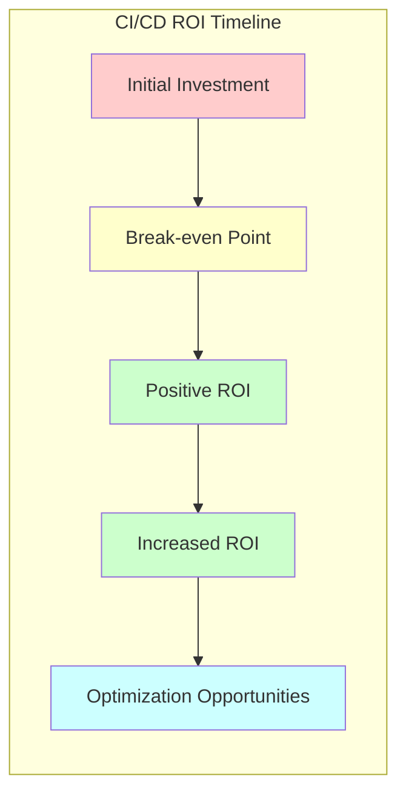

# CI/CD ROI: Understanding the Return on Investment

## Introduction

Implementing Continuous Integration and Continuous Deployment (CI/CD) practices requires an investment of time, resources, and often money. But how do you know if this investment is paying off? This is where Return on Investment (ROI) comes into play.

In this guide, we'll explore how to measure, calculate, and maximize the ROI of your CI/CD implementation. Whether you're trying to convince stakeholders to adopt CI/CD or evaluating your existing pipeline, understanding CI/CD ROI is essential.

## What is CI/CD ROI?

CI/CD ROI is a measure of the financial benefits gained relative to the investment made in implementing and maintaining CI/CD practices. It helps answer the question: "Is our CI/CD pipeline worth the resources we're putting into it?"

The basic formula for calculating ROI is:

```
ROI = (Net Benefit / Cost of Investment) × 100%
```

Where:
- **Net Benefit** = Total Benefits - Total Costs
- **Cost of Investment** = Initial Implementation Costs + Ongoing Maintenance Costs

## Key Benefits to Measure

To calculate CI/CD ROI effectively, we need to identify and quantify the benefits. Here are the key areas where CI/CD typically provides value:

### 1. Time Savings

CI/CD automation reduces the time spent on manual processes, allowing developers to focus on writing code.

**Example calculation:**

```
Time Saved = (Time for Manual Deployment × Number of Deployments) - 
             (Time for Automated Deployment × Number of Deployments)

Dollar Value = Time Saved × Average Developer Hourly Cost
```

### 2. Faster Time to Market

CI/CD enables more frequent releases, allowing features to reach users faster.

**Example calculation:**

```
Revenue Impact = (Revenue per Feature × Number of Features) × 
                 (New Time to Market - Old Time to Market) / 365
```

### 3. Reduced Defects and Improved Quality

Automated testing catches bugs earlier in the development cycle when they're cheaper to fix.

**Example calculation:**

```
Cost Savings = (Number of Bugs Prevented × Average Cost per Bug Fix)
```

### 4. Increased Developer Productivity

With CI/CD, developers spend less time on integration issues and more time on valuable work.

**Example calculation:**

```
Productivity Gain = (Previous Time Spent on Integration Issues - 
                    Current Time Spent on Integration Issues) × 
                    Number of Developers × Average Hourly Rate
```

## Calculating CI/CD Implementation Costs

To determine ROI, we also need to account for all CI/CD-related costs:

### 1. Initial Implementation Costs

- Infrastructure/tools costs
- Training expenses
- Consultant fees (if applicable)
- Developer time spent on setup

### 2. Ongoing Costs

- Subscription or license fees for CI/CD tools
- Infrastructure costs (e.g., build servers, cloud services)
- Maintenance and updates
- Support personnel

## ROI Calculation Example

Let's walk through a simplified example of calculating CI/CD ROI for a small development team:

### Scenario

- Team size: 5 developers
- Average developer salary: $100,000/year ($50/hour)
- Number of deployments: Increased from 4/year to 24/year
- Manual deployment time: 8 hours each
- Automated deployment time: 0.5 hours of oversight each
- Defects found in production: Reduced from 50/year to 15/year
- Average cost to fix a production defect: $500

### Costs

1. **Initial implementation:**
   - CI/CD tools setup: $5,000
   - Developer time (80 hours): $4,000
   - Training: $2,000
   - **Total initial cost: $11,000**

2. **Annual ongoing costs:**
   - CI/CD tool subscriptions: $3,600/year
   - Infrastructure: $2,400/year
   - Maintenance (50 hours/year): $2,500/year
   - **Total annual cost: $8,500**

### Benefits

1. **Deployment time savings:**
   - Before: 4 deployments × 8 hours = 32 hours
   - After: 24 deployments × 0.5 hours = 12 hours
   - Net time savings: 20 hours/year
   - Dollar value: 20 hours × $50/hour = $1,000/year

2. **Increased deployment frequency benefits:**
   - More frequent feedback and feature delivery
   - Estimated value: $20,000/year (based on earlier time-to-market)

3. **Reduced defects:**
   - Defects prevented: 35/year
   - Cost savings: 35 defects × $500 = $17,500/year

4. **Developer productivity:**
   - Time saved on integration issues: 100 hours/year
   - Dollar value: 100 hours × $50/hour = $5,000/year

**Total annual benefits: $43,500**

### ROI Calculation

For the first year (including initial implementation costs):

```
First Year ROI = ((43,500 - (11,000 + 8,500)) / (11,000 + 8,500)) × 100%
               = (24,000 / 19,500) × 100%
               = 123%
```

For subsequent years:

```
Annual ROI = ((43,500 - 8,500) / 8,500) × 100%
           = (35,000 / 8,500) × 100%
           = 412%
```

This means that for every dollar invested in CI/CD after the initial setup, the company receives $4.12 in benefits!

## Visualizing CI/CD ROI Over Time

The ROI of CI/CD typically increases over time as initial costs are recouped and teams become more efficient with the processes.



```mermaid
xychart-beta
    title "CI/CD ROI Over Time"
    x-axis [Q1, Q2, Q3, Q4, Year 2, Year 3]
    y-axis "ROI %" -50 --> 500
    bar ["-40%", "20%", "80%", "123%", "290%", "412%"]
```

## Common Challenges in Measuring CI/CD ROI

### 1. Quantifying Intangible Benefits

Some benefits are difficult to express in monetary terms, such as:
- Improved developer satisfaction
- Better collaboration between teams
- Increased confidence in releases
- Enhanced security posture

### 2. Attribution Issues

It can be challenging to determine whether improvements are due to CI/CD implementation or other factors like:
- Team skill improvements
- Better requirements gathering
- Changes in project complexity

### 3. Data Collection Difficulties

To accurately measure ROI, you need data from before and after CI/CD implementation, which may not always be available.

## Best Practices for Maximizing CI/CD ROI

### 1. Start Small and Expand

Begin with high-value, low-effort improvements:

```javascript
// Example: Adding a simple test automation script
const { test } = require('@jest/globals');
const { sum } = require('./calculator');

test('adds 1 + 2 to equal 3', () => {
  expect(sum(1, 2)).toBe(3);
});
```

### 2. Standardize Your CI/CD Pipeline

Create consistent processes across projects:

```yaml
# Example: Basic CI/CD pipeline configuration
name: Basic CI Pipeline

on:
  push:
    branches: [ main ]
  pull_request:
    branches: [ main ]

jobs:
  build-and-test:
    runs-on: ubuntu-latest
    steps:
    - uses: actions/checkout@v2
    - name: Setup Node.js
      uses: actions/setup-node@v2
      with:
        node-version: '14'
    - name: Install dependencies
      run: npm ci
    - name: Run tests
      run: npm test
    - name: Build
      run: npm run build
```

### 3. Automate Everything Possible

Look for manual processes that could be automated:

- Build processes
- Testing (unit, integration, performance)
- Code quality checks
- Deployment steps
- Environment provisioning

### 4. Monitor and Continuously Improve

Track key metrics over time:

- Deployment frequency
- Lead time for changes
- Time to recover from failures
- Change failure rate

### 5. Invest in Training

Ensure your team understands CI/CD concepts and tools:

- Version control best practices
- Test automation strategies
- Infrastructure as code
- Pipeline configuration

## Real-world Example: An E-commerce Company

A mid-sized e-commerce company implemented CI/CD and tracked the following changes over one year:

| Metric | Before CI/CD | After CI/CD | Improvement |
|--------|--------------|-------------|-------------|
| Deployment frequency | 1/month | 8/month | 8× increase |
| Deployment duration | 4 hours | 20 minutes | 92% reduction |
| Production bugs | 25/month | 8/month | 68% reduction |
| Time to fix bugs | 3 days | 4 hours | 83% reduction |
| Developer onboarding | 2 weeks | 3 days | 70% reduction |

Their annual ROI calculation showed a 275% return after accounting for all implementation and maintenance costs.

## Case Study: Calculating ROI for a Specific Improvement

Let's examine how automating test execution can contribute to overall CI/CD ROI:

### Before Automation:
- Manual test execution: 20 hours/week
- Tester hourly cost: $40/hour
- Annual testing cost: 20 hours × $40 × 52 weeks = $41,600

### After Automation:
- Initial automation development: 200 hours × $40 = $8,000
- Automated test execution: 2 hours/week
- Test maintenance: 3 hours/week
- Annual automated testing cost: (2 + 3) hours × $40 × 52 weeks = $10,400

### ROI Calculation for Test Automation:
- First-year savings: $41,600 - ($8,000 + $10,400) = $23,200
- First-year ROI: ($23,200 / $8,000) × 100% = 290%
- Subsequent years ROI: (($41,600 - $10,400) / $10,400) × 100% = 300%

## Summary

Calculating CI/CD ROI is essential for justifying investments in CI/CD tools and practices. By measuring both tangible and intangible benefits against implementation and ongoing costs, organizations can make data-driven decisions about their DevOps initiatives.

Remember these key points:
- ROI typically increases over time as initial investments are recouped
- CI/CD provides both quantifiable benefits (time savings, defect reduction) and intangible benefits (developer satisfaction, confidence)
- Start small, measure results, and gradually expand your CI/CD implementation
- Continuously monitor and improve your pipeline to maximize ROI

## Exercises

1. **ROI Calculation Practice**: Calculate the ROI for a CI/CD implementation based on your organization's specific metrics or a hypothetical scenario.

2. **Identify Automation Opportunities**: List manual processes in your development workflow that could be automated, and estimate the time savings for each.

3. **Design a Metrics Dashboard**: Create a plan for tracking the key metrics needed to evaluate your CI/CD ROI over time.

4. **Cost-Benefit Analysis**: For a specific CI/CD tool or practice you're considering, perform a detailed cost-benefit analysis.

## Additional Resources

- [The DevOps Handbook](https://itrevolution.com/book/the-devops-handbook/) by Gene Kim, Jez Humble, Patrick Debois, and John Willis
- [Accelerate: The Science of Lean Software and DevOps](https://itrevolution.com/book/accelerate/) by Nicole Forsgren, Jez Humble, and Gene Kim
- [The DORA Metrics](https://cloud.google.com/blog/products/devops-sre/using-the-four-keys-to-measure-your-devops-performance) - Key metrics for measuring DevOps performance
- [Martin Fowler's article on Continuous Integration](https://martinfowler.com/articles/continuousIntegration.html)