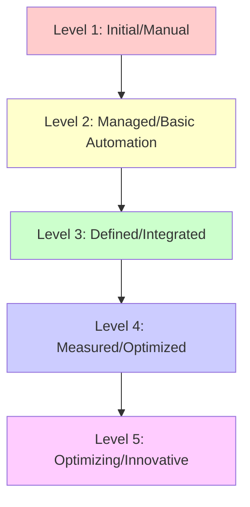

# CI/CD Maturity

## Introduction

Continuous Integration and Continuous Delivery/Deployment (CI/CD) is more than just a set of tools or practices—it represents an evolutionary journey for development teams. CI/CD maturity refers to how advanced and refined an organization's CI/CD processes are, ranging from basic manual deployments to fully automated, optimized pipelines with sophisticated feedback mechanisms.

In this guide, we'll explore the concept of CI/CD maturity, its different levels, and how organizations can progress through these stages to improve their software delivery capabilities.

## Understanding CI/CD Maturity Models

CI/CD maturity models provide frameworks to assess and evolve your automation practices. These models typically describe a progression from manual, error-prone processes to fully automated, optimized workflows.

### Why CI/CD Maturity Matters

Before diving into the maturity levels, let's understand why maturity in CI/CD processes is important:

- **Reduced Risk**: More mature processes reduce the likelihood of errors and production issues
- **Faster Delivery**: Higher maturity enables quicker, more reliable software delivery
- **Better Quality**: Mature practices incorporate extensive testing and verification
- **Team Efficiency**: Teams spend less time on manual tasks and more on value-added work
- **Business Agility**: Organizations can respond more quickly to market changes

## CI/CD Maturity Levels

Let's explore a common five-level maturity model for CI/CD practices:



### Level 1: Initial/Manual

At this foundational level, most processes are manual, with little to no automation.

**Characteristics:**
- Manual code integration
- Manual testing processes
- Manual deployment to environments
- Limited version control usage
- No standardized release process

**Example Scenario:**
A team finishes coding a feature, then manually tests it on a developer's machine. When ready, a team member manually copies files to the production server during a scheduled maintenance window.

```javascript
// Level 1 Example: Manual deployment process
// Developer manually copies these files to the server
const app = express();
app.get('/', (req, res) => {
  res.send('Hello World!');
});
app.listen(3000, () => {
  console.log('Server running on port 3000');
});
```

### Level 2: Managed/Basic Automation

At this level, teams introduce basic automation for building and testing code.

**Characteristics:**
- Automated builds triggered by code commits
- Basic automated tests
- Some deployment scripts, but still requiring manual intervention
- Consistent version control usage
- Basic documentation of processes

**Code Example:**
A simple build script that the team runs manually:

```bash
# Level 2 Example: Basic build script
#!/bin/bash

# Set variables
PROJECT_DIR="/path/to/project"
BUILD_DIR="$PROJECT_DIR/build"

# Clean build directory
echo "Cleaning build directory..."
rm -rf $BUILD_DIR
mkdir -p $BUILD_DIR

# Run tests
echo "Running tests..."
npm test

# Build if tests pass
if [ $? -eq 0 ]; then
  echo "Tests passed! Building application..."
  npm run build
  echo "Build complete. Files are in $BUILD_DIR"
else
  echo "Tests failed! Build aborted."
  exit 1
fi
```

### Level 3: Defined/Integrated

At this level, CI/CD becomes more formalized with established pipelines and integration across the development lifecycle.

**Characteristics:**
- Complete CI pipeline for build and test
- Automated deployments to test environments
- Integration with issue tracking and project management
- Comprehensive test coverage
- Standardized environments across development, testing, and production

**Example: Basic CI/CD Pipeline Configuration**

```yaml
# Level 3 Example: Basic CI/CD Pipeline (GitHub Actions)
name: CI/CD Pipeline

on:
  push:
    branches: [ main, develop ]
  pull_request:
    branches: [ main ]

jobs:
  build:
    runs-on: ubuntu-latest
    
    steps:
    - uses: actions/checkout@v3
    
    - name: Set up Node.js
      uses: actions/setup-node@v3
      with:
        node-version: '16'
        
    - name: Install dependencies
      run: npm ci
      
    - name: Run tests
      run: npm test
      
    - name: Build
      run: npm run build
      
    - name: Deploy to Test
      if: github.ref == 'refs/heads/develop'
      run: |
        echo "Deploying to test environment..."
        # Deployment script would go here
        
    - name: Deploy to Production
      if: github.ref == 'refs/heads/main'
      run: |
        echo "Deploying to production environment..."
        # Production deployment script would go here
```

### Level 4: Measured/Optimized

At this level, teams focus on measuring and optimizing their CI/CD processes based on metrics and feedback.

**Characteristics:**
- Comprehensive metrics collection and analysis
- Automated security scanning
- Feature flags for controlled releases
- Advanced testing strategies (A/B testing, canary deployments)
- Automated rollback capabilities
- Performance monitoring integrated into the pipeline

**Example: Advanced Pipeline with Metrics and Monitoring**

```yaml
# Level 4 Example: Advanced CI/CD Pipeline with Metrics
name: Optimized CI/CD Pipeline

on:
  push:
    branches: [ main, develop ]
  pull_request:
    branches: [ main ]

jobs:
  build:
    runs-on: ubuntu-latest
    
    steps:
    - uses: actions/checkout@v3
    
    - name: Set up Node.js
      uses: actions/setup-node@v3
      with:
        node-version: '16'
        
    - name: Install dependencies
      run: npm ci
      
    - name: Code Quality Analysis
      run: |
        npm run lint
        npm run sonar-scan
        
    - name: Security Scan
      run: npm run security-audit
      
    - name: Unit Tests with Coverage
      run: npm run test:coverage
      
    - name: Build
      run: npm run build
      
    - name: Performance Test
      run: npm run perf-test
      
    - name: Canary Deployment
      if: github.ref == 'refs/heads/main'
      run: |
        echo "Deploying to canary environment..."
        npm run deploy:canary
        
    - name: Monitor Canary
      if: github.ref == 'refs/heads/main'
      run: |
        echo "Monitoring canary deployment..."
        npm run monitor:canary
        
    - name: Full Production Deployment
      if: github.ref == 'refs/heads/main' && success()
      run: |
        echo "Deploying to full production..."
        npm run deploy:production
```

### Level 5: Optimizing/Innovative

The highest level of CI/CD maturity focuses on continuous improvement and innovation in the delivery process.

**Characteristics:**
- Self-healing infrastructure and pipelines
- Full automation from commit to production
- Sophisticated observability and feedback loops
- Chaos engineering practices
- Advanced deployment strategies (blue/green, shadow deployments)
- AI/ML for predictive analysis and optimization

**Example: Sophisticated Deployment Strategy**

```javascript
// Level 5 Example: Feature Flag Implementation
const featureFlags = {
  async shouldEnableFeature(featureName, userId) {
    try {
      // Check if feature is enabled globally
      const globalFeatures = await getGlobalFeatures();
      
      if (!globalFeatures[featureName]) {
        return false;
      }
      
      // Check if feature is in a percentage rollout
      const rolloutPercentage = await getRolloutPercentage(featureName);
      if (rolloutPercentage < 100) {
        // Determine if this user is in the rollout group
        const userHash = hashUserIdForFeature(userId, featureName);
        return userHash <= rolloutPercentage;
      }
      
      return true;
    } catch (error) {
      console.error('Feature flag check failed', error);
      // Fail safely - don't enable feature if check fails
      return false;
    }
  }
};

// Usage in application code
app.get('/dashboard', async (req, res) => {
  const userId = req.user.id;
  const showNewUI = await featureFlags.shouldEnableFeature('new-dashboard-ui', userId);
  
  if (showNewUI) {
    return res.render('dashboard-new', { user: req.user });
  }
  
  return res.render('dashboard-classic', { user: req.user });
});
```

## Assessing Your CI/CD Maturity

To determine your current maturity level, consider these key questions:

1. **Build and Integration**: How automated is your build process? Is it triggered automatically on code changes?
2. **Testing**: What types of automated tests do you have? How comprehensive is your test coverage?
3. **Deployment**: How automated is your deployment process? Can you deploy with a single click or command?
4. **Infrastructure**: How do you manage environments? Are they consistent and created programmatically?
5. **Feedback**: What metrics do you collect? How quickly can you detect and respond to issues?

## Advancing Your CI/CD Maturity

Here are strategic steps to advance your CI/CD maturity:

### Moving from Level 1 to Level 2

- Implement a version control system for all code
- Set up automated builds triggered by commits
- Create basic automated tests
- Document your manual processes

### Moving from Level 2 to Level 3

- Implement a complete CI pipeline
- Automate deployments to test environments
- Standardize environments
- Integrate with issue tracking

### Moving from Level 3 to Level 4

- Implement metrics collection and dashboards
- Add security scanning to your pipeline
- Implement feature flags
- Set up performance monitoring
- Implement automated rollbacks

### Moving from Level 4 to Level 5

- Implement advanced deployment strategies
- Add chaos engineering practices
- Implement self-healing capabilities
- Use AI/ML to optimize your pipeline

## Real-World Application: E-commerce Website Example

Let's walk through a practical example of how CI/CD maturity levels might apply to an e-commerce website:

### Level 1 (Initial):
Developers update code on their local machines, then manually upload files to the production server. Testing is done manually by clicking through the website before deployment.

### Level 2 (Managed):
The team uses Git for version control and has a script that builds the application. They run manual tests before deploying, but use a deployment script to push to the server.

### Level 3 (Defined):
The team has a CI pipeline that automatically builds and tests code on every push. Deployments to the test environment are automated, but production deployments still require manual approval.

### Level 4 (Measured):
The pipeline includes security scanning, performance testing, and automated UI tests. The team uses blue-green deployments to minimize downtime and has monitoring dashboards to track key metrics.

### Level 5 (Optimizing):
The team implements feature flags to control the rollout of new features. They use canary deployments to test changes with a small percentage of users before full release. The system automatically rolls back changes if anomalies are detected in monitoring data.

## Common Challenges and Solutions

As you advance in CI/CD maturity, you may encounter these challenges:

### Challenge: Resistance to Automation
**Solution**: Start small with high-value, low-risk processes. Demonstrate the time saved and reduced errors to build buy-in.

### Challenge: Environment Inconsistencies
**Solution**: Use container technologies like Docker to ensure consistency across environments.

```dockerfile
# Example Dockerfile ensuring environment consistency
FROM node:16-alpine

WORKDIR /app

# Copy dependency definitions
COPY package*.json ./

# Install dependencies
RUN npm ci --only=production

# Copy app code
COPY . .

# Build the application
RUN npm run build

# Expose port
EXPOSE 3000

# Start the application
CMD ["npm", "start"]
```

### Challenge: Complex Legacy Systems
**Solution**: Gradually introduce CI/CD practices, starting with new features or services. Consider a strangler pattern for migrating legacy systems.

### Challenge: Lack of Test Coverage
**Solution**: Establish a policy of writing tests for all new code and gradually increase coverage for existing code.

## Summary

CI/CD maturity is a journey that organizations travel through as they refine their software delivery practices. By understanding these maturity levels, teams can assess their current state and create a roadmap for improvement.

Remember that advancing in CI/CD maturity is not just about implementing tools—it requires cultural changes, skill development, and continuous learning. The benefits—faster delivery, higher quality, reduced risk, and greater efficiency—make this journey worthwhile.

## Additional Resources

To further develop your CI/CD maturity:

- Learn about infrastructure as code (Terraform, CloudFormation)
- Explore container orchestration (Kubernetes)
- Study DevOps metrics and measurement techniques
- Investigate feature flag management systems
- Research chaos engineering principles

## Exercises

1. **Assessment**: Evaluate your current CI/CD processes against the maturity model described in this guide. Identify your current level and areas for improvement.

2. **Automation Plan**: Create a plan to automate one manual process in your current workflow. Document the steps, tools required, and expected benefits.

3. **Metrics Design**: Design a dashboard of metrics to measure the effectiveness of your CI/CD pipeline. What would you track and why?

4. **Pipeline Design**: Sketch a CI/CD pipeline for a sample application, incorporating practices from at least Level 3 maturity.