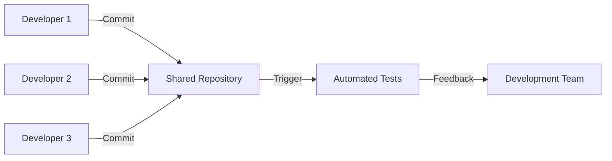
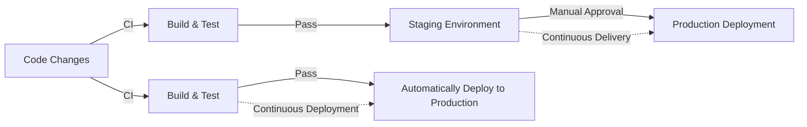
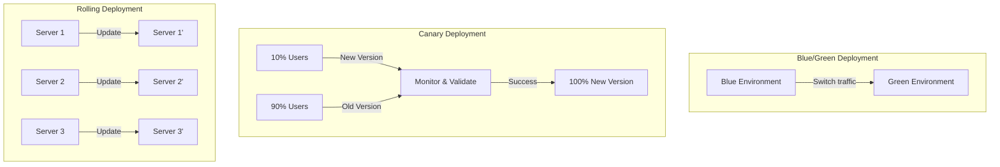

# CI/CD Terminology

## Introduction

Continuous Integration and Continuous Deployment (CI/CD) form the backbone of modern software development practices. These methodologies enable teams to deliver code changes more frequently and reliably. However, the world of CI/CD comes with its own vocabulary that can be overwhelming for beginners. This guide will walk you through the essential terminology you'll encounter when working with CI/CD pipelines, helping you build a solid foundation for your DevOps journey.

## Core CI/CD Concepts

### Continuous Integration (CI)

**Continuous Integration** is the practice of frequently merging code changes into a shared repository, followed by automated building and testing. This approach helps catch integration issues early in the development cycle.



**Real-world example**: A team working on an e-commerce platform has several developers working on different features. Each developer commits their code multiple times per day. With CI, every commit triggers automated tests to ensure the new code doesn't break existing functionality.

### Continuous Delivery (CD)

**Continuous Delivery** extends CI by automatically preparing code changes for release to production. Every build that passes the automated tests is deployed to a staging environment and is ready for production deployment.

### Continuous Deployment

**Continuous Deployment** takes CD one step further by automatically deploying every change that passes the automated tests to production without human intervention.



## Essential CI/CD Terminology

### Pipeline

A **Pipeline** is a series of automated steps that code changes go through from development to production. It typically includes stages like build, test, and deploy.

**Example of a simple pipeline configuration in YAML**:

```yaml
pipeline:
  stages:
    - build
    - test
    - deploy

  build:
    script:
      - npm install
      - npm run build
  
  test:
    script:
      - npm run test
  
  deploy:
    script:
      - aws s3 sync ./build s3://my-website-bucket/
    only:
      - main
```

### Build

A **Build** is the process of converting source code into a standalone artifact that can be run or deployed. This might involve compiling code, bundling assets, and creating executable packages.

**Example**: For a JavaScript application, a build might involve transpiling ES6+ code to browser-compatible JavaScript, minifying files, and bundling them together.

```bash
# Build command for a React application
npm run build

# Output
Creating an optimized production build...
Compiled successfully.

File sizes after gzip:
  56.32 KB  build/static/js/main.a1b2c3d4.js
  2.23 KB   build/static/css/main.e5f6g7h8.css
```

### Repository/Version Control

A **Repository** (or repo) is a storage location for your code that tracks changes over time using version control systems like Git.

**Example Git commands**:

```bash
# Initialize a new repository
git init

# Add changes
git add .

# Commit changes
git commit -m "Add user authentication feature"

# Push to remote repository
git push origin main
```

### Artifact

An **Artifact** is a deployable package or unit produced by a build. It could be a JAR file, Docker image, or a bundle of static files.

### Environment

An **Environment** is a system where your application runs. Common environments include:

- **Development**: Where active code development happens
- **Testing/QA**: Where quality assurance teams test the application
- **Staging**: A production-like environment for final testing
- **Production**: The live environment used by end-users

### Trigger

A **Trigger** is an event that initiates a pipeline run. Common triggers include:

- Code commits
- Pull/Merge requests
- Scheduled intervals (e.g., nightly builds)
- Manual initiation

### Runner/Agent

A **Runner** or **Agent** is a service that executes the jobs defined in your CI/CD pipeline. It can be a shared server, a dedicated machine, or a container.

### Job

A **Job** is a specific task in a pipeline, such as running tests or deploying to an environment.

**Example of jobs in a GitLab CI configuration**:

```yaml
build-job:
  stage: build
  script:
    - echo "Building the application..."
    - npm install
    - npm run build
  artifacts:
    paths:
      - build/

test-job:
  stage: test
  script:
    - echo "Running tests..."
    - npm run test
```

### Workflow

A **Workflow** defines the order and conditions under which jobs run in your pipeline. It can include branching paths and conditional execution.

**Example GitHub Actions workflow**:

```yaml
name: CI/CD Workflow

on:
  push:
    branches: [ main ]
  pull_request:
    branches: [ main ]

jobs:
  build:
    runs-on: ubuntu-latest
    steps:
      - uses: actions/checkout@v2
      - name: Set up Node.js
        uses: actions/setup-node@v2
        with:
          node-version: '14'
      - name: Install dependencies
        run: npm install
      - name: Build
        run: npm run build
  
  test:
    needs: build
    runs-on: ubuntu-latest
    steps:
      - uses: actions/checkout@v2
      - name: Run tests
        run: npm test
```

### Deployment Strategy

A **Deployment Strategy** is a method used to release new versions of an application. Common strategies include:

- **Blue/Green Deployment**: Maintaining two identical production environments, with only one active at a time
- **Canary Deployment**: Gradually rolling out changes to a small subset of users
- **Rolling Deployment**: Updating instances one at a time



### Feature Flags/Toggles

**Feature Flags** (or toggles) allow you to enable or disable features in your application without deploying new code. They're useful for testing features with a subset of users or quickly disabling problematic features.

**Example code for a feature flag**:

```javascript
// Feature flag implementation
const FEATURES = {
  NEW_PAYMENT_SYSTEM: process.env.ENABLE_NEW_PAYMENT === 'true',
  BETA_USER_DASHBOARD: process.env.ENABLE_BETA_DASHBOARD === 'true'
};

// Usage in code
if (FEATURES.NEW_PAYMENT_SYSTEM) {
  // Use new payment processing logic
} else {
  // Use old payment processing logic
}
```

### Infrastructure as Code (IaC)

**Infrastructure as Code** is the practice of managing and provisioning infrastructure through code rather than manual processes. Popular IaC tools include Terraform, AWS CloudFormation, and Ansible.

**Example Terraform code to provision an AWS S3 bucket**:

```hcl
provider "aws" {
  region = "us-west-2"
}

resource "aws_s3_bucket" "static_website" {
  bucket = "my-static-website-bucket"
  acl    = "public-read"

  website {
    index_document = "index.html"
    error_document = "error.html"
  }

  tags = {
    Environment = "Production"
    Purpose     = "StaticWebsite"
  }
}
```

## CI/CD Tools and Platforms

Here's a brief overview of popular CI/CD tools:

1. **Jenkins**: An open-source automation server
2. **GitHub Actions**: CI/CD solution integrated with GitHub
3. **GitLab CI/CD**: Built-in CI/CD for GitLab repositories
4. **CircleCI**: Cloud-based CI/CD service
5. **Travis CI**: CI service used to build and test software projects
6. **Azure DevOps**: Microsoft's solution for end-to-end DevOps
7. **AWS CodePipeline**: Continuous delivery service from AWS

## CI/CD Best Practices

1. **Keep pipelines fast**: Aim for feedback within minutes
2. **Make small, frequent commits**: Easier to test and debug
3. **Automate everything**: Minimize manual intervention
4. **Test early and often**: Include various testing types (unit, integration, etc.)
5. **Secure your pipeline**: Scan for vulnerabilities and secrets
6. **Monitor and measure**: Track pipeline performance metrics
7. **Use environment-specific configurations**: Separate configs for dev, staging, and production

## Summary

Understanding CI/CD terminology is essential for modern software development. These concepts and practices enable teams to deliver high-quality code faster and more reliably. By implementing CI/CD pipelines, you can automate repetitive tasks, catch bugs early, and maintain a steady release cadence.

As you continue your journey into CI/CD, remember that the goal is to create a smooth, automated process that allows you to focus on writing great code rather than worrying about how to deliver it.

## Additional Resources

- [The CI/CD Pipeline: What It Is and How It Works](https://www.atlassian.com/continuous-delivery/principles/continuous-integration-vs-delivery-vs-deployment)
- [Martin Fowler's article on Continuous Integration](https://martinfowler.com/articles/continuousIntegration.html)
- [The DevOps Handbook](https://itrevolution.com/the-devops-handbook/)

## Exercises

1. Set up a basic CI pipeline for a simple web application using GitHub Actions or GitLab CI.
2. Implement feature flags in a small project and practice enabling/disabling features.
3. Create a deployment pipeline that includes automated testing and deploys to a staging environment.
4. Compare different deployment strategies for a specific application scenario.
5. Design a branching strategy that works well with your CI/CD pipeline.