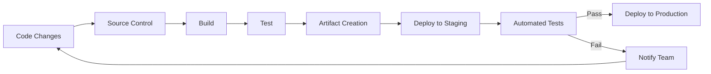

# CICD Workflow

## Introduction

A CI/CD workflow is the backbone of modern software development practices, enabling teams to deliver code changes more frequently and reliably. CI/CD stands for Continuous Integration and Continuous Delivery/Deployment, representing a series of automated steps that help developers integrate code changes, run tests, and deploy applications seamlessly.

In this guide, we'll explore what makes up a CI/CD workflow, how it functions, and how you can implement one for your projects. Whether you're working solo or as part of a team, understanding CI/CD workflows will dramatically improve your development process.

## What is a CI/CD Workflow?

A CI/CD workflow consists of a series of automated steps that code changes go through from the moment developers commit their changes until those changes are deployed to production environments.

### The Key Components

1. **Continuous Integration (CI)**: Automatically integrating code changes from multiple contributors into a shared repository
2. **Continuous Delivery (CD)**: Automatically preparing code for release to production
3. **Continuous Deployment (CD)**: Automatically deploying code to production environments

Let's visualize a typical CI/CD workflow:



## Continuous Integration

Continuous Integration is the practice of frequently merging code changes into a central repository, followed by automated builds and tests. This helps detect integration issues early and ensures that the codebase remains stable.

### Key CI Steps

1. **Code Commit**: Developers push code to a shared repository
2. **Automated Build**: The system compiles the code and checks for errors
3. **Automated Tests**: Unit tests, integration tests, and other automated tests run
4. **Code Quality Checks**: Static code analysis tools scan for code quality issues
5. **Reporting**: Results are reported back to the development team

### Example CI Configuration

Here's a basic example of a GitHub Actions workflow for continuous integration:

```yaml
name: CI Workflow

on:
  push:
    branches: [ main, develop ]
  pull_request:
    branches: [ main, develop ]

jobs:
  build-and-test:
    runs-on: ubuntu-latest
    
    steps:
    - uses: actions/checkout@v3
    
    - name: Set up Node.js
      uses: actions/setup-node@v3
      with:
        node-version: '16'
    
    - name: Install dependencies
      run: npm install
    
    - name: Run linting
      run: npm run lint
    
    - name: Run tests
      run: npm test
    
    - name: Build
      run: npm run build
```

## Continuous Delivery and Deployment

After successful CI, the next stages are Continuous Delivery and Continuous Deployment.

- **Continuous Delivery**: Automating the process of preparing code for release, ensuring it can be deployed at any time.
- **Continuous Deployment**: Taking Continuous Delivery a step further by automatically deploying every change that passes all stages of the production pipeline.

### CD Pipeline Stages

1. **Artifact Creation**: Package the application into a deployable format
2. **Environment Configuration**: Prepare the target environment
3. **Deployment to Staging**: Deploy to a staging environment that mimics production
4. **Acceptance Testing**: Run automated tests in the staging environment
5. **Deployment to Production**: Deploy to the production environment
6. **Post-Deployment Validation**: Ensure the deployment was successful

### Example CD Configuration

Here's an example of a GitHub Actions workflow for continuous deployment:

```yaml
name: CD Workflow

on:
  workflow_run:
    workflows: ["CI Workflow"]
    types:
      - completed

jobs:
  deploy-staging:
    if: ${{ github.event.workflow_run.conclusion == 'success' }}
    runs-on: ubuntu-latest
    
    steps:
    - uses: actions/checkout@v3
    
    - name: Set up Node.js
      uses: actions/setup-node@v3
      with:
        node-version: '16'
    
    - name: Install dependencies
      run: npm install
    
    - name: Build
      run: npm run build
    
    - name: Deploy to Staging
      run: |
        # Deploy command to your staging environment
        echo "Deploying to staging..."
    
    - name: Run Acceptance Tests
      run: npm run test:e2e
  
  deploy-production:
    needs: deploy-staging
    runs-on: ubuntu-latest
    
    steps:
    - uses: actions/checkout@v3
    
    - name: Deploy to Production
      run: |
        # Deploy command to your production environment
        echo "Deploying to production..."
    
    - name: Post-Deployment Check
      run: |
        # Verify the deployment
        echo "Verifying deployment..."
```

## Building a CI/CD Workflow for Your Project

Let's walk through setting up a basic CI/CD workflow for a JavaScript web application.

### Step 1: Set Up Version Control

First, ensure your code is in a version control system like Git, with a hosting service like GitHub, GitLab, or Bitbucket.

```bash
# Initialize a new Git repository
git init

# Add your code
git add .

# Commit your code
git commit -m "Initial commit"

# Add a remote repository
git remote add origin https://github.com/yourusername/your-project.git

# Push your code
git push -u origin main
```

### Step 2: Define Branching Strategy

Implement a branching strategy such as Git Flow or GitHub Flow:

- **Main/Master**: Production-ready code
- **Develop**: Integration branch for features
- **Feature branches**: For developing new features
- **Release branches**: For preparing releases
- **Hotfix branches**: For fixing critical bugs in production

### Step 3: Set Up CI/CD Configuration

Create a configuration file for your CI/CD platform. For GitHub Actions, create a file at `.github/workflows/cicd.yml`:

```yaml
name: CI/CD Pipeline

on:
  push:
    branches: [ main, develop ]
  pull_request:
    branches: [ main, develop ]

jobs:
  # CI Phase
  build-and-test:
    runs-on: ubuntu-latest
    
    steps:
    - uses: actions/checkout@v3
    
    - name: Set up Node.js
      uses: actions/setup-node@v3
      with:
        node-version: '16'
    
    - name: Install dependencies
      run: npm install
    
    - name: Run linting
      run: npm run lint
    
    - name: Run unit tests
      run: npm test
    
    - name: Build
      run: npm run build
    
    - name: Archive build
      uses: actions/upload-artifact@v3
      with:
        name: build
        path: build/

  # CD Phase - Staging
  deploy-staging:
    needs: build-and-test
    if: github.ref == 'refs/heads/develop'
    runs-on: ubuntu-latest
    
    steps:
    - uses: actions/checkout@v3
    
    - name: Download build
      uses: actions/download-artifact@v3
      with:
        name: build
        path: build/
    
    - name: Deploy to Staging
      run: |
        # Commands to deploy to staging
        echo "Deploying to staging..."
    
    - name: Run E2E Tests
      run: |
        # Run end-to-end tests on staging
        echo "Running E2E tests..."

  # CD Phase - Production
  deploy-production:
    needs: build-and-test
    if: github.ref == 'refs/heads/main'
    runs-on: ubuntu-latest
    
    steps:
    - uses: actions/checkout@v3
    
    - name: Download build
      uses: actions/download-artifact@v3
      with:
        name: build
        path: build/
    
    - name: Deploy to Production
      run: |
        # Commands to deploy to production
        echo "Deploying to production..."
```

### Step 4: Implement Automated Testing

Set up different types of tests to run in your CI/CD pipeline:

```javascript
// Example Jest unit test
// src/__tests__/sum.test.js
const sum = require('../utils/sum');

test('adds 1 + 2 to equal 3', () => {
  expect(sum(1, 2)).toBe(3);
});
```

```javascript
// Example utils function
// src/utils/sum.js
function sum(a, b) {
  return a + b;
}

module.exports = sum;
```

### Step 5: Monitor and Improve

After setting up your CI/CD workflow, continuously monitor its performance and look for opportunities to improve:

- Analyze build times and optimize slow steps
- Review test coverage and add more tests where needed
- Add additional quality checks like security scanning
- Implement feature flags for controlled feature releases

## Real-World CI/CD Workflow Example

Let's examine a real-world example of how a team might use CI/CD to deploy a new feature:

1. **Feature Development**:
   - A developer creates a new feature branch from `develop`
   - They write code and commit regularly

2. **Pull Request**:
   - When the feature is complete, they create a pull request to merge into `develop`
   - This triggers CI processes:
     - Code compilation
     - Unit tests
     - Code quality checks
     - Security scans

3. **Code Review and Merge**:
   - Other team members review the code
   - When approved, the code is merged into `develop`
   - This triggers the CD process for the staging environment

4. **Staging Deployment**:
   - The application is automatically deployed to staging
   - Automated acceptance tests run

5. **Production Release**:
   - When ready for production, a release branch is created
   - Final testing is performed
   - The release branch is merged to `main`
   - The CD pipeline automatically deploys to production

6. **Monitoring**:
   - The team monitors application performance and error rates
   - If issues are detected, they can quickly roll back or fix

## Best Practices for CI/CD Workflows

To get the most out of your CI/CD workflow, follow these best practices:

1. **Keep build times short**: Aim for under 10 minutes to maintain developer productivity
2. **Prioritize test automation**: Invest in building a comprehensive test suite
3. **Use infrastructure as code**: Define your infrastructure using code (e.g., Terraform, CloudFormation)
4. **Implement environment parity**: Make staging as similar to production as possible
5. **Practice trunk-based development**: Keep feature branches short-lived
6. **Use feature flags**: Decouple deployment from feature release
7. **Implement observability**: Add logging, monitoring, and alerting
8. **Security scanning**: Include security checks in your pipeline
9. **Artifact versioning**: Properly version your build artifacts
10. **Document your pipeline**: Ensure team members understand the workflow

## Common CI/CD Tools

Several tools can help you implement CI/CD workflows:

- **CI/CD Platforms**: GitHub Actions, GitLab CI/CD, CircleCI, Jenkins, Travis CI
- **Build Tools**: Maven, Gradle, npm, webpack
- **Testing Frameworks**: Jest, Mocha, JUnit, Selenium
- **Containerization**: Docker, Kubernetes
- **Infrastructure as Code**: Terraform, AWS CloudFormation, Ansible
- **Monitoring**: Prometheus, Grafana, New Relic, Datadog

## Troubleshooting CI/CD Workflows

When your CI/CD pipeline fails, follow these troubleshooting steps:

1. **Identify the failure stage**: Determine exactly where the pipeline is failing
2. **Check logs**: Read the detailed logs for the failed step
3. **Reproduce locally**: Try to reproduce the issue in your local environment
4. **Check recent changes**: Review recent code or configuration changes
5. **Review environment differences**: Look for discrepancies between environments
6. **Incremental fixes**: Make small changes and test them individually

## Summary

CI/CD workflows automate the software development lifecycle, enabling teams to deliver high-quality software faster and more reliably. By implementing continuous integration, continuous delivery, and continuous deployment, you can:

- Reduce manual errors
- Get faster feedback on code changes
- Deploy more frequently
- Increase team productivity
- Improve software quality

Remember that setting up a CI/CD workflow is an iterative process. Start simple and gradually add more automation as your project grows.

## Exercises

1. **Set up a basic CI pipeline** using GitHub Actions for a simple web application that runs linting and unit tests.
2. **Extend your pipeline** to include continuous delivery to a staging environment.
3. **Implement a feature flag system** in your application and use it to control the release of a new feature.
4. **Create a rollback strategy** for your CI/CD pipeline to quickly revert to a previous version if issues are detected.
5. **Analyze your current workflow** and identify at least three areas for improvement.

## Additional Resources

- **Books**:
  - "Continuous Delivery" by Jez Humble and David Farley
  - "DevOps Handbook" by Gene Kim, Jez Humble, Patrick Debois, and John Willis

- **Online Courses**:
  - CI/CD courses on Udemy, Coursera, and Pluralsight

- **Documentation**:
  - GitHub Actions documentation
  - GitLab CI/CD documentation
  - Jenkins documentation

- **Communities**:
  - DevOps Stack Exchange
  - GitHub Community Forum
  - GitLab Community Forum

By implementing and refining a CI/CD workflow for your projects, you'll be adopting one of the most important practices in modern software development, paving the way for more efficient, reliable, and enjoyable development experiences.