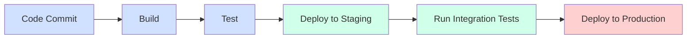
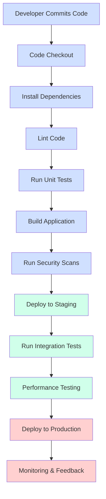

# CI/CD Pipelines

## Introduction

Have you ever wondered how companies like Netflix or Amazon deploy code changes multiple times a day without breaking their applications? The answer lies in CI/CD pipelines - one of the most powerful tools in modern software development.

CI/CD (Continuous Integration/Continuous Deployment) pipelines automate the process of taking code from version control through building, testing, and deployment. They're like assembly lines for your code, ensuring quality and consistency at every step.

In this guide, we'll explore what CI/CD pipelines are, why they're crucial for effective software development, and how to build your first pipeline.

## What is a CI/CD Pipeline?

A CI/CD pipeline is an automated workflow that helps developers deliver code changes more frequently and reliably. It's a series of steps that code changes go through from initial commit to production deployment.



A typical CI/CD pipeline consists of these stages:

1. **Source Stage**: Code is committed to a version control system (Git, SVN, etc.)
2. **Build Stage**: Code is compiled, dependencies are resolved
3. **Test Stage**: Automated tests verify code quality and functionality
4. **Deploy Stage**: Code is deployed to production or staging environments

## CI vs. CD: Understanding the Difference

While often mentioned together, CI and CD are distinct concepts:

- **Continuous Integration (CI)** focuses on automatically integrating code changes from multiple contributors into a shared repository. It involves automatic building and testing to catch integration issues early.

- **Continuous Delivery (CD)** extends CI by automatically deploying all code changes to a testing or staging environment after the build stage.

- **Continuous Deployment** goes one step further than continuous delivery by automatically deploying to production when all tests pass.

## Benefits of CI/CD Pipelines

Implementing CI/CD pipelines in your projects offers numerous advantages:

- **Faster Release Cycles**: Automate manual processes to ship features quickly
- **Higher Code Quality**: Catch bugs early through automated testing
- **Reduced Risk**: Small, incremental changes reduce deployment risks
- **Increased Developer Productivity**: Less time spent on manual processes
- **Better Collaboration**: Teams work together more effectively with automated feedback
- **Consistency**: Every change goes through the same standardized process

## Creating Your First CI/CD Pipeline

Let's build a simple CI/CD pipeline using GitHub Actions, a popular CI/CD tool that's free for public repositories.

### Step 1: Create a GitHub Workflow File

In your repository, create a `.github/workflows` directory and add a YAML file (e.g., `ci-cd.yml`):

```yaml
name: CI/CD Pipeline

on:
  push:
    branches: [ main ]
  pull_request:
    branches: [ main ]

jobs:
  build-and-test:
    runs-on: ubuntu-latest
    
    steps:
    - uses: actions/checkout@v3
    
    - name: Set up Node.js
      uses: actions/setup-node@v3
      with:
        node-version: '16'
        
    - name: Install dependencies
      run: npm ci
      
    - name: Run linter
      run: npm run lint
      
    - name: Run tests
      run: npm test
      
    - name: Build project
      run: npm run build
```

This simple workflow will:
1. Trigger whenever code is pushed to the main branch or a pull request is created
2. Set up a Node.js environment
3. Install dependencies
4. Run linting checks
5. Execute tests
6. Build the project

### Step 2: Extend the Pipeline for Deployment

To add deployment to your pipeline, extend the workflow:

```yaml
name: CI/CD Pipeline

on:
  push:
    branches: [ main ]
  pull_request:
    branches: [ main ]

jobs:
  build-and-test:
    runs-on: ubuntu-latest
    
    steps:
    - uses: actions/checkout@v3
    
    - name: Set up Node.js
      uses: actions/setup-node@v3
      with:
        node-version: '16'
        
    - name: Install dependencies
      run: npm ci
      
    - name: Run linter
      run: npm run lint
      
    - name: Run tests
      run: npm test
      
    - name: Build project
      run: npm run build
      
    - name: Save build artifacts
      uses: actions/upload-artifact@v3
      with:
        name: build-artifacts
        path: ./build

  deploy:
    needs: build-and-test
    if: github.event_name == 'push' && github.ref == 'refs/heads/main'
    runs-on: ubuntu-latest
    
    steps:
    - name: Download build artifacts
      uses: actions/download-artifact@v3
      with:
        name: build-artifacts
        path: ./build
        
    - name: Deploy to production
      run: |
        echo "Deploying to production server..."
        # Add your deployment commands here
        # For example: aws s3 sync ./build s3://your-bucket-name/
```

This extended pipeline adds:
1. Artifact storage to pass the built files between jobs
2. A deployment job that only runs on pushes to the main branch
3. A placeholder for actual deployment commands

## Popular CI/CD Tools

Many tools are available to help you build CI/CD pipelines:

- **GitHub Actions**: Integrated with GitHub repositories, easy to set up
- **Jenkins**: Self-hosted, highly customizable with many plugins
- **GitLab CI/CD**: Built into GitLab with robust features
- **CircleCI**: Cloud-based CI/CD service with a focus on speed
- **Travis CI**: Simple setup, good for open-source projects
- **Azure DevOps**: Microsoft's integrated DevOps service
- **AWS CodePipeline**: AWS-native CI/CD service

## Real-world CI/CD Pipeline Example

Let's examine a more complex CI/CD pipeline for a web application:



This pipeline includes:

1. **Code Quality Checks**: Linting and static analysis
2. **Security Scanning**: Checking for vulnerabilities before deployment
3. **Multiple Environment Deployments**: Testing in staging before production
4. **Performance Testing**: Ensuring the application meets performance requirements
5. **Post-Deployment Monitoring**: Watching for issues after deployment

## Best Practices for CI/CD Pipelines

1. **Keep Pipelines Fast**: Aim for quick feedback cycles
2. **Build Once, Deploy Multiple Times**: Create artifacts once and promote them through environments
3. **Fail Fast**: Run quick tests first to catch obvious issues early
4. **Test in Production-like Environments**: Ensure staging matches production
5. **Automate Everything**: Manual steps introduce errors
6. **Use Feature Flags**: Decouple deployment from feature release
7. **Include Security Checks**: Scan for vulnerabilities as part of the pipeline
8. **Monitor Pipeline Performance**: Track pipeline metrics and optimize
9. **Store Pipeline Configurations as Code**: Version control your pipeline definitions
10. **Implement Smoke Tests**: Quick tests after deployment to verify basic functionality

## Implementing a CI/CD Pipeline for a Node.js Project

Let's build a practical pipeline for a typical Node.js application using GitHub Actions:

```yaml
name: Node.js CI/CD Pipeline

on:
  push:
    branches: [ main, develop ]
  pull_request:
    branches: [ main, develop ]

jobs:
  quality:
    runs-on: ubuntu-latest
    
    steps:
    - uses: actions/checkout@v3
    
    - name: Setup Node.js
      uses: actions/setup-node@v3
      with:
        node-version: '16'
        cache: 'npm'
        
    - name: Install dependencies
      run: npm ci
      
    - name: Check code style
      run: npm run lint
      
    - name: Run unit tests
      run: npm test -- --coverage
      
    - name: Upload coverage report
      uses: codecov/codecov-action@v3
      
  build:
    needs: quality
    runs-on: ubuntu-latest
    
    steps:
    - uses: actions/checkout@v3
    
    - name: Setup Node.js
      uses: actions/setup-node@v3
      with:
        node-version: '16'
        cache: 'npm'
        
    - name: Install dependencies
      run: npm ci
      
    - name: Build application
      run: npm run build
      
    - name: Run security audit
      run: npm audit --production
      
    - name: Save build artifacts
      uses: actions/upload-artifact@v3
      with:
        name: build-artifacts
        path: ./build
        
  deploy-staging:
    needs: build
    if: github.ref == 'refs/heads/develop'
    runs-on: ubuntu-latest
    
    steps:
    - name: Download build artifacts
      uses: actions/download-artifact@v3
      with:
        name: build-artifacts
        path: ./build
        
    - name: Deploy to staging
      run: |
        echo "Deploying to staging environment..."
        # Add staging deployment commands here
        
    - name: Run integration tests
      run: |
        echo "Running integration tests against staging..."
        # Add integration test commands here
        
  deploy-production:
    needs: [build, deploy-staging]
    if: github.ref == 'refs/heads/main'
    runs-on: ubuntu-latest
    environment: production
    
    steps:
    - name: Download build artifacts
      uses: actions/download-artifact@v3
      with:
        name: build-artifacts
        path: ./build
        
    - name: Deploy to production
      run: |
        echo "Deploying to production environment..."
        # Add production deployment commands here
        
    - name: Verify deployment
      run: |
        echo "Running smoke tests on production..."
        # Add verification commands here
```

This pipeline demonstrates:

1. **Branch-based Workflows**: Different actions for develop and main branches
2. **Job Dependencies**: Jobs that depend on earlier stages
3. **Environment Protection**: Production deployment requires approval
4. **Test Coverage Reporting**: Uploading coverage reports to Codecov
5. **Security Scanning**: Running npm audit as part of the build process

## Troubleshooting Common CI/CD Issues

Even the best pipelines can encounter problems. Here are some common issues and solutions:

1. **Pipeline Takes Too Long**
   - Split into parallel jobs where possible
   - Cache dependencies
   - Optimize test suites

2. **Flaky Tests**
   - Identify and fix tests that sometimes pass, sometimes fail
   - Implement retry mechanisms for tests affected by timing
   - Isolate test environments

3. **Environment Configuration Issues**
   - Use configuration as code
   - Implement environment parity
   - Use secrets management for sensitive values

4. **Dependency Problems**
   - Lock dependency versions
   - Use private package repositories
   - Implement dependency scanning

5. **Deployment Failures**
   - Implement rollback mechanisms
   - Use blue-green deployments
   - Add more pre-deployment validation

## Summary

CI/CD pipelines are powerful tools that transform how teams deliver software. By automating the build, test, and deployment processes, they enable faster, more reliable software delivery with fewer errors and less manual work.

In this guide, we've covered:
- What CI/CD pipelines are and why they're important
- The differences between CI, continuous delivery, and continuous deployment
- How to create your first pipeline using GitHub Actions
- Real-world examples and best practices
- Troubleshooting common CI/CD issues

As you start implementing CI/CD in your projects, remember that it's a journey. Begin with simple pipelines focusing on automated testing, then gradually add more sophisticated stages as your confidence grows.

## Exercises

1. **Set Up a Basic Pipeline**: Create a GitHub Actions workflow for a simple application that runs tests on every push.

2. **Add Environment Deployments**: Extend your pipeline to deploy to a staging environment when code is pushed to a develop branch.

3. **Implement Security Scanning**: Add a security scanning step to your pipeline using a tool like OWASP Dependency-Check.

4. **Create a Complete Pipeline**: Build a full CI/CD pipeline that takes code from commit to production with appropriate testing at each stage.

5. **Pipeline as Code Challenge**: Convert an existing manual deployment process to a fully automated pipeline defined in code.

## Additional Resources

- [GitHub Actions Documentation](https://docs.github.com/en/actions)
- [Jenkins Handbook](https://www.jenkins.io/doc/)
- [GitLab CI/CD Documentation](https://docs.gitlab.com/ee/ci/)
- [The DevOps Handbook](https://itrevolution.com/book/the-devops-handbook/) by Gene Kim, Jez Humble, Patrick Debois, and John Willis
- [Continuous Delivery](https://continuousdelivery.com/) by Jez Humble and David Farley
- [CI/CD for Beginners](https://www.atlassian.com/continuous-delivery/principles/continuous-integration-vs-delivery-vs-deployment) by Atlassian