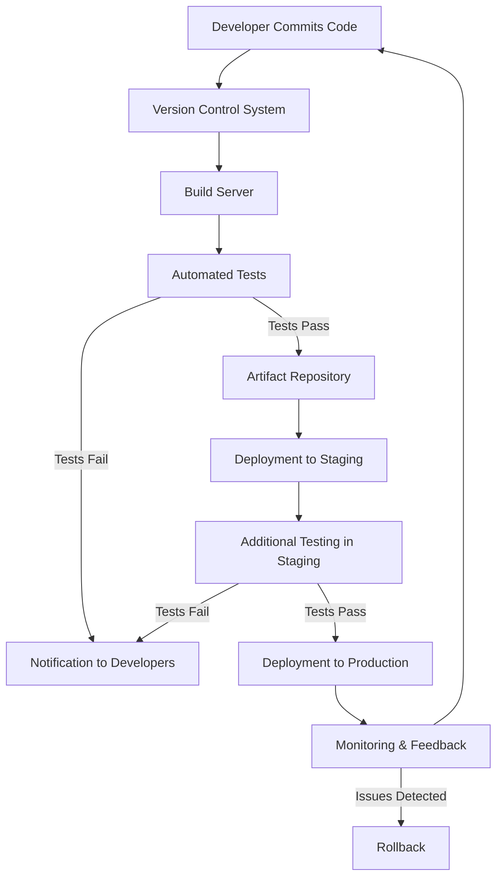

# CI/CD Components

## Introduction

Continuous Integration and Continuous Deployment (CI/CD) has revolutionized how software is built, tested, and released. Rather than treating development, testing, and deployment as separate stages with manual handoffs, CI/CD creates an automated pipeline that takes code from commit to production with minimal human intervention.

But what exactly makes up a CI/CD pipeline? In this article, we'll break down the essential components that work together to enable smooth, automated software delivery. Whether you're setting up your first pipeline or looking to improve an existing one, understanding these components is crucial for effective implementation.

## Core Components of a CI/CD Pipeline

A typical CI/CD pipeline consists of several interconnected components, each serving a specific function in the software delivery process.

### 1. Version Control System (VCS)

At the foundation of every CI/CD pipeline is a version control system.

**Key Functions:**
- Tracks code changes over time
- Enables collaboration between developers
- Provides a single source of truth for the codebase
- Triggers pipeline events when code is pushed

**Popular Tools:**
- Git (with platforms like GitHub, GitLab, Bitbucket)
- Subversion (SVN)
- Mercurial

**Example Git Workflow:**

```bash
# Create a new feature branch
git checkout -b feature/user-authentication

# Make changes and commit them
git add .
git commit -m "Add user authentication functionality"

# Push changes to remote repository
git push origin feature/user-authentication

# Create a pull request (via GitHub/GitLab/Bitbucket UI)
```

When this code is pushed, it triggers the CI/CD pipeline to start, beginning with the build phase.

### 2. Build Server/Continuous Integration Server

The build server is responsible for compiling code, running initial tests, and creating deployable artifacts.

**Key Functions:**
- Monitors the VCS for changes
- Compiles and builds the application
- Runs automated tests
- Creates deployable artifacts
- Reports build status to the team

**Popular Tools:**
- Jenkins
- GitLab CI
- GitHub Actions
- CircleCI
- Travis CI
- Azure DevOps

**Example GitHub Actions Workflow:**

```yaml
name: Build and Test

on:
  push:
    branches: [ main, develop ]
  pull_request:
    branches: [ main, develop ]

jobs:
  build:
    runs-on: ubuntu-latest
    
    steps:
    - uses: actions/checkout@v3
    
    - name: Set up Node.js
      uses: actions/setup-node@v3
      with:
        node-version: '16'
        
    - name: Install dependencies
      run: npm ci
      
    - name: Build application
      run: npm run build
      
    - name: Run tests
      run: npm test
```

### 3. Test Automation Framework

Testing is a critical component of CI/CD, ensuring code quality at every stage of development.

**Key Functions:**
- Executes unit tests, integration tests, and other automated tests
- Validates code quality and functionality
- Identifies regressions
- Provides feedback to developers

**Test Types:**
- **Unit Tests**: Test individual functions or methods
- **Integration Tests**: Test interactions between components
- **End-to-End Tests**: Test complete user workflows
- **Security Tests**: Identify vulnerabilities
- **Performance Tests**: Assess application speed and resource usage

**Example Jest Test:**

```javascript
// userAuth.test.js
const { authenticate } = require('./userAuth');

describe('User Authentication', () => {
  test('authenticates valid user credentials', () => {
    const result = authenticate('validUser', 'correctPassword');
    expect(result.success).toBe(true);
    expect(result.user).toBeDefined();
  });

  test('rejects invalid credentials', () => {
    const result = authenticate('validUser', 'wrongPassword');
    expect(result.success).toBe(false);
    expect(result.error).toBe('Invalid credentials');
  });
});
```

### 4. Artifact Repository

Once built and tested, applications are stored in artifact repositories before deployment.

**Key Functions:**
- Stores build outputs (binaries, containers, packages)
- Versions artifacts
- Provides a central location for deployment tools to retrieve artifacts
- Controls access to production-ready code

**Popular Tools:**
- Nexus Repository
- JFrog Artifactory
- Docker Hub (for container images)
- Amazon S3
- npm Registry (for JavaScript packages)

**Example Uploading to Artifact Repository:**

```yaml
# In a CI configuration file
steps:
  - name: Build application
    run: npm run build
    
  - name: Package application
    run: tar -czf app.tar.gz dist/
    
  - name: Upload to artifact repository
    run: |
      curl -u $USERNAME:$PASSWORD \
        -X POST \
        -F "file=@app.tar.gz" \
        https://artifacts.example.com/repository/releases/app/1.0.0/
```

### 5. Configuration Management

Configuration management tools help maintain consistent environments and configurations.

**Key Functions:**
- Defines infrastructure as code
- Manages environment-specific configurations
- Ensures consistency across environments
- Automates environment setup

**Popular Tools:**
- Ansible
- Chef
- Puppet
- Terraform (for infrastructure)

**Example Ansible Playbook:**

```yaml
---
- name: Configure web server
  hosts: webservers
  become: yes
  
  tasks:
    - name: Install Nginx
      apt:
        name: nginx
        state: present
        
    - name: Copy application files
      copy:
        src: /path/to/app
        dest: /var/www/html/
        
    - name: Configure Nginx
      template:
        src: nginx.conf.j2
        dest: /etc/nginx/sites-available/default
      notify: Restart Nginx
        
  handlers:
    - name: Restart Nginx
      service:
        name: nginx
        state: restarted
```

### 6. Deployment Tools

Deployment tools handle the actual release of applications to various environments.

**Key Functions:**
- Deploys applications to target environments
- Manages deployment strategies (blue-green, canary, etc.)
- Handles rollbacks if issues are detected
- Coordinates with other systems during deployment

**Popular Tools:**
- Kubernetes
- AWS CodeDeploy
- Spinnaker
- Octopus Deploy
- ArgoCD

**Example Kubernetes Deployment:**

```yaml
apiVersion: apps/v1
kind: Deployment
metadata:
  name: my-app
spec:
  replicas: 3
  selector:
    matchLabels:
      app: my-app
  template:
    metadata:
      labels:
        app: my-app
    spec:
      containers:
      - name: my-app
        image: my-registry/my-app:1.0.0
        ports:
        - containerPort: 8080
        readinessProbe:
          httpGet:
            path: /health
            port: 8080
          initialDelaySeconds: 5
          periodSeconds: 10
```

### 7. Monitoring and Feedback Systems

Monitoring tools provide visibility into the pipeline and the deployed application.

**Key Functions:**
- Monitors application performance and health
- Tracks deployment success/failure
- Collects logs and metrics
- Alerts teams about issues
- Provides feedback to improve the CI/CD process

**Popular Tools:**
- Prometheus and Grafana
- ELK Stack (Elasticsearch, Logstash, Kibana)
- Datadog
- New Relic
- CloudWatch (AWS)

**Example Prometheus Configuration:**

```yaml
global:
  scrape_interval: 15s

scrape_configs:
  - job_name: 'my-app'
    metrics_path: '/metrics'
    static_configs:
      - targets: ['app-server:8080']
```

## How These Components Work Together

A complete CI/CD pipeline connects all of these components to create an automated workflow:



## Setting Up a Simple CI/CD Pipeline

Let's walk through a practical example of setting up a basic CI/CD pipeline for a Node.js application using GitHub Actions and Heroku.

### 1. Create a GitHub Actions Workflow File

Create a file at `.github/workflows/main.yml` in your repository:

```yaml
name: CI/CD Pipeline

on:
  push:
    branches: [ main ]
  pull_request:
    branches: [ main ]

jobs:
  build-and-test:
    runs-on: ubuntu-latest
    
    steps:
    - uses: actions/checkout@v3
    
    - name: Set up Node.js
      uses: actions/setup-node@v3
      with:
        node-version: '16'
        
    - name: Install dependencies
      run: npm ci
      
    - name: Run linting
      run: npm run lint
      
    - name: Run tests
      run: npm test
      
    - name: Build application
      run: npm run build
    
  deploy:
    needs: build-and-test
    if: github.ref == 'refs/heads/main' && github.event_name == 'push'
    runs-on: ubuntu-latest
    
    steps:
    - uses: actions/checkout@v3
    
    - name: Deploy to Heroku
      uses: akhileshns/heroku-deploy@v3.12.14
      with:
        heroku_api_key: ${{ secrets.HEROKU_API_KEY }}
        heroku_app_name: "your-app-name"
        heroku_email: ${{ secrets.HEROKU_EMAIL }}
```

### 2. Set Up the Required Secrets

In your GitHub repository settings, add the following secrets:
- `HEROKU_API_KEY`: Your Heroku API key
- `HEROKU_EMAIL`: Your Heroku account email

### 3. Push Changes to Trigger the Pipeline

Now when you push changes to the main branch, the pipeline will:
1. Check out the code
2. Install dependencies
3. Run linting and tests
4. Build the application
5. Deploy to Heroku (if all previous steps succeed)

## Best Practices for CI/CD Components

1. **Keep builds fast**: Optimize your build and test steps to run quickly to provide faster feedback.

2. **Make small, frequent commits**: Smaller changes are easier to integrate and test.

3. **Automate everything**: Any manual step is a potential point of failure.

4. **Use branch policies**: Require peer reviews and passing builds before merging.

5. **Isolate environments**: Ensure development, testing, and production environments are isolated but similar.

6. **Implement feature flags**: Decouple deployment from feature release to reduce risk.

7. **Monitor pipeline performance**: Track metrics like build time, failure rate, and deployment frequency.

8. **Secure your pipeline**: Protect credentials, scan for vulnerabilities, and follow the principle of least privilege.

## Common CI/CD Pipeline Patterns

### Basic Pipeline
- Build → Test → Deploy
- Simple and straightforward for small projects

### Environment-Based Pipeline
- Build → Test → Deploy to Dev → Deploy to Staging → Deploy to Production
- Progressively promotes code through environments

### Feature Branch Pipeline
- Build → Test → (If main branch) Deploy
- Tests feature branches but only deploys from the main branch

### Deployment Strategies

Different components support various deployment strategies:

1. **Blue-Green Deployment**
   - Run two identical production environments
   - One environment (blue) serves production traffic
   - Deploy to the inactive environment (green)
   - Switch traffic when ready

2. **Canary Deployment**
   - Deploy to a small subset of servers/users
   - Monitor performance
   - Gradually roll out to more servers/users

3. **Rolling Deployment**
   - Update instances one by one
   - Maintains service availability during deployment

## Summary

CI/CD components work together to form a comprehensive pipeline that automates the software delivery process from code commit to production deployment. The key components include:

- Version Control Systems that track code changes
- Build Servers that compile and package applications
- Test Automation Frameworks that ensure quality
- Artifact Repositories that store build outputs
- Configuration Management tools that maintain environment consistency
- Deployment Tools that release applications to various environments
- Monitoring and Feedback Systems that provide visibility and enable improvement

By understanding these components and how they interact, you can build effective CI/CD pipelines that improve your development workflow, increase productivity, and deliver higher-quality software to your users.

## Exercises

1. **Exercise 1**: Set up a basic CI pipeline using GitHub Actions for a simple application that runs tests on every pull request.

2. **Exercise 2**: Extend your pipeline to include a deployment step to a staging environment when code is merged to the main branch.

3. **Exercise 3**: Implement a blue-green deployment strategy for your production environment using your preferred deployment tool.

4. **Exercise 4**: Add monitoring to your pipeline to track deployment success rates and application performance.

## Additional Resources

- [GitHub Actions Documentation](https://docs.github.com/en/actions)
- [Jenkins User Documentation](https://www.jenkins.io/doc/)
- [GitLab CI/CD Documentation](https://docs.gitlab.com/ee/ci/)
- [The Kubernetes Book](https://www.amazon.com/Kubernetes-Book-Nigel-Poulton/dp/1521823634)
- [Continuous Delivery: Reliable Software Releases through Build, Test, and Deployment Automation](https://www.amazon.com/Continuous-Delivery-Deployment-Automation-Addison-Wesley/dp/0321601912)