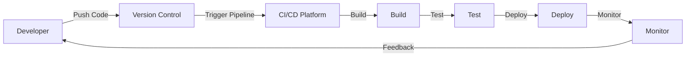

# CI/CD Platforms

## Introduction

Continuous Integration and Continuous Deployment (CI/CD) platforms are the backbone of modern software development workflows. These platforms automate the process of building, testing, and deploying code, enabling teams to deliver software faster and with higher quality.

In this guide, we'll explore various CI/CD platforms that help implement the CI/CD principles we've discussed in previous sections. Whether you're working on a small personal project or a large enterprise application, understanding these platforms will help you choose the right tools for your workflow.

## What are CI/CD Platforms?

CI/CD platforms are specialized tools that automate the software delivery process. They serve as the infrastructure that executes your CI/CD pipelines, connecting your version control system, build tools, test frameworks, and deployment targets into a cohesive workflow.



## Key Features of CI/CD Platforms

Before diving into specific platforms, let's understand the core features that most CI/CD platforms provide:

1. **Pipeline Configuration** - Ways to define your build, test, and deployment steps
2. **Integration with Version Control** - Automatic triggers when code changes are pushed
3. **Build Environment Management** - Containers or virtual machines for consistent builds
4. **Artifact Management** - Storage and versioning of build outputs
5. **Testing Integration** - Running automated tests as part of the pipeline
6. **Deployment Automation** - Delivering software to various environments
7. **Security Scanning** - Identifying vulnerabilities in code and dependencies
8. **Monitoring and Notifications** - Tracking pipeline status and alerting on failures

## Popular CI/CD Platforms

### Jenkins

Jenkins is one of the oldest and most widely-used open-source CI/CD tools. It offers extensive customization through its plugin ecosystem.

#### Key Features:
- Self-hosted with complete control over your environment
- Extensive plugin ecosystem (1500+ plugins)
- Supports distributed builds across multiple machines
- Jenkinsfile for pipeline-as-code

#### Basic Jenkins Pipeline Example:

```groovy
pipeline {
    agent any
    
    stages {
        stage('Build') {
            steps {
                echo 'Building application...'
                sh 'npm install'
                sh 'npm run build'
            }
        }
        stage('Test') {
            steps {
                echo 'Running tests...'
                sh 'npm test'
            }
        }
        stage('Deploy') {
            steps {
                echo 'Deploying application...'
                sh 'npm run deploy'
            }
        }
    }
    
    post {
        success {
            echo 'Pipeline completed successfully!'
        }
        failure {
            echo 'Pipeline failed!'
        }
    }
}
```

### GitHub Actions

GitHub Actions is GitHub's integrated CI/CD solution that allows you to automate workflows directly from your GitHub repository.

#### Key Features:
- Tight integration with GitHub repositories
- Marketplace with pre-built actions
- Matrix builds for testing across multiple configurations
- Built-in secrets management

#### GitHub Actions Workflow Example:

```yaml
name: Node.js CI/CD

on:
  push:
    branches: [ main ]
  pull_request:
    branches: [ main ]

jobs:
  build-and-deploy:
    runs-on: ubuntu-latest
    
    steps:
    - uses: actions/checkout@v3
    
    - name: Set up Node.js
      uses: actions/setup-node@v3
      with:
        node-version: '16'
        
    - name: Install dependencies
      run: npm install
      
    - name: Run tests
      run: npm test
      
    - name: Build
      run: npm run build
      
    - name: Deploy to production
      if: github.ref == 'refs/heads/main'
      run: npm run deploy
```

### GitLab CI/CD

GitLab offers a built-in CI/CD system that is deeply integrated with the GitLab platform, making it a convenient choice for teams already using GitLab for source control.

#### Key Features:
- Integrated with GitLab repositories
- Auto DevOps for automatic CI/CD configuration
- Container registry integration
- Built-in code quality and security scanning

#### GitLab CI/CD Pipeline Example:

```yaml
stages:
  - build
  - test
  - deploy

build-job:
  stage: build
  script:
    - echo "Building application..."
    - npm install
    - npm run build
  artifacts:
    paths:
      - dist/

test-job:
  stage: test
  script:
    - echo "Running tests..."
    - npm test

deploy-job:
  stage: deploy
  script:
    - echo "Deploying application..."
    - npm run deploy
  only:
    - main
```

### CircleCI

CircleCI is a cloud-based CI/CD platform known for its speed and flexibility.

#### Key Features:
- Fast setup and easy configuration
- Parallelism for running tests across multiple containers
- Caching for faster builds
- Orbs (reusable configuration packages)

#### CircleCI Configuration Example:

```yaml
version: 2.1

jobs:
  build:
    docker:
      - image: cimg/node:16.13
    steps:
      - checkout
      - restore_cache:
          keys:
            - node-deps-{{ checksum "package-lock.json" }}
      - run:
          name: Install Dependencies
          command: npm install
      - save_cache:
          key: node-deps-{{ checksum "package-lock.json" }}
          paths:
            - ./node_modules
      - run:
          name: Build
          command: npm run build
      - persist_to_workspace:
          root: .
          paths: [dist]

  test:
    docker:
      - image: cimg/node:16.13
    steps:
      - checkout
      - restore_cache:
          keys:
            - node-deps-{{ checksum "package-lock.json" }}
      - run:
          name: Run Tests
          command: npm test

  deploy:
    docker:
      - image: cimg/node:16.13
    steps:
      - checkout
      - attach_workspace:
          at: .
      - run:
          name: Deploy
          command: npm run deploy

workflows:
  version: 2
  build-test-deploy:
    jobs:
      - build
      - test:
          requires:
            - build
      - deploy:
          requires:
            - test
          filters:
            branches:
              only: main
```

### Travis CI

Travis CI is a CI/CD service that integrates with GitHub projects.

#### Key Features:
- Simple configuration with `.travis.yml` file
- Built-in support for many languages and frameworks
- Build matrix for testing across different environments
- Deployment integrations with various platforms

#### Travis CI Configuration Example:

```yaml
language: node_js
node_js:
  - 16

cache:
  directories:
    - node_modules

install:
  - npm install

script:
  - npm test
  - npm run build

deploy:
  provider: pages
  skip_cleanup: true
  github_token: $GITHUB_TOKEN
  local_dir: dist
  on:
    branch: main
```

### AWS CodePipeline

AWS CodePipeline is Amazon's fully managed CI/CD service that integrates with other AWS services.

#### Key Features:
- Seamless integration with AWS services
- Visual pipeline editor
- Integration with AWS CodeBuild for building and testing
- Support for multiple deployment targets

#### AWS CodePipeline (using AWS CDK) Example:

```typescript
import * as cdk from 'aws-cdk-lib';
import { Construct } from 'constructs';
import * as codepipeline from 'aws-cdk-lib/aws-codepipeline';
import * as codepipeline_actions from 'aws-cdk-lib/aws-codepipeline-actions';
import * as codebuild from 'aws-cdk-lib/aws-codebuild';

export class MyCicdPipelineStack extends cdk.Stack {
  constructor(scope: Construct, id: string, props?: cdk.StackProps) {
    super(scope, id, props);

    // Create a pipeline
    const pipeline = new codepipeline.Pipeline(this, 'Pipeline', {
      pipelineName: 'MyAppPipeline',
    });

    // Source stage
    const sourceOutput = new codepipeline.Artifact();
    const sourceAction = new codepipeline_actions.GitHubSourceAction({
      actionName: 'GitHub',
      owner: 'my-github-username',
      repo: 'my-app-repo',
      oauthToken: cdk.SecretValue.secretsManager('github-token'),
      output: sourceOutput,
      branch: 'main',
    });
    pipeline.addStage({
      stageName: 'Source',
      actions: [sourceAction],
    });

    // Build stage
    const buildOutput = new codepipeline.Artifact();
    const buildProject = new codebuild.PipelineProject(this, 'Build', {
      environment: {
        buildImage: codebuild.LinuxBuildImage.STANDARD_5_0,
      },
      buildSpec: codebuild.BuildSpec.fromObject({
        version: '0.2',
        phases: {
          install: {
            commands: 'npm install',
          },
          build: {
            commands: [
              'npm run test',
              'npm run build',
            ],
          },
        },
        artifacts: {
          'base-directory': 'dist',
          files: ['**/*'],
        },
      }),
    });
    const buildAction = new codepipeline_actions.CodeBuildAction({
      actionName: 'BuildAndTest',
      project: buildProject,
      input: sourceOutput,
      outputs: [buildOutput],
    });
    pipeline.addStage({
      stageName: 'BuildAndTest',
      actions: [buildAction],
    });

    // Deploy stage
    const deployAction = new codepipeline_actions.S3DeployAction({
      actionName: 'Deploy',
      bucket: /* your S3 bucket */,
      input: buildOutput,
    });
    pipeline.addStage({
      stageName: 'Deploy',
      actions: [deployAction],
    });
  }
}
```

### Azure DevOps

Azure DevOps (formerly VSTS) offers a comprehensive set of DevOps tools, including Azure Pipelines for CI/CD.

#### Key Features:
- Seamless integration with Azure services
- Support for any language, platform, and cloud
- Parallel jobs for faster builds
- Deployment to multiple targets

#### Azure DevOps Pipeline Example:

```yaml
trigger:
- main

pool:
  vmImage: 'ubuntu-latest'

stages:
- stage: Build
  jobs:
  - job: BuildJob
    steps:
    - task: NodeTool@0
      inputs:
        versionSpec: '16.x'
      displayName: 'Install Node.js'
    
    - script: npm install
      displayName: 'Install dependencies'
    
    - script: npm run build
      displayName: 'Build'
    
    - task: CopyFiles@2
      inputs:
        contents: 'dist/**'
        targetFolder: '$(Build.ArtifactStagingDirectory)'
      displayName: 'Copy build output'
    
    - task: PublishBuildArtifacts@1
      inputs:
        pathToPublish: '$(Build.ArtifactStagingDirectory)'
        artifactName: 'drop'
      displayName: 'Publish artifacts'

- stage: Test
  jobs:
  - job: TestJob
    steps:
    - task: NodeTool@0
      inputs:
        versionSpec: '16.x'
      displayName: 'Install Node.js'
    
    - script: |
        npm install
        npm test
      displayName: 'Run tests'

- stage: Deploy
  condition: and(succeeded(), eq(variables['Build.SourceBranch'], 'refs/heads/main'))
  jobs:
  - job: DeployJob
    steps:
    - task: DownloadBuildArtifacts@0
      inputs:
        buildType: 'current'
        downloadType: 'single'
        artifactName: 'drop'
        downloadPath: '$(System.ArtifactsDirectory)'
    
    - script: npm run deploy
      displayName: 'Deploy to production'
```

## Self-Hosted vs. Cloud-Based Platforms

When choosing a CI/CD platform, you'll need to decide between self-hosted and cloud-based solutions:

### Self-Hosted Platforms

**Advantages:**
- Complete control over the infrastructure
- Data remains within your network
- No usage limits or per-minute billing
- Customizable to specific requirements

**Disadvantages:**
- Requires maintenance and updates
- Need to provide your own compute resources
- Initial setup can be complex

**Examples:** Jenkins, GitLab CE (self-hosted), Drone CI

### Cloud-Based Platforms

**Advantages:**
- Minimal setup and maintenance
- Scales automatically with your needs
- Regular updates handled by the provider
- Often includes pre-configured environments

**Disadvantages:**
- Monthly costs can be higher for large teams
- Less control over the infrastructure
- Potential data privacy concerns

**Examples:** GitHub Actions, CircleCI, Travis CI, GitLab.com, Azure DevOps

## Choosing the Right CI/CD Platform

Consider these factors when selecting a CI/CD platform:

1. **Integration** - Does it work well with your existing tools and workflows?
2. **Scalability** - Can it handle your team's workload as you grow?
3. **Ease of Use** - How steep is the learning curve?
4. **Cost** - What's the pricing model, and does it fit your budget?
5. **Support** - Is there good documentation and community support?
6. **Security** - How does it handle secrets and secure pipelines?
7. **Customization** - Can you adapt it to your specific needs?

## Getting Started with a CI/CD Platform

Let's walk through setting up a basic CI/CD pipeline using GitHub Actions, which is a good starting point for beginners:

### Step 1: Create a GitHub Repository

If you don't already have one, create a repository for your project on GitHub.

### Step 2: Create a Workflow File

In your repository, create a `.github/workflows` directory and add a YAML file for your workflow configuration (e.g., `ci-cd.yml`).

### Step 3: Define Your Workflow

Here's a simple workflow for a Node.js application:

```yaml
name: CI/CD Pipeline

on:
  push:
    branches: [ main ]
  pull_request:
    branches: [ main ]

jobs:
  build-and-test:
    runs-on: ubuntu-latest
    
    steps:
    - uses: actions/checkout@v3
    
    - name: Set up Node.js
      uses: actions/setup-node@v3
      with:
        node-version: '16'
        cache: 'npm'
        
    - name: Install dependencies
      run: npm ci
      
    - name: Run linting
      run: npm run lint
      
    - name: Run tests
      run: npm test
      
    - name: Build application
      run: npm run build
      
    - name: Archive production artifacts
      uses: actions/upload-artifact@v3
      with:
        name: dist
        path: dist/
```

### Step 4: Push Your Workflow

Commit and push the workflow file to your repository. GitHub will automatically detect and run the workflow.

### Step 5: Monitor Your Workflow

Go to the "Actions" tab in your GitHub repository to see your workflow runs and their status.

## Best Practices for CI/CD Platforms

1. **Keep Pipelines Fast** - Optimize your pipeline to run as quickly as possible
2. **Use Caching** - Cache dependencies and build artifacts to speed up builds
3. **Implement Branch Policies** - Require successful CI builds before merging
4. **Secure Secrets** - Use the platform's secrets management for sensitive data
5. **Monitor Pipeline Health** - Track metrics like build times and failure rates
6. **Test in Production-Like Environments** - Make your test environment mirror production
7. **Use Infrastructure as Code** - Define your pipeline configuration in version control
8. **Automate Everything** - If a step can be automated, it should be

## Troubleshooting Common Issues

### Pipeline Failures

When your pipeline fails:
1. Check the logs for specific error messages
2. Verify that tests pass locally before pushing
3. Ensure all dependencies are correctly specified
4. Check for environment-specific issues

### Slow Pipelines

To improve pipeline performance:
1. Run tests in parallel when possible
2. Use caching for dependencies
3. Only run necessary steps based on changed files
4. Use lightweight Docker images

### Configuration Issues

When your pipeline isn't configured correctly:
1. Validate your YAML syntax
2. Check for indentation errors
3. Review the platform's documentation
4. Look for examples of similar configurations

## Summary

CI/CD platforms are essential tools for modern software development, enabling teams to automate building, testing, and deploying applications. By understanding the features and capabilities of different platforms, you can choose the right solution for your needs and implement effective CI/CD pipelines.

The right CI/CD platform will grow with your project, helping you deliver high-quality software faster and more reliably. Whether you choose Jenkins, GitHub Actions, GitLab CI/CD, or another platform, the principles of good CI/CD practices remain the same: automation, reliability, and continuous improvement.

## Additional Resources

- Try creating a simple CI/CD pipeline for a personal project using GitHub Actions
- Experiment with different pipeline configurations to understand their impact
- Learn more about Docker and containerization for consistent build environments
- Explore infrastructure as code tools like Terraform or AWS CDK for managing deployment targets

## Exercises

1. Set up a basic CI/CD pipeline for a simple web application using one of the platforms discussed in this guide.
2. Modify a pipeline to deploy to different environments (development, staging, production) based on branch names.
3. Implement automated testing in your pipeline and ensure that deployments only proceed if tests pass.
4. Configure your pipeline to send notifications when builds fail or succeed.
5. Optimize your pipeline for speed by implementing caching and parallel execution.