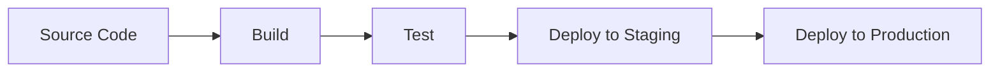
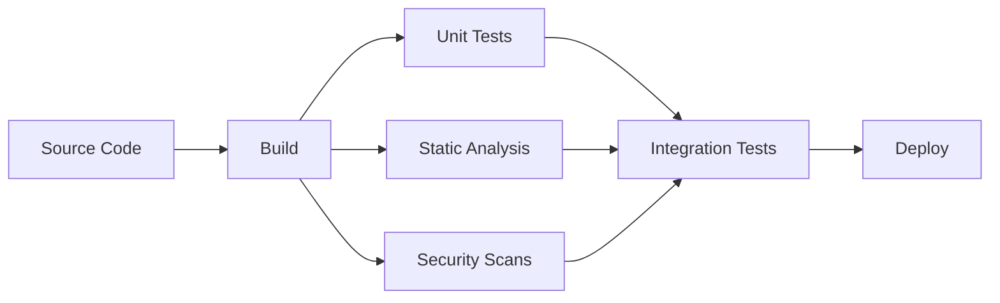
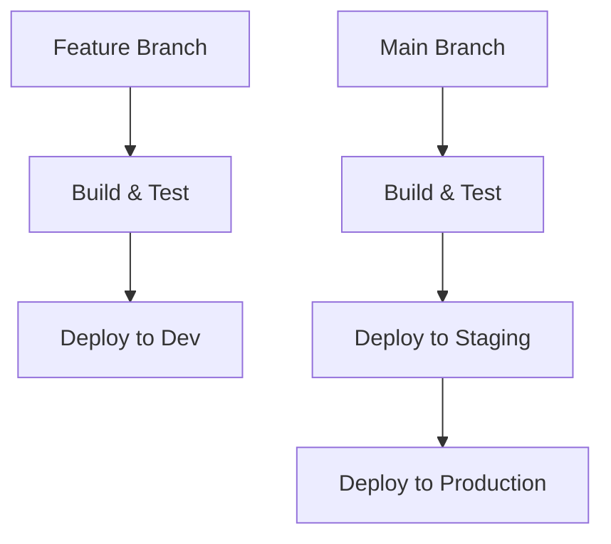
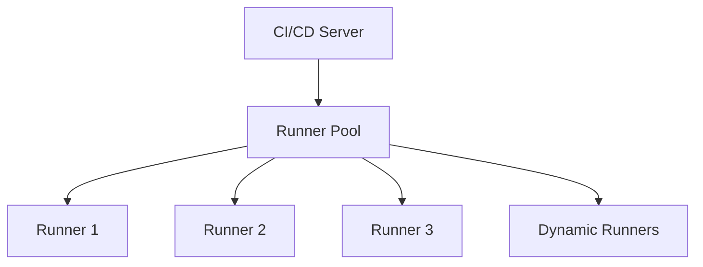
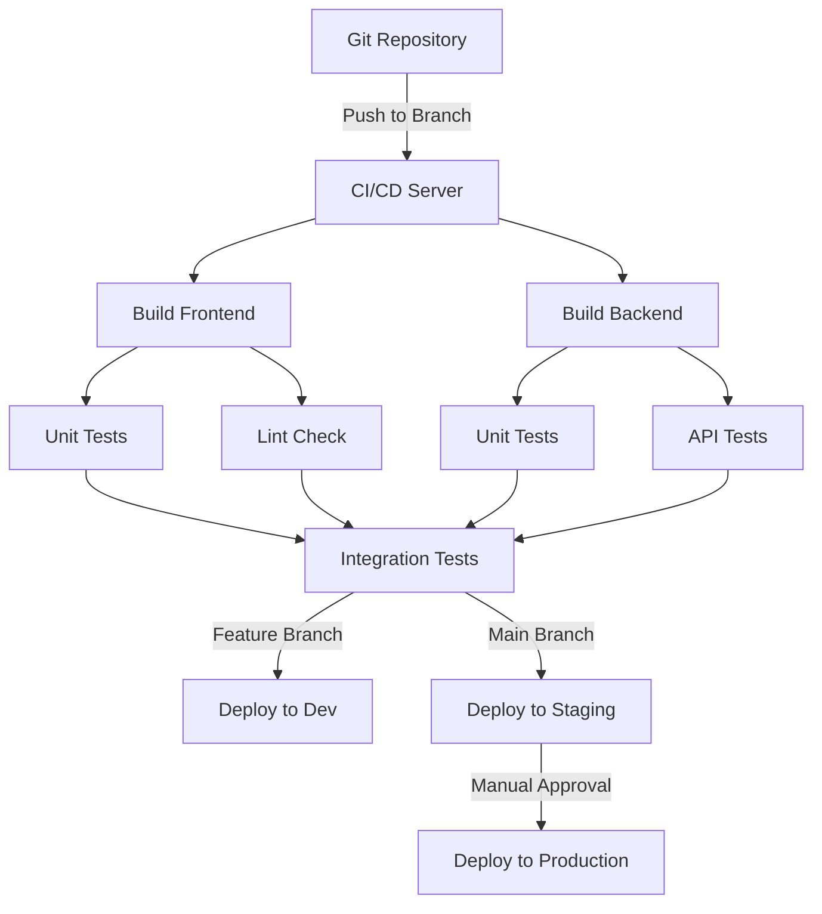
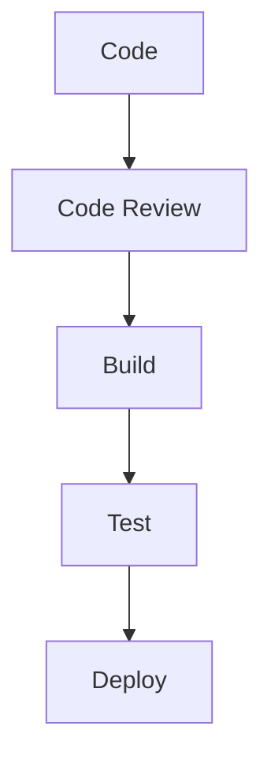

# CI/CD Architecture

## Introduction

Continuous Integration and Continuous Delivery (CI/CD) has become a cornerstone of modern software development. But what exactly happens behind the scenes when you push your code? In this guide, we'll explore the architecture that powers CI/CD systems, breaking down the components, workflows, and design patterns that make automated software delivery possible.

CI/CD architecture refers to the structural organization of tools, processes, and environments that enable teams to automate building, testing, and deploying their applications. A well-designed CI/CD architecture reduces manual intervention, catches bugs early, and helps teams deliver software faster and more reliably.

## Core Components of CI/CD Architecture

A typical CI/CD pipeline architecture consists of several key components:

### 1. Source Code Repository

The repository serves as the single source of truth for your codebase:

- **Centralized storage**: Git repositories like GitHub, GitLab, or Bitbucket
- **Version control**: Tracks changes and manages branches
- **Triggers**: Initiates CI/CD workflows based on events (commits, pull requests)

```bash
# Example of a Git workflow that triggers a CI/CD pipeline
git checkout -b feature/new-login
# Make changes to code
git add .
git commit -m "Implement new login page"
git push origin feature/new-login
# This push triggers the CI/CD pipeline
```

### 2. CI/CD Server/Orchestrator

This is the "brain" of your CI/CD setup:

- **Job scheduler**: Manages when and how pipeline jobs run
- **Workflow definition**: Defines stages, steps, and dependencies
- **Resource allocation**: Assigns runners/agents to execute jobs

Examples include Jenkins, GitHub Actions, GitLab CI, CircleCI, and Azure DevOps.

### 3. Build Environment

Where your code gets compiled and packaged:

- **Build tools**: Maven, Gradle, npm, pip, etc.
- **Build artifacts**: Generated packages, binaries, or containers
- **Caching mechanisms**: Speed up builds by caching dependencies

```yaml
# Example build configuration in GitHub Actions
build:
  runs-on: ubuntu-latest
  steps:
    - uses: actions/checkout@v3
    - name: Set up Node.js
      uses: actions/setup-node@v3
      with:
        node-version: '16'
        cache: 'npm'
    - name: Install dependencies
      run: npm ci
    - name: Build project
      run: npm run build
    - name: Upload build artifacts
      uses: actions/upload-artifact@v3
      with:
        name: build-files
        path: build/
```

### 4. Test Infrastructure

Ensures your code meets quality standards:

- **Test runners**: Tools that execute your test suites
- **Test environments**: Clean, isolated environments for running tests
- **Test reporting**: Captures and displays test results

### 5. Artifact Repository

Stores the outputs of your build process:

- **Storage systems**: JFrog Artifactory, Nexus, Docker Hub, AWS ECR
- **Versioning**: Tracks different versions of your artifacts
- **Access control**: Manages who can publish or download artifacts

### 6. Deployment Targets

Where your application ultimately runs:

- **Development environments**: For ongoing feature work
- **Staging/QA environments**: For pre-release testing
- **Production environments**: For end-user access

## CI/CD Pipeline Architecture Patterns

Different architecture patterns can be applied to CI/CD pipelines based on your team's needs:

### Basic Linear Pipeline

The simplest architecture, where each stage runs sequentially:



### Parallel Pipeline Architecture

Tasks that don't depend on each other run simultaneously to save time:



### Multi-Branch Pipeline

Different pipeline configurations for different branches:



### Deployment Strategies

CI/CD architectures often incorporate specific deployment patterns:

1. **Blue-Green Deployment**: Maintains two identical production environments.
2. **Canary Releases**: Gradually routes traffic to the new version.
3. **Feature Flags**: Toggles to enable/disable features without redeploying.

```js
// Example of a feature flag in code
function newFeature() {
  if (featureFlags.isEnabled('new-checkout')) {
    return <NewCheckoutProcess />;
  } else {
    return <LegacyCheckoutProcess />;
  }
}
```

## Building a Robust CI/CD Architecture

### Scalable Runner Architecture

As teams grow, the demand for CI/CD resources increases. A scalable runner architecture might look like:



Runners can be:
- **Self-hosted**: On your own infrastructure
- **Cloud-based**: Provided by the CI/CD service
- **Auto-scaling**: Dynamically adjusts based on load

### Security Considerations

Your CI/CD architecture must include security measures:

- **Secrets management**: Secure storage for tokens, passwords, and keys
- **Least privilege**: Runners have only the permissions they need
- **Vulnerability scanning**: Checks code and dependencies for security issues

```yaml
# Example security scan in a CI/CD pipeline
security_scan:
  runs-on: ubuntu-latest
  steps:
    - uses: actions/checkout@v3
    - name: Install dependencies
      run: npm ci
    - name: Run security scan
      run: npm audit
    - name: SAST analysis
      uses: some-security-tool/scan-action@v1
```

## Real-World Example: E-commerce Website CI/CD Architecture

Let's look at how a simple e-commerce website might implement CI/CD architecture:



The architecture includes:

1. **Parallel building** of frontend and backend components
2. **Different test types** running simultaneously
3. **Environment-specific deployment** based on branch
4. **Manual approval gate** before production deployment

## Implementing CI/CD Architecture: Step-by-Step

### 1. Map Your Software Delivery Workflow

Before building your CI/CD architecture, document your current process:



### 2. Choose Your Tools

Select tools that fit your stack and team preferences:

- **Source Control**: GitHub, GitLab, Bitbucket
- **CI/CD Server**: Jenkins, GitHub Actions, GitLab CI, CircleCI
- **Testing Frameworks**: Jest, Pytest, JUnit
- **Deployment Tools**: Kubernetes, Terraform, AWS CloudFormation

### 3. Define Pipeline Configuration

Create configuration files that define your pipeline:

```yaml
# Example .github/workflows/main.yml
name: CI/CD Pipeline

on:
  push:
    branches: [ main, development ]
  pull_request:
    branches: [ main ]

jobs:
  build:
    runs-on: ubuntu-latest
    steps:
      - uses: actions/checkout@v3
      - name: Setup Node.js
        uses: actions/setup-node@v3
        with:
          node-version: '16'
      - name: Install dependencies
        run: npm ci
      - name: Build
        run: npm run build
      - name: Test
        run: npm test

  deploy-staging:
    needs: build
    if: github.ref == 'refs/heads/main'
    runs-on: ubuntu-latest
    steps:
      - name: Deploy to staging
        run: ./deploy.sh staging

  deploy-production:
    needs: deploy-staging
    runs-on: ubuntu-latest
    environment:
      name: production
      url: https://example.com
    steps:
      - name: Deploy to production
        run: ./deploy.sh production
```

### 4. Set Up Infrastructure

Provision the necessary infrastructure for your pipeline:

- **Build and test runners**
- **Artifact storage**
- **Deployment environments**

```bash
# Example Terraform code for setting up CI/CD infrastructure
terraform {
  required_providers {
    aws = {
      source  = "hashicorp/aws"
      version = "~> 4.0"
    }
  }
}

resource "aws_instance" "ci_runner" {
  ami           = "ami-0c55b159cbfafe1f0"
  instance_type = "t2.micro"
  
  tags = {
    Name = "CI-Runner"
  }
}
```

## Monitoring and Improving Your CI/CD Architecture

A successful CI/CD architecture includes monitoring and continuous improvement:

- **Pipeline metrics**: Build time, success rate, deployment frequency
- **Bottleneck identification**: Finding slow or resource-intensive stages
- **Failure analysis**: Understanding common causes of pipeline failures

```js
// Example of tracking CI/CD metrics with JavaScript
function trackPipelineMetrics(pipelineRun) {
  const metrics = {
    buildId: pipelineRun.id,
    startTime: pipelineRun.startTime,
    endTime: pipelineRun.endTime,
    duration: pipelineRun.endTime - pipelineRun.startTime,
    status: pipelineRun.status,
    stageDurations: pipelineRun.stages.map(stage => ({
      name: stage.name,
      duration: stage.endTime - stage.startTime
    }))
  };
  
  metricsClient.send(metrics);
}
```

## Common CI/CD Architecture Challenges

### 1. Pipeline Slowness

Long-running pipelines reduce developer productivity:

- **Solution**: Parallelize tests, use caching, and optimize build scripts

### 2. Environment Consistency

"Works on my machine" problems:

- **Solution**: Use containers like Docker to ensure consistency

```dockerfile
# Example Dockerfile for consistent build environments
FROM node:16-alpine

WORKDIR /app
COPY package*.json ./
RUN npm ci
COPY . .

RUN npm run build
```

### 3. Managing Secrets

Secure handling of sensitive information:

- **Solution**: Use dedicated secrets management services integrated with your CI/CD tool

## Summary

CI/CD architecture is the foundation that enables modern software delivery practices. A well-designed architecture includes:

- **Source code management** that triggers automated workflows
- **Build and test automation** that ensures quality
- **Deployment pipelines** that deliver to various environments
- **Security measures** to protect the delivery process
- **Monitoring systems** to continuously improve

By understanding these architectural components and how they fit together, you can design a CI/CD system that meets your team's needs and speeds up your software delivery while maintaining quality.

## Additional Resources

Here are some exercises to help you practice CI/CD architecture concepts:

1. **Map your ideal CI/CD pipeline**: Draw a diagram of a CI/CD pipeline for a project you're working on.
2. **Identify bottlenecks**: Analyze your current pipeline and find the slowest stages.
3. **Implement a simple CI/CD pipeline**: Set up a basic CI/CD pipeline for a small project using GitHub Actions or another tool.

## Further Reading

- CI/CD Best Practices
- Containerization and CI/CD
- Infrastructure as Code for CI/CD Pipelines
- Advanced Deployment Strategies