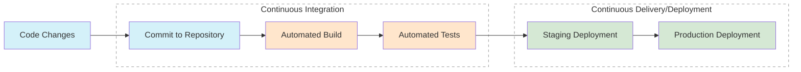

# CI/CD Principles

## Introduction

Continuous Integration and Continuous Deployment (CI/CD) have revolutionized the way software is developed and delivered. These practices allow development teams to release high-quality code faster and more reliably by automating the build, test, and deployment processes. In this guide, we'll explore the core principles that make CI/CD effective and how they can be applied to your development workflow.

## What is CI/CD?

CI/CD consists of two related but distinct practices:

- **Continuous Integration (CI)**: The practice of frequently merging code changes into a shared repository, with automated builds and tests verifying each integration.
- **Continuous Delivery/Deployment (CD)**: The practice of automatically deploying code changes to production or staging environments after passing automated tests.



## Core CI/CD Principles

### 1. Automation

Automation is the foundation of effective CI/CD. By automating repetitive tasks, teams can focus on writing code rather than manually building, testing, and deploying applications.

#### Example: GitHub Actions Workflow

```yaml
name: Basic CI Pipeline

on:
  push:
    branches: [ main ]
  pull_request:
    branches: [ main ]

jobs:
  build:
    runs-on: ubuntu-latest
    
    steps:
    - uses: actions/checkout@v3
    
    - name: Set up Node.js
      uses: actions/setup-node@v3
      with:
        node-version: '18'
        
    - name: Install dependencies
      run: npm ci
      
    - name: Run tests
      run: npm test
      
    - name: Build application
      run: npm run build
```

This example demonstrates a simple GitHub Actions workflow that builds and tests a Node.js application whenever code is pushed to the main branch or when a pull request is opened.

### 2. Frequent Integration

Integrating code changes frequently (ideally multiple times per day) helps detect and fix integration issues early.

#### Best Practices:

- Commit code at least once per day
- Keep commits small and focused on specific features or fixes
- Use feature branches for new development, but integrate frequently with the main branch

### 3. Comprehensive Testing

Automated testing is essential for maintaining code quality and preventing regressions. A robust test suite should include:

- **Unit tests**: Test individual components in isolation
- **Integration tests**: Verify components work together correctly
- **End-to-end tests**: Test the entire application flow

#### Example: Jest Test Suite

```javascript
// calculator.js
function add(a, b) {
  return a + b;
}

function subtract(a, b) {
  return a - b;
}

module.exports = { add, subtract };

// calculator.test.js
const { add, subtract } = require('./calculator');

test('adds 1 + 2 to equal 3', () => {
  expect(add(1, 2)).toBe(3);
});

test('subtracts 5 - 2 to equal 3', () => {
  expect(subtract(5, 2)).toBe(3);
});
```

### 4. Fast Feedback

Quick feedback on code changes is crucial. CI/CD pipelines should run quickly to provide developers with immediate information about potential issues.

#### Strategies to Maintain Fast Feedback:

- Optimize test execution through parallelization
- Use incremental builds where possible
- Implement test pyramids (more unit tests, fewer E2E tests)
- Consider using test splitting and distributed testing

### 5. Repeatable Deployments

Every deployment should be identical, regardless of the environment. This principle ensures consistency across development, testing, and production environments.

#### Implementation with Docker:

```dockerfile
FROM node:18-alpine

WORKDIR /app

COPY package*.json ./
RUN npm ci --only=production

COPY . .

EXPOSE 3000
CMD ["npm", "start"]
```

By containerizing your application, you ensure that it runs consistently in any environment, eliminating the "it works on my machine" problem.

### 6. Version Control Everything

All project assets (code, configuration, infrastructure definitions) should be version-controlled to maintain history and enable repeatable builds.

#### What to Version Control:

- Source code
- Test scripts
- Build scripts
- Configuration files
- Infrastructure as Code (IaC) files
- Database schema migrations

### 7. Trunk-Based Development

Trunk-based development promotes short-lived branches and frequent merges to the main branch, reducing merge conflicts and keeping the codebase integrated.

#### Example Workflow:

1. Create a short-lived feature branch
2. Make small, focused changes
3. Run tests locally
4. Create a pull request
5. Automated CI pipeline runs
6. Merge to main branch when tests pass
7. Automated deployment begins

### 8. Deployment Strategies

Safe deployment strategies minimize risk and enable quick recovery from issues.

#### Common Strategies:

- **Blue-Green Deployment**: Maintain two identical environments (blue and green), and switch traffic between them
- **Canary Deployment**: Roll out changes to a small subset of users before full deployment
- **Feature Flags**: Toggle features on/off without deploying new code

#### Example: Feature Flag Implementation

```javascript
const FEATURES = {
  NEW_UI: process.env.ENABLE_NEW_UI === 'true',
  BETA_FEATURES: process.env.ENABLE_BETA === 'true',
};

function renderUI() {
  if (FEATURES.NEW_UI) {
    return <NewUIComponent />;
  }
  return <LegacyUIComponent />;
}
```

## Real-World Implementation Example

Let's build a simple CI/CD pipeline for a Node.js web application using popular tools:

### 1. Set Up a Git Repository

First, create a Git repository for your project:

```bash
mkdir my-node-app
cd my-node-app
git init
npm init -y
git add .
git commit -m "Initial commit"
```

### 2. Create a Simple Express Application

```javascript
// app.js
const express = require('express');
const app = express();
const port = process.env.PORT || 3000;

app.get('/', (req, res) => {
  res.json({ message: 'Hello from my CI/CD enabled app!' });
});

app.listen(port, () => {
  console.log(`App running on port ${port}`);
});

module.exports = app;
```

### 3. Add Tests with Jest and Supertest

```javascript
// app.test.js
const request = require('supertest');
const app = require('./app');

describe('API Endpoints', () => {
  test('GET / should return hello message', async () => {
    const response = await request(app).get('/');
    expect(response.statusCode).toBe(200);
    expect(response.body.message).toBe('Hello from my CI/CD enabled app!');
  });
});
```

### 4. Create a CI Pipeline with GitHub Actions

```yaml
# .github/workflows/ci.yml
name: Node.js CI/CD

on:
  push:
    branches: [ main ]
  pull_request:
    branches: [ main ]

jobs:
  build-and-test:
    runs-on: ubuntu-latest
    
    steps:
    - uses: actions/checkout@v3
    
    - name: Set up Node.js
      uses: actions/setup-node@v3
      with:
        node-version: '18'
        
    - name: Install dependencies
      run: npm ci
      
    - name: Run linting
      run: npm run lint
      
    - name: Run tests
      run: npm test
      
    - name: Build
      run: npm run build --if-present
      
  deploy:
    needs: build-and-test
    if: github.ref == 'refs/heads/main'
    runs-on: ubuntu-latest
    
    steps:
    - uses: actions/checkout@v3
    
    - name: Deploy to Heroku
      uses: akhileshns/heroku-deploy@v3.12.12
      with:
        heroku_api_key: ${{ secrets.HEROKU_API_KEY }}
        heroku_app_name: "my-node-app"
        heroku_email: ${{ secrets.HEROKU_EMAIL }}
```

### 5. Implement Continuous Deployment

When changes are pushed to the main branch:
1. GitHub Actions runs the CI pipeline
2. If tests pass, the deployment job deploys the application to Heroku
3. The application is automatically available to users

## Benefits of CI/CD

Implementing CI/CD principles provides numerous benefits:

- **Faster Time to Market**: Automate manual processes to deliver features quicker
- **Higher Quality Code**: Catch bugs earlier through automated testing
- **Reduced Risk**: Small, incremental changes are easier to troubleshoot
- **Better Collaboration**: Team members integrate work frequently
- **Increased Confidence**: Every change is tested before deployment
- **Improved Developer Experience**: Less time spent on manual tasks

## Common Challenges and Solutions

| Challenge | Solution |
|-----------|----------|
| Slow CI/CD pipelines | Optimize tests, use parallelization, implement caching |
| Flaky tests | Isolate tests, implement retry logic, fix race conditions |
| Environment inconsistencies | Use containers, infrastructure as code |
| Security concerns | Implement automated security scanning |
| Team resistance | Start small, demonstrate value, provide training |

## Summary

CI/CD principles fundamentally change how software is delivered by emphasizing automation, frequent integration, comprehensive testing, and consistent deployments. By implementing these practices, development teams can deliver higher-quality software more quickly and reliably.

The key principles to remember are:
- Automate everything possible
- Integrate code changes frequently
- Build a comprehensive test suite
- Provide fast feedback
- Make deployments repeatable and consistent
- Version control all project assets
- Consider trunk-based development
- Implement safe deployment strategies

## Learn More

To continue learning about CI/CD, explore these topics:

- Infrastructure as Code (IaC)
- Test-Driven Development (TDD)
- Container orchestration with Kubernetes
- Monitoring and observability
- DevOps culture and practices

## Exercises

1. Set up a basic CI pipeline for an existing project using GitHub Actions or GitLab CI.
2. Implement automated unit and integration tests for your application.
3. Create a Docker container for your application to ensure consistent deployment.
4. Implement a feature flag system to toggle features without deployment.
5. Design a blue-green deployment strategy for your application.