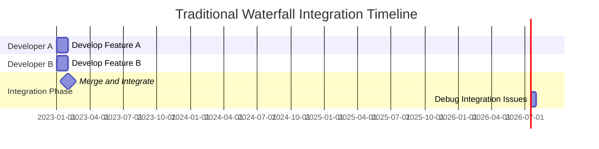
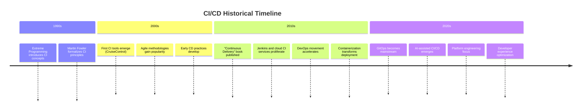

# CI/CD History

## Introduction

Continuous Integration and Continuous Deployment/Delivery (CI/CD) are foundational practices in modern software development. These methodologies have revolutionized how developers build, test, and release software, but they didn't appear overnight. Understanding the historical context of CI/CD helps us appreciate why these practices were developed and how they've evolved to address fundamental challenges in software development.

In this article, we'll trace the evolution of CI/CD from its conceptual beginnings to its current state as an essential component of DevOps culture. We'll explore the key milestones, influential figures, and technological advances that shaped these practices.

## Early Software Development Challenges

### The "Integration Hell" Era (1970s-1990s)

Before CI/CD practices emerged, software teams faced what was commonly known as "integration hell." In traditional waterfall development:

- Developers worked in isolation for weeks or months
- Code was merged manually at the end of development cycles
- Integration problems were discovered late in the development process
- Fixing these issues often led to project delays and budget overruns



This approach led to several problems:

- **Merge conflicts**: Code changes often conflicted with one another
- **Environmental inconsistencies**: Code that worked on one developer's machine failed in other environments
- **Testing bottlenecks**: Manual testing couldn't keep pace with development
- **Unpredictable releases**: Project timelines were difficult to estimate accurately

## The Birth of Continuous Integration (1990s)

### Extreme Programming and Martin Fowler

The concept of Continuous Integration emerged in the late 1990s as part of the Extreme Programming (XP) methodology championed by Kent Beck. Martin Fowler, a prominent software developer and author, further popularized CI through his influential writings.

In 2000, Fowler published his seminal article on Continuous Integration, where he defined it as:

> "A software development practice where members of a team integrate their work frequently, usually each person integrates at least daily - leading to multiple integrations per day. Each integration is verified by an automated build (including test) to detect integration errors as quickly as possible."

### Key CI Principles Established

The early CI approach established several principles that remain fundamental today:

1. **Maintain a single source repository**
2. **Automate the build process**
3. **Make the build self-testing**
4. **Everyone commits to the mainline daily**
5. **Every commit builds the mainline on an integration machine**
6. **Fix broken builds immediately**
7. **Keep the build fast**

## The First CI Tools (Early 2000s)

### CruiseControl and Early Automation

The early 2000s saw the development of the first dedicated CI tools:

- **CruiseControl** (2001): One of the first open-source CI servers, developed by ThoughtWorks
- **Tinderbox**: Mozilla's early build automation tool
- **AntHill** (2001): An early commercial build server

These tools automated the build process and provided feedback on build status, but they were quite primitive by today's standards.

### A Simple CruiseControl Configuration Example

```xml
<cruisecontrol>
  <project name="HelloWorld">
    <modificationset>
      <cvs localWorkingCopy="/path/to/working/copy"/>
    </modificationset>
    <schedule interval="300">
      <ant buildfile="build.xml" target="clean test"/>
    </schedule>
    <publishers>
      <email mailhost="smtp.example.com"
        returnaddress="build@example.com"
        buildresultsurl="http://buildserver/results"
        defaultsuffix="@example.com"
        returnname="Build Results">
        <failure address="team" />
      </email>
    </publishers>
  </project>
</cruisecontrol>
```

## The Emergence of Continuous Delivery/Deployment (Mid-2000s)

As CI practices matured, forward-thinking organizations began extending automation beyond integration and testing to include deployment.

### The Rise of Agile and DevOps

Two movements significantly influenced the development of Continuous Delivery/Deployment:

1. **Agile methodologies**: Emphasized iterative development and frequent delivery of working software
2. **DevOps culture**: Focused on breaking down silos between development and operations teams

### Jez Humble and the CD Manifesto

In 2010, Jez Humble and David Farley published "Continuous Delivery," a book that formalized CD practices. They defined Continuous Delivery as:

> "A software development discipline where you build software in such a way that it can be released to production at any time."

The book outlined several key principles:

- **Build quality in**: Detect problems early through automation
- **Work in small batches**: Reduce risk through incremental changes
- **Automate repetitive tasks**: Create reliable, consistent processes
- **Pursue continuous improvement**: Regularly refine processes and tools
- **Share responsibility**: Everyone is responsible for successful delivery

## The CI/CD Tools Revolution (2010s)

### Jenkins and the New Wave

The 2010s saw an explosion in CI/CD tools that made these practices more accessible:

- **Jenkins** (2011): Evolved from Hudson, became the most widely used open-source automation server
- **Travis CI** (2011): Introduced CI as a service for GitHub repositories
- **CircleCI** (2011): Offered cloud-based CI with an emphasis on speed
- **GitLab CI** (2012): Integrated CI directly into the GitLab platform
- **GitHub Actions** (2018): Brought CI/CD capabilities directly to GitHub repositories

### Example: A Simple Jenkins Pipeline

```groovy
pipeline {
    agent any
    
    stages {
        stage('Build') {
            steps {
                sh 'npm install'
                sh 'npm run build'
            }
        }
        stage('Test') {
            steps {
                sh 'npm test'
            }
        }
        stage('Deploy') {
            steps {
                sh 'npm run deploy'
            }
        }
    }
    
    post {
        success {
            echo 'Pipeline completed successfully!'
        }
        failure {
            echo 'Pipeline failed.'
        }
    }
}
```

## Cloud-Native CI/CD (Late 2010s-Present)

The rise of cloud computing, containerization, and microservices architecture has further transformed CI/CD practices.

### Containerization and Orchestration

- **Docker** (2013): Standardized containerization, making applications more portable
- **Kubernetes** (2014): Provided orchestration for containerized applications
- **Helm** (2016): Package manager for Kubernetes that simplified deployments

### GitOps and Infrastructure as Code

Modern CI/CD practices now often incorporate:

- **Infrastructure as Code (IaC)**: Managing infrastructure through code repositories
- **GitOps**: Using Git as the single source of truth for both application and infrastructure code
- **Immutable infrastructure**: Creating new environments rather than modifying existing ones

### Example: A Modern GitOps Workflow with ArgoCD

```yaml
apiVersion: argoproj.io/v1alpha1
kind: Application
metadata:
  name: myapp
  namespace: argocd
spec:
  project: default
  source:
    repoURL: https://github.com/myorg/myapp.git
    targetRevision: HEAD
    path: kubernetes/manifests
  destination:
    server: https://kubernetes.default.svc
    namespace: myapp
  syncPolicy:
    automated:
      prune: true
      selfHeal: true
```

## The Evolution of CI/CD Practices



## Current Trends and Future Direction

### Today's CI/CD Landscape

Current CI/CD practices focus on:

1. **Developer experience**: Making CI/CD more accessible to developers
2. **Security integration**: Shifting security left with DevSecOps
3. **Observability**: Integrating monitoring and feedback into the deployment process
4. **Platform engineering**: Creating internal developer platforms that abstract complexity
5. **AI-assisted development**: Using AI to optimize testing and deployment strategies

### Emerging Trends

Looking ahead, several trends are shaping the future of CI/CD:

- **Low-code/no-code CI/CD**: Making automation accessible to non-specialists
- **Serverless CI/CD**: Event-driven pipelines that scale automatically
- **Chaos engineering integration**: Building resilience testing into pipelines
- **Self-healing systems**: Autonomous detection and recovery from failures
- **Machine learning for deployment optimization**: Using AI to determine optimal deployment strategies

## Summary

The history of CI/CD reflects the software industry's ongoing quest for more efficient, reliable delivery processes. From the early days of infrequent, painful integrations to today's automated, continuous pipelines, each evolution has sought to address fundamental challenges in software development.

The journey from "integration hell" to modern CI/CD practices has been driven by a desire to:

- Reduce risk through smaller, more frequent changes
- Increase feedback speed to catch issues earlier
- Automate repeatable processes to ensure consistency
- Break down silos between development and operations
- Deliver value to users more quickly and reliably

As we look to the future, CI/CD continues to evolve, but its core principles remain essential to effective software development.

## Further Learning

To deepen your understanding of CI/CD concepts and practices, consider:

1. Exploring hands-on tutorials with tools like Jenkins, GitHub Actions, or GitLab CI
2. Reading industry publications like "Accelerate" by Nicole Forsgren, Jez Humble, and Gene Kim
3. Participating in open-source projects to experience CI/CD in action
4. Implementing a simple CI/CD pipeline for one of your personal projects
5. Joining DevOps community forums to learn from practitioners

## Exercise: Design Your First CI/CD Pipeline

Try designing a basic CI/CD pipeline for a simple web application:

1. Identify the key stages (build, test, deploy)
2. Determine what tools you might use for each stage
3. Sketch out the pipeline flow, including any approval gates or quality checks
4. Consider how you would handle failures at different stages
5. Think about how you would monitor the effectiveness of your pipeline

This exercise will help solidify your understanding of CI/CD concepts and how they apply to real-world development scenarios.