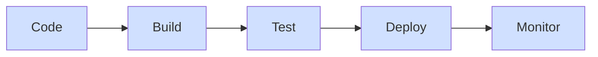
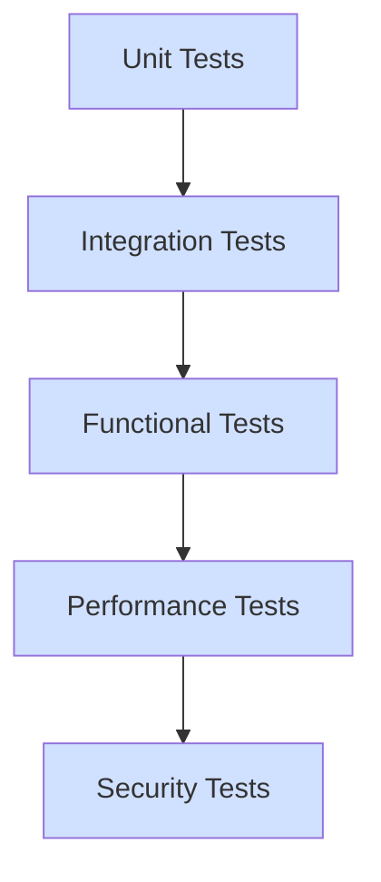
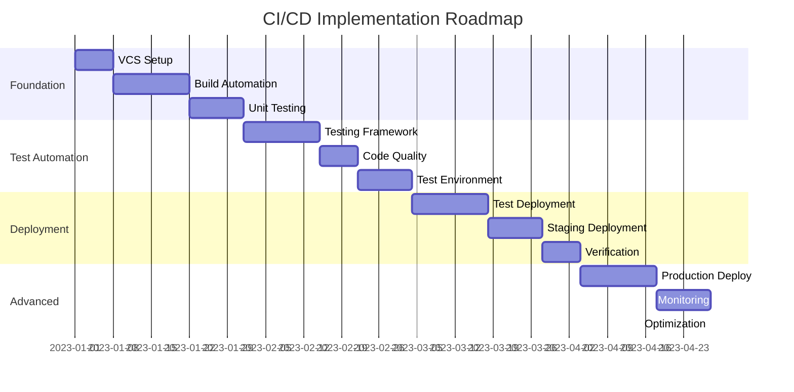

# CICD Planning

## Introduction

Continuous Integration and Continuous Deployment (CI/CD) has revolutionized how software is developed, tested, and released. Before diving into implementation, having a solid CI/CD plan is crucial for success. This guide will walk you through the essential steps of planning your CI/CD pipeline, helping you build a foundation for efficient, automated software delivery.

CI/CD planning is the process of designing your automation strategy before implementation. A well-thought-out plan ensures your CI/CD pipeline aligns with your team's needs, project requirements, and organizational goals.

## Why CI/CD Planning Matters

Implementing CI/CD without proper planning can lead to:

- Inefficient workflows
- Security vulnerabilities
- Resource wastage
- Integration headaches
- Adoption resistance from team members

Let's explore how to create an effective CI/CD plan that sets you up for success.

## Core Components of CI/CD Planning

### 1. Assessing Your Current Workflow

Before designing your CI/CD pipeline, understand your current software development lifecycle:



**Exercise:** Document your current workflow by answering these questions:
- How does code move from development to production?
- What manual steps exist in your process?
- Where do bottlenecks occur?
- What testing is performed and when?

### 2. Defining CI/CD Goals

Clearly articulate what you want to achieve with CI/CD:

- Faster release cycles
- Improved code quality
- Reduced manual errors
- Better deployment consistency
- Enhanced team collaboration

**Example Goal Setting:**

```javascript
// Sample CI/CD goals document in JSON format
const cicdGoals = {
  primaryGoals: [
    "Reduce deployment time from 2 days to 2 hours",
    "Automate 90% of manual testing processes",
    "Decrease production bugs by 50%"
  ],
  metrics: {
    deploymentFrequency: "Daily",
    leadTime: "< 24 hours",
    changeFailureRate: "< 10%",
    meanTimeToRecover: "< 1 hour"
  }
};
```

### 3. Selecting CI/CD Tools

Choose tools that match your project requirements:

| Category | Popular Options | Best For |
|----------|----------------|----------|
| CI Servers | Jenkins, CircleCI, GitHub Actions | Automating build and test processes |
| Version Control | Git, SVN | Managing code changes |
| Artifact Repositories | Nexus, Artifactory | Storing build outputs |
| Container Platforms | Docker, Kubernetes | Consistent environments |
| Infrastructure as Code | Terraform, Ansible | Environment provisioning |
| Monitoring | Prometheus, Grafana | Pipeline and application insights |

**Tool Selection Example:**

```python
# Python dictionary representing tool selection
ci_cd_tools = {
    "ci_server": "GitHub Actions",
    "version_control": "Git + GitHub",
    "artifact_repository": "GitHub Packages",
    "containerization": "Docker",
    "infrastructure": "Terraform",
    "monitoring": "Prometheus + Grafana"
}

# Function to evaluate tool compatibility
def evaluate_compatibility(tools):
    compatibility_score = 0
    # Tool compatibility logic would go here
    return compatibility_score
```

### 4. Pipeline Architecture Design

Design your pipeline stages according to your workflow needs:

```mermaid
flowchart LR
    A[Code Commit] --> B[Build]
    B --> C[Unit Tests]
    C --> D[Static Analysis]
    D --> E[Package]
    E --> F[Deploy to Test]
    F --> G[Integration Tests]
    G --> H[Security Scan]
    H --> I[Deploy to Staging]
    I --> J[Performance Tests]
    J --> K[Deploy to Production]
    style A fill:#d4f9d4
    style B fill:#d4f9d4
    style C fill:#d4f9d4
    style D fill:#d4f9d4
    style E fill:#d4f9d4
    style F fill:#ffdfba
    style G fill:#ffdfba
    style H fill:#ffdfba
    style I fill:#ffb6c1
    style J fill:#ffb6c1
    style K fill:#c8a2c8
```



**Best Practices for Pipeline Design:**

- Keep pipelines fast (under 10 minutes if possible)
- Fail early with most critical tests upfront
- Make pipelines idempotent (can run multiple times with same result)
- Parallelize stages when possible
- Include proper notifications

### 5. Environment Strategy

Define your environments and their purpose:

- **Development:** For active development work
- **Testing/QA:** For automated and manual testing
- **Staging:** Production-like for final verification
- **Production:** Live environment for end users

**Environment Configuration Example:**

```yaml
# Example environment configuration in YAML
environments:
  development:
    purpose: "Active development"
    refresh_frequency: "Continuous"
    data: "Anonymized subset"
    access: "All developers"
    
  testing:
    purpose: "Automated tests"
    refresh_frequency: "Daily"
    data: "Anonymized full set"
    access: "QA team, developers"
    
  staging:
    purpose: "Pre-production verification"
    refresh_frequency: "On release"
    data: "Production-like, anonymized"
    access: "Release managers, QA leads"
    
  production:
    purpose: "End users"
    refresh_frequency: "On approved release"
    data: "Live data"
    access: "Operations team only"
```

### 6. Testing Strategy

Plan your testing approach across the pipeline:



**Testing Strategy Example:**

```javascript
// JavaScript testing strategy example
const testingStrategy = {
  unitTests: {
    tools: ["Jest", "Mocha"],
    coverage: "80% minimum",
    environment: "CI server",
    trigger: "Every commit"
  },
  integrationTests: {
    tools: ["Postman", "RestAssured"],
    coverage: "Critical paths",
    environment: "Test",
    trigger: "After successful unit tests"
  },
  uiTests: {
    tools: ["Cypress", "Selenium"],
    coverage: "Main user journeys",
    environment: "Test",
    trigger: "Daily and pre-release"
  },
  performanceTests: {
    tools: ["JMeter", "k6"],
    criteria: "Response < 200ms for 95% of requests",
    environment: "Staging",
    trigger: "Pre-release"
  }
};
```

### 7. Security Considerations

Include security in your CI/CD planning:

- Secret management (API keys, credentials)
- Vulnerability scanning
- Dependency checking
- Compliance verification
- Access control for pipeline and environments

**Example Security Checks:**

```bash
# Example security checks in a CI/CD pipeline
# Secret scanning with git-secrets
git-secrets --scan

# Dependency vulnerability check with npm audit
npm audit

# Container vulnerability scanning with Trivy
trivy image my-application:latest

# SAST (Static Application Security Testing) with SonarQube
sonar-scanner \
  -Dsonar.projectKey=my-project \
  -Dsonar.sources=. \
  -Dsonar.host.url=http://sonarqube-server \
  -Dsonar.login=$SONAR_TOKEN
```

### 8. Rollout and Rollback Strategy

Plan for both smooth deployments and quick recoveries:

- **Progressive Deployment:** Canary releases, blue/green deployments
- **Feature Toggles:** Control feature availability without redeployment
- **Rollback Mechanisms:** Automated procedures to revert to previous versions
- **Monitoring:** Key metrics to track during and after deployment

**Rollback Script Example:**

```python
# Simple Python rollback script example
import subprocess
import logging

logging.basicConfig(level=logging.INFO)
logger = logging.getLogger(__name__)

def rollback_deployment(service_name, previous_version):
    """
    Rollback a service to its previous version
    """
    try:
        logger.info(f"Rolling back {service_name} to version {previous_version}")
        
        # Stop current service
        subprocess.run(["docker", "stop", service_name], check=True)
        
        # Start previous version
        subprocess.run([
            "docker", "run", "-d",
            "--name", service_name,
            f"{service_name}:{previous_version}"
        ], check=True)
        
        logger.info(f"Rollback completed successfully")
        return True
    except Exception as e:
        logger.error(f"Rollback failed: {str(e)}")
        return False

if __name__ == "__main__":
    # Example usage
    rollback_deployment("user-service", "1.2.3")
```

### 9. Creating a CI/CD Implementation Roadmap

Break down your CI/CD implementation into phases:

1. **Phase 1: Foundation**
   - Version control setup
   - Basic build automation
   - Initial unit testing

2. **Phase 2: Test Automation**
   - Automated testing framework
   - Code quality checks
   - Test environment deployment

3. **Phase 3: Deployment Automation**
   - Automated deployment to test/staging
   - Deployment verification
   - Notification system

4. **Phase 4: Advanced CI/CD**
   - Automated production deployment
   - Advanced monitoring
   - Performance optimization

**Roadmap Timeline Example:**



### 10. Team Training and Adoption Plan

Consider the human aspect of CI/CD adoption:

- Training requirements for different team roles
- Documentation needs
- Gradual implementation to allow for adaptation
- Feedback loops for continuous improvement

**Training Plan Example:**

```javascript
// Training plan example in JavaScript
const trainingPlan = {
  developers: [
    { topic: "Git Workflow", duration: "2 hours", format: "Workshop" },
    { topic: "Writing Testable Code", duration: "4 hours", format: "Hands-on" },
    { topic: "Pipeline Debugging", duration: "2 hours", format: "Tutorial" }
  ],
  
  qaTeam: [
    { topic: "Automated Testing", duration: "1 day", format: "Workshop" },
    { topic: "Test Environment Management", duration: "4 hours", format: "Hands-on" }
  ],
  
  operations: [
    { topic: "Infrastructure as Code", duration: "1 day", format: "Workshop" },
    { topic: "Monitoring Setup", duration: "4 hours", format: "Hands-on" }
  ],
  
  allTeams: [
    { topic: "CI/CD Overview", duration: "2 hours", format: "Presentation" },
    { topic: "New Workflow Introduction", duration: "2 hours", format: "Demo" }
  ]
};
```

## Real-World CI/CD Planning Example

Let's look at a sample CI/CD planning process for a web application:

### Company: WebApp Inc.
**Project:** E-commerce platform
**Team:** 5 developers, 2 QA engineers, 1 DevOps specialist
**Current process:** Manual deployment every 2 weeks

### Step 1: Assessment of Current Process
- Code stored in Git repository
- Manual code reviews
- Local testing by developers
- Manual QA testing
- Manual deployment to staging and production
- Frequent hotfixes for issues found in production

### Step 2: Goals Defined
- Reduce deployment time from 2 days to 2 hours
- Enable at least weekly releases
- Reduce production bugs by 60%
- Automate 90% of regression testing

### Step 3: Tool Selection
- GitHub for version control
- GitHub Actions for CI/CD pipeline
- Jest and Cypress for testing
- Docker for containerization
- AWS for hosting
- Terraform for infrastructure

### Step 4: Pipeline Design

```yaml
# Example GitHub Actions workflow for the e-commerce platform
name: E-commerce CI/CD Pipeline

on:
  push:
    branches: [ main, develop ]
  pull_request:
    branches: [ main, develop ]

jobs:
  build:
    runs-on: ubuntu-latest
    steps:
      - uses: actions/checkout@v3
      - name: Set up Node.js
        uses: actions/setup-node@v3
        with:
          node-version: '16'
      - name: Install dependencies
        run: npm ci
      - name: Lint code
        run: npm run lint
      - name: Run unit tests
        run: npm test
      - name: Build application
        run: npm run build
      - name: Store build artifacts
        uses: actions/upload-artifact@v3
        with:
          name: build
          path: build/

  test:
    needs: build
    runs-on: ubuntu-latest
    steps:
      - uses: actions/checkout@v3
      - name: Download build
        uses: actions/download-artifact@v3
        with:
          name: build
          path: build/
      - name: Run integration tests
        run: npm run test:integration
      - name: Security scan
        run: npm run security-scan

  deploy-staging:
    needs: test
    if: github.ref == 'refs/heads/develop'
    runs-on: ubuntu-latest
    steps:
      - name: Download build
        uses: actions/download-artifact@v3
        with:
          name: build
          path: build/
      - name: Configure AWS credentials
        uses: aws-actions/configure-aws-credentials@v1
        with:
          aws-access-key-id: ${{ secrets.AWS_ACCESS_KEY_ID }}
          aws-secret-access-key: ${{ secrets.AWS_SECRET_ACCESS_KEY }}
          aws-region: us-east-1
      - name: Deploy to staging
        run: npm run deploy:staging

  e2e-tests:
    needs: deploy-staging
    if: github.ref == 'refs/heads/develop'
    runs-on: ubuntu-latest
    steps:
      - uses: actions/checkout@v3
      - name: Run E2E tests against staging
        run: npm run test:e2e:staging

  deploy-production:
    needs: [test, e2e-tests]
    if: github.ref == 'refs/heads/main'
    runs-on: ubuntu-latest
    steps:
      - name: Download build
        uses: actions/download-artifact@v3
        with:
          name: build
          path: build/
      - name: Configure AWS credentials
        uses: aws-actions/configure-aws-credentials@v1
        with:
          aws-access-key-id: ${{ secrets.AWS_ACCESS_KEY_ID }}
          aws-secret-access-key: ${{ secrets.AWS_SECRET_ACCESS_KEY }}
          aws-region: us-east-1
      - name: Deploy to production
        run: npm run deploy:production
```

### Step 5: Implementation Timeline

1. **Month 1:** Set up version control and code quality tools
2. **Month 2:** Implement automated testing framework
3. **Month 3:** Create staging environment and automated deployment
4. **Month 4:** Set up production deployment pipeline with safeguards
5. **Month 5:** Optimize pipeline performance and add monitoring

### Step 6: Results After Implementation

- Deployment time reduced from 2 days to 90 minutes
- Release frequency increased to twice per week
- Production bugs reduced by 70%
- Developer satisfaction improved significantly

## CI/CD Planning Checklist

Use this checklist to ensure your CI/CD planning is comprehensive:

- [ ] Current workflow documented and analyzed
- [ ] Clear, measurable goals defined
- [ ] Appropriate tools selected and evaluated
- [ ] Pipeline architecture designed with all necessary stages
- [ ] Environment strategy defined
- [ ] Comprehensive testing strategy developed
- [ ] Security considerations addressed
- [ ] Rollout and rollback strategy created
- [ ] Implementation roadmap with clear phases
- [ ] Team training and adoption plan prepared
- [ ] Metrics defined to measure success
- [ ] Stakeholder buy-in secured

## Common CI/CD Planning Pitfalls

Avoid these common mistakes:

1. **Tool-first approach:** Focusing on tools rather than workflow needs
2. **Big-bang implementation:** Trying to implement everything at once
3. **Ignoring team culture:** Not considering the human aspect of adoption
4. **Skipping security:** Leaving security considerations until the end
5. **Neglecting monitoring:** Not planning how to measure pipeline effectiveness
6. **Overcomplicating:** Creating unnecessarily complex pipelines

## Summary

Effective CI/CD planning is critical for successful implementation. By following the steps outlined in this guide, you can create a CI/CD strategy that enhances your development process, improves code quality, and accelerates delivery.

Remember that CI/CD is not just about tools and automation—it's about transforming your development culture and processes. A thoughtful planning phase sets the foundation for this transformation.

## Additional Resources

- **Books:**
  - "Continuous Delivery" by Jez Humble and David Farley
  - "DevOps Handbook" by Gene Kim, et al.

- **Online Courses:**
  - "CI/CD Fundamentals" on various learning platforms
  - "Infrastructure as Code" courses

- **Practice Exercises:**
  1. Document your current development workflow and identify automation opportunities
  2. Create a basic CI pipeline for a simple application
  3. Design a CI/CD roadmap for a project you're familiar with

Remember: Start small, iterate, and continuously improve your CI/CD process based on feedback and results.