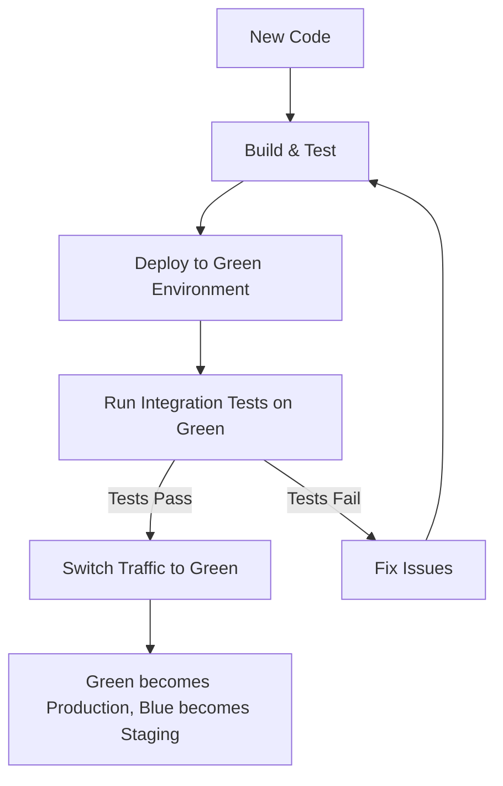
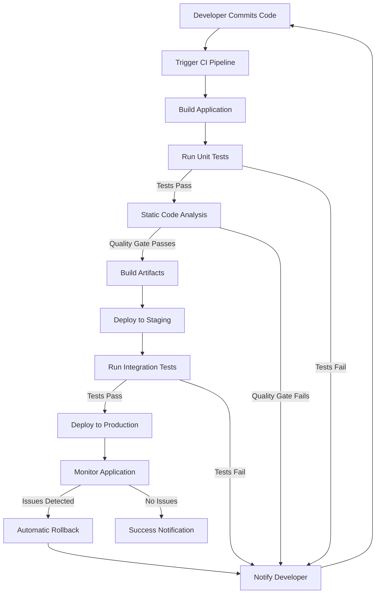

# CI/CD Requirements

## Introduction

Continuous Integration and Continuous Deployment (CI/CD) has transformed how software is built, tested, and delivered. Before diving into implementation, it's essential to understand the fundamental requirements that make CI/CD pipelines effective. This guide explores the necessary components, tools, and practices you'll need to establish a robust CI/CD workflow.

## Prerequisites

Before implementing CI/CD, ensure you have:

- Basic understanding of version control (particularly Git)
- Familiarity with software development processes
- A project that needs automated building, testing, and deployment

## Core CI/CD Requirements

### 1. Version Control System

A version control system (VCS) is the foundation of any CI/CD pipeline.

**Requirements:**
- Git repository (GitHub, GitLab, Bitbucket, etc.)
- Branching strategy (e.g., Gitflow, trunk-based development)
- Pull/Merge request processes

**Example: Basic Git Workflow**

```bash
# Initialize a repository
git init

# Create a development branch
git checkout -b develop

# Make changes and commit
git add .
git commit -m "Add new feature"

# Push to remote repository
git push origin develop

# Create a pull request from develop to main
# (This is done through your Git provider's interface)
```

### 2. Automated Build Process

Your CI/CD pipeline needs the ability to automatically build your application.

**Requirements:**
- Build tool appropriate for your language/framework (e.g., Maven, Gradle, npm, etc.)
- Build configuration file
- Dependency management
- Artifact storage

**Example: Simple npm build script in package.json**

```json
{
  "name": "my-application",
  "version": "1.0.0",
  "scripts": {
    "build": "webpack --mode production",
    "test": "jest"
  },
  "dependencies": {
    "react": "^18.2.0"
  },
  "devDependencies": {
    "webpack": "^5.75.0",
    "jest": "^29.3.1"
  }
}
```

### 3. Automated Testing

Testing ensures your code changes don't break existing functionality.

**Requirements:**
- Unit tests
- Integration tests
- End-to-end tests
- Test runner configuration
- Code coverage reporting

**Example: Jest Test**

```javascript
// sum.js
function sum(a, b) {
  return a + b;
}
module.exports = sum;

// sum.test.js
const sum = require('./sum');

test('adds 1 + 2 to equal 3', () => {
  expect(sum(1, 2)).toBe(3);
});
```

### 4. CI/CD Server or Service

You need a system to execute your pipeline steps.

**Popular Options:**
- Jenkins
- GitHub Actions
- GitLab CI/CD
- CircleCI
- Travis CI
- Azure DevOps

**Example: GitHub Actions Workflow**

```yaml
name: CI Pipeline

on:
  push:
    branches: [ main, develop ]
  pull_request:
    branches: [ main ]

jobs:
  build:
    runs-on: ubuntu-latest
    
    steps:
    - uses: actions/checkout@v3
    
    - name: Set up Node.js
      uses: actions/setup-node@v3
      with:
        node-version: '16'
        
    - name: Install dependencies
      run: npm ci
      
    - name: Run tests
      run: npm test
      
    - name: Build
      run: npm run build
```

### 5. Environment Configuration

Managing different environments is crucial for CI/CD.

**Requirements:**
- Development, staging, and production environments
- Environment variables management
- Secrets management
- Configuration files

**Example: Environment Variables in GitHub Actions**

```yaml
jobs:
  deploy:
    runs-on: ubuntu-latest
    
    steps:
    - uses: actions/checkout@v3
    
    - name: Deploy to staging
      if: github.ref == 'refs/heads/develop'
      run: ./deploy.sh staging
      env:
        API_KEY: ${{ secrets.STAGING_API_KEY }}
        DATABASE_URL: ${{ secrets.STAGING_DB_URL }}
        
    - name: Deploy to production
      if: github.ref == 'refs/heads/main'
      run: ./deploy.sh production
      env:
        API_KEY: ${{ secrets.PRODUCTION_API_KEY }}
        DATABASE_URL: ${{ secrets.PRODUCTION_DB_URL }}
```

### 6. Deployment Strategy

How code changes are deployed to production.

**Common Strategies:**
- Blue-Green deployment
- Canary releases
- Feature flags
- Rolling updates

**Example: Simple Blue-Green Deployment Process**



### 7. Monitoring and Feedback

Tracking application health post-deployment.

**Requirements:**
- Application performance monitoring
- Error tracking
- Logging
- Alerting system
- Feedback loops to development

**Example: Basic Monitoring Setup**

```javascript
// Example Node.js app with basic monitoring
const express = require('express');
const app = express();
const prometheus = require('prom-client');

// Create a metrics collection registry
const register = new prometheus.Registry();
prometheus.collectDefaultMetrics({ register });

// Create a counter for HTTP requests
const httpRequestCounter = new prometheus.Counter({
  name: 'http_requests_total',
  help: 'Total HTTP requests',
  labelNames: ['method', 'route', 'status'],
  registers: [register]
});

// Middleware to count requests
app.use((req, res, next) => {
  const end = res.end;
  res.end = function() {
    httpRequestCounter.inc({
      method: req.method,
      route: req.route?.path || req.path,
      status: res.statusCode
    });
    return end.apply(this, arguments);
  };
  next();
});

// Metrics endpoint for Prometheus
app.get('/metrics', async (req, res) => {
  res.set('Content-Type', register.contentType);
  res.end(await register.metrics());
});

app.listen(3000);
```

## Implementing a Basic CI/CD Pipeline

Let's look at a simplified workflow that ties together these requirements.

### Step-by-Step Implementation

1. **Set up version control**
   - Create a Git repository
   - Establish branching strategy (main, develop, feature branches)
   - Document contribution guidelines

2. **Configure automated build**
   - Create build scripts
   - Define build environments
   - Set up dependency management

3. **Implement automated testing**
   - Write unit tests
   - Create integration tests
   - Configure test runners

4. **Set up CI/CD service**
   - Choose a CI/CD platform
   - Configure pipeline triggers
   - Define pipeline stages

5. **Configure environments**
   - Set up development, staging, and production
   - Manage environment-specific variables
   - Implement secrets management

6. **Define deployment strategy**
   - Choose deployment approach
   - Implement deployment scripts
   - Configure rollback mechanisms

7. **Set up monitoring**
   - Implement application monitoring
   - Configure alerting
   - Establish feedback mechanisms

### Complete Pipeline Flow



## Real-World Example: Web Application CI/CD

Let's consider a practical example for a JavaScript web application:

### Repository Structure

```
my-web-app/
├── src/
├── tests/
├── .github/
│   └── workflows/
│       ├── ci.yml
│       └── deploy.yml
├── package.json
├── webpack.config.js
├── jest.config.js
└── README.md
```

### CI/CD Pipeline Configuration (GitHub Actions)

```yaml
# .github/workflows/ci.yml
name: CI Pipeline

on:
  push:
    branches: [ develop, feature/* ]
  pull_request:
    branches: [ main, develop ]

jobs:
  test:
    runs-on: ubuntu-latest
    
    steps:
    - uses: actions/checkout@v3
    
    - name: Set up Node.js
      uses: actions/setup-node@v3
      with:
        node-version: '16'
        cache: 'npm'
        
    - name: Install dependencies
      run: npm ci
      
    - name: Lint code
      run: npm run lint
      
    - name: Run unit tests
      run: npm test
      
    - name: Build
      run: npm run build
      
    - name: Upload build artifacts
      uses: actions/upload-artifact@v3
      with:
        name: build-files
        path: ./build
```

```yaml
# .github/workflows/deploy.yml
name: Deploy Pipeline

on:
  push:
    branches: [ main ]

jobs:
  deploy:
    runs-on: ubuntu-latest
    
    steps:
    - uses: actions/checkout@v3
    
    - name: Set up Node.js
      uses: actions/setup-node@v3
      with:
        node-version: '16'
        cache: 'npm'
        
    - name: Install dependencies
      run: npm ci
      
    - name: Run tests
      run: npm test
      
    - name: Build
      run: npm run build
      
    - name: Deploy to staging
      run: |
        # Deploy to staging server
        echo "Deploying to staging..."
        
    - name: Run integration tests
      run: |
        # Run integration tests against staging
        echo "Running integration tests..."
        
    - name: Deploy to production
      run: |
        # Deploy to production server
        echo "Deploying to production..."
        
    - name: Verify deployment
      run: |
        # Verify the deployment worked
        echo "Verifying deployment..."
```

## Common Challenges and Solutions

### Slow Pipelines

**Problem**: CI/CD pipelines taking too long to complete.

**Solutions**:
- Parallelize test execution
- Implement test splitting and selective testing
- Cache dependencies and builds
- Use incremental builds when possible

### Flaky Tests

**Problem**: Intermittent test failures that aren't related to code changes.

**Solutions**:
- Isolate test environments
- Add retries for unstable tests
- Improve test logging for better diagnosis
- Separate flaky tests into their own test suite

### Security Concerns

**Problem**: Exposing secrets or deploying insecure code.

**Solutions**:
- Implement security scanning in your pipeline
- Use secrets management services
- Conduct automated vulnerability scanning
- Implement proper access controls

### Managing Dependencies

**Problem**: Dependency changes breaking builds.

**Solutions**:
- Lock dependency versions
- Use dependency scanning tools
- Implement automated dependency updates
- Set up dependency caching

## Best Practices

1. **Keep pipelines fast**
   - Aim for under 10 minutes for the entire pipeline
   - Optimize build and test processes

2. **Make pipelines reliable**
   - Eliminate flaky tests
   - Ensure consistent environments

3. **Prioritize security**
   - Scan for vulnerabilities
   - Protect sensitive information

4. **Implement quality gates**
   - Set code coverage thresholds
   - Enforce code quality standards

5. **Automate everything**
   - Minimize manual intervention
   - Script all deployment steps

6. **Monitor and measure**
   - Track pipeline metrics
   - Measure deployment frequency and failure rates

7. **Practice continuous improvement**
   - Regularly review and optimize your pipeline
   - Keep tools and practices up-to-date

## Summary

Implementing CI/CD requires careful consideration of several components:

- Version control as the foundation
- Automated building and testing
- Environment management
- Deployment strategies
- Monitoring and feedback loops

When these requirements are properly addressed, CI/CD can dramatically improve development velocity, code quality, and deployment reliability. Remember that CI/CD is not just about tools—it's about cultural changes and processes that enable teams to deliver software more efficiently.

## Additional Resources

### Recommended Reading
- "Continuous Delivery" by Jez Humble and David Farley
- "DevOps Handbook" by Gene Kim, Jez Humble, Patrick Debois, and John Willis

### Practice Exercises

1. **Set up a basic CI pipeline**
   - Create a simple application
   - Configure a GitHub Actions workflow
   - Implement automated tests

2. **Implement a deployment pipeline**
   - Set up staging and production environments
   - Configure automated deployments
   - Implement a rollback mechanism

3. **Optimize your pipeline**
   - Measure current pipeline performance
   - Identify bottlenecks
   - Implement improvements and measure results