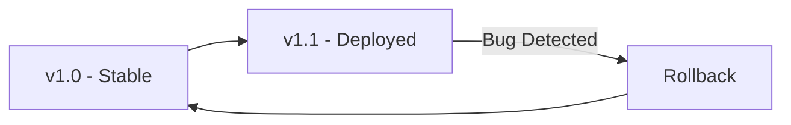
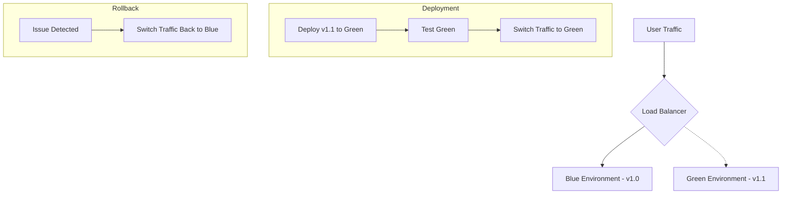
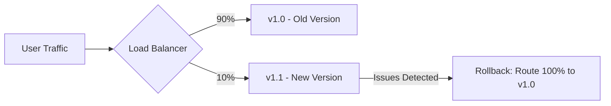
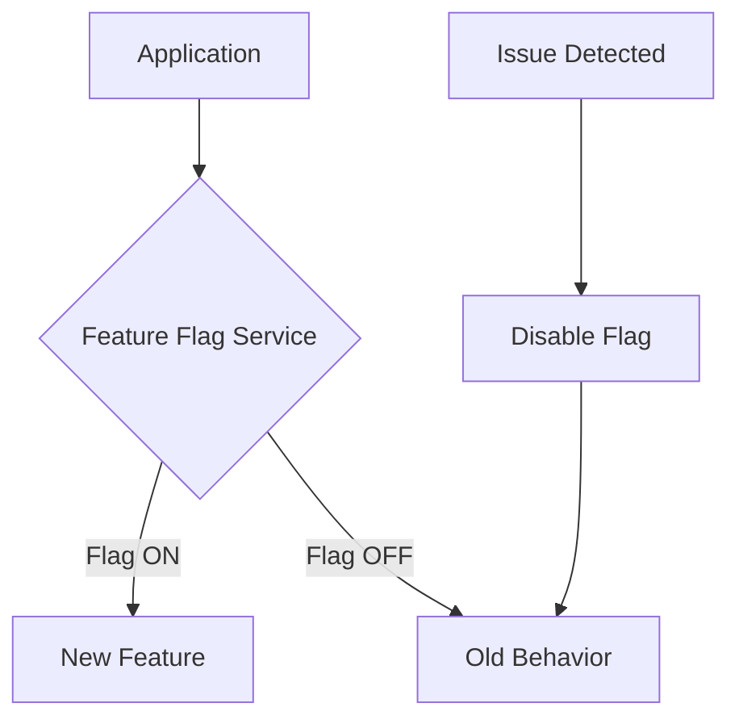

# CI/CD Rollback

## Introduction

Imagine you've just deployed a new version of your application to production. Excitement quickly turns to panic as you realize something is broken. Users are experiencing errors, and your monitoring system is lighting up with alerts. What do you do now?

This is where **CI/CD rollback** comes to the rescue. A rollback is a strategy that allows you to quickly revert to a previous working version of your application when a deployment goes wrong. Think of it as an "undo" button for your software releases.

In this guide, we'll explore:
- What rollbacks are and why they're crucial
- Different rollback strategies
- How to implement rollbacks in your CI/CD pipeline
- Best practices to make your rollbacks smooth and reliable

## Why Rollbacks Matter

Rollbacks are an essential part of any robust CI/CD pipeline for several reasons:

1. **Minimize Downtime**: When issues occur, you can quickly restore service instead of scrambling to fix bugs in production.
2. **Reduce Risk**: Knowing you can easily revert changes makes teams more confident in deploying frequently.
3. **Improve User Experience**: Users experience fewer disruptions when problems are quickly addressed.
4. **Support Experimentation**: Teams can try new features with the safety net of being able to revert if necessary.

## Types of Rollback Strategies

### 1. Version Rollback

The simplest form of rollback is to redeploy a previous version of your application that's known to work correctly.



### 2. Blue-Green Deployment

In blue-green deployment, you maintain two identical production environments (blue and green). At any time, only one environment is live and serving traffic.



### 3. Canary Releases

Canary releases involve gradually routing traffic to the new version, allowing you to detect issues before they affect all users.



### 4. Feature Flags

Feature flags allow you to enable or disable features at runtime without redeploying your application.



## Implementing Rollbacks in Your CI/CD Pipeline

Let's look at practical examples of how to implement rollbacks in different CI/CD tools.

### GitHub Actions Example

Here's how you might implement a simple version rollback in GitHub Actions:

```yaml
name: Deploy and Rollback

on:
  push:
    branches: [ main ]

jobs:
  deploy:
    runs-on: ubuntu-latest
    steps:
      - uses: actions/checkout@v3
      
      - name: Set version info
        id: version
        run: |
          echo "::set-output name=version::$(date +%Y%m%d%H%M%S)"
          echo "::set-output name=previous_version::$(cat last_stable_version.txt)"
      
      - name: Build application
        run: |
          ./build.sh
          
      - name: Deploy application
        run: |
          ./deploy.sh ${{ steps.version.outputs.version }}
          
      - name: Health check
        id: health_check
        run: |
          ./health_check.sh
        continue-on-error: true
      
      - name: Rollback if deploy fails
        if: steps.health_check.outputs.status != 'healthy'
        run: |
          echo "Deployment failed health checks, rolling back to ${{ steps.version.outputs.previous_version }}"
          ./deploy.sh ${{ steps.version.outputs.previous_version }}
          
      - name: Update stable version
        if: steps.health_check.outputs.status == 'healthy'
        run: |
          echo ${{ steps.version.outputs.version }} > last_stable_version.txt
          git config user.name github-actions
          git config user.email github-actions@github.com
          git add last_stable_version.txt
          git commit -m "Update last stable version"
          git push
```

### Jenkins Pipeline Example

Here's a rollback strategy in a Jenkins pipeline:

```groovy
pipeline {
    agent any
    
    environment {
        CURRENT_VERSION = sh(script: 'date +%Y%m%d%H%M%S', returnStdout: true).trim()
        PREVIOUS_VERSION = sh(script: 'cat last_stable_version.txt', returnStdout: true).trim()
    }
    
    stages {
        stage('Build') {
            steps {
                sh 'npm install'
                sh 'npm run build'
            }
        }
        
        stage('Deploy') {
            steps {
                sh "./deploy.sh ${CURRENT_VERSION}"
            }
        }
        
        stage('Health Check') {
            steps {
                script {
                    try {
                        sh './health_check.sh'
                        currentBuild.result = 'SUCCESS'
                    } catch (Exception e) {
                        currentBuild.result = 'FAILURE'
                        error "Deployment failed health checks"
                    }
                }
            }
        }
        
        stage('Update Stable Version') {
            when {
                expression { currentBuild.result == 'SUCCESS' }
            }
            steps {
                sh "echo ${CURRENT_VERSION} > last_stable_version.txt"
                sh 'git add last_stable_version.txt'
                sh 'git commit -m "Update last stable version"'
                sh 'git push origin main'
            }
        }
    }
    
    post {
        failure {
            echo "Deployment failed, rolling back to version ${PREVIOUS_VERSION}"
            sh "./deploy.sh ${PREVIOUS_VERSION}"
        }
    }
}
```

### Kubernetes Rollback Example

Kubernetes has built-in rollback capabilities for deployments:

```bash
# Deploy a new version
kubectl apply -f deployment.yaml

# If issues arise, roll back to the previous version
kubectl rollout undo deployment/my-app

# Roll back to a specific revision
kubectl rollout undo deployment/my-app --to-revision=2
```

Here's what a basic deployment file might look like:

```yaml
apiVersion: apps/v1
kind: Deployment
metadata:
  name: my-app
spec:
  replicas: 3
  selector:
    matchLabels:
      app: my-app
  template:
    metadata:
      labels:
        app: my-app
    spec:
      containers:
      - name: my-app
        image: my-app:1.2.3
        ports:
        - containerPort: 8080
```

## Rollback Automation

For a truly robust CI/CD pipeline, you should automate your rollbacks. Here's a common pattern:

1. **Automatic Monitoring**: Set up monitoring to check your application's health.
2. **Failure Detection**: Define what constitutes a "failed" deployment (error rates, latency, etc.).
3. **Automatic Rollback**: Trigger rollbacks automatically when failures are detected.

Here's a simple script that might be used in your pipeline to check the health of a deployment and roll back if necessary:

```javascript
const axios = require('axios');
const { execSync } = require('child_process');

async function checkHealth() {
  try {
    // Make a request to your health check endpoint
    const response = await axios.get('https://your-app.com/health');
    
    // Check if the health check passes
    if (response.status === 200 && response.data.status === 'healthy') {
      console.log('Health check passed!');
      return true;
    } else {
      console.error('Health check failed: Received unhealthy status');
      return false;
    }
  } catch (error) {
    console.error('Health check failed:', error.message);
    return false;
  }
}

async function monitorAndRollback() {
  // Number of times to check before deciding to roll back
  const maxChecks = 5;
  let healthyChecks = 0;
  
  for (let i = 0; i < maxChecks; i++) {
    console.log(`Health check attempt ${i + 1}/${maxChecks}...`);
    
    if (await checkHealth()) {
      healthyChecks++;
    }
    
    // Wait 10 seconds between checks
    await new Promise(resolve => setTimeout(resolve, 10000));
  }
  
  // If less than 80% of checks are healthy, roll back
  if (healthyChecks < maxChecks * 0.8) {
    console.log('Too many failed health checks. Rolling back...');
    execSync('kubectl rollout undo deployment/my-app');
    console.log('Rollback completed!');
    return false;
  }
  
  console.log('Deployment is stable!');
  return true;
}

monitorAndRollback();
```

## Best Practices for Effective Rollbacks

1. **Version Everything**: Keep track of all deployment versions so you can rollback to any point.
2. **Automate Testing**: Detect issues as early as possible through automated tests.
3. **Database Compatibility**: Ensure your database schema changes are backward compatible.
4. **Immutable Infrastructure**: Use container images or virtual machine snapshots that can be easily replaced.
5. **Practice Rollbacks**: Regularly test your rollback strategy to ensure it works when needed.
6. **Metrics and Monitoring**: Implement comprehensive monitoring to quickly identify when rollbacks are necessary.
7. **Communication Plan**: Have a clear process for communicating issues and rollbacks to stakeholders.

## Common Rollback Challenges

### Database Changes

Database migrations can complicate rollbacks. Consider these approaches:

1. **Backward Compatible Changes**: Make additive changes (like adding columns) rather than destructive ones.
2. **Separate Database Changes**: Deploy database changes separately from application changes.
3. **Blue-Green for Databases**: Maintain two database schemas during transitions.

Example of a backward-compatible database migration:

```sql
-- Instead of:
ALTER TABLE users DROP COLUMN old_field;

-- Do this first (in one deployment):
ALTER TABLE users ADD COLUMN new_field VARCHAR(255);
-- Update application to use new_field

-- Then much later (in a separate deployment):
ALTER TABLE users DROP COLUMN old_field;
```

### Distributed Systems

Rollbacks in microservices architecture require additional consideration:

1. **Service Versioning**: Version your APIs and ensure backwards compatibility.
2. **Choreographed Rollbacks**: Roll back related services together.
3. **Feature Toggles**: Use feature flags to control functionality across services.

## Practical Exercise: Implementing a Basic Rollback

Let's walk through implementing a basic rollback strategy:

1. Create a simple deployment script that includes version tracking:

```bash
#!/bin/bash
# deploy.sh

VERSION=$1
PREVIOUS_VERSION=$(cat version.txt || echo "none")

echo "Deploying version: $VERSION"
echo "Previous version: $PREVIOUS_VERSION"

# Save current version as previous before deploying
echo $VERSION > version.txt

# Deploy your application (this will vary based on your setup)
# For example, with a Docker-based application:
docker build -t myapp:$VERSION .
docker stop myapp || true
docker rm myapp || true
docker run -d --name myapp -p 8080:8080 myapp:$VERSION

# Verify deployment
./health_check.sh
if [ $? -ne 0 ]; then
  echo "Deployment failed, rolling back to $PREVIOUS_VERSION"
  
  if [ "$PREVIOUS_VERSION" != "none" ]; then
    docker stop myapp || true
    docker rm myapp || true
    docker run -d --name myapp -p 8080:8080 myapp:$PREVIOUS_VERSION
    echo $PREVIOUS_VERSION > version.txt
    echo "Rolled back to version $PREVIOUS_VERSION"
  else
    echo "No previous version to roll back to!"
  fi
  
  exit 1
else
  echo "Deployment successful!"
fi
```

2. Create a health check script:

```bash
#!/bin/bash
# health_check.sh

# Wait for application to start
sleep 5

# Make a request to the health endpoint
HEALTH_STATUS=$(curl -s -o /dev/null -w "%{http_code}" http://localhost:8080/health)

if [ $HEALTH_STATUS -eq 200 ]; then
  echo "Health check passed!"
  exit 0
else
  echo "Health check failed with status $HEALTH_STATUS"
  exit 1
fi
```

3. Deploy your application with the script:

```bash
./deploy.sh v1.0
```

4. If the health check fails, the script will automatically roll back to the previous version.

## Summary

Implementing a robust rollback strategy in your CI/CD pipeline is essential for maintaining application reliability and quickly recovering from deployment issues. By understanding different rollback strategies and following best practices, you can create a safety net that allows your team to deploy with confidence.

Remember these key points:
- Rollbacks are your emergency "undo" button for deployments
- Various strategies exist, including version rollback, blue-green deployment, and feature flags
- Automation is key to effective rollbacks
- Practice your rollback strategy regularly
- Consider database changes and distributed systems in your rollback approach

## Additional Resources

- Learn more about Kubernetes deployment strategies
- Explore feature flag management tools
- Investigate advanced monitoring solutions for automatic rollback triggers

## Practice Exercise

Implement a basic rollback strategy for a simple web application:

1. Create a simple web application with a version number displayed on the homepage
2. Set up a CI/CD pipeline using GitHub Actions or Jenkins
3. Implement automatic health checks after deployment
4. Add a rollback mechanism that reverts to the previous version if health checks fail
5. Intentionally introduce a bug and verify that your rollback strategy works correctly

Happy deploying—and rolling back when needed!