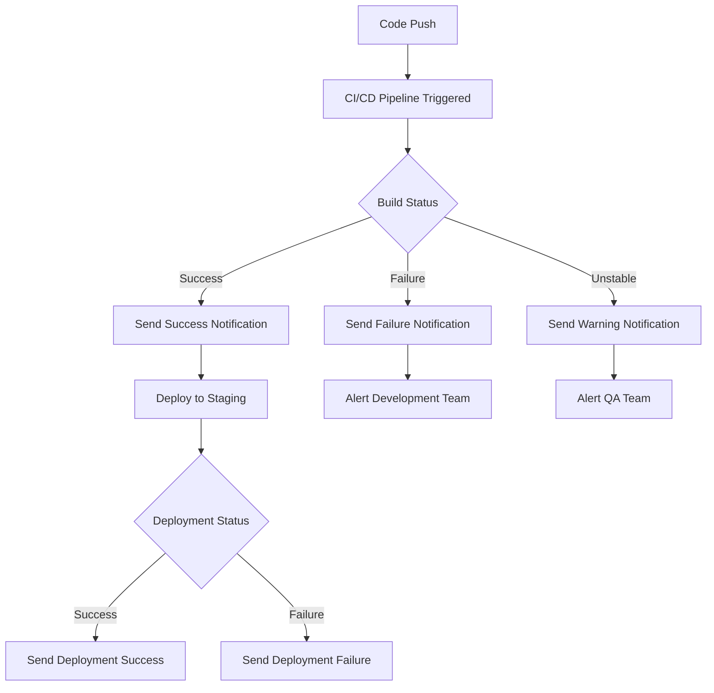

# CI/CD Notifications

## Introduction

Notifications are a critical component of any CI/CD (Continuous Integration/Continuous Deployment) pipeline. They serve as the communication channel between your automated processes and your team, ensuring everyone stays informed about the status of builds, tests, and deployments. 

Without proper notifications, team members would need to constantly check the CI/CD dashboard to know if their changes have been successfully integrated or if something went wrong. Notifications eliminate this inefficiency by proactively alerting relevant stakeholders when important events occur.

In this guide, we'll explore how to implement effective notification strategies in your CI/CD pipeline, covering various notification channels, configuration techniques, and best practices.

## Why Notifications Matter

Before diving into implementation details, let's understand why notifications are so important:

1. **Immediate Feedback**: Developers receive instant feedback when their code changes trigger a pipeline.
2. **Reduced Time to Fix**: Quick notification of failures allows for faster resolution.
3. **Team Awareness**: Everyone stays informed about the status of the application.
4. **Accountability**: Clear tracking of who made changes and whether they caused issues.
5. **Process Visibility**: Stakeholders can track progress without technical access to the CI/CD platform.

## Common Notification Channels

Modern CI/CD systems support multiple notification channels to ensure messages reach team members through their preferred communication methods:

- **Email**: Traditional but effective for formal notifications
- **Slack/Teams/Discord**: Instant messaging platforms for real-time alerts
- **SMS/Mobile Push**: Critical alerts that require immediate attention
- **Webhooks**: For integration with custom systems or applications
- **Dashboard Displays**: For team spaces or monitoring environments

## Basic Notification Setup

Let's start by implementing a basic notification system in a common CI/CD platform. We'll use GitHub Actions as an example, but the concepts apply to most CI/CD tools.

### Email Notifications in GitHub Actions

Here's a simple workflow that sends an email notification when a build fails:

```yaml
name: Build and Notify

on:
  push:
    branches: [ main ]
  pull_request:
    branches: [ main ]

jobs:
  build:
    runs-on: ubuntu-latest
    
    steps:
    - uses: actions/checkout@v3
    
    - name: Set up Node.js
      uses: actions/setup-node@v3
      with:
        node-version: '16'
        
    - name: Install dependencies
      run: npm install
      
    - name: Run tests
      run: npm test
      
    - name: Send email on failure
      if: failure()
      uses: dawidd6/action-send-mail@v3
      with:
        server_address: smtp.gmail.com
        server_port: 465
        username: ${{ secrets.EMAIL_USERNAME }}
        password: ${{ secrets.EMAIL_PASSWORD }}
        subject: Build failed for ${{ github.repository }}
        body: The build failed on branch ${{ github.ref_name }}. Check the logs at ${{ github.server_url }}/${{ github.repository }}/actions/runs/${{ github.run_id }}
        to: team@example.com
        from: CI/CD Notification <ci@example.com>
```

This workflow:
1. Runs on pushes to main and on pull requests
2. Sets up Node.js and runs tests
3. Sends an email notification only when the build fails

## Slack Notifications

Slack is one of the most popular channels for CI/CD notifications due to its real-time nature and rich formatting options.

### Setting up Slack Notifications in Jenkins

If you're using Jenkins, here's how to set up Slack notifications:

1. First, install the "Slack Notification" plugin in Jenkins
2. Configure the plugin with your Slack workspace and token
3. Add notification steps to your Jenkinsfile:

```groovy
pipeline {
    agent any
    
    stages {
        stage('Build') {
            steps {
                // Your build steps here
                sh 'npm install'
                sh 'npm run build'
            }
        }
        
        stage('Test') {
            steps {
                // Your test steps here
                sh 'npm test'
            }
        }
        
        stage('Deploy') {
            steps {
                // Your deployment steps here
                sh 'npm run deploy'
            }
        }
    }
    
    post {
        success {
            slackSend channel: '#builds',
                      color: 'good',
                      message: "SUCCESS: Job '${env.JOB_NAME} [${env.BUILD_NUMBER}]' (${env.BUILD_URL})"
        }
        failure {
            slackSend channel: '#builds',
                      color: 'danger',
                      message: "FAILED: Job '${env.JOB_NAME} [${env.BUILD_NUMBER}]' (${env.BUILD_URL})"
        }
        unstable {
            slackSend channel: '#builds',
                      color: 'warning',
                      message: "UNSTABLE: Job '${env.JOB_NAME} [${env.BUILD_NUMBER}]' (${env.BUILD_URL})"
        }
    }
}
```

This Jenkinsfile sends different notifications to the `#builds` Slack channel based on the build outcome:
- Green notification for successful builds
- Red notification for failed builds
- Yellow notification for unstable builds

## Notification Flow Visualization

Let's visualize a typical notification flow in a CI/CD pipeline:



## Advanced Notification Strategies

### Contextual Notifications

Instead of sending the same notification to everyone, you can make notifications more relevant by tailoring them based on context:

```yaml
name: Contextual Notifications

on:
  pull_request:
    branches: [ main ]

jobs:
  test:
    runs-on: ubuntu-latest
    
    steps:
    - uses: actions/checkout@v3
    
    - name: Run tests
      id: tests
      run: npm test
      continue-on-error: true
      
    - name: Notify on test failures
      if: steps.tests.outcome != 'success'
      uses: 8398a7/action-slack@v3
      with:
        status: failure
        fields: repo,author,commit,message,workflow
        mention: 'here'
        if_mention: failure
        text: |
          Test failures detected in PR #${{ github.event.pull_request.number }}
          
          Failed tests related to files changed by: ${{ github.event.pull_request.user.login }}
          Commit message: ${{ github.event.pull_request.title }}
        channel: '#dev-alerts'
```

This example analyzes the PR to provide contextual information about which developer made changes and what areas might be affected.

### Notification Filtering and Batching

Too many notifications can lead to "alert fatigue." Here are strategies to reduce notification noise:

1. **Threshold-Based Notifications**: Only send alerts when a certain threshold is reached
2. **Notification Batching**: Group multiple similar notifications into a single digest
3. **Time-Window Filtering**: Limit the frequency of similar notifications

Example implementation for notification batching in CircleCI:

```yaml
version: 2.1

orbs:
  slack: circleci/slack@4.10.1

jobs:
  build_and_test:
    docker:
      - image: cimg/node:16.14
    steps:
      - checkout
      - run:
          name: Install dependencies
          command: npm install
      - run:
          name: Run tests
          command: npm test
      # More steps...

workflows:
  daily_workflow:
    triggers:
      - schedule:
          cron: "0 0 * * *" # Daily at midnight UTC
          filters:
            branches:
              only: main
    jobs:
      - build_and_test
      - slack/notify:
          event: always
          custom: |
            {
              "blocks": [
                {
                  "type": "header",
                  "text": {
                    "type": "plain_text",
                    "text": "Daily Build Report",
                    "emoji": true
                  }
                },
                {
                  "type": "section",
                  "text": {
                    "type": "mrkdwn",
                    "text": "*Build Status*: ${CIRCLE_JOB} job ${CIRCLE_WORKFLOW_STATUS}
*Branch*: ${CIRCLE_BRANCH}
*Latest Commit*: ${CIRCLE_SHA1}"
                  }
                }
              ]
            }
```

This workflow sends a single daily digest instead of individual notifications for every commit.

## Notification Security Considerations

When implementing CI/CD notifications, consider these security aspects:

1. **Sensitive Information**: Avoid including secrets, tokens, or sensitive data in notifications
2. **Authentication**: Secure notification endpoints with proper authentication
3. **Limited Access**: Only send notifications to authorized channels or individuals
4. **Audit Trail**: Keep logs of sent notifications for security auditing

## Implementing Custom Notification Services

Sometimes, built-in notification options aren't enough. Here's how to create a custom notification service using webhooks:

```javascript
// custom-notifier.js
const axios = require('axios');

async function sendCustomNotification(buildStatus, details) {
  try {
    const payload = {
      status: buildStatus,
      project: process.env.PROJECT_NAME,
      branch: process.env.BRANCH_NAME,
      commit: process.env.COMMIT_SHA,
      buildUrl: process.env.BUILD_URL,
      timestamp: new Date().toISOString(),
      details: details
    };
    
    const response = await axios.post(process.env.WEBHOOK_URL, payload, {
      headers: {
        'Content-Type': 'application/json',
        'Authorization': `Bearer ${process.env.WEBHOOK_TOKEN}`
      }
    });
    
    console.log('Notification sent successfully!');
    return response.data;
  } catch (error) {
    console.error('Failed to send notification:', error);
    throw error;
  }
}

// Usage example
sendCustomNotification('success', {
  testsPassed: 42,
  testsFailed: 0,
  coveragePercent: 87.5,
  buildDuration: '3m 24s'
});
```

You can integrate this custom notifier into your CI/CD pipeline:

```yaml
# In GitHub Actions workflow
- name: Send custom notification
  if: always()
  run: |
    export PROJECT_NAME=${{ github.repository }}
    export BRANCH_NAME=${{ github.ref_name }}
    export COMMIT_SHA=${{ github.sha }}
    export BUILD_URL=${{ github.server_url }}/${{ github.repository }}/actions/runs/${{ github.run_id }}
    export WEBHOOK_URL=${{ secrets.NOTIFICATION_WEBHOOK_URL }}
    export WEBHOOK_TOKEN=${{ secrets.NOTIFICATION_WEBHOOK_TOKEN }}
    node custom-notifier.js
```

## Best Practices for CI/CD Notifications

To ensure your notifications are effective:

1. **Be Concise**: Include only essential information in the notification
2. **Provide Context**: Make it clear what happened and what action is needed
3. **Include Links**: Add direct links to build logs, commits, or relevant documentation
4. **Use Visual Cues**: Utilize colors, emojis, or icons to quickly convey status
5. **Target the Right Audience**: Only notify people who need to know
6. **Set Appropriate Urgency**: Distinguish between critical failures and minor issues
7. **Include Actionable Information**: Provide guidance on next steps
8. **Monitor Notification Effectiveness**: Regularly review and adjust your notification strategy

## Common CI/CD Notification Patterns

### The "You Build It, You Run It" Pattern

This pattern ensures developers receive notifications for issues in their own code:

```yaml
# GitHub Actions example
- name: Determine code owner
  id: codeowner
  run: |
    AUTHOR=$(git show -s --format='%ae' ${{ github.sha }})
    echo "author=$AUTHOR" >> $GITHUB_OUTPUT

- name: Notify author on failure
  if: failure()
  uses: dawidd6/action-send-mail@v3
  with:
    # Email configuration
    to: ${{ steps.codeowner.outputs.author }}
    subject: Your build failed
    body: |
      Hello,
      
      The build for your recent commit (${{ github.sha }}) has failed.
      Please check the logs and fix the issue as soon as possible.
      
      Build URL: ${{ github.server_url }}/${{ github.repository }}/actions/runs/${{ github.run_id }}
```

### The "Status Dashboard" Pattern

This pattern involves sending all notifications to a central dashboard:

```javascript
// webhook-handler.js
const express = require('express');
const app = express();
const port = process.env.PORT || 3000;

// In-memory store for build statuses (in production, use a database)
const buildStatuses = [];

app.use(express.json());

app.post('/webhook', (req, res) => {
  const notification = req.body;
  
  // Save the notification
  buildStatuses.push({
    ...notification,
    receivedAt: new Date()
  });
  
  // In a real implementation, you might:
  // 1. Save to database
  // 2. Update real-time dashboard via WebSockets
  // 3. Trigger additional actions
  
  console.log('Received build notification:', notification);
  res.status(200).send({ status: 'received' });
});

app.get('/dashboard', (req, res) => {
  res.json(buildStatuses);
});

app.listen(port, () => {
  console.log(`Notification server listening at http://localhost:${port}`);
});
```

## Real-World Example: Complete CI/CD Notification System

Let's put everything together with a comprehensive example using GitLab CI:

```yaml
stages:
  - test
  - build
  - deploy
  - notify

variables:
  SLACK_CHANNEL: '#deployments'
  URGENT_CHANNEL: '#alerts'

.notification_template: &notification_template
  image: curlimages/curl:latest
  script:
    - |
      curl -X POST \
        -H "Content-Type: application/json" \
        -H "Authorization: Bearer ${NOTIFICATION_TOKEN}" \
        --data "{
          \"channel\": \"${CHANNEL}\",
          \"username\": \"GitLab CI\",
          \"icon_emoji\": \"${EMOJI}\",
          \"text\": \"${MESSAGE}\",
          \"attachments\": [{
            \"color\": \"${COLOR}\",
            \"title\": \"${CI_PROJECT_NAME} - ${CI_COMMIT_REF_NAME}\",
            \"title_link\": \"${CI_PROJECT_URL}/pipelines/${CI_PIPELINE_ID}\",
            \"fields\": [
              {\"title\": \"Status\", \"value\": \"${STATUS}\", \"short\": true},
              {\"title\": \"Commit\", \"value\": \"${CI_COMMIT_SHORT_SHA}\", \"short\": true},
              {\"title\": \"Author\", \"value\": \"${GITLAB_USER_NAME}\", \"short\": true}
            ]
          }]
        }" \
        ${WEBHOOK_URL}

test:
  stage: test
  script:
    - npm install
    - npm test
  artifacts:
    reports:
      junit: test-results.xml

build:
  stage: build
  script:
    - npm run build
  artifacts:
    paths:
      - dist/

deploy:
  stage: deploy
  script:
    - npm run deploy
  environment:
    name: production
  only:
    - main

notify_success:
  stage: notify
  extends: .notification_template
  variables:
    CHANNEL: ${SLACK_CHANNEL}
    EMOJI: ":white_check_mark:"
    MESSAGE: "Deployment successful!"
    COLOR: "good"
    STATUS: "Success"
  only:
    - main
  when: on_success

notify_failure:
  stage: notify
  extends: .notification_template
  variables:
    CHANNEL: ${URGENT_CHANNEL}
    EMOJI: ":x:"
    MESSAGE: "Deployment failed. Urgent attention required!"
    COLOR: "danger"
    STATUS: "Failure"
  only:
    - main
  when: on_failure
```

This GitLab CI configuration:
1. Defines a reusable notification template
2. Runs tests, builds, and deploys the application
3. Sends a success notification to a regular channel on success
4. Sends a failure notification to an urgent channel on failure

## Integrating Notifications with Ticketing Systems

For more mature teams, connecting CI/CD notifications with ticketing systems like Jira can provide traceability:

```python
# jira-notifier.py
import os
import sys
import requests
from jira import JIRA

# Get environment variables
jira_url = os.environ.get('JIRA_URL')
jira_username = os.environ.get('JIRA_USERNAME')
jira_api_token = os.environ.get('JIRA_API_TOKEN')
build_status = os.environ.get('BUILD_STATUS')
pipeline_id = os.environ.get('PIPELINE_ID')
branch_name = os.environ.get('BRANCH_NAME')

# Connect to Jira
jira = JIRA(
    server=jira_url,
    basic_auth=(jira_username, jira_api_token)
)

# Extract Jira issue key from branch name (e.g., feature/PROJ-123-new-feature)
import re
issue_key_match = re.search(r'([A-Z]+-\d+)', branch_name)
if not issue_key_match:
    print("No Jira issue key found in branch name")
    sys.exit(0)

issue_key = issue_key_match.group(1)

try:
    # Get the issue
    issue = jira.issue(issue_key)
    
    # Add a comment with build status
    if build_status == 'success':
        comment = f"✅ CI/CD Pipeline #{pipeline_id} completed successfully. Ready for review."
    else:
        comment = f"❌ CI/CD Pipeline #{pipeline_id} failed. Please check the build logs."
    
    jira.add_comment(issue, comment)
    
    # If build successful and in a specific state, transition the issue
    if build_status == 'success' and issue.fields.status.name == 'In Progress':
        transitions = jira.transitions(issue)
        for t in transitions:
            if t['name'] == 'Ready for Review':
                jira.transition_issue(issue, t['id'])
                print(f"Transitioned issue {issue_key} to Ready for Review")
                break
    
    print(f"Successfully updated Jira issue {issue_key}")
    
except Exception as e:
    print(f"Error updating Jira: {str(e)}")
    sys.exit(1)
```

## Summary

CI/CD notifications are essential for keeping your development team informed about the status of your pipeline. By implementing effective notification strategies, you can:

- Reduce response time to critical issues
- Keep stakeholders informed without manual checks
- Increase visibility into your development process
- Create accountability for build and deployment issues
- Automate communication around your CI/CD workflow

Remember that notification strategies should evolve with your team. Start simple with basic email or chat notifications, then gradually implement more sophisticated patterns as your needs grow.

## Additional Resources

Here are some resources to help you further explore CI/CD notifications:

- **Documentation**
  - [GitHub Actions Notifications](https://docs.github.com/en/actions/monitoring-and-troubleshooting-workflows/adding-a-workflow-status-badge)
  - [Jenkins Notification Plugin](https://plugins.jenkins.io/notification/)
  - [GitLab Notifications](https://docs.gitlab.com/ee/user/profile/notifications.html)
  - [CircleCI Notifications](https://circleci.com/docs/notifications/)

- **Exercises**
  1. Set up email notifications for a GitHub Actions workflow
  2. Implement Slack notifications for build failures in your CI/CD pipeline
  3. Create a custom notification service that sends targeted alerts based on which tests failed
  4. Design a notification dashboard that aggregates status from multiple pipelines