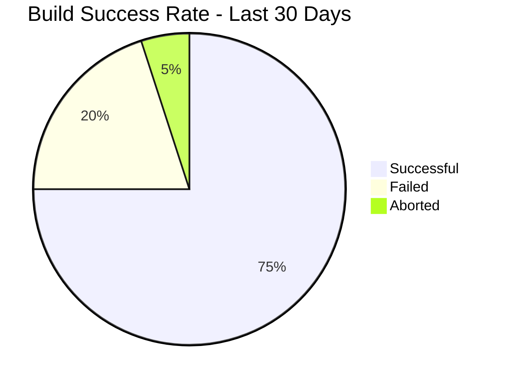

# CI/CD Reporting

## Introduction

Continuous Integration and Continuous Delivery (CI/CD) pipelines generate vast amounts of data about your software development lifecycle. CI/CD reporting is the practice of collecting, analyzing, and presenting this data to gain insights into the health, performance, and efficiency of your development and deployment processes.

For beginners implementing CI/CD, understanding how to set up effective reporting mechanisms is crucial for identifying bottlenecks, tracking improvements, and making data-driven decisions about your development workflow.

## Why CI/CD Reporting Matters

Effective reporting provides several benefits to development teams:

- **Visibility**: Get clear insights into pipeline performance and build statuses
- **Accountability**: Track who made changes and when
- **Quality Assurance**: Monitor test coverage and failures over time
- **Efficiency**: Identify bottlenecks in your delivery process
- **Improvement**: Measure the impact of process changes

## Essential CI/CD Metrics to Track

### 1. Build Metrics

#### Build Success Rate

The percentage of successful builds over a given time period.



#### Build Duration

How long your builds take to complete. Tracking this over time helps identify performance regressions.

```javascript
// Example script to calculate average build time from Jenkins
const builds = jenkins.getBuilds('main-pipeline', 20); // Get last 20 builds
const durations = builds.map(build => build.duration);
const averageDuration = durations.reduce((a, b) => a + b, 0) / durations.length;

console.log(`Average build duration: ${(averageDuration/1000/60).toFixed(2)} minutes`);
// Output: Average build duration: 8.45 minutes
```

#### Mean Time to Recovery (MTTR)

How quickly your team can fix a broken build.

### 2. Test Metrics

#### Test Coverage

The percentage of your codebase covered by automated tests.

```yaml
# Example configuration for a coverage report in .gitlab-ci.yml
test_coverage:
  stage: test
  script:
    - npm test -- --coverage
  coverage: /All files[^|]*\|[^|]*\s+([\d\.]+)/
  artifacts:
    paths:
      - coverage/
```

#### Test Failure Rate

The percentage of tests that fail in each build.

#### Flaky Tests

Tests that sometimes pass and sometimes fail with the same code.

### 3. Deployment Metrics

#### Deployment Frequency

How often you deploy to production.

#### Deployment Success Rate

The percentage of successful deployments.

#### Lead Time

The time from code commit to successful deployment in production.

#### Change Failure Rate

The percentage of deployments that cause failures in production.

## Setting Up Basic CI/CD Reporting

Let's implement a basic reporting system for a CI/CD pipeline. We'll cover setup for some popular tools:

### GitHub Actions Reporting

GitHub Actions provides built-in reports for your workflows. You can also create custom reports:

```yaml
# .github/workflows/report.yml
name: Generate CI Report

on:
  schedule:
    - cron: '0 0 * * 0'  # Run weekly on Sunday at midnight

jobs:
  generate-report:
    runs-on: ubuntu-latest
    steps:
      - uses: actions/checkout@v3
      
      - name: Get workflow statistics
        id: stats
        uses: actions/github-script@v6
        with:
          script: |
            const workflows = await github.rest.actions.listWorkflowRunsForRepo({
              owner: context.repo.owner,
              repo: context.repo.repo,
              created: `>${new Date(Date.now() - 7 * 24 * 60 * 60 * 1000).toISOString()}`
            });
            
            const successful = workflows.data.workflow_runs.filter(run => run.conclusion === 'success').length;
            const failed = workflows.data.workflow_runs.filter(run => run.conclusion === 'failure').length;
            const total = workflows.data.workflow_runs.length;
            
            console.log(`Total runs: ${total}`);
            console.log(`Success rate: ${(successful/total*100).toFixed(2)}%`);
            
            return {
              total: total,
              success_rate: (successful/total*100).toFixed(2)
            };
            
      - name: Create report
        run: |
          echo "# Weekly CI Report" > report.md
          echo "Generated on $(date)" >> report.md
          echo "- Total workflow runs: ${{ steps.stats.outputs.total }}" >> report.md  
          echo "- Success rate: ${{ steps.stats.outputs.success_rate }}%" >> report.md
          
      - name: Upload report
        uses: actions/upload-artifact@v3
        with:
          name: ci-report
          path: report.md
```

### Jenkins Reporting

Jenkins offers several plugins for reporting:

1. Install the "Dashboard View" plugin in Jenkins
2. Create a new dashboard view
3. Add build statistics widgets

```groovy
// Jenkinsfile with reporting
pipeline {
    agent any
    
    stages {
        stage('Build') {
            steps {
                sh 'npm install'
                sh 'npm run build'
            }
        }
        stage('Test') {
            steps {
                sh 'npm test'
            }
            post {
                always {
                    junit 'test-results/*.xml'
                    publishHTML([
                        allowMissing: false,
                        alwaysLinkToLastBuild: true,
                        keepAll: true,
                        reportDir: 'coverage',
                        reportFiles: 'index.html',
                        reportName: 'Coverage Report'
                    ])
                }
            }
        }
    }
    
    post {
        always {
            recordIssues enabledForFailure: true, tool: checkStyle()
            recordIssues enabledForFailure: true, tool: spotBugs()
        }
    }
}
```

### GitLab CI Reporting

GitLab CI provides rich reporting capabilities with metrics, graphs, and dashboards:

```yaml
# .gitlab-ci.yml with reporting
stages:
  - build
  - test
  - deploy

build_job:
  stage: build
  script:
    - npm install
    - npm run build
  artifacts:
    paths:
      - dist/

test_job:
  stage: test
  script:
    - npm test
  artifacts:
    reports:
      junit: test-results.xml
      coverage_report:
        coverage_format: cobertura
        path: coverage/cobertura-coverage.xml

deploy_job:
  stage: deploy
  script:
    - echo "Deploying application..."
  environment:
    name: production
  only:
    - main
```

## Creating Custom Reports

Sometimes the built-in reporting tools don't provide everything you need. Here's how to create a custom report:

```javascript
// report-generator.js
const fs = require('fs');
const axios = require('axios');

async function generateReport() {
  // Fetch build data from CI API
  const ciData = await axios.get('https://ci.example.com/api/builds', {
    headers: { 'Authorization': `Bearer ${process.env.CI_TOKEN}` }
  });
  
  // Process the data
  const builds = ciData.data;
  const totalBuilds = builds.length;
  const successfulBuilds = builds.filter(build => build.status === 'success').length;
  const successRate = (successfulBuilds / totalBuilds * 100).toFixed(2);
  
  const averageDuration = builds.reduce((sum, build) => sum + build.duration, 0) / totalBuilds;
  
  // Generate report
  const report = {
    generated_at: new Date().toISOString(),
    total_builds: totalBuilds,
    success_rate: `${successRate}%`,
    average_duration: `${(averageDuration/60).toFixed(2)} minutes`,
    trend: successRate > 90 ? 'positive' : 'concerning'
  };
  
  // Save report to file
  fs.writeFileSync('ci-report.json', JSON.stringify(report, null, 2));
  console.log('Report generated successfully');
}

generateReport().catch(console.error);

// Output: Report generated successfully
// Creates a JSON file with build statistics
```

## Visualizing CI/CD Data

Raw numbers are useful, but visualizations make it easier to understand trends and patterns:

### Option 1: Use Built-in Dashboards

Most CI/CD tools offer built-in dashboards:

- GitHub Actions: Check the "Insights" tab
- GitLab: Use the CI/CD Analytics page
- Jenkins: Use plugins like "Build Monitor View"

### Option 2: Export to Dedicated Dashboarding Tools

For more advanced analytics, export your CI/CD data to dedicated tools:

```javascript
// Example script to export CI data to Prometheus
const client = require('prom-client');
const axios = require('axios');

// Create a counter for build results
const buildCounter = new client.Counter({
  name: 'cicd_builds_total',
  help: 'Total number of builds',
  labelNames: ['status']
});

// Create a gauge for build duration
const buildDurationGauge = new client.Gauge({
  name: 'cicd_build_duration_seconds',
  help: 'Build duration in seconds'
});

async function exportMetrics() {
  // Fetch recent builds
  const builds = await axios.get('https://ci.example.com/api/builds/recent');
  
  // Update Prometheus metrics
  builds.data.forEach(build => {
    buildCounter.inc({ status: build.status });
    buildDurationGauge.set(build.duration_seconds);
  });
  
  // Export metrics to Prometheus
  console.log(await client.register.metrics());
}

exportMetrics().catch(console.error);

// Output:
// # HELP cicd_builds_total Total number of builds
// # TYPE cicd_builds_total counter
// cicd_builds_total{status="success"} 42
// cicd_builds_total{status="failure"} 7
// # HELP cicd_build_duration_seconds Build duration in seconds
// # TYPE cicd_build_duration_seconds gauge
// cicd_build_duration_seconds 156
```

## Real-world Example: Implementing a Complete Reporting Solution

Let's build a complete solution that:
1. Collects data from our CI/CD pipeline
2. Processes and stores it
3. Generates reports
4. Sends notifications

```javascript
// comprehensive-reporter.js
const fs = require('fs');
const axios = require('axios');
const nodemailer = require('nodemailer');

class CICDReporter {
  constructor(config) {
    this.config = config;
    this.data = {
      builds: [],
      tests: [],
      deployments: []
    };
  }
  
  async collectData() {
    // Fetch build data
    const buildsResponse = await axios.get(
      `${this.config.ciServer}/api/builds`, 
      { headers: { 'Authorization': `Bearer ${this.config.apiToken}` } }
    );
    this.data.builds = buildsResponse.data;
    
    // Fetch test results
    const testsResponse = await axios.get(
      `${this.config.ciServer}/api/tests`, 
      { headers: { 'Authorization': `Bearer ${this.config.apiToken}` } }
    );
    this.data.tests = testsResponse.data;
    
    // Fetch deployment data
    const deploymentsResponse = await axios.get(
      `${this.config.ciServer}/api/deployments`, 
      { headers: { 'Authorization': `Bearer ${this.config.apiToken}` } }
    );
    this.data.deployments = deploymentsResponse.data;
    
    console.log('Data collected successfully');
  }
  
  analyzeData() {
    const analysis = {
      buildSuccessRate: this.calculateBuildSuccessRate(),
      averageBuildDuration: this.calculateAverageBuildDuration(),
      testCoverage: this.calculateTestCoverage(),
      deploymentFrequency: this.calculateDeploymentFrequency(),
      leadTime: this.calculateLeadTime()
    };
    
    return analysis;
  }
  
  calculateBuildSuccessRate() {
    const successful = this.data.builds.filter(build => build.status === 'success').length;
    return (successful / this.data.builds.length * 100).toFixed(2);
  }
  
  calculateAverageBuildDuration() {
    const sum = this.data.builds.reduce((total, build) => total + build.duration, 0);
    return (sum / this.data.builds.length / 60).toFixed(2); // in minutes
  }
  
  calculateTestCoverage() {
    // Simplified calculation
    const covered = this.data.tests.covered || 0;
    const total = this.data.tests.total || 1;
    return (covered / total * 100).toFixed(2);
  }
  
  calculateDeploymentFrequency() {
    // Count deployments in the last 7 days
    const oneWeekAgo = new Date();
    oneWeekAgo.setDate(oneWeekAgo.getDate() - 7);
    
    const recentDeployments = this.data.deployments.filter(
      deploy => new Date(deploy.timestamp) > oneWeekAgo
    ).length;
    
    return recentDeployments;
  }
  
  calculateLeadTime() {
    // Average time from commit to production in hours
    let totalTime = 0;
    let count = 0;
    
    this.data.deployments.forEach(deploy => {
      if (deploy.commit_timestamp && deploy.deploy_timestamp) {
        const commitTime = new Date(deploy.commit_timestamp).getTime();
        const deployTime = new Date(deploy.deploy_timestamp).getTime();
        totalTime += (deployTime - commitTime) / (1000 * 60 * 60); // Convert to hours
        count++;
      }
    });
    
    return (totalTime / count).toFixed(2);
  }
  
  generateReport() {
    const analysis = this.analyzeData();
    const report = {
      timestamp: new Date().toISOString(),
      period: "Last 7 days",
      metrics: analysis,
      trends: {
        buildSuccess: this.getTrend(this.config.previousReport?.metrics?.buildSuccessRate, analysis.buildSuccessRate),
        buildDuration: this.getTrend(this.config.previousReport?.metrics?.averageBuildDuration, analysis.averageBuildDuration, true),
        deploymentFrequency: this.getTrend(this.config.previousReport?.metrics?.deploymentFrequency, analysis.deploymentFrequency)
      },
      recommendations: this.generateRecommendations(analysis)
    };
    
    fs.writeFileSync('cicd-report.json', JSON.stringify(report, null, 2));
    
    console.log('Report generated successfully');
    return report;
  }
  
  getTrend(previous, current, lowerIsBetter = false) {
    if (!previous) return "neutral";
    
    const diff = current - previous;
    if (Math.abs(diff) < 0.5) return "neutral";
    
    if (lowerIsBetter) {
      return diff < 0 ? "positive" : "negative";
    } else {
      return diff > 0 ? "positive" : "negative";
    }
  }
  
  generateRecommendations(analysis) {
    const recommendations = [];
    
    if (analysis.buildSuccessRate < 90) {
      recommendations.push("Investigate causes of build failures to improve build success rate.");
    }
    
    if (analysis.averageBuildDuration > 10) {
      recommendations.push("Optimize build process to reduce average build time.");
    }
    
    if (analysis.testCoverage < 70) {
      recommendations.push("Increase test coverage to improve code quality.");
    }
    
    if (analysis.deploymentFrequency < 3) {
      recommendations.push("Consider more frequent deployments to reduce batch size and risk.");
    }
    
    if (analysis.leadTime > 24) {
      recommendations.push("Work on reducing lead time to get changes to production faster.");
    }
    
    return recommendations;
  }
  
  async sendReportEmail(report) {
    const transporter = nodemailer.createTransport({
      host: this.config.smtp.host,
      port: this.config.smtp.port,
      secure: this.config.smtp.secure,
      auth: {
        user: this.config.smtp.user,
        pass: this.config.smtp.pass
      }
    });
    
    const mailOptions = {
      from: this.config.smtp.from,
      to: this.config.reportRecipients.join(', '),
      subject: 'Weekly CI/CD Pipeline Report',
      html: this.generateEmailHtml(report)
    };
    
    const info = await transporter.sendMail(mailOptions);
    console.log(`Email sent: ${info.messageId}`);
  }
  
  generateEmailHtml(report) {
    return `
      <h1>CI/CD Pipeline Report</h1>
      <p>Period: ${report.period}</p>
      
      <h2>Key Metrics</h2>
      <ul>
        <li>Build Success Rate: ${report.metrics.buildSuccessRate}% 
            <span style="color: ${report.trends.buildSuccess === 'positive' ? 'green' : 
                              report.trends.buildSuccess === 'negative' ? 'red' : 'gray'}">
              (${report.trends.buildSuccess === 'positive' ? '↑' : 
                 report.trends.buildSuccess === 'negative' ? '↓' : '→'})
            </span>
        </li>
        <li>Average Build Duration: ${report.metrics.averageBuildDuration} minutes
            <span style="color: ${report.trends.buildDuration === 'positive' ? 'green' : 
                              report.trends.buildDuration === 'negative' ? 'red' : 'gray'}">
              (${report.trends.buildDuration === 'positive' ? '↑' : 
                 report.trends.buildDuration === 'negative' ? '↓' : '→'})
            </span>
        </li>
        <li>Test Coverage: ${report.metrics.testCoverage}%</li>
        <li>Deployment Frequency: ${report.metrics.deploymentFrequency} per week
            <span style="color: ${report.trends.deploymentFrequency === 'positive' ? 'green' : 
                              report.trends.deploymentFrequency === 'negative' ? 'red' : 'gray'}">
              (${report.trends.deploymentFrequency === 'positive' ? '↑' : 
                 report.trends.deploymentFrequency === 'negative' ? '↓' : '→'})
            </span>
        </li>
        <li>Lead Time: ${report.metrics.leadTime} hours</li>
      </ul>
      
      <h2>Recommendations</h2>
      <ul>
        ${report.recommendations.map(rec => `<li>${rec}</li>`).join('')}
      </ul>
      
      <p>View the full report <a href="${this.config.reportUrl}">here</a>.</p>
    `;
  }
  
  async run() {
    try {
      await this.collectData();
      const report = this.generateReport();
      await this.sendReportEmail(report);
    } catch (error) {
      console.error('Error running reporter:', error);
    }
  }
}

// Usage example
const config = {
  ciServer: 'https://ci.example.com',
  apiToken: process.env.CI_API_TOKEN,
  previousReport: JSON.parse(fs.existsSync('cicd-report.json') ? 
    fs.readFileSync('cicd-report.json', 'utf8') : '{}'),
  smtp: {
    host: 'smtp.example.com',
    port: 587,
    secure: false,
    user: process.env.SMTP_USER,
    pass: process.env.SMTP_PASS,
    from: 'ci-reporter@example.com'
  },
  reportRecipients: ['team@example.com', 'manager@example.com'],
  reportUrl: 'https://dashboard.example.com/reports/latest'
};

const reporter = new CICDReporter(config);
reporter.run().catch(console.error);

// Output:
// Data collected successfully
// Report generated successfully
// Email sent: <messageId>
```

## Best Practices for CI/CD Reporting

### 1. Focus on Actionable Metrics

Don't track metrics just for the sake of it. Each metric should help you make decisions about your development process.

### 2. Establish Baselines

Before trying to improve, establish baselines for your key metrics so you can track progress over time.

### 3. Set Realistic Goals

Set realistic and achievable targets for improvement based on your baselines.

### 4. Make Reports Accessible

Ensure all team members can access and understand the reports. Use clear visualizations and explanations.

### 5. Automate Report Generation

Manually generating reports is time-consuming and error-prone. Automate the process to ensure consistency.

### 6. Regular Reviews

Schedule regular reviews of your reports to identify trends and make improvements.

## Common Challenges and Solutions

### Challenge 1: Data Overload

**Problem**: Too many metrics making it hard to focus.

**Solution**: Start with a few key metrics (like build time, success rate, and deployment frequency) and add more as needed.

### Challenge 2: Poor Data Quality

**Problem**: Incomplete or inaccurate data leads to misleading reports.

**Solution**: Implement data validation and ensure all necessary events are being captured correctly.

### Challenge 3: Lack of Context

**Problem**: Raw numbers without context don't provide insights.

**Solution**: Include historical trends and benchmarks in your reports to provide context.

## Summary

CI/CD reporting is an essential practice for gaining insights into your development process and making data-driven improvements. By tracking key metrics like build success rate, test coverage, and deployment frequency, you can identify bottlenecks, measure the impact of changes, and continuously improve your software delivery pipeline.

Remember to:
- Focus on actionable metrics
- Automate data collection and report generation
- Make reports accessible to all team members
- Regularly review and act on the insights

With effective CI/CD reporting, you'll be better equipped to deliver high-quality software more efficiently and reliably.

## Additional Resources

- **Books**:
  - "Accelerate: The Science of Lean Software and DevOps" by Nicole Forsgren, Jez Humble, and Gene Kim
  - "Continuous Delivery" by Jez Humble and David Farley

- **Practice Exercises**:
  1. Set up a basic CI/CD pipeline with reporting using GitHub Actions or GitLab CI
  2. Implement a custom reporting tool that collects data from your CI/CD system
  3. Create a dashboard to visualize your CI/CD metrics
  4. Configure alerts for when key metrics fall below certain thresholds