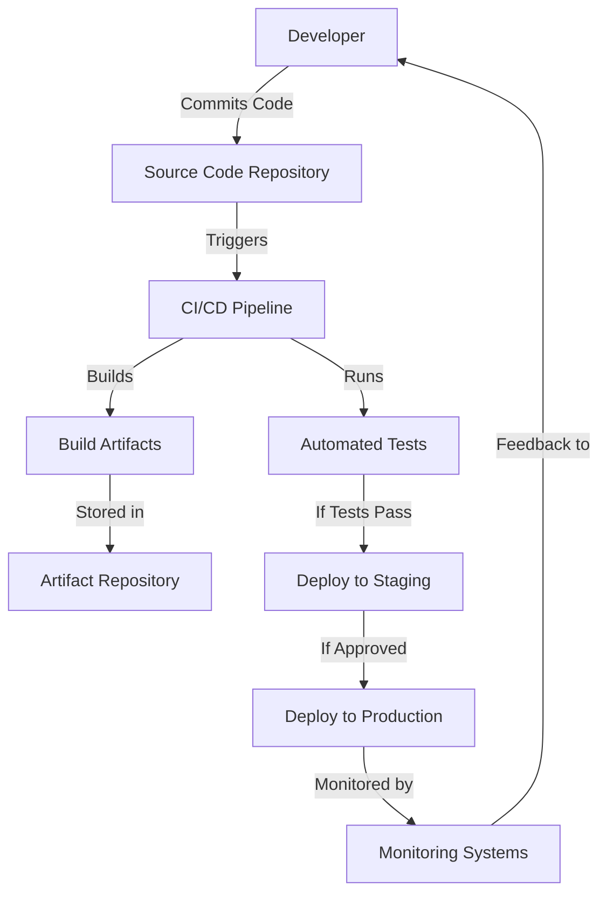
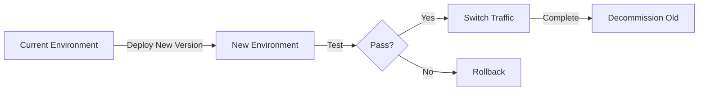

# CI/CD Infrastructure

## Introduction

Continuous Integration and Continuous Deployment (CI/CD) is a modern software development approach that relies on automating the process of integrating code changes, testing them, and deploying them to production environments. For CI/CD to work effectively, you need the right infrastructure in place.

In this guide, we'll explore the critical infrastructure components that power CI/CD pipelines, understand how they work together, and learn how to set up a basic CI/CD infrastructure for your projects.

## What is CI/CD Infrastructure?

CI/CD infrastructure refers to the set of tools, services, and systems that enable continuous integration and continuous deployment workflows. This infrastructure provides the foundation for automating your software delivery pipeline from code commit to production deployment.

Think of CI/CD infrastructure as the foundation of a house - without a solid foundation, the rest of the building cannot stand securely.

## Core Components of CI/CD Infrastructure

### 1. Source Code Repository

The source code repository is where your code lives and typically serves as the starting point of your CI/CD pipeline.

**Popular Options:**
- GitHub
- GitLab
- Bitbucket
- Azure DevOps

**Key Features:**
- Version control
- Branch management
- Code review mechanisms (Pull Requests/Merge Requests)
- Webhooks to trigger CI/CD processes

### 2. CI/CD Server/Platform

This is the central component that orchestrates your pipeline and executes the defined workflows.

**Popular Options:**
- Jenkins
- GitLab CI
- GitHub Actions
- CircleCI
- Travis CI
- Azure DevOps Pipelines

**Example Jenkins Pipeline Configuration:**

```groovy
pipeline {
    agent any
    
    stages {
        stage('Build') {
            steps {
                echo 'Building the application'
                sh 'mvn clean package'
            }
        }
        stage('Test') {
            steps {
                echo 'Running tests'
                sh 'mvn test'
            }
        }
        stage('Deploy') {
            steps {
                echo 'Deploying to staging'
                sh './deploy.sh staging'
            }
        }
    }
    
    post {
        success {
            echo 'Pipeline completed successfully!'
        }
        failure {
            echo 'Pipeline failed!'
        }
    }
}
```

### 3. Build Automation Tools

These tools compile your code, package it, and prepare it for testing and deployment.

**Popular Options:**
- Maven (Java)
- Gradle (Java/Android)
- npm/Yarn (JavaScript/Node.js)
- Pip/Poetry (Python)
- Make (C/C++)

### 4. Artifact Repository

This is where built artifacts (compiled code, packages, containers) are stored for later use in the pipeline.

**Popular Options:**
- JFrog Artifactory
- Nexus Repository
- Amazon S3
- Docker Hub
- GitHub Packages

**Example: Pushing a Docker image to a repository:**

```bash
# Build the Docker image
docker build -t myapp:latest .

# Tag the image with registry info
docker tag myapp:latest registry.example.com/myapp:latest

# Push to the registry
docker push registry.example.com/myapp:latest
```

### 5. Testing Infrastructure

This includes various test runners and environments that validate your code's functionality, performance, and security.

**Types of Testing:**
- Unit testing
- Integration testing
- End-to-end testing
- Performance testing
- Security scanning

### 6. Deployment Targets

These are the environments where your application runs, from development to production.

**Common Options:**
- Kubernetes clusters
- Virtual machines
- Serverless platforms (AWS Lambda, Azure Functions)
- PaaS solutions (Heroku, Google App Engine)

### 7. Monitoring and Feedback Systems

These tools track the health of your application and provide feedback on deployments.

**Popular Options:**
- Prometheus
- Grafana
- Datadog
- New Relic
- ELK Stack (Elasticsearch, Logstash, Kibana)

## CI/CD Infrastructure Architecture

A typical CI/CD infrastructure follows this pattern:



## Setting Up Basic CI/CD Infrastructure

Let's walk through setting up a simple CI/CD infrastructure using GitHub Actions and AWS.

### Step 1: Set Up Your Repository

First, ensure your code is in a GitHub repository with a clear structure:

```
my-project/
├── src/
├── tests/
├── .github/
│   └── workflows/
│       └── ci-cd.yml
└── README.md
```

### Step 2: Define Your GitHub Actions Workflow

Create a file `.github/workflows/ci-cd.yml`:

```yaml
name: CI/CD Pipeline

on:
  push:
    branches: [ main ]
  pull_request:
    branches: [ main ]

jobs:
  build:
    runs-on: ubuntu-latest
    
    steps:
    - uses: actions/checkout@v3
    
    - name: Set up Node.js
      uses: actions/setup-node@v3
      with:
        node-version: '16'
        
    - name: Install dependencies
      run: npm install
      
    - name: Run tests
      run: npm test
      
    - name: Build
      run: npm run build
      
    - name: Deploy to AWS S3
      if: github.ref == 'refs/heads/main'
      uses: jakejarvis/s3-sync-action@master
      with:
        args: --acl public-read --delete
      env:
        AWS_S3_BUCKET: ${{ secrets.AWS_S3_BUCKET }}
        AWS_ACCESS_KEY_ID: ${{ secrets.AWS_ACCESS_KEY_ID }}
        AWS_SECRET_ACCESS_KEY: ${{ secrets.AWS_SECRET_ACCESS_KEY }}
        SOURCE_DIR: 'build'
```

### Step 3: Set Up AWS Infrastructure

1. Create an S3 bucket for hosting your application
2. Set up an IAM user with permissions for S3 access
3. Configure bucket permissions for website hosting

**AWS S3 Bucket Configuration:**

```json
{
    "Version": "2012-10-17",
    "Statement": [
        {
            "Sid": "PublicReadGetObject",
            "Effect": "Allow",
            "Principal": "*",
            "Action": "s3:GetObject",
            "Resource": "arn:aws:s3:::your-bucket-name/*"
        }
    ]
}
```

### Step 4: Add Secrets to Your GitHub Repository

In your GitHub repository settings, add the following secrets:
- `AWS_S3_BUCKET`
- `AWS_ACCESS_KEY_ID`
- `AWS_SECRET_ACCESS_KEY`

## Infrastructure as Code (IaC)

For more complex CI/CD infrastructures, consider using Infrastructure as Code tools to define and provision your infrastructure.

**Popular IaC Tools:**
- Terraform
- AWS CloudFormation
- Pulumi
- Ansible

**Example Terraform Configuration for AWS Resources:**

```hcl
provider "aws" {
  region = "us-west-2"
}

resource "aws_s3_bucket" "app_bucket" {
  bucket = "my-app-deployment-bucket"
  acl    = "public-read"

  website {
    index_document = "index.html"
    error_document = "error.html"
  }
}

resource "aws_s3_bucket_policy" "bucket_policy" {
  bucket = aws_s3_bucket.app_bucket.id
  policy = jsonencode({
    Version = "2012-10-17"
    Statement = [
      {
        Action    = ["s3:GetObject"]
        Effect    = "Allow"
        Resource  = "${aws_s3_bucket.app_bucket.arn}/*"
        Principal = "*"
      },
    ]
  })
}

output "website_url" {
  value = aws_s3_bucket.app_bucket.website_endpoint
}
```

## Containerization in CI/CD Infrastructure

Containers provide consistency across development, testing, and production environments, making them ideal for CI/CD pipelines.

**Key Container Technologies:**
- Docker
- Kubernetes
- Docker Compose

**Example Dockerfile:**

```dockerfile
FROM node:16-alpine

WORKDIR /app

COPY package*.json ./
RUN npm install

COPY . .
RUN npm run build

EXPOSE 3000

CMD ["npm", "start"]
```

## CI/CD Infrastructure for Microservices

Microservices architecture requires additional considerations for CI/CD infrastructure:

1. **Service Discovery**: Tools like Consul or Kubernetes Service Discovery
2. **API Gateway**: Components like Kong, Amazon API Gateway
3. **Container Orchestration**: Kubernetes, Amazon ECS
4. **Service Mesh**: Istio, Linkerd
5. **Distributed Tracing**: Jaeger, Zipkin

## Security Considerations for CI/CD Infrastructure

Security should be integrated throughout your CI/CD infrastructure:

1. **Secret Management**:
   - Use Vault, AWS Secrets Manager, or GitHub Secrets
   - Never hardcode secrets in your codebase

2. **Vulnerability Scanning**:
   - Integrate tools like Snyk, SonarQube, or OWASP Dependency Check

```yaml
# Example GitHub Actions step for vulnerability scanning
- name: Run Snyk to check for vulnerabilities
  uses: snyk/actions/node@master
  env:
    SNYK_TOKEN: ${{ secrets.SNYK_TOKEN }}
```

3. **Infrastructure Security**:
   - Apply least privilege principles
   - Use IAM roles and policies
   - Enable encryption for data at rest and in transit

## Cost Optimization for CI/CD Infrastructure

As your CI/CD infrastructure grows, managing costs becomes important:

1. **On-demand Resources**: Use cloud resources that scale based on demand
2. **Caching**: Implement build caching to reduce build times and costs
3. **Spot Instances**: For non-critical builds, use spot/preemptible instances
4. **Pipeline Efficiency**: Optimize pipeline steps to reduce execution time
5. **Resource Cleanup**: Automatically remove unused resources

## CI/CD Infrastructure Scaling Patterns

As your team and projects grow, consider these scaling patterns:

1. **Runner Pools**: Maintain pools of build agents that can be shared across projects
2. **Pipeline as Code**: Define pipelines in code to ensure consistency
3. **Self-service Infrastructure**: Enable developers to provision their own environments
4. **Multi-region Deployment**: Deploy across multiple regions for resiliency
5. **Blue/Green Deployments**: Maintain parallel environments for zero-downtime deployments



## Summary

CI/CD infrastructure forms the backbone of modern software delivery pipelines. By implementing the right infrastructure components, you can enable faster, more reliable software delivery with reduced manual effort.

Key takeaways:
- Start small and grow your infrastructure as needed
- Embrace infrastructure as code for reproducibility
- Integrate security throughout your pipeline
- Optimize for developer experience and productivity
- Monitor and continuously improve your infrastructure

## Additional Resources

- [Martin Fowler's CI/CD Article](https://martinfowler.com/articles/continuousIntegration.html)
- [The DevOps Handbook](https://itrevolution.com/book/the-devops-handbook/)
- [Kubernetes Documentation](https://kubernetes.io/docs/home/)
- [GitHub Actions Documentation](https://docs.github.com/en/actions)

## Exercises

1. Set up a basic CI/CD pipeline for a simple web application using GitHub Actions.
2. Create a Dockerfile and integrate it into your CI/CD pipeline to build and push container images.
3. Implement Infrastructure as Code using Terraform to provision your deployment environment.
4. Add automated security scanning to your pipeline using a tool like OWASP Dependency Check.
5. Design a blue/green deployment strategy for a sample application deployment.