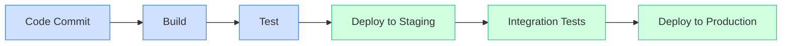

# CICD Setup

## Introduction

Continuous Integration and Continuous Deployment (CI/CD) has revolutionized how developers build, test, and deploy applications. In this guide, we'll walk through setting up a CI/CD pipeline from scratch, making your development workflow more efficient and reliable.

CI/CD automates the process of integrating code changes, running tests, and deploying applications. This automation reduces manual errors, provides faster feedback, and enables more frequent deployments.

## What is CI/CD?

Before diving into setup, let's clarify what CI/CD actually means:

- **Continuous Integration (CI)**: The practice of frequently merging code changes into a shared repository, followed by automated building and testing.
- **Continuous Deployment (CD)**: The practice of automatically deploying all code changes to a testing or production environment after they pass CI stages.

Here's a visual representation of a typical CI/CD pipeline:



## CI/CD Tools Overview

Several tools can help you implement CI/CD. Here are some popular options:

| Tool | Type | Best For | Hosting |
|------|------|----------|---------|
| GitHub Actions | CI/CD | GitHub projects | Cloud |
| Jenkins | CI/CD | Customizable workflows | Self-hosted |
| GitLab CI | CI/CD | GitLab projects | Cloud/Self-hosted |
| CircleCI | CI/CD | Quick setup | Cloud |
| Travis CI | CI | Open source projects | Cloud |

## Setting Up Your First CI/CD Pipeline

Let's create a simple CI/CD pipeline using GitHub Actions, as it's beginner-friendly and requires minimal setup for GitHub-hosted repositories.

### Prerequisites

- A GitHub account
- A simple project repository on GitHub

### Step 1: Create a Workflow File

In your repository, create a directory structure `.github/workflows/` and add a YAML file (e.g., `ci-cd.yml`):

```yaml
name: CI/CD Pipeline

on:
  push:
    branches: [ main ]
  pull_request:
    branches: [ main ]

jobs:
  build-and-test:
    runs-on: ubuntu-latest
    
    steps:
    - uses: actions/checkout@v3
    
    - name: Set up Node.js
      uses: actions/setup-node@v3
      with:
        node-version: '16'
        
    - name: Install dependencies
      run: npm ci
      
    - name: Run tests
      run: npm test
      
    - name: Build
      run: npm run build
```

This workflow will trigger whenever code is pushed to the main branch or a pull request targeting the main branch is created. It sets up a Node.js environment, installs dependencies, runs tests, and builds the application.

### Step 2: Add a Deployment Job

Let's extend our workflow to include deployment to a staging environment:

```yaml
name: CI/CD Pipeline

on:
  push:
    branches: [ main ]
  pull_request:
    branches: [ main ]

jobs:
  build-and-test:
    runs-on: ubuntu-latest
    
    steps:
    - uses: actions/checkout@v3
    
    - name: Set up Node.js
      uses: actions/setup-node@v3
      with:
        node-version: '16'
        
    - name: Install dependencies
      run: npm ci
      
    - name: Run tests
      run: npm test
      
    - name: Build
      run: npm run build
      
    - name: Upload build artifacts
      uses: actions/upload-artifact@v3
      with:
        name: build-files
        path: ./build
  
  deploy-to-staging:
    needs: build-and-test
    if: github.event_name == 'push' && github.ref == 'refs/heads/main'
    runs-on: ubuntu-latest
    
    steps:
    - name: Download build artifacts
      uses: actions/download-artifact@v3
      with:
        name: build-files
        path: ./build
        
    - name: Deploy to staging
      run: |
        echo "Deploying to staging environment..."
        # Add your deployment commands here
        # For example: aws s3 sync ./build s3://your-staging-bucket/
```

This extended workflow adds a deployment step that runs only when code is pushed to the main branch (not on pull requests). It downloads the build artifacts from the previous job and deploys them to your staging environment.

### Step 3: Test Your Workflow

To test your workflow:

1. Commit and push the workflow file to your repository
2. Go to the "Actions" tab in your GitHub repository
3. You should see your workflow running

## Real-world CI/CD Example: A Node.js Web Application

Let's look at a more complete example for a Node.js web application with testing, linting, and deployment to both staging and production environments.

```yaml
name: Complete CI/CD Pipeline

on:
  push:
    branches: [ main, develop ]
  pull_request:
    branches: [ main, develop ]

jobs:
  lint:
    runs-on: ubuntu-latest
    steps:
    - uses: actions/checkout@v3
    - name: Set up Node.js
      uses: actions/setup-node@v3
      with:
        node-version: '16'
    - name: Install dependencies
      run: npm ci
    - name: Lint code
      run: npm run lint

  test:
    needs: lint
    runs-on: ubuntu-latest
    steps:
    - uses: actions/checkout@v3
    - name: Set up Node.js
      uses: actions/setup-node@v3
      with:
        node-version: '16'
    - name: Install dependencies
      run: npm ci
    - name: Run unit tests
      run: npm test

  build:
    needs: test
    runs-on: ubuntu-latest
    steps:
    - uses: actions/checkout@v3
    - name: Set up Node.js
      uses: actions/setup-node@v3
      with:
        node-version: '16'
    - name: Install dependencies
      run: npm ci
    - name: Build application
      run: npm run build
    - name: Upload build artifacts
      uses: actions/upload-artifact@v3
      with:
        name: build-files
        path: ./build

  deploy-to-staging:
    needs: build
    if: github.ref == 'refs/heads/develop'
    runs-on: ubuntu-latest
    environment:
      name: staging
      url: https://staging.example.com
    steps:
    - name: Download build artifacts
      uses: actions/download-artifact@v3
      with:
        name: build-files
        path: ./build
    - name: Deploy to staging
      run: |
        echo "Deploying to staging environment..."
        # Add staging deployment commands here

  deploy-to-production:
    needs: [build, deploy-to-staging]
    if: github.ref == 'refs/heads/main'
    runs-on: ubuntu-latest
    environment:
      name: production
      url: https://example.com
    steps:
    - name: Download build artifacts
      uses: actions/download-artifact@v3
      with:
        name: build-files
        path: ./build
    - name: Deploy to production
      run: |
        echo "Deploying to production environment..."
        # Add production deployment commands here
```

This workflow:
1. Lints the code
2. Runs tests if linting passes
3. Builds the application if tests pass
4. Deploys to staging if the commit is on the develop branch
5. Deploys to production if the commit is on the main branch

## Setting Up Jenkins for CI/CD

While GitHub Actions is cloud-based, Jenkins offers a self-hosted option with extensive customization. Here's how to set up a basic Jenkins pipeline:

### Step 1: Install Jenkins

First, install Jenkins on your server:

```bash
# For Ubuntu/Debian
wget -q -O - https://pkg.jenkins.io/debian-stable/jenkins.io.key | sudo apt-key add -
sudo sh -c 'echo deb https://pkg.jenkins.io/debian-stable binary/ > /etc/apt/sources.list.d/jenkins.list'
sudo apt-get update
sudo apt-get install jenkins
```

### Step 2: Create a Jenkinsfile

In your repository root, create a file named `Jenkinsfile`:

```groovy
pipeline {
    agent any
    
    stages {
        stage('Checkout') {
            steps {
                checkout scm
            }
        }
        
        stage('Install') {
            steps {
                sh 'npm ci'
            }
        }
        
        stage('Test') {
            steps {
                sh 'npm test'
            }
        }
        
        stage('Build') {
            steps {
                sh 'npm run build'
            }
        }
        
        stage('Deploy') {
            steps {
                sh 'echo "Deploying application..."'
                // Add deployment scripts here
            }
        }
    }
    
    post {
        success {
            echo 'Pipeline executed successfully!'
        }
        failure {
            echo 'Pipeline failed!'
        }
    }
}
```

### Step 3: Configure Jenkins Pipeline

1. Open Jenkins in your browser
2. Click "New Item" and select "Pipeline"
3. In the Pipeline section, select "Pipeline script from SCM"
4. Select your SCM system (e.g., Git)
5. Enter your repository URL
6. Set the Script Path to "Jenkinsfile"
7. Save the configuration

## Best Practices for CI/CD Setup

1. **Keep builds fast**: Long builds slow down feedback and development.
2. **Use caching**: Cache dependencies to speed up builds.
3. **Parallelize when possible**: Run independent tests in parallel.
4. **Secure your secrets**: Use environment variables or secret management.
5. **Monitor your pipelines**: Set up alerts for pipeline failures.
6. **Test your CI/CD pipeline**: Make sure your pipeline itself is reliable.
7. **Use infrastructure as code**: Define your CI/CD infrastructure using code.

## Common CI/CD Pipeline Stages

A comprehensive CI/CD pipeline typically includes these stages:

1. **Code Checkout**: Fetch the latest code from your repository
2. **Linting**: Check code for style issues and potential errors
3. **Dependency Installation**: Install required dependencies
4. **Unit Testing**: Run tests for individual code units
5. **Integration Testing**: Test how components work together
6. **Building**: Compile and package the application
7. **Security Scanning**: Check for vulnerabilities
8. **Deployment**: Deploy the application to the target environment
9. **Smoke Testing**: Verify basic functionality after deployment
10. **Performance Testing**: Test application under load (typically in staging)

## Troubleshooting Common CI/CD Issues

### Issue: Pipeline Fails on Specific Platform

**Solution**: Use Docker containers to ensure consistent environments across all stages of your pipeline.

```yaml
jobs:
  build:
    runs-on: ubuntu-latest
    container: node:16-alpine
    steps:
      # Your steps here
```

### Issue: Tests Work Locally But Fail in CI

**Solution**: Ensure your CI environment matches your local environment, particularly regarding environment variables.

```yaml
jobs:
  test:
    runs-on: ubuntu-latest
    env:
      NODE_ENV: test
      DATABASE_URL: ${{ secrets.TEST_DATABASE_URL }}
    steps:
      # Your steps here
```

### Issue: Deployment Failures

**Solution**: Add pre-deployment checks and implement a rollback strategy.

```yaml
deploy:
  steps:
    - name: Pre-deployment check
      run: ./scripts/check-environment.sh
      
    - name: Deploy
      run: ./scripts/deploy.sh
      
    - name: Verify deployment
      run: ./scripts/verify-deployment.sh
      
    - name: Rollback on failure
      if: failure()
      run: ./scripts/rollback.sh
```

## Summary

Setting up a CI/CD pipeline might seem daunting at first, but it brings tremendous benefits to your development workflow:

- **Increased confidence** in code changes
- **Faster feedback** on potential issues
- **Reduced time** between writing code and deploying it
- **Consistent deployment process** across environments
- **Improved collaboration** between team members

Start simple with basic building, testing, and deployment, then gradually add more sophisticated stages as you grow more comfortable with CI/CD principles.

## Additional Resources

- **Learn More About CI/CD**:
  - [CI/CD Concepts](https://martinfowler.com/articles/continuousIntegration.html)
  - [The Deployment Pipeline](https://www.thoughtworks.com/insights/blog/deployment-pipeline)

- **Tool Documentation**:
  - [GitHub Actions Documentation](https://docs.github.com/en/actions)
  - [Jenkins User Documentation](https://www.jenkins.io/doc/)
  - [GitLab CI Documentation](https://docs.gitlab.com/ee/ci/)

## Exercises

1. Set up a basic GitHub Actions workflow for a simple project that runs tests on every push.
2. Extend your workflow to include a linting step and make it run before tests.
3. Configure your workflow to deploy your application to GitHub Pages when commits are pushed to the main branch.
4. Create a workflow that builds Docker images for your application and pushes them to Docker Hub.
5. Implement a multi-environment deployment strategy that deploys to staging for all commits to develop and to production for tagged releases.

Remember that CI/CD is about iteration and improvement. Start with a simple pipeline and enhance it as your project and team grow!