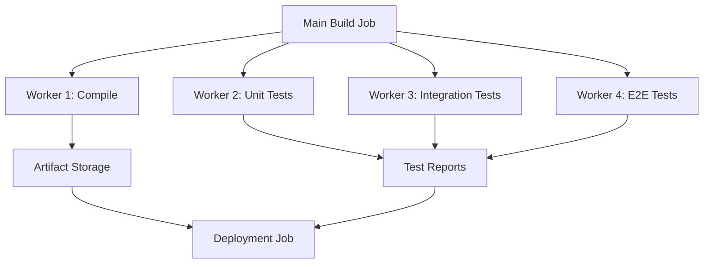
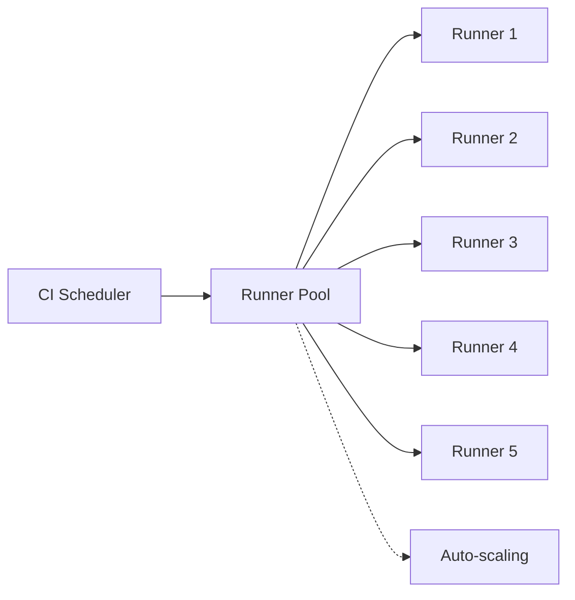

# CICD Scaling

## Introduction

As your software projects grow in size and complexity, your Continuous Integration and Continuous Deployment (CI/CD) pipelines need to evolve accordingly. What works for a small team or a simple application might not be sufficient when you have multiple teams, larger codebases, or more frequent deployments.

CI/CD scaling refers to the strategies, techniques, and practices that allow your build, test, and deployment processes to handle increased load without sacrificing performance or reliability. In this guide, we'll explore how to identify scaling bottlenecks and implement solutions that keep your development workflow smooth and efficient, even as demands increase.

## Why CI/CD Scaling Matters

Imagine you're part of a small team that has been using a CI/CD pipeline for a project with a moderate codebase. Your builds take around 5 minutes, and you deploy once a day. Everything runs smoothly.

Fast forward a year: your team has tripled in size, the codebase is 5 times larger, and you're now deploying multiple times per day. Suddenly:

- Builds are taking 30+ minutes
- The CI server is constantly at high CPU usage
- Developers wait in queues for their jobs to run
- Test failures are harder to diagnose due to the volume of tests
- Deployment failures have increased

This scenario illustrates why CI/CD scaling is essential. Without proper scaling strategies, your delivery pipeline becomes a bottleneck rather than an accelerator.

## Identifying Scaling Bottlenecks

Before implementing solutions, you need to identify where your CI/CD pipeline is struggling. Here are common areas to examine:

### 1. Build Time Analysis

Start by gathering metrics on your build times:

```javascript
// Sample script to analyze build times from CI system API
const analyzeBuildTimes = async () => {
  const builds = await fetchLastMonthBuilds();
  
  const buildTimesByProject = builds.reduce((acc, build) => {
    const project = build.projectName;
    if (!acc[project]) acc[project] = [];
    acc[project].push(build.duration);
    return acc;
  }, {});
  
  // Calculate averages and trends
  Object.keys(buildTimesByProject).forEach(project => {
    const times = buildTimesByProject[project];
    const avgTime = times.reduce((sum, time) => sum + time, 0) / times.length;
    console.log(`${project}: Avg build time ${avgTime.toFixed(2)} minutes`);
  });
};
```

### 2. Resource Utilization

Monitor your CI/CD infrastructure's resource utilization:

- CPU usage during builds
- Memory consumption 
- Disk I/O
- Network throughput

### 3. Queue Analysis

Check for job queuing issues:
- How long do jobs wait in queue before starting?
- Are there peak times when queues grow significantly?
- Which job types experience the most waiting?

### 4. Test Execution Time

Track how long different test suites take to run:

```bash
# Example command to measure test execution time
time npm test

# Output:
# > test-suite@1.0.0 test
# > jest
# 
# PASS src/components/__tests__/App.test.js
# PASS src/utils/__tests__/format.test.js
# ...
# 
# Test Suites: 24 passed, 24 total
# Tests:       142 passed, 142 total
# Snapshots:   0 total
# Time:        45.142s
# 
# real    0m46.852s
# user    1m13.773s
# sys     0m5.489s
```

## Scaling Strategies for CI/CD

Let's explore key strategies to scale your CI/CD pipelines effectively:

### 1. Parallelization

Running tasks in parallel is one of the most effective ways to reduce build times:

```yaml
# Example GitHub Actions workflow with parallelization
name: CI

on: [push, pull_request]

jobs:
  lint:
    runs-on: ubuntu-latest
    steps:
      - uses: actions/checkout@v3
      - name: Install dependencies
        run: npm ci
      - name: Run linting
        run: npm run lint

  unit-tests:
    runs-on: ubuntu-latest
    steps:
      - uses: actions/checkout@v3
      - name: Install dependencies
        run: npm ci
      - name: Run unit tests
        run: npm run test:unit

  integration-tests:
    runs-on: ubuntu-latest
    steps:
      - uses: actions/checkout@v3
      - name: Install dependencies
        run: npm ci
      - name: Run integration tests
        run: npm run test:integration
```

This approach runs linting, unit tests, and integration tests in parallel, significantly reducing the total execution time.

### 2. Distributed Builds

For larger projects, distribute your build across multiple machines:



### 3. Caching Strategies

Implement effective caching to avoid unnecessary work:

```yaml
# Example of caching in GitHub Actions
jobs:
  build:
    runs-on: ubuntu-latest
    steps:
      - uses: actions/checkout@v3
      
      - name: Cache node modules
        uses: actions/cache@v3
        with:
          path: ~/.npm
          key: ${{ runner.os }}-node-${{ hashFiles('**/package-lock.json') }}
          restore-keys: |
            ${{ runner.os }}-node-
      
      - name: Cache build artifacts
        uses: actions/cache@v3
        with:
          path: ./dist
          key: ${{ runner.os }}-build-${{ github.sha }}
      
      - name: Install dependencies
        run: npm ci
      
      - name: Build
        run: npm run build
```

### 4. Test Optimization

Optimize your test suites for faster execution:

```javascript
// Example Jest configuration for CI environments
// jest.config.ci.js
module.exports = {
  // Run tests in parallel
  maxWorkers: '50%',
  
  // Only run tests related to changed files in CI
  onlyChanged: true,
  
  // Group similar tests for more efficient execution
  groupBy: 'file',
  
  // Set a timeout limit to catch hanging tests
  testTimeout: 15000,
  
  // Fail fast on the first error
  bail: true,
};
```

### 5. Incremental Builds

Implement incremental builds to only rebuild what has changed:

```typescript
// Example of a build script that supports incremental builds
import * as fs from 'fs';
import * as path from 'path';
import { execSync } from 'child_process';

// Get list of changed files
const changedFiles = execSync('git diff --name-only HEAD~1 HEAD')
  .toString()
  .trim()
  .split('
');

// Determine which modules need rebuilding
const modules = new Set();
changedFiles.forEach(file => {
  const module = file.split('/')[0];
  if (fs.existsSync(path.join(module, 'package.json'))) {
    modules.add(module);
  }
});

// Build only changed modules
modules.forEach(module => {
  console.log(`Building ${module}...`);
  execSync(`cd ${module} && npm run build`, { stdio: 'inherit' });
});

console.log('Incremental build completed');
```

## Infrastructure Scaling for CI/CD

As your team and codebase grow, your infrastructure needs to keep pace. Here are strategies for scaling your CI/CD infrastructure:

### 1. Horizontal Scaling with Runner Pools



For platforms like GitLab or GitHub Actions, configure auto-scaling runner pools that can grow or shrink based on demand.

### 2. Containerization

Use containers to ensure consistent build environments and improve resource utilization:

```dockerfile
# Example Dockerfile for a CI container
FROM node:18-alpine

# Install common CI tools
RUN apk add --no-cache git curl jq 

# Set up the working directory
WORKDIR /app

# Pre-install common dependencies to speed up builds
COPY package*.json ./
RUN npm ci

# The actual application code will be mounted at runtime
```

### 3. Specialized Build Agents

Configure specialized runners for different types of jobs:

```yaml
# Example Jenkins configuration for specialized agents
pipeline {
  agent none
  
  stages {
    stage('Lint') {
      agent {
        label 'small'  // Small instance for lightweight jobs
      }
      steps {
        sh 'npm run lint'
      }
    }
    
    stage('Build') {
      agent {
        label 'medium'  // Medium instance for build jobs
      }
      steps {
        sh 'npm run build'
      }
    }
    
    stage('Test') {
      agent {
        label 'large'  // Large instance for test suites
      }
      steps {
        sh 'npm run test'
      }
    }
    
    stage('Deploy') {
      agent {
        label 'deploy'  // Specialized instance with deployment tools
      }
      steps {
        sh './deploy.sh'
      }
    }
  }
}
```

## Optimizing for Developer Experience

Scaling isn't just about infrastructure—it's also about maintaining a good developer experience:

### 1. Fast Feedback Loops

Implement tiered testing to provide quick feedback:

```yaml
# Example GitHub Actions workflow with tiered testing
name: CI

on: [push, pull_request]

jobs:
  quick-feedback:
    runs-on: ubuntu-latest
    steps:
      - uses: actions/checkout@v3
      - name: Quick lint and type check
        run: |
          npm ci
          npm run lint:quick
          npm run typecheck
      
  unit-tests:
    needs: quick-feedback
    runs-on: ubuntu-latest
    steps:
      - uses: actions/checkout@v3
      - name: Run unit tests
        run: |
          npm ci
          npm run test:unit
          
  full-test-suite:
    needs: unit-tests
    runs-on: ubuntu-latest
    steps:
      - uses: actions/checkout@v3
      - name: Run all tests
        run: |
          npm ci
          npm run test
```

### 2. Local CI Simulation

Provide tools for developers to run CI-like processes locally:

```bash
#!/bin/bash
# ci-local.sh - Script to simulate CI environment locally

echo "Running local CI simulation..."

# Step 1: Linting
echo "Step 1/4: Running linters"
npm run lint
if [ $? -ne 0 ]; then
  echo "Linting failed! Fix issues before continuing."
  exit 1
fi

# Step 2: Type checking
echo "Step 2/4: Type checking"
npm run typecheck
if [ $? -ne 0 ]; then
  echo "Type checking failed! Fix issues before continuing."
  exit 1
fi

# Step 3: Unit tests
echo "Step 3/4: Running unit tests"
npm run test:unit
if [ $? -ne 0 ]; then
  echo "Unit tests failed! Fix issues before continuing."
  exit 1
fi

# Step 4: Build
echo "Step 4/4: Building application"
npm run build
if [ $? -ne 0 ]; then
  echo "Build failed! Fix issues before continuing."
  exit 1
fi

echo "Local CI simulation passed! Your changes should pass in the actual CI."
```

### 3. Test Splitting and Selective Execution

Implement logic to only run tests relevant to changes:

```javascript
// Example script to determine which tests to run
const { execSync } = require('child_process');

// Get the files changed in this commit
const changedFiles = execSync('git diff --name-only HEAD~1 HEAD')
  .toString()
  .trim()
  .split('
');

// Categorize changes
const hasBackendChanges = changedFiles.some(file => file.startsWith('server/'));
const hasFrontendChanges = changedFiles.some(file => file.startsWith('client/'));
const hasDBChanges = changedFiles.some(file => file.includes('migrations/') || file.includes('schema.'));

// Determine which test suites to run
if (hasBackendChanges) {
  console.log('Running backend tests');
  execSync('npm run test:backend', { stdio: 'inherit' });
}

if (hasFrontendChanges) {
  console.log('Running frontend tests');
  execSync('npm run test:frontend', { stdio: 'inherit' });
}

if (hasDBChanges) {
  console.log('Running database tests');
  execSync('npm run test:db', { stdio: 'inherit' });
}

// Always run core tests
console.log('Running core tests');
execSync('npm run test:core', { stdio: 'inherit' });
```

## Case Study: Scaling CI/CD at Growing Startups

Let's examine how a fictional startup called DevFast scaled their CI/CD pipeline as they grew:

### Phase 1: Early Startup (5 developers)
- Simple GitHub Actions workflow
- Single-threaded builds
- ~5 minute build time
- Daily deployments

### Phase 2: Growth (15 developers)
- Implemented parallel jobs
- Added caching
- Introduced test splitting
- ~8 minute build time despite 3x team size
- Multiple daily deployments

### Phase 3: Scaling (50 developers)
- Moved to self-hosted runners
- Implemented microservices architecture with independent pipelines
- Added specialized runners for different tasks
- Used incremental builds
- ~10 minute build time despite 10x team size
- Continuous deployment with multiple releases per day

Key takeaways:
1. Started simple and added complexity only when needed
2. Focused on developer experience alongside infrastructure scaling
3. Invested in automation to maintain quality as the team grew
4. Adopted infrastructure-as-code for CI/CD configuration

## Best Practices for CI/CD Scaling

Based on our exploration, here are key best practices to follow:

1. **Measure before optimizing**: Collect metrics to identify actual bottlenecks
2. **Start with easy wins**: Implement caching and parallelization first
3. **Scale horizontally**: Add more runners rather than larger ones when possible
4. **Automate everything**: Including infrastructure provisioning for CI/CD
5. **Implement tiered testing**: Run fast tests first, slower tests later
6. **Use ephemeral environments**: Fresh environments for each build prevent contamination
7. **Monitor CI/CD performance**: Track metrics over time to identify degradation
8. **Optimize test suites regularly**: Remove redundant or low-value tests
9. **Keep configurations as code**: Store CI/CD configurations in your repository
10. **Document your CI/CD architecture**: Help new team members understand the system

## Advanced Scaling Techniques

For teams facing significant scaling challenges, consider these advanced techniques:

### 1. Predictive Scaling

Analyze historical build patterns to pre-provision infrastructure before peak times:

```javascript
// Sample script to analyze CI usage patterns
const analyzeUsagePatterns = async () => {
  // Fetch last month of build data
  const builds = await fetchBuildsForLastMonth();
  
  // Group by hour of day
  const hourlyUsage = Array(24).fill(0);
  builds.forEach(build => {
    const hour = new Date(build.startTime).getHours();
    hourlyUsage[hour]++;
  });
  
  // Find peak usage times
  const peakHours = hourlyUsage
    .map((count, hour) => ({ hour, count }))
    .sort((a, b) => b.count - a.count)
    .slice(0, 3);
  
  console.log('Peak CI usage hours:');
  peakHours.forEach(({ hour, count }) => {
    console.log(`${hour}:00 - ${hour+1}:00: ${count} builds`);
  });
  
  // We could use this data to scale up before peak hours
};
```

### 2. Build Matrix Optimization

Intelligently construct build matrices to minimize redundancy:

```yaml
# Example GitHub Actions workflow with optimized matrix
name: Test Matrix

on: [push, pull_request]

jobs:
  test:
    strategy:
      matrix:
        os: [ubuntu-latest, windows-latest]
        node: [16, 18]
        database: [mysql, postgres]
        include:
          # Add special combinations
          - os: ubuntu-latest
            node: 18
            database: mongodb
        exclude:
          # Remove unnecessary combinations
          - os: windows-latest
            database: postgres
      
      # Don't cancel all jobs if one fails
      fail-fast: false
      
    runs-on: ${{ matrix.os }}
    
    steps:
      - uses: actions/checkout@v3
      - name: Set up Node.js
        uses: actions/setup-node@v3
        with:
          node-version: ${{ matrix.node }}
      - name: Set up database
        run: ./scripts/setup-db.sh ${{ matrix.database }}
      - name: Run tests
        run: npm test
```

### 3. Pipeline as Code Generation

For complex organizations, generate CI/CD configurations programmatically:

```javascript
// Example script to generate CI pipeline configuration
const fs = require('fs');
const yaml = require('js-yaml');

// Get list of all services
const services = fs.readdirSync('./services')
  .filter(dir => fs.existsSync(`./services/${dir}/package.json`));

// Generate a workflow file for each service
services.forEach(service => {
  const workflowConfig = {
    name: `${service} CI`,
    on: ['push', 'pull_request'],
    jobs: {
      test: {
        'runs-on': 'ubuntu-latest',
        steps: [
          { uses: 'actions/checkout@v3' },
          {
            name: 'Setup Node',
            uses: 'actions/setup-node@v3',
            with: { 'node-version': '18' }
          },
          { 
            name: 'Install dependencies',
            run: 'cd services/' + service + ' && npm ci'
          },
          {
            name: 'Run tests',
            run: 'cd services/' + service + ' && npm test'
          }
        ]
      }
    }
  };
  
  // Special handling for services with DB dependencies
  if (fs.existsSync(`./services/${service}/db`)) {
    workflowConfig.jobs.test.services = {
      postgres: {
        image: 'postgres:14',
        env: {
          POSTGRES_PASSWORD: 'postgres',
          POSTGRES_USER: 'postgres',
          POSTGRES_DB: 'test'
        },
        ports: ['5432:5432']
      }
    };
  }
  
  // Write the workflow file
  fs.writeFileSync(
    `./.github/workflows/${service}.yml`,
    yaml.dump(workflowConfig)
  );
  
  console.log(`Generated workflow for ${service}`);
});
```

## Summary

Scaling CI/CD pipelines is essential as your projects and teams grow. By implementing the strategies discussed in this guide, you can maintain fast, reliable delivery pipelines even with increasing demands.

Key points to remember:
- Start by measuring and identifying bottlenecks
- Implement parallelization and caching for immediate gains
- Scale infrastructure horizontally when needed
- Optimize for developer experience alongside performance
- Continue monitoring and improving your pipelines over time

As your organization grows, your CI/CD scaling strategies should evolve too. Regular reviews and improvements will ensure your delivery pipeline remains an accelerator for your development process rather than a bottleneck.

## Additional Resources

To further expand your knowledge of CI/CD scaling, check out these resources:

- **Books**:
  - "Continuous Delivery" by Jez Humble and David Farley
  - "Accelerate" by Nicole Forsgren, Jez Humble, and Gene Kim

- **Online Documentation**:
  - [GitHub Actions Workflow Optimization](https://docs.github.com/en/actions/using-workflows/workflow-syntax-for-github-actions)
  - [GitLab CI/CD Scaling Documentation](https://docs.gitlab.com/ee/ci/)
  - [Jenkins Scaling Documentation](https://www.jenkins.io/doc/book/scaling/)

- **Tools to Explore**:
  - BuildCache tools for your language ecosystem
  - Test splitting and parallelization libraries
  - Infrastructure-as-code tools for CI/CD

## Exercises

1. **Analysis Exercise**: Analyze your current CI/CD pipeline and identify the top three bottlenecks. Create a plan to address each one.

2. **Implementation Exercise**: Implement test parallelization for your project and measure the improvement in build time.

3. **Advanced Exercise**: Set up a local CI simulation script that developers can run before pushing code to catch issues early.

4. **Scaling Challenge**: Design a CI/CD architecture that could handle 10x your current team size and codebase while keeping build times under 15 minutes.