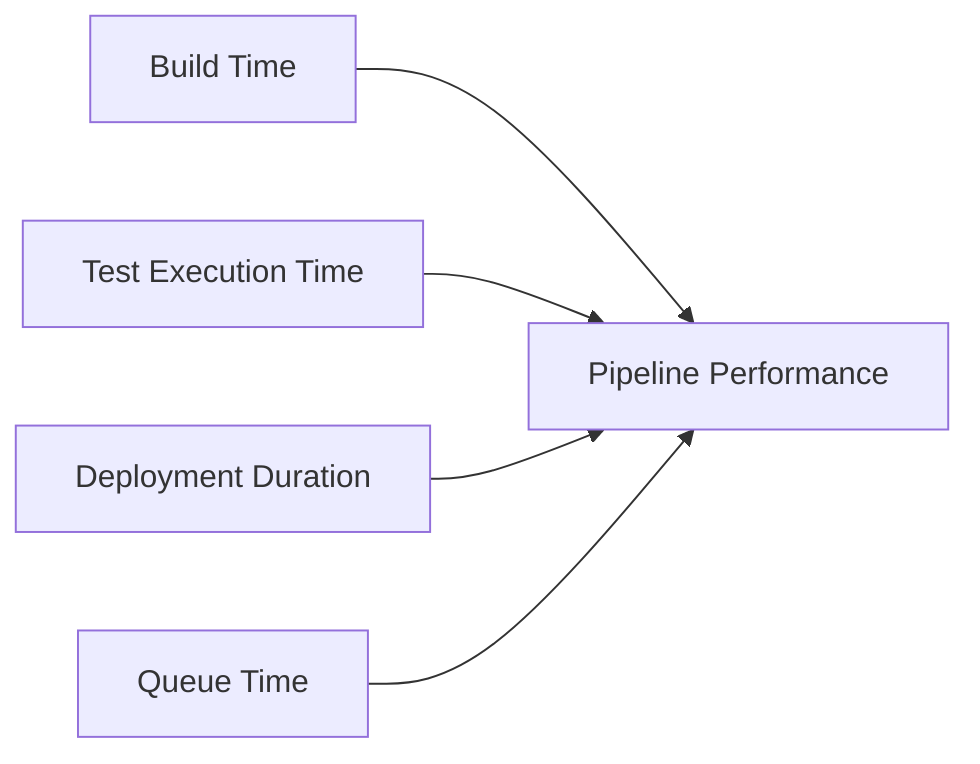
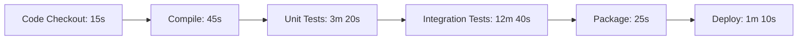

# CI/CD Monitoring

## Introduction

Continuous Integration and Continuous Deployment (CI/CD) pipelines are the backbone of modern software development practices, automating the build, test, and deployment processes. However, a pipeline is only as reliable as its monitoring system. Without proper monitoring, issues can go undetected, leading to failed deployments, degraded application performance, and unhappy users.

CI/CD monitoring refers to the practice of tracking, analyzing, and alerting on the health and performance metrics of your CI/CD pipeline. Effective monitoring ensures that your automated processes are functioning correctly, identifies bottlenecks, and helps maintain the quality of your software delivery.

## Why CI/CD Monitoring Matters

For beginners entering the world of CI/CD, understanding monitoring is crucial because:

1. **Early Problem Detection**: Catch issues before they affect your production environment
2. **Continuous Improvement**: Gather data to optimize pipeline performance over time
3. **Quality Assurance**: Ensure code quality standards are maintained throughout the delivery process
4. **Resource Optimization**: Identify resource usage patterns and optimize accordingly
5. **Team Visibility**: Provide transparency into the development process for all stakeholders

## Key Monitoring Areas in CI/CD

### 1. Pipeline Performance Metrics

Understanding how your pipeline performs is the first step in effective monitoring.



#### Example: Tracking Build Times

```javascript
// Sample script to collect and log build times
const startTime = new Date().getTime();

// Build process happens here
runBuild();

const endTime = new Date().getTime();
const buildDuration = (endTime - startTime) / 1000;

console.log(`Build completed in ${buildDuration} seconds`);

// Send to monitoring system
monitoringClient.recordMetric('build_duration', buildDuration);
```

In a real-world scenario, these metrics would be collected automatically by your CI/CD tool or a monitoring system integration.

### 2. Build and Test Success Rates

Track the success and failure rates of your builds and tests to identify recurring issues.

#### Example Dashboard Data (JSON):

```json
{
  "daily_builds": {
    "total": 124,
    "success": 113,
    "failed": 11,
    "success_rate": "91.1%"
  },
  "test_execution": {
    "total_tests": 3567,
    "passed": 3521,
    "failed": 46,
    "flaky": 12,
    "coverage": "87.3%"
  }
}
```

### 3. Deployment Metrics

Monitor how smoothly your deployments are going and how often they need to be rolled back.

Key metrics include:
- Deployment frequency
- Lead time for changes
- Mean time to recovery (MTTR)
- Change failure rate

### 4. Infrastructure Health

CI/CD pipelines rely on infrastructure. Monitor the health of your build servers, agents, and deployment targets.

```yaml
# Example Prometheus alert configuration for CI server health
groups:
- name: ci_server_alerts
  rules:
  - alert: CIServerHighLoad
    expr: cpu_usage_percent{service="ci-server"} > 85 for 10m
    labels:
      severity: warning
    annotations:
      summary: "CI Server under high load"
      description: "Build server {{ $labels.instance }} has been above 85% CPU for more than 10 minutes."
```

## Setting Up Basic CI/CD Monitoring

Let's walk through a basic setup for monitoring a CI/CD pipeline using popular tools.

### Step 1: Identify Key Metrics

First, determine what metrics matter most for your pipeline:

- Build duration
- Test success rate
- Deployment frequency
- Error rates
- Resource utilization

### Step 2: Instrument Your Pipeline

Add instrumentation to your pipeline configuration to collect these metrics.

#### Example: Jenkins Pipeline with Monitoring

```groovy
pipeline {
    agent any
    
    stages {
        stage('Build') {
            steps {
                // Record start time
                script {
                    env.STAGE_START_TIME = System.currentTimeMillis()
                }
                
                // Build steps here
                sh 'mvn clean package'
                
                // Record metrics
                script {
                    def duration = (System.currentTimeMillis() - env.STAGE_START_TIME.toLong()) / 1000
                    
                    // Using a hypothetical monitoring plugin
                    recordMetric(
                        name: 'build_duration',
                        value: duration,
                        tags: [project: env.JOB_NAME]
                    )
                }
            }
        }
        
        // Other stages...
    }
    
    post {
        always {
            // Record overall success/failure
            script {
                recordMetric(
                    name: 'pipeline_status',
                    value: currentBuild.resultIsBetterOrEqualTo('SUCCESS') ? 1 : 0,
                    tags: [project: env.JOB_NAME]
                )
            }
        }
    }
}
```

### Step 3: Connect to Monitoring System

Integrate your CI/CD tools with a monitoring system like Prometheus, Grafana, or a specialized CI/CD monitoring tool.

#### Example: Prometheus Configuration for Jenkins

```yaml
# prometheus.yml
scrape_configs:
  - job_name: 'jenkins'
    metrics_path: '/prometheus'
    static_configs:
      - targets: ['jenkins:8080']
```

### Step 4: Create Visualizations and Dashboards

Create dashboards to visualize your pipeline performance and health.

## Real-World Examples

### Example 1: Detecting Pipeline Bottlenecks

A development team was experiencing long build times that slowed down their delivery process. By implementing CI/CD monitoring, they discovered that their test suite was the bottleneck:



The team optimized their test suite by:
1. Parallelizing test execution
2. Removing redundant tests
3. Implementing test caching

Result: Total pipeline time reduced from 18 minutes to 7 minutes.

### Example 2: Monitoring Deployment Health

A company implemented a monitoring system that tracked not just the success/failure of deployments but also the post-deployment application health:

```javascript
// Post-deployment health check script
const deploymentTime = new Date().getTime();

// Run health checks every minute for the first 10 minutes after deployment
const healthCheckInterval = setInterval(() => {
  const healthStatus = checkApplicationEndpoints();
  
  if (!healthStatus.allEndpointsHealthy) {
    notifyTeam(`Health check failed after deployment: ${healthStatus.failedEndpoints.join(', ')}`);
    considerRollback();
  }
  
  // Record recovery time if there was an issue
  if (healthStatus.hadIssue && healthStatus.allEndpointsHealthy) {
    const recoveryTime = (new Date().getTime() - deploymentTime) / 1000;
    recordMetric('deployment_recovery_time', recoveryTime);
  }
  
  // Stop checking after 10 minutes
  if ((new Date().getTime() - deploymentTime) / (1000 * 60) >= 10) {
    clearInterval(healthCheckInterval);
  }
}, 60000);
```

This approach helped the team reduce their mean time to recovery (MTTR) by 70%.

## Advanced Monitoring Techniques

As your CI/CD practices mature, consider implementing these advanced monitoring techniques:

### 1. Predictive Analysis

Use historical data to predict potential failures before they occur.

```python
# Pseudocode for a basic predictive model
def predict_build_failure(repo, branch, changed_files, time_of_day):
    # Load historical build data
    historical_data = load_build_history(repo, branch)
    
    # Extract features
    features = extract_features(
        historical_data, 
        changed_files,
        time_of_day
    )
    
    # Use trained model to predict probability of failure
    failure_probability = prediction_model.predict_proba(features)[0]
    
    if failure_probability > 0.7:
        notify_developers("High risk build detected!")
    
    return failure_probability
```

### 2. Correlation Analysis

Correlate build metrics with application performance to identify how CI/CD changes impact user experience.

### 3. Automated Remediation

Set up automated responses to common pipeline issues.

```yaml
# Example automatic remediation rule
- name: "Rebuild on Transient Network Error"
  condition: |
    pipeline.status == "FAILED" &&
    pipeline.logs.contains("Network timeout") &&
    pipeline.attempt < 3
  action: |
    pipeline.rebuild()
    notify_channel("builds", "Automatically retrying build due to network timeout")
```

## Best Practices for CI/CD Monitoring

1. **Start Simple**: Begin with basic metrics and expand as needed
2. **Set Baselines**: Establish normal performance baselines to detect deviations
3. **Create Actionable Alerts**: Ensure alerts provide clear information on what went wrong and potential solutions
4. **Avoid Alert Fatigue**: Only alert on important issues that require immediate attention
5. **Regularly Review Metrics**: Schedule regular reviews of monitoring data to identify trends
6. **Document Response Procedures**: Create playbooks for common issues detected by monitoring

## Implementing CI/CD Monitoring in Common Tools

### GitHub Actions

```yaml
name: CI with Monitoring

on:
  push:
    branches: [ main ]
  pull_request:
    branches: [ main ]

jobs:
  build:
    runs-on: ubuntu-latest
    steps:
    - uses: actions/checkout@v3
    
    - name: Set up monitoring
      run: |
        echo "::set-output name=start_time::$(date +%s)"
      id: monitoring
    
    - name: Build and test
      run: |
        npm ci
        npm run build
        npm test
    
    - name: Calculate build duration
      if: always()
      run: |
        END_TIME=$(date +%s)
        START_TIME=${{ steps.monitoring.outputs.start_time }}
        DURATION=$((END_TIME - START_TIME))
        echo "Build duration: ${DURATION} seconds"
        
        # Send to monitoring service (example uses curl to a hypothetical API)
        curl -X POST "https://monitoring-service.example/api/metrics" \
          -H "Content-Type: application/json" \
          -d '{"metric":"build_duration","value":'${DURATION}',"status":"${{ job.status }}"}'
```

### Jenkins

For Jenkins, you can use the Performance Plugin or Prometheus Plugin to collect and visualize metrics.

### GitLab CI

GitLab provides built-in metrics for CI/CD pipelines, which can be extended using their Prometheus integration.

## Summary

CI/CD monitoring is a crucial aspect of maintaining an efficient and reliable delivery pipeline. By tracking key metrics, setting up proper visualizations, and implementing alerting, you can:

- Identify and fix bottlenecks in your pipeline
- Improve code quality and delivery speed
- Reduce recovery time when issues occur
- Make data-driven decisions about infrastructure and process improvements

Remember that monitoring should evolve with your CI/CD practices. Start with basic metrics that matter most to your team and gradually expand your monitoring capabilities as you gain experience.

## Additional Resources

Here are some exercises to help you practice CI/CD monitoring:

1. **Exercise 1**: Set up a basic monitoring system for a simple CI/CD pipeline using free tools like Prometheus and Grafana.
2. **Exercise 2**: Create custom metrics for your most important build and deployment processes.
3. **Exercise 3**: Implement a post-deployment health check system to validate successful deployments.
4. **Exercise 4**: Design an alert system with appropriate thresholds for your key metrics.
5. **Exercise 5**: Analyze historical pipeline data to identify patterns and opportunities for optimization.

By mastering CI/CD monitoring, you'll ensure your automated pipelines remain reliable, efficient, and continuously improving over time.