# Jenkins CI/CD

## Introduction

Jenkins is an open-source automation server that has become the de facto standard for implementing Continuous Integration and Continuous Deployment (CI/CD) pipelines. Originally developed as the Hudson project in 2004, Jenkins helps teams automate the building, testing, and deployment of their applications, reducing manual effort and ensuring consistent quality.

In this guide, we'll explore how Jenkins serves as a crucial tool in modern software development workflows, enabling teams to deliver reliable software more frequently and efficiently.

## What is CI/CD?

Before diving into Jenkins, let's clarify what CI/CD means:

- **Continuous Integration (CI)**: The practice of frequently merging code changes into a shared repository, followed by automated building and testing.
- **Continuous Delivery (CD)**: Extending CI to ensure that code can be reliably released at any time.
- **Continuous Deployment**: Taking CD one step further by automatically deploying every change that passes all tests to production.


## Getting Started with Jenkins

### Installation

Jenkins can be installed on various operating systems. Here's how to install it on Ubuntu:

```bash
# Add the Jenkins repository key
wget -q -O - https://pkg.jenkins.io/debian/jenkins.io.key | sudo apt-key add -

# Add the Jenkins repository to the system
sudo sh -c 'echo deb http://pkg.jenkins.io/debian-stable binary/ > /etc/apt/sources.list.d/jenkins.list'

# Update package information
sudo apt update

# Install Jenkins and Java
sudo apt install openjdk-11-jdk
sudo apt install jenkins

# Start Jenkins
sudo systemctl start jenkins
```

Once installed, access Jenkins by navigating to `http://localhost:8080` in your web browser.

### Initial Setup

When you first access Jenkins, you'll need to:

1. Retrieve the initial admin password from the server:

```bash
sudo cat /var/lib/jenkins/secrets/initialAdminPassword
```

2. Install suggested plugins or select specific ones
3. Create an admin user
4. Configure the Jenkins URL

## Key Jenkins Concepts

### 1. Jobs

Jobs (also called Projects) are the fundamental building blocks in Jenkins. They represent a single task or step in your CI/CD pipeline.

#### Creating Your First Job

1. Click on "New Item" on the Jenkins dashboard
2. Enter a name for your job
3. Select "Freestyle project" and click "OK"
4. Configure your job:
   - Source Code Management: Connect to your Git repository
   - Build Triggers: Specify when the job should run
   - Build Steps: Define actions to execute
   - Post-build Actions: Configure what happens after the build

Here's an example configuration for a basic Java application:

```xml
<project>
  <scm class="hudson.plugins.git.GitSCM">
    <userRemoteConfigs>
      <hudson.plugins.git.UserRemoteConfig>
        <url>https://github.com/yourusername/your-java-app.git</url>
      </hudson.plugins.git.UserRemoteConfig>
    </userRemoteConfigs>
    <branches>
      <hudson.plugins.git.BranchSpec>
        <name>*/main</name>
      </hudson.plugins.git.BranchSpec>
    </branches>
  </scm>
  <builders>
    <hudson.tasks.Maven>
      <targets>clean install</targets>
    </hudson.tasks.Maven>
  </builders>
  <publishers>
    <hudson.tasks.junit.JUnitResultArchiver>
      <testResults>**/target/surefire-reports/*.xml</testResults>
    </hudson.tasks.junit.JUnitResultArchiver>
  </publishers>
</project>
```

### 2. Pipelines

Pipelines represent your entire CI/CD workflow as code. They provide a more sophisticated way to define your build process compared to traditional freestyle jobs.

#### Jenkinsfile Example

```groovy
pipeline {
    agent any
    
    stages {
        stage('Build') {
            steps {
                // Get code from GitHub repository
                git 'https://github.com/yourusername/your-app.git'
                
                // Run Maven build
                sh 'mvn clean install'
            }
        }
        stage('Test') {
            steps {
                // Run tests
                sh 'mvn test'
            }
            post {
                always {
                    // Archive test results
                    junit '**/target/surefire-reports/*.xml'
                }
            }
        }
        stage('Deploy') {
            steps {
                // Deploy application
                sh './deploy.sh'
            }
        }
    }
}
```

This `Jenkinsfile` defines a pipeline with three stages: Build, Test, and Deploy. Each stage contains specific steps to execute.

### 3. Agents and Nodes

Agents (or nodes) are machines that execute your Jenkins jobs. The Jenkins master coordinates these agents to distribute the workload.

```mermaid
graph TD
    A[Jenkins Master] --> B[Agent 1: Linux]
    A --> C[Agent 2: Windows]
    A --> D[Agent 3: macOS]
    
    style A fill:#d0e0ff,stroke:#4070a0,stroke-width:2px
    style B fill:#d0ffd0,stroke:#40a040,stroke-width:2px
    style C fill:#ffd0d0,stroke:#a04040,stroke-width:2px
    style D fill:#ffffd0,stroke:#a0a040,stroke-width:2px
```



### 4. Plugins

Jenkins is highly extensible through plugins. Here are some essential plugins:

- **Git Plugin**: Integrates Jenkins with Git repositories
- **Pipeline Plugin**: Supports defining pipelines as code
- **Docker Plugin**: Allows building and using Docker containers
- **Blue Ocean**: Provides a modern UI experience for Jenkins

## Real-World CI/CD Pipeline Example

Let's create a complete CI/CD pipeline for a Node.js application:

```groovy
pipeline {
    agent {
        docker {
            image 'node:14-alpine'
        }
    }
    
    stages {
        stage('Checkout') {
            steps {
                checkout scm
            }
        }
        
        stage('Install') {
            steps {
                sh 'npm install'
            }
        }
        
        stage('Lint') {
            steps {
                sh 'npm run lint'
            }
        }
        
        stage('Test') {
            steps {
                sh 'npm test'
            }
            post {
                always {
                    junit 'test-results/*.xml'
                }
            }
        }
        
        stage('Build') {
            steps {
                sh 'npm run build'
            }
        }
        
        stage('Deploy to Staging') {
            when {
                branch 'develop'
            }
            steps {
                sh './deploy.sh staging'
            }
        }
        
        stage('Deploy to Production') {
            when {
                branch 'main'
            }
            steps {
                input message: 'Deploy to production?'
                sh './deploy.sh production'
            }
        }
    }
    
    post {
        success {
            echo 'Pipeline completed successfully!'
            // Send success notification
        }
        failure {
            echo 'Pipeline failed!'
            // Send failure notification
        }
    }
}
```

This pipeline:
1. Uses a Docker container with Node.js
2. Checks out the source code
3. Installs dependencies
4. Runs linting checks
5. Executes tests and archives the results
6. Builds the application
7. Automatically deploys to staging if on the develop branch
8. Requires manual approval before deploying to production from the main branch
9. Sends notifications based on the build result

## Best Practices

### 1. Pipeline as Code

Store your pipeline configurations in your Git repository using a `Jenkinsfile`. This brings several benefits:
- Version control for your CI/CD process
- Code review for pipeline changes
- Audit trail for pipeline modifications

### 2. Keep Builds Fast

Long build times reduce productivity. Optimize your pipelines by:
- Running tests in parallel
- Using build caching
- Implementing incremental builds

### 3. Secure Your Jenkins Instance

- Use secure credentials storage
- Implement proper authorization
- Keep Jenkins and its plugins updated
- Run Jenkins behind a firewall or proxy

### 4. Implement Quality Gates

Establish quality gates in your pipeline that code must pass:
- Code coverage thresholds
- Static code analysis rules
- Performance benchmarks

## Common Jenkins Problems and Solutions

### Problem: Build Failing Unexpectedly

**Solution**: Check these common causes:
- Resource constraints (disk space, memory)
- Network issues accessing repositories
- Outdated plugins

```bash
# Check available disk space
df -h

# Check Jenkins logs
tail -f /var/log/jenkins/jenkins.log
```

### Problem: Slow Builds

**Solution**:
- Analyze your build with the Jenkins Build Time Trend plugin
- Implement parallel execution where possible
- Use faster hardware for build agents

### Problem: Plugin Compatibility Issues

**Solution**:
- Use the Plugin Manager to check for updates
- Review compatibility information in plugin documentation
- Maintain a test instance for plugin updates

## Summary

Jenkins is a powerful tool for implementing CI/CD pipelines that can transform how your team delivers software. By automating build, test, and deployment processes, you can:

- Detect problems earlier
- Release more frequently
- Maintain higher quality
- Reduce manual effort

As you continue your Jenkins journey, remember that CI/CD is not just about tools but also about practices and culture. Implementing Jenkins successfully requires changes to how your team collaborates and approaches software delivery.

## Further Learning

To deepen your Jenkins knowledge:

1. **Practice Exercises**:
   - Set up a simple pipeline for a personal project
   - Implement automated testing in your pipeline
   - Configure Jenkins to deploy to a staging environment

2. **Advanced Topics to Explore**:
   - Jenkins Shared Libraries
   - Jenkins Configuration as Code (JCasC)
   - Multi-branch pipelines
   - Jenkins X for Kubernetes

3. **Recommended Resources**:
   - Official Jenkins documentation
   - Jenkins community forums
   - DevOps and CI/CD focused online courses