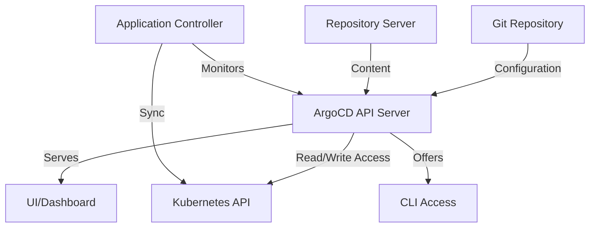
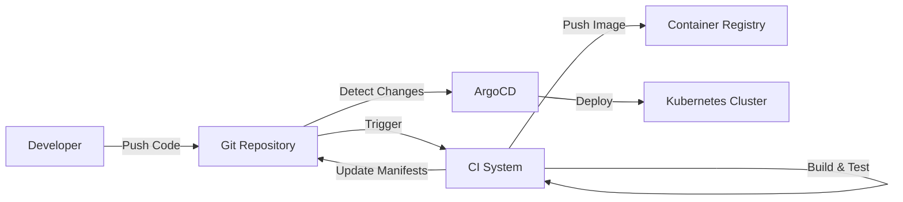

# CICD ArgoCD

## Introduction

ArgoCD is a declarative, GitOps continuous delivery tool specifically designed for Kubernetes. As part of the modern CI/CD toolchain, ArgoCD helps teams automate deployment processes while maintaining infrastructure as code principles.

At its core, ArgoCD follows the GitOps philosophy: Git repositories serve as the single source of truth for defining the desired application state. ArgoCD continuously monitors these repositories and automatically synchronizes the actual state with the desired state in your Kubernetes cluster.

## What is GitOps?

Before diving deeper into ArgoCD, let's understand GitOps:

GitOps is an operational framework that takes DevOps best practices used for application development such as version control, collaboration, compliance, and CI/CD, and applies them to infrastructure automation.

Key principles include:
- **Declarative**: System and application configurations are described declaratively
- **Versioned and Immutable**: Configurations stored in Git repositories provide a verifiable history
- **Automated Delivery**: Software agents automatically pull the state declarations from the repository

## Why ArgoCD?

ArgoCD solves several challenges teams face with Kubernetes deployments:

1. **Configuration Drift**: ArgoCD prevents differences between Git-defined desired state and actual cluster state
2. **Deployment Visibility**: Provides a UI dashboard showing sync status and deployment health
3. **Access Control**: Integrates with existing authentication mechanisms and offers RBAC
4. **Multi-Cluster Management**: Can manage deployments across multiple Kubernetes clusters
5. **Automation**: Automates the deployment process, reducing manual intervention

## ArgoCD Architecture

ArgoCD consists of several core components:



1. **API Server**: Core component that exposes the API consumed by the UI, CLI, and other components
2. **Repository Server**: Internal service that maintains a local cache of Git repositories
3. **Application Controller**: Continuously monitors running applications and compares with desired state

## Getting Started with ArgoCD

### Prerequisites

- Kubernetes cluster (v1.17 or higher)
- kubectl CLI configured to connect to your cluster
- Basic understanding of Kubernetes manifests (YAML)

### Installation

Let's install ArgoCD in your Kubernetes cluster:

```bash
# Create a namespace for ArgoCD
kubectl create namespace argocd

# Apply the ArgoCD installation manifest
kubectl apply -n argocd -f https://raw.githubusercontent.com/argoproj/argo-cd/stable/manifests/install.yaml
```

After running these commands, you'll have ArgoCD running in your cluster. The installation creates several Kubernetes resources including deployments, services, and ConfigMaps.

### Accessing the ArgoCD UI

The ArgoCD UI is available via a Service. To access it:

```bash
# Port forward the ArgoCD server service
kubectl port-forward svc/argocd-server -n argocd 8080:443
```

Now you can access the UI at `https://localhost:8080`.

For initial login:
- Username: admin
- Password: To retrieve the auto-generated password, run:

```bash
kubectl -n argocd get secret argocd-initial-admin-secret -o jsonpath="{.data.password}" | base64 -d
```

### Installing ArgoCD CLI

The ArgoCD CLI provides command-line access to ArgoCD functionality:

```bash
# For macOS using Homebrew
brew install argocd

# For Linux (replace VERSION as needed)
curl -sSL -o argocd-linux-amd64 https://github.com/argoproj/argo-cd/releases/latest/download/argocd-linux-amd64
sudo install -m 555 argocd-linux-amd64 /usr/local/bin/argocd
rm argocd-linux-amd64
```

## Creating Your First ArgoCD Application

An "Application" in ArgoCD represents a Kubernetes application defined by a set of manifests.

### Application Manifests

Here's an example of defining an ArgoCD Application using YAML:

```yaml
apiVersion: argoproj.io/v1alpha1
kind: Application
metadata:
  name: guestbook
  namespace: argocd
spec:
  project: default
  source:
    repoURL: https://github.com/argoproj/argocd-example-apps.git
    targetRevision: HEAD
    path: guestbook
  destination:
    server: https://kubernetes.default.svc
    namespace: guestbook
  syncPolicy:
    automated:
      prune: true
      selfHeal: true
```

This manifest defines:
- A source repository containing your application manifests
- The target revision (branch, tag, or commit)
- Path within the repo where manifests are located
- Destination cluster and namespace
- Sync policy (whether to automate syncing and pruning)

### Deploy Using CLI

To create this application:

```bash
# Create the target namespace
kubectl create namespace guestbook

# Apply the Application manifest
kubectl apply -f application.yaml
```

Alternatively, using the ArgoCD CLI:

```bash
argocd app create guestbook \
  --repo https://github.com/argoproj/argocd-example-apps.git \
  --path guestbook \
  --dest-server https://kubernetes.default.svc \
  --dest-namespace guestbook
```

### Sync Status and Health

After creating the application, you can check its sync status:

```bash
argocd app get guestbook
```

The output shows:
- Current sync status
- Health status of resources
- Deployment history

If the application isn't automatically synchronized, you can manually sync:

```bash
argocd app sync guestbook
```

## ArgoCD Sync Strategies

ArgoCD supports different strategies for application synchronization:

### 1. Manual Sync

Applications must be synced explicitly through UI or CLI:

```bash
argocd app sync <app-name>
```

### 2. Automated Sync

Applications automatically sync when changes are detected in Git:

```yaml
spec:
  syncPolicy:
    automated: {}
```

### 3. Automated Sync with Pruning

Automatically removes resources that were deleted from Git:

```yaml
spec:
  syncPolicy:
    automated:
      prune: true
```

### 4. Self-Healing

Automatically corrects drift even when changes are made directly to the cluster:

```yaml
spec:
  syncPolicy:
    automated:
      selfHeal: true
```

## Practical Example: Multi-Environment Deployment

Let's implement a real-world example deploying an application to multiple environments.

### Application Structure

```
├── base
│   ├── deployment.yaml
│   ├── service.yaml
│   └── kustomization.yaml
├── overlays
│   ├── development
│   │   ├��─ kustomization.yaml
│   │   └── config.yaml
│   ├── staging
│   │   ├── kustomization.yaml
│   │   └── config.yaml
│   └── production
│       ├── kustomization.yaml
│       └── config.yaml
```

This structure uses Kustomize for environment-specific configurations.

### Base Application Manifests

base/deployment.yaml:

```yaml
apiVersion: apps/v1
kind: Deployment
metadata:
  name: my-app
spec:
  replicas: 1
  selector:
    matchLabels:
      app: my-app
  template:
    metadata:
      labels:
        app: my-app
    spec:
      containers:
      - name: my-app
        image: my-app:1.0
        ports:
        - containerPort: 8080
```

base/service.yaml:

```yaml
apiVersion: v1
kind: Service
metadata:
  name: my-app
spec:
  selector:
    app: my-app
  ports:
  - port: 80
    targetPort: 8080
```

base/kustomization.yaml:

```yaml
apiVersion: kustomize.config.k8s.io/v1beta1
kind: Kustomization
resources:
- deployment.yaml
- service.yaml
```

### Environment-Specific Overlays

overlays/development/kustomization.yaml:

```yaml
apiVersion: kustomize.config.k8s.io/v1beta1
kind: Kustomization
namePrefix: dev-
resources:
- ../../base
patchesStrategicMerge:
- config.yaml
images:
- name: my-app
  newTag: dev
```

overlays/development/config.yaml:

```yaml
apiVersion: apps/v1
kind: Deployment
metadata:
  name: my-app
spec:
  replicas: 1
```

Similar files would exist for staging and production with appropriate configurations.

### ArgoCD Applications for Each Environment

```yaml
apiVersion: argoproj.io/v1alpha1
kind: Application
metadata:
  name: my-app-dev
  namespace: argocd
spec:
  project: default
  source:
    repoURL: https://github.com/myorg/my-app.git
    targetRevision: HEAD
    path: overlays/development
  destination:
    server: https://kubernetes.default.svc
    namespace: my-app-dev
  syncPolicy:
    automated:
      prune: true
      selfHeal: true
```

You would create similar Application resources for staging and production.

## Advanced ArgoCD Features

### 1. Rollback

If a deployment causes issues, you can easily roll back:

```bash
argocd app history my-app
argocd app rollback my-app [REVISION]
```

### 2. Application Sets

ApplicationSets allow you to manage multiple applications as a unit:

```yaml
apiVersion: argoproj.io/v1alpha1
kind: ApplicationSet
metadata:
  name: cluster-addons
spec:
  generators:
  - list:
      elements:
      - cluster: development
        url: https://kubernetes.default.svc
      - cluster: production
        url: https://production-cluster.example.com
  template:
    metadata:
      name: '{{cluster}}-monitoring'
    spec:
      project: default
      source:
        repoURL: https://github.com/myorg/cluster-addons.git
        targetRevision: HEAD
        path: monitoring
      destination:
        server: '{{url}}'
        namespace: monitoring
```

### 3. Health Checks

ArgoCD provides built-in health assessment for common Kubernetes resources. You can also define custom health checks:

```yaml
apiVersion: argoproj.io/v1alpha1
kind: Application
metadata:
  name: my-app
spec:
  # ... other fields
  ignoreDifferences:
  - group: apps
    kind: Deployment
    jsonPointers:
    - /spec/replicas
  health:
    customHealthChecks:
    - apiVersion: v1
      kind: Pod
      jsonPointers:
      - /status/phase
      jqPath: ".status.phase == \"Running\""
```

### 4. Webhook Integration

ArgoCD can be integrated with Git webhook notifications to trigger immediate sync when changes are pushed:

```bash
argocd repo add https://github.com/myorg/my-app.git --webhook-url https://argocd.example.com/api/webhook
```

## Common Workflows

### CI/CD Pipeline Integration

ArgoCD is often used alongside CI tools (Jenkins, GitHub Actions, etc.) in a workflow like:



1. Developer pushes code changes
2. CI system builds, tests, and pushes new container images
3. CI updates manifests in Git with new image tags
4. ArgoCD detects changes and deploys to clusters

### Progressive Delivery with Argo Rollouts

ArgoCD integrates with Argo Rollouts to enable advanced deployment strategies:

```yaml
apiVersion: argoproj.io/v1alpha1
kind: Rollout
metadata:
  name: my-app
spec:
  replicas: 10
  strategy:
    canary:
      steps:
      - setWeight: 20
      - pause: {duration: 1h}
      - setWeight: 40
      - pause: {duration: 1h}
      - setWeight: 60
      - pause: {duration: 1h}
      - setWeight: 80
      - pause: {duration: 1h}
  revisionHistoryLimit: 2
  selector:
    matchLabels:
      app: my-app
  template:
    metadata:
      labels:
        app: my-app
    spec:
      containers:
      - name: my-app
        image: my-app:1.0
        ports:
        - containerPort: 8080
```

## Best Practices

1. **Structure Repositories Consistently**: Organize manifests logically—either mono-repo (all apps in one repository) or per-app repositories

2. **Use Helm or Kustomize for Configuration**: Manage environment-specific configurations with these tools

3. **Implement Proper RBAC**: Restrict who can create, update, and sync applications

4. **Monitor ArgoCD Itself**: Set up monitoring for ArgoCD components

5. **Backup ArgoCD**: Regular backups of ArgoCD state are crucial

6. **Configure SSO**: Integrate with organization authentication systems

7. **Version Tagging**: Use explicit versions/tags for applications instead of 'latest'

## Troubleshooting

Common issues and their solutions:

### 1. Out of Sync Applications

If an application shows as "OutOfSync":

```bash
argocd app diff my-app
```

This shows the differences between the desired and actual states.

### 2. Failed Synchronizations

Check logs for details:

```bash
kubectl logs -n argocd deploy/argocd-application-controller
```

### 3. Webhook Issues

If webhooks aren't triggering syncs, verify the webhook configuration in your Git provider.

## Summary

ArgoCD is a powerful GitOps continuous delivery tool that helps automate application deployments to Kubernetes. By keeping your cluster state synchronized with Git repositories, it ensures consistency, reliability, and audit capabilities for all deployments.

Key benefits of using ArgoCD include:
- Automated deployment synchronization
- Clear visibility of application state across environments
- Drift detection and remediation
- Simplified rollbacks
- Integration with existing CI pipelines

## Additional Resources

For deeper exploration:

- **Official Documentation**: Visit the [ArgoCD Documentation](https://argo-cd.readthedocs.io/en/stable/)
- **GitHub Repository**: Explore the [ArgoCD GitHub repo](https://github.com/argoproj/argo-cd)
- **Slack Community**: Join the #argo-cd channel in the CNCF Slack

## Practice Exercises

1. Install ArgoCD in a local Kubernetes cluster (Minikube or kind)
2. Deploy a simple application using ArgoCD
3. Implement a change in your application Git repository and observe automatic synchronization
4. Create a multi-environment deployment with different configurations
5. Set up an ApplicationSet to manage applications across multiple clusters
6. Implement a CI/CD pipeline that integrates with ArgoCD