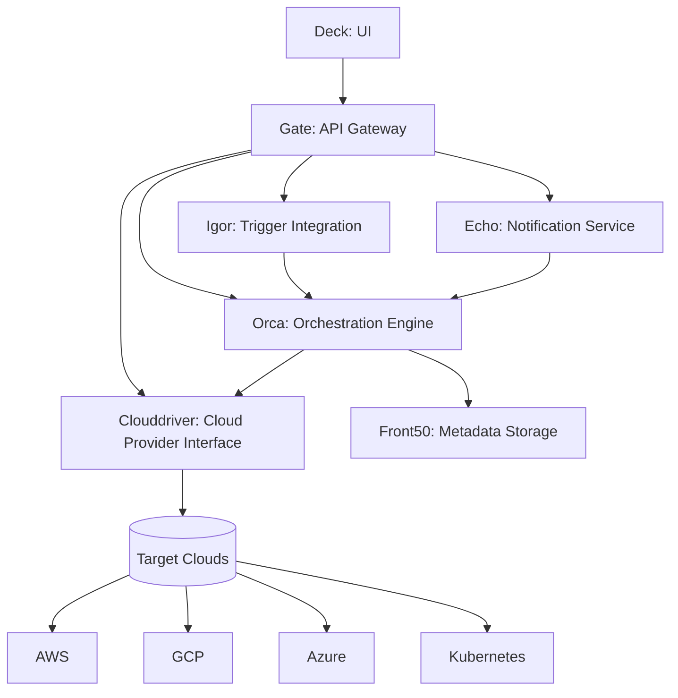
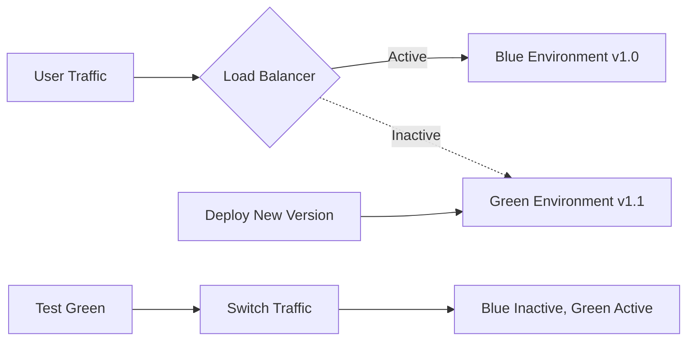
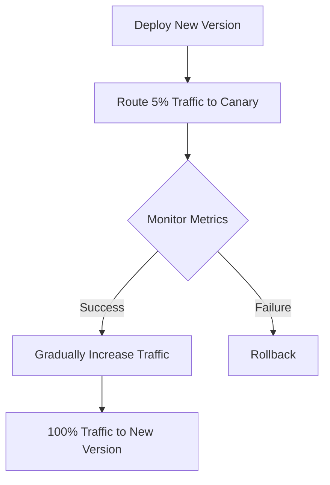

# CICD Spinnaker

## Introduction

Spinnaker is an open-source, multi-cloud continuous delivery platform initially developed by Netflix and now maintained by a community including Google, Microsoft, and Amazon. It's designed to help teams release software changes with high velocity and confidence.

Unlike many CI/CD tools that focus primarily on building and testing code, Spinnaker specializes in the deployment part of the pipeline - taking your built artifacts and safely deploying them to your target environments, whether they're virtual machines, containers, or serverless functions.

## What Makes Spinnaker Special?

Spinnaker stands out from other CI/CD tools because of its:

- **Multi-cloud support**: Deploy to AWS, GCP, Azure, Kubernetes, and more from a single platform
- **Deployment strategies**: Advanced deployment techniques like blue/green and canary deployments built-in
- **Pipeline visualization**: Clear visual representation of your deployment pipelines
- **Manual judgments**: Ability to add approval gates at critical points in your pipeline
- **Deployment history**: Track when and how services were deployed

## Spinnaker Architecture

Spinnaker has a microservices architecture composed of several components:



Each service has specific responsibilities:

- **Deck**: User interface for creating and managing pipelines
- **Gate**: API gateway to the Spinnaker services
- **Orca**: Orchestrates pipelines and tasks
- **Clouddriver**: Interfaces with various cloud providers
- **Igor**: Triggers pipelines from CI systems
- **Echo**: Handles notifications and webhooks
- **Front50**: Stores and retrieves metadata about applications, pipelines, etc.

## Setting Up Spinnaker

Spinnaker can be deployed in various ways, but the most common approach for beginners is using Halyard, a command-line tool that manages Spinnaker's lifecycle.

### Prerequisites

- Kubernetes cluster (for hosting Spinnaker)
- kubectl configured
- Minimum 4GB RAM, 2 vCPUs
- Storage provider (S3, GCS, etc.)

### Basic Installation Steps

1. Install Halyard on your machine:

```bash
curl -O https://raw.githubusercontent.com/spinnaker/halyard/master/install/debian/InstallHalyard.sh
sudo bash InstallHalyard.sh
```

2. Set up a storage provider (Example with S3):

```bash
hal config storage s3 edit \
    --access-key-id $AWS_ACCESS_KEY_ID \
    --secret-access-key $AWS_SECRET_ACCESS_KEY \
    --region us-west-2 \
    --bucket spinnaker-artifacts

hal config storage edit --type s3
```

3. Add a Kubernetes account:

```bash
hal config provider kubernetes enable

hal config provider kubernetes account add my-k8s \
    --context $(kubectl config current-context)
```

4. Choose which Spinnaker version to deploy:

```bash
hal version list
hal config version edit --version 1.28.0
```

5. Deploy Spinnaker:

```bash
hal deploy apply
```

6. Connect to the UI:

```bash
hal deploy connect
```

This will forward Spinnaker's UI to [http://localhost:9000](http://localhost:9000).

## Creating Your First Pipeline

Now that you have Spinnaker installed, let's create a basic deployment pipeline.

### Step 1: Create an Application

1. Open Spinnaker UI at http://localhost:9000
2. Click on "Applications" then "Create Application"
3. Fill in details:
   - Name: my-first-app
   - Email: your@email.com
   - Cloud Providers: select Kubernetes
4. Click "Create"

### Step 2: Create a Pipeline

1. Inside your application, go to "Pipelines" and click "Create"
2. Name your pipeline "Deploy to Dev"
3. Click "Create"

### Step 3: Add a Trigger

1. In the pipeline configuration, click "Add Trigger"
2. Select "Docker Registry" trigger type
3. Configure details:
   - Registry: DockerHub
   - Organization: your-org
   - Image: your-image
   - Tag: latest

### Step 4: Add a Deploy Stage

1. Click "Add Stage"
2. Select "Deploy (Manifest)" for Kubernetes deployment
3. Configure the stage:
   - Account: my-k8s
   - Manifest Source: Text
4. In the Manifest YAML, paste a Kubernetes deployment definition:

```yaml
apiVersion: apps/v1
kind: Deployment
metadata:
  name: my-app
  namespace: default
spec:
  replicas: 2
  selector:
    matchLabels:
      app: my-app
  template:
    metadata:
      labels:
        app: my-app
    spec:
      containers:
      - name: my-container
        image: ${trigger['registry']}/${trigger['organization']}/${trigger['repository']}:${trigger['tag']}
        ports:
        - containerPort: 80
```

5. Save the pipeline

Your pipeline will now automatically trigger whenever a new image with the "latest" tag is pushed to your Docker registry.

## Advanced Deployment Strategies

Spinnaker excels at implementing advanced deployment strategies that minimize risk.

### Blue/Green Deployment

In this strategy, you maintain two identical environments (blue and green). One serves production traffic while the other is updated.



To implement this in Spinnaker:

1. Create a pipeline with two Deploy Manifest stages
2. First stage deploys the new version to the inactive environment
3. Add a Manual Judgment stage for verification
4. Add a final stage using "Patch Manifest" to update the service to point to the new deployment

### Canary Deployment

With canary deployments, you roll out changes to a small subset of users before full deployment.



Spinnaker's Kayenta service supports automated canary analysis by comparing metrics between your baseline and canary deployments.

## Integration with CI Tools

Spinnaker works best when integrated with CI tools that handle building and testing. Here's how to integrate with some popular CI tools:

### Jenkins Integration

1. Enable the Jenkins integration:

```bash
hal config ci jenkins enable
```

2. Add your Jenkins master:

```bash
hal config ci jenkins master add my-jenkins \
    --address http://jenkins.example.com \
    --username myuser \
    --password
```

3. In your pipeline, you can now add a "Jenkins" trigger that will start your pipeline when a Jenkins job completes.

### GitHub Actions Integration

For GitHub Actions, you can use webhooks to trigger Spinnaker pipelines:

1. Enable Echo's webhook support:

```bash
hal config features edit --webhook-notifications true
```

2. Add a webhook trigger to your pipeline
3. In your GitHub Actions workflow, add a step to call the webhook when builds complete:

```yaml
- name: Trigger Spinnaker Pipeline
  run: |
    curl -X POST \
      https://your-spinnaker-gate-url/webhooks/webhook/your-webhook-id \
      -H "Content-Type: application/json" \
      -d '{"artifacts": [{"name": "my-app", "version": "${{ github.sha }}", "type": "github/file"}]}'
```

## Real-World Example: Microservices Deployment

Let's walk through a complete example of deploying a microservices application using Spinnaker.

### Scenario

We have three microservices:
- Frontend UI (React)
- Authentication Service (Node.js)
- Product Service (Java Spring Boot)

Each service has its own repository and CI pipeline that builds Docker images.

### Implementation

1. **Create an Application in Spinnaker**
   - Name: e-commerce-app
   - Add all team members as owners

2. **Create a Shared Pipeline Template**
   - Define common deployment logic
   - Parameterize service-specific values

3. **Create Service-Specific Pipelines**
   - Frontend UI Pipeline:
     - Trigger on new Docker image
     - Deploy to dev namespace
     - Run integration tests
     - Manual approval for production
     - Canary deployment to production (10% traffic)
     - Gradually increase traffic

   - Authentication & Product Service Pipelines:
     - Similar flow but with blue/green deployment instead of canary

4. **Create Orchestration Pipeline**
   - Trigger when all services are ready
     - Ensure version compatibility
     - Update API Gateway routes
     - Run system-wide tests
     - Send notifications to Slack

This approach allows you to deploy each service independently but also coordinate when needed for major releases.

## Monitoring Deployments

Spinnaker integrates with popular monitoring tools to help you observe your deployments:

### Prometheus Integration

1. Configure Spinnaker to send metrics to Prometheus
2. Create dashboards to monitor deployment health
3. Set up alerts for deployment failures

### Adding Automated Canary Analysis

```yaml
stage:
  type: canary
  analysisType: realTime
  canaryConfig:
    lifetimeHours: 1
    metricsAccountName: prometheus
    storageAccountName: s3
    scoreThresholds:
      marginal: 75
      pass: 90
    metrics:
    - name: latency
      query: 'avg(rate(http_request_duration_seconds_sum{job="my-app"}[2m])) / avg(rate(http_request_duration_seconds_count{job="my-app"}[2m]))'
      metricSourceType: prometheus
```

## Best Practices

1. **Standardize Pipelines**: Create templates for common patterns to ensure consistency
2. **Implement Controls**: Add manual judgments for critical environments
3. **Automate Rollbacks**: Configure automatic rollbacks based on monitoring
4. **Version Your Infrastructure**: Keep Spinnaker configurations in version control
5. **Secure Your Pipelines**: Implement role-based access control
6. **Monitor Pipeline Executions**: Set up alerts for failed pipelines
7. **Optimize For Speed**: Balance safety with velocity by parallelizing when possible

## Troubleshooting Common Issues

### Pipeline Not Triggering

1. Check the trigger configuration
2. Verify the Docker registry connectivity
3. Check Echo service logs:
   ```bash
   kubectl logs -n spinnaker deployment/spin-echo -f
   ```

### Deployment Failures

1. Look at the task output in the UI
2. Check Clouddriver logs:
   ```bash
   kubectl logs -n spinnaker deployment/spin-clouddriver -f
   ```
3. Validate your Kubernetes manifest

### Performance Issues

1. Increase resource allocations:
   ```bash
   hal config deploy edit --type distributed --account-name my-k8s
   hal config deploy component edit clouddriver --resources cpu=2,memory=2Gi
   hal deploy apply
   ```

## Summary

Spinnaker offers a powerful platform for implementing continuous delivery across multiple cloud providers. Its key strengths include:

- Visual pipeline management
- Advanced deployment strategies
- Multi-cloud support
- Integration with CI tools
- Extensible architecture

While it has a steeper learning curve than some CI/CD tools, the flexibility and capabilities it provides make it worth the investment for teams looking to implement sophisticated deployment pipelines.

## Additional Resources

- [Official Spinnaker Documentation](https://spinnaker.io/docs/)
- [Spinnaker Slack Community](https://join.spinnaker.io/)
- [GitHub Repository](https://github.com/spinnaker/spinnaker)

## Exercise: Create Your First Spinnaker Pipeline

1. Set up a local Spinnaker instance using Minnaker (a lightweight Spinnaker distribution)
2. Create an application for a simple web service
3. Build a pipeline that:
   - Triggers on a Git commit
   - Deploys to a dev environment
   - Runs integration tests
   - Requires manual approval for production
   - Deploys to production using a blue/green strategy
4. Trigger the pipeline and observe the deployment process
5. Modify the pipeline to include a notification when deployment completes