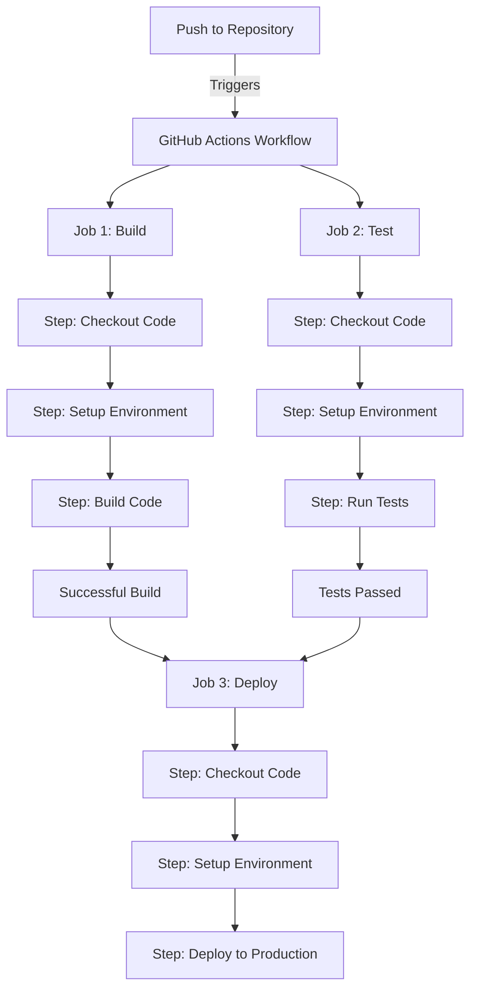

# CICD GitHub Actions

## Introduction

GitHub Actions is a powerful CI/CD (Continuous Integration and Continuous Deployment) platform that enables you to automate your software development workflows directly within your GitHub repository. With GitHub Actions, you can build, test, and deploy your code right from GitHub, making it easier to integrate continuous integration and continuous delivery into your development process.

In this guide, we'll explore how GitHub Actions works, how to set up your first workflow, and how to implement common CI/CD patterns to improve your development process.

## What is CI/CD?

Before diving into GitHub Actions, let's briefly understand what CI/CD is:

- **Continuous Integration (CI)**: The practice of frequently merging code changes into a shared repository, followed by automated builds and tests to detect issues early.

- **Continuous Deployment (CD)**: The practice of automatically deploying code changes to production after they pass all tests in the CI pipeline.

The CI/CD pipeline automates the software delivery process, from code changes to deployment, improving software quality and reducing time to market.

## GitHub Actions Core Concepts

### Workflows

A workflow is an automated process that you set up in your repository to build, test, package, release, or deploy your project. Workflows are defined in YAML files stored in the `.github/workflows` directory of your repository.

### Events

Events are specific activities that trigger a workflow to run. For example:

- Push to a repository
- Pull request creation or update
- Scheduled events (cron)
- Manual triggers (workflow_dispatch)
- External events (webhook)

### Jobs

Jobs are a set of steps that execute on the same runner. By default, jobs run in parallel, but you can configure them to run sequentially.

### Steps

Steps are individual tasks that run commands or actions. Steps within a job execute sequentially.

### Actions

Actions are reusable units of code that perform common tasks, like checking out code, setting up programming languages, or deploying to cloud services.

### Runners

Runners are servers that run your workflows. GitHub provides runners for Linux, Windows, and macOS, or you can host your own.

## Setting Up Your First GitHub Actions Workflow

Let's create a simple workflow that runs tests whenever you push code to your repository:

1. In your repository, create a directory structure: `.github/workflows/`
2. Create a file named `ci.yml` in this directory

### Basic Workflow Example

```yaml
name: CI

on:
  push:
    branches: [ main ]
  pull_request:
    branches: [ main ]

jobs:
  build:
    runs-on: ubuntu-latest
    
    steps:
    - uses: actions/checkout@v3
    
    - name: Set up Node.js
      uses: actions/setup-node@v3
      with:
        node-version: '16'
        
    - name: Install dependencies
      run: npm ci
      
    - name: Run tests
      run: npm test
```

### Understanding the Workflow

Let's break down this example:

- `name`: The name of the workflow that appears in the GitHub Actions tab
- `on`: Defines the events that trigger the workflow (pushes and PRs to main)
- `jobs`: Contains the build job that will run on an Ubuntu runner
- `steps`: The sequence of tasks to perform:
  - Checkout the code
  - Set up Node.js environment
  - Install dependencies
  - Run tests

## Workflow Visualization

Here's a visualization of a typical GitHub Actions workflow:



## Common Use Cases for GitHub Actions

### 1. Building and Testing Applications

```yaml
name: Build and Test

on: [push, pull_request]

jobs:
  build:
    runs-on: ubuntu-latest
    
    steps:
    - uses: actions/checkout@v3
    
    - name: Set up Node.js
      uses: actions/setup-node@v3
      with:
        node-version: '16'
        
    - name: Install dependencies
      run: npm ci
      
    - name: Build
      run: npm run build
      
    - name: Test
      run: npm test
```

### 2. Deploying to Production

```yaml
name: Deploy to Production

on:
  push:
    branches: [ main ]

jobs:
  deploy:
    runs-on: ubuntu-latest
    
    steps:
    - uses: actions/checkout@v3
    
    - name: Set up Node.js
      uses: actions/setup-node@v3
      with:
        node-version: '16'
        
    - name: Install dependencies
      run: npm ci
      
    - name: Build
      run: npm run build
      
    - name: Deploy to Netlify
      uses: netlify/actions/cli@master
      with:
        args: deploy --prod
      env:
        NETLIFY_AUTH_TOKEN: ${{ secrets.NETLIFY_AUTH_TOKEN }}
        NETLIFY_SITE_ID: ${{ secrets.NETLIFY_SITE_ID }}
```

### 3. Running on Multiple Operating Systems

```yaml
name: Cross-Platform Tests

on: [push, pull_request]

jobs:
  test:
    runs-on: ${{ matrix.os }}
    
    strategy:
      matrix:
        os: [ubuntu-latest, windows-latest, macos-latest]
        node-version: [14, 16, 18]
        
    steps:
    - uses: actions/checkout@v3
    
    - name: Set up Node.js ${{ matrix.node-version }}
      uses: actions/setup-node@v3
      with:
        node-version: ${{ matrix.node-version }}
        
    - name: Install dependencies
      run: npm ci
      
    - name: Test
      run: npm test
```

## GitHub Actions Environment Variables and Secrets

### Environment Variables

GitHub Actions provides several default environment variables like `GITHUB_REPOSITORY`, `GITHUB_SHA`, and `GITHUB_REF`. You can also set custom environment variables:

```yaml
jobs:
  example-job:
    runs-on: ubuntu-latest
    env:
      MY_ENV_VAR: "custom value"
    steps:
      - name: Print environment variable
        run: echo $MY_ENV_VAR
```

### Secrets

For sensitive data like API tokens, you should use GitHub Secrets:

1. In your repository, go to Settings > Secrets > Actions
2. Add a new secret with a name and value
3. Reference it in your workflow file:

```yaml
steps:
  - name: Deploy with API key
    run: ./deploy.sh
    env:
      API_KEY: ${{ secrets.API_KEY }}
```

## Advanced GitHub Actions Features

### 1. Caching Dependencies

Caching can significantly speed up your workflows by reusing dependency files:

```yaml
steps:
  - uses: actions/checkout@v3
  
  - name: Cache Node modules
    uses: actions/cache@v3
    with:
      path: ~/.npm
      key: ${{ runner.os }}-node-${{ hashFiles('**/package-lock.json') }}
      restore-keys: |
        ${{ runner.os }}-node-
        
  - name: Install dependencies
    run: npm ci
```

### 2. Conditional Execution

You can make steps run conditionally:

```yaml
steps:
  - name: Deploy to production
    if: github.ref == 'refs/heads/main'
    run: ./deploy.sh
```

### 3. Manual Workflow Triggers

Allow workflows to be triggered manually:

```yaml
name: Manual workflow

on:
  workflow_dispatch:
    inputs:
      environment:
        description: 'Environment to deploy to'
        required: true
        default: 'staging'
        type: choice
        options:
          - staging
          - production

jobs:
  deploy:
    runs-on: ubuntu-latest
    steps:
      - name: Deploy to ${{ github.event.inputs.environment }}
        run: echo "Deploying to ${{ github.event.inputs.environment }}"
```

## Practical Example: Full CI/CD Pipeline for a Web Application

Let's create a complete CI/CD pipeline for a JavaScript web application:

```yaml
name: Web App CI/CD

on:
  push:
    branches: [ main, develop ]
  pull_request:
    branches: [ main, develop ]

jobs:
  test:
    runs-on: ubuntu-latest
    steps:
      - uses: actions/checkout@v3
      
      - name: Setup Node.js
        uses: actions/setup-node@v3
        with:
          node-version: '16'
          
      - name: Install dependencies
        run: npm ci
        
      - name: Lint code
        run: npm run lint
        
      - name: Run unit tests
        run: npm run test
        
      - name: Run e2e tests
        run: npm run test:e2e
  
  build:
    needs: test
    runs-on: ubuntu-latest
    if: github.event_name == 'push'
    steps:
      - uses: actions/checkout@v3
      
      - name: Setup Node.js
        uses: actions/setup-node@v3
        with:
          node-version: '16'
          
      - name: Install dependencies
        run: npm ci
        
      - name: Build
        run: npm run build
        
      - name: Upload build artifacts
        uses: actions/upload-artifact@v3
        with:
          name: build
          path: build/
  
  deploy-staging:
    needs: build
    runs-on: ubuntu-latest
    if: github.ref == 'refs/heads/develop'
    steps:
      - name: Download build artifacts
        uses: actions/download-artifact@v3
        with:
          name: build
          path: build/
      
      - name: Deploy to staging
        run: |
          echo "Deploying to staging environment"
          # Add your deployment commands here
        env:
          DEPLOY_TOKEN: ${{ secrets.STAGING_DEPLOY_TOKEN }}
  
  deploy-production:
    needs: build
    runs-on: ubuntu-latest
    if: github.ref == 'refs/heads/main'
    environment:
      name: production
      url: https://example.com
    steps:
      - name: Download build artifacts
        uses: actions/download-artifact@v3
        with:
          name: build
          path: build/
      
      - name: Deploy to production
        run: |
          echo "Deploying to production environment"
          # Add your deployment commands here
        env:
          DEPLOY_TOKEN: ${{ secrets.PRODUCTION_DEPLOY_TOKEN }}
```

This workflow:
1. Runs tests on all pushes and pull requests
2. Builds the application if tests pass and it's a push event
3. Deploys to staging if it's a push to the develop branch
4. Deploys to production if it's a push to the main branch

## Best Practices for GitHub Actions

1. **Keep Workflows Focused**: Create separate workflows for different purposes (e.g., testing, deployment, documentation).

2. **Use Reusable Actions**: Utilize the marketplace actions instead of writing custom scripts.

3. **Optimize for Speed**: Use caching, matrix builds, and conditional steps to optimize workflow speed.

4. **Secure Secrets**: Never hardcode sensitive information; use GitHub Secrets.

5. **Test Workflows Locally**: Use tools like [act](https://github.com/nektos/act) to test workflows locally before pushing.

6. **Monitor Workflow Usage**: Keep an eye on workflow minutes to avoid unexpected charges.

7. **Properly Set Permissions**: Use the principle of least privilege for workflow permissions.

## Troubleshooting GitHub Actions

### Common Issues and Solutions

1. **Workflow Syntax Errors**
   - Check your YAML indentation
   - Validate your workflow file with online YAML linters

2. **Action Not Running**
   - Verify the event trigger is correctly defined
   - Check branch names and paths

3. **Failed Dependencies**
   - Ensure your dependency versions are compatible
   - Consider using dependency caching

4. **Debugging Workflows**
   - Enable debug logging by setting the secret `ACTIONS_RUNNER_DEBUG` to `true`
   - Use the `actions/upload-artifact` action to save logs or build artifacts

## Summary

GitHub Actions provides a powerful, flexible platform for implementing CI/CD workflows directly within your GitHub repository. By automating your build, test, and deployment processes, you can deliver code changes more quickly, with higher quality, and with less manual effort.

In this guide, we've covered:
- Core concepts of GitHub Actions
- Setting up basic and advanced workflows
- Creating comprehensive CI/CD pipelines
- Best practices and troubleshooting tips

With GitHub Actions, you can streamline your development process and focus more on writing great code and less on manual deployment tasks.

## Additional Resources

- [GitHub Actions Documentation](https://docs.github.com/en/actions)
- [GitHub Marketplace for Actions](https://github.com/marketplace?type=actions)
- [GitHub Actions Community Forum](https://github.community/c/actions/41)

## Exercises

1. Create a simple GitHub Actions workflow that runs tests for your favorite programming language.
2. Modify your workflow to run on multiple operating systems using a matrix strategy.
3. Set up a workflow that automatically deploys your application to GitHub Pages.
4. Create a workflow that labels and comments on issues based on their content.
5. Implement a workflow that notifies you (via email or Slack) when a build fails.