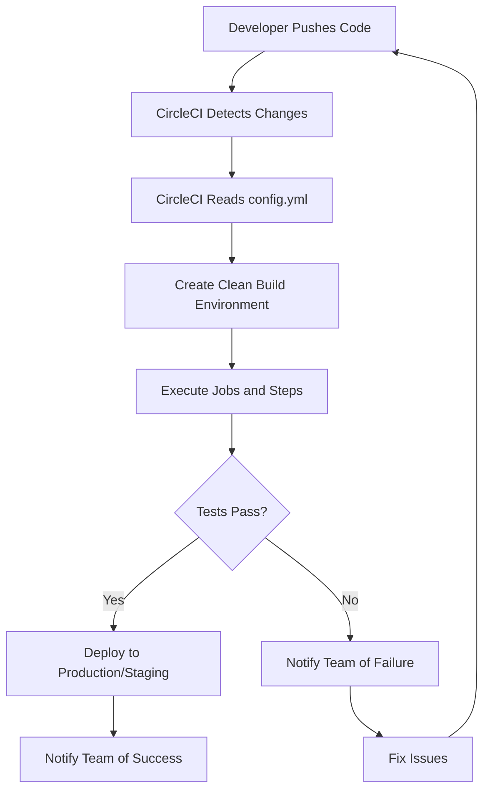

# CircleCI for Continuous Integration and Deployment

## Introduction

CircleCI is a popular continuous integration and continuous deployment (CI/CD) platform that automates your build, test, and deployment processes. As a cloud-based service, CircleCI integrates with GitHub, Bitbucket, and GitLab, allowing developers to automate their development workflows efficiently. 

In today's fast-paced software development world, CI/CD has become essential for delivering high-quality code quickly and reliably. CircleCI helps teams achieve this by automating repetitive tasks, ensuring code quality through automated testing, and streamlining the deployment process.

## What is CircleCI?

CircleCI is a CI/CD tool that executes a series of steps every time code changes are detected in your repository. The platform runs these steps in isolated containers or virtual machines, providing a clean environment for each build.

Key features of CircleCI include:

- **Automated testing and deployment**: Run tests and deploy code automatically when changes are pushed to your repository
- **Parallel execution**: Speed up build times by running tests in parallel
- **Customizable workflows**: Create complex pipelines tailored to your project's needs
- **Caching**: Save time by caching dependencies between builds
- **Docker support**: Use Docker containers for consistent build environments
- **Comprehensive API**: Integrate CircleCI with other tools and services

## How CircleCI Works

CircleCI operates based on a configuration file (`.circleci/config.yml`) in your repository. This file defines the steps that CircleCI should execute when changes are detected.



## Setting Up CircleCI

### 1. Create a CircleCI Account

Sign up at [CircleCI](https://circleci.com/) using your GitHub, Bitbucket, or GitLab account.

### 2. Add Your Project

After signing in, you can select the repository you want to set up with CircleCI.

### 3. Create a Configuration File

Create a `.circleci` directory in your project's root and add a `config.yml` file. Here's a basic example:

```yaml
version: 2.1
jobs:
  build:
    docker:
      - image: cimg/node:16.13
    steps:
      - checkout
      - run: npm install
      - run: npm test
```

This configuration:
- Uses CircleCI version 2.1
- Defines a job named "build"
- Uses a Docker image with Node.js 16.13
- Checks out your code
- Runs `npm install` to install dependencies
- Runs `npm test` to execute tests

## CircleCI Configuration Deep Dive

Let's explore more advanced configurations that you might need for real-world projects.

### Using Workflows

Workflows allow you to orchestrate multiple jobs:

```yaml
version: 2.1
jobs:
  build:
    docker:
      - image: cimg/node:16.13
    steps:
      - checkout
      - run: npm install
      - run: npm run build
  test:
    docker:
      - image: cimg/node:16.13
    steps:
      - checkout
      - run: npm install
      - run: npm test
  deploy:
    docker:
      - image: cimg/node:16.13
    steps:
      - checkout
      - run: npm install
      - run: npm run deploy

workflows:
  version: 2
  build-test-deploy:
    jobs:
      - build
      - test:
          requires:
            - build
      - deploy:
          requires:
            - test
          filters:
            branches:
              only: main
```

This workflow:
1. Runs the `build` job first
2. Runs the `test` job after the `build` job completes successfully
3. Runs the `deploy` job after the `test` job completes, but only for the main branch

### Using CircleCI Orbs

Orbs are reusable packages of CircleCI configuration that help you simplify your config files:

```yaml
version: 2.1
orbs:
  node: circleci/node@4.7
  aws-s3: circleci/aws-s3@3.0

jobs:
  build:
    executor: node/default
    steps:
      - checkout
      - node/install-packages
      - run: npm run build
      - persist_to_workspace:
          root: .
          paths:
            - build

  deploy:
    executor: node/default
    steps:
      - checkout
      - attach_workspace:
          at: .
      - aws-s3/sync:
          from: build
          to: 's3://my-bucket/my-app'
          arguments: |
            --acl public-read \
            --cache-control "max-age=86400"

workflows:
  version: 2
  build-and-deploy:
    jobs:
      - build
      - deploy:
          requires:
            - build
          filters:
            branches:
              only: main
```

This configuration:
- Uses the Node.js orb for Node.js-related tasks
- Uses the AWS S3 orb to simplify deploying to Amazon S3
- Persists the build directory to be used in the deploy job

## Practical Example: Setting up CI/CD for a React Application

Let's walk through setting up CircleCI for a React application, covering the full CI/CD pipeline:

1. Build the application
2. Run tests
3. Deploy to staging for non-main branches
4. Deploy to production for the main branch

```yaml
version: 2.1
orbs:
  node: circleci/node@4.7
  aws-s3: circleci/aws-s3@3.0

jobs:
  build:
    executor: node/default
    steps:
      - checkout
      - node/install-packages
      - run:
          name: Build React application
          command: npm run build
      - persist_to_workspace:
          root: .
          paths:
            - build
            - node_modules

  test:
    executor: node/default
    steps:
      - checkout
      - attach_workspace:
          at: .
      - run:
          name: Run tests
          command: npm test

  deploy-staging:
    executor: node/default
    steps:
      - checkout
      - attach_workspace:
          at: .
      - aws-s3/sync:
          from: build
          to: 's3://my-staging-bucket/my-app'
          arguments: |
            --acl public-read \
            --cache-control "max-age=3600"

  deploy-production:
    executor: node/default
    steps:
      - checkout
      - attach_workspace:
          at: .
      - aws-s3/sync:
          from: build
          to: 's3://my-production-bucket/my-app'
          arguments: |
            --acl public-read \
            --cache-control "max-age=86400"

workflows:
  version: 2
  build-test-deploy:
    jobs:
      - build
      - test:
          requires:
            - build
      - deploy-staging:
          requires:
            - test
          filters:
            branches:
              ignore: main
      - deploy-production:
          requires:
            - test
          filters:
            branches:
              only: main
```

## Optimizing Your CircleCI Pipeline

### Caching Dependencies

Caching dependencies can significantly speed up your builds:

```yaml
jobs:
  build:
    executor: node/default
    steps:
      - checkout
      - restore_cache:
          keys:
            - v1-dependencies-{{ checksum "package-lock.json" }}
            - v1-dependencies-
      - run: npm install
      - save_cache:
          paths:
            - node_modules
          key: v1-dependencies-{{ checksum "package-lock.json" }}
      - run: npm run build
```

### Parallelizing Tests

For large test suites, you can run tests in parallel:

```yaml
jobs:
  test:
    parallelism: 4
    executor: node/default
    steps:
      - checkout
      - node/install-packages
      - run:
          name: Run tests in parallel
          command: |
            TESTFILES=$(circleci tests glob "src/**/*.test.js" | circleci tests split --split-by=timings)
            npm test -- $TESTFILES
```

## Environment Variables and Secrets

CircleCI allows you to set environment variables for your builds:

1. **Project Settings**: Set variables in the CircleCI web interface under Project Settings > Environment Variables
2. **Context**: Share variables across projects using Contexts in Organization Settings
3. **Configuration**: Set variables directly in your config file

Example of using environment variables:

```yaml
jobs:
  deploy:
    executor: node/default
    steps:
      - checkout
      - run:
          name: Deploy with environment-specific settings
          command: |
            if [ "${CIRCLE_BRANCH}" = "main" ]; then
              export API_URL=$PROD_API_URL
            else
              export API_URL=$STAGING_API_URL
            fi
            npm run deploy
```

## Handling Different Platforms and Architectures

CircleCI supports various execution environments:

```yaml
jobs:
  test-multi-platform:
    parameters:
      os:
        type: executor
    executor: << parameters.os >>
    steps:
      - checkout
      - run: ./run-tests.sh

workflows:
  test-on-multiple-platforms:
    jobs:
      - test-multi-platform:
          matrix:
            parameters:
              os: [node/default, macos/default, windows/default]
```

## Debugging CircleCI Builds

When your builds fail, you have several options for debugging:

1. **SSH Access**: Enable SSH access to the build environment
   ```yaml
   jobs:
     build:
       steps:
         - add_ssh_keys:
             fingerprints:
               - "SO:ME:FI:NG:ER:PR:IN:T"
   ```

2. **Rerun with SSH**: Use the "Rerun job with SSH" option in the CircleCI web interface

3. **Debug with `printf`**: Add debug print statements to your scripts
   ```yaml
   steps:
     - run:
         name: Debug environment
         command: |
           echo "Node version: $(node -v)"
           echo "NPM version: $(npm -v)"
           echo "Working directory: $(pwd)"
           ls -la
   ```

## CircleCI vs. Other CI/CD Tools

| Feature | CircleCI | Jenkins | GitHub Actions | Travis CI |
|---------|----------|---------|---------------|-----------|
| Hosting | Cloud/Self-hosted | Self-hosted | Cloud | Cloud |
| Configuration | YAML | Jenkinsfile/UI | YAML | YAML |
| Free Tier | Yes | Open Source | Yes | Limited |
| Setup Complexity | Low | High | Low | Low |
| Scalability | High | High | Medium | Medium |
| Community Support | Strong | Very Strong | Strong | Moderate |

## Common CircleCI Issues and Solutions

### Issue: Build Takes Too Long

**Solutions:**
- Implement caching for dependencies
- Use parallelism for tests
- Optimize Docker images by using smaller base images
- Remove unnecessary steps from your workflow

### Issue: Tests Passing Locally But Failing in CircleCI

**Solutions:**
- Ensure environment variables are correctly set
- Check for platform-specific code
- Verify test timing and race conditions
- Use the same Docker image locally as in CI

### Issue: Deployment Failures

**Solutions:**
- Double-check access tokens and permissions
- Ensure deployment scripts work in a CI environment
- Add more debug logging during deployment steps
- Test deployment scripts locally before pushing

## Summary

CircleCI provides a powerful platform for implementing CI/CD pipelines in your development workflow. By automating the build, test, and deployment processes, CircleCI helps teams:

- Detect and fix issues early
- Deliver features faster
- Maintain high-quality code
- Streamline the release process

In this guide, we've covered:
- Setting up CircleCI for your projects
- Creating basic and advanced configuration files
- Implementing workflows for complex pipelines
- Optimizing your CI/CD process
- Debugging and troubleshooting common issues

## Additional Resources

- [CircleCI Documentation](https://circleci.com/docs/)
- [CircleCI Orbs Registry](https://circleci.com/developer/orbs)
- [CircleCI Community Forums](https://discuss.circleci.com/)

## Exercises

1. Set up a basic CircleCI configuration for a simple web application
2. Modify your configuration to implement a build-test-deploy workflow
3. Add caching to speed up your builds
4. Configure your pipeline to deploy to different environments based on the branch
5. Implement parallelism in your test jobs to reduce build time

By mastering CircleCI, you'll have a valuable skill that helps you implement efficient CI/CD pipelines, a crucial component in modern software development practices.